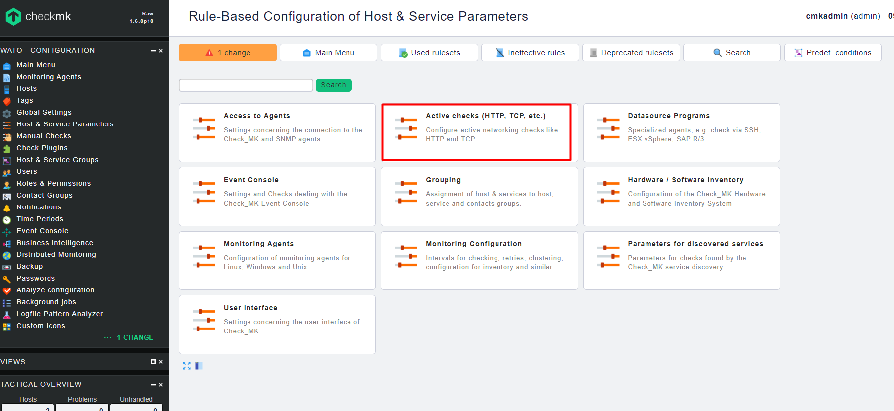
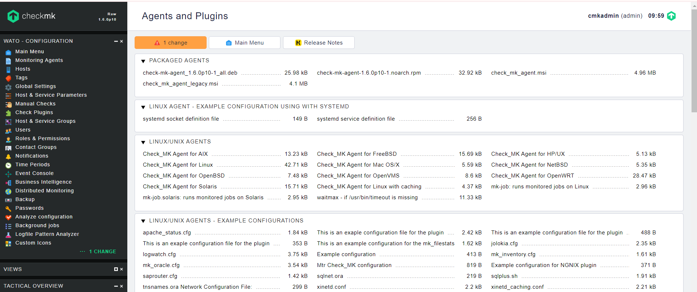
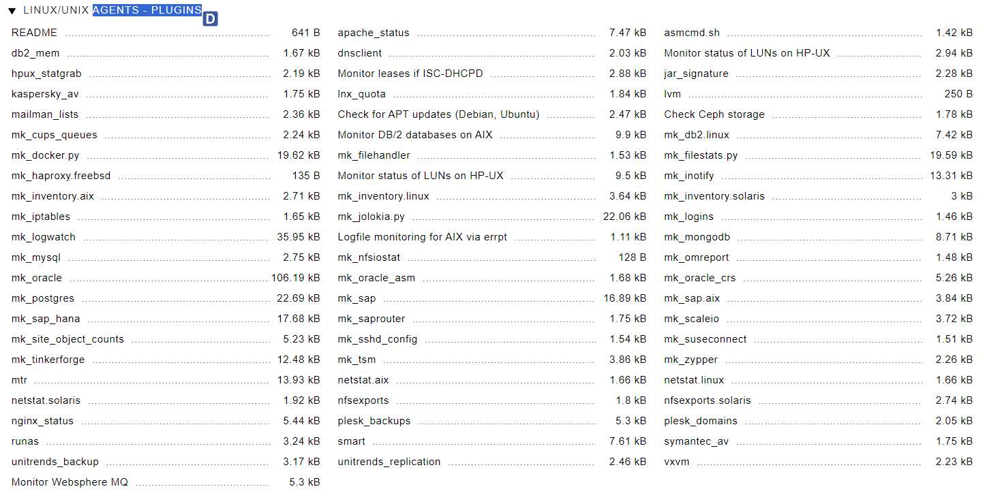
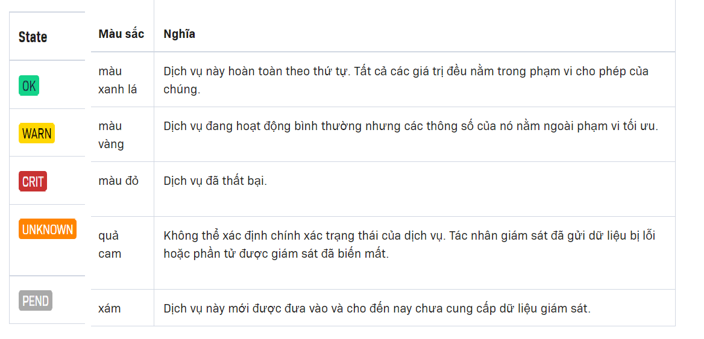
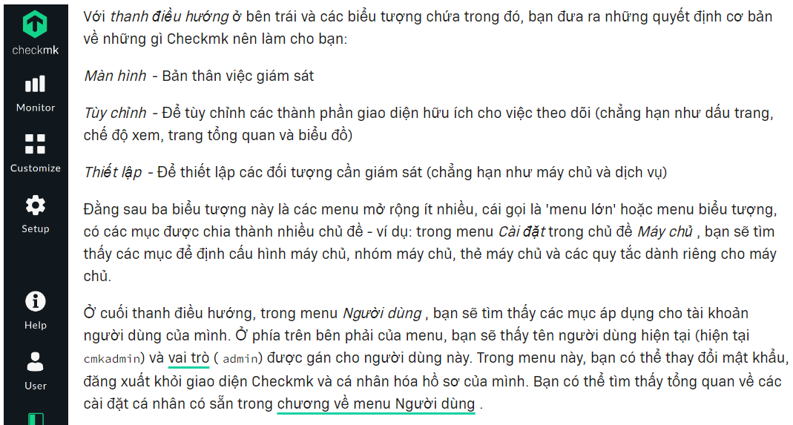

# Bảng chú giải thông tin

## Activating changes

- Các thay đổi về cấu hình chỉ có hiệu lực đối với giám sát sau khi chúng được kích hoạt 

"Activating changes" là bước cuối cùng để triển khai các thay đổi cấu hình vào hệ thống giám sát hoạt động.
Quá trình này giúp kiểm tra và xác nhận rằng các thay đổi không gây ra lỗi hoặc xung đột, đảm bảo tính ổn định và nhất quán của hệ thống giám sát.

VD Quá trình "Activating check"

* Khi thêm 1 host mới và cấu hình checkmk
1. Thực hiện Thay đổi:

Thêm host mới hoặc thay đổi cài đặt giám sát cho host hiện có trong giao diện quản lý Checkmk.

2. Kiểm tra và Lưu Thay đổi:

Các thay đổi này sẽ được lưu trữ dưới dạng bản nháp và chưa được áp dụng vào hệ thống giám sát hoạt động.

3. Activate Changes:

 nhấn vào nút "Activate Changes" để áp dụng các thay đổi.
Checkmk kiểm tra tính hợp lệ của các thay đổi và nếu không có lỗi, nó sẽ triển khai chúng vào hệ thống.
4. Hệ thống Giám Sát Cập Nhật:

Sau khi các thay đổi được kích hoạt, hệ thống giám sát sẽ cập nhật cấu hình của nó để bao gồm host mới và bắt đầu giám sát nó theo các cài đặt mới.

## Active check
Active check là kiểm tra mà checkmk chủ động thực hiện 
Bao gồm các yêu cầu hoặc lệnh gửi đến các host để lấy thông tin giám sát

Ví dụ về Active Checks:

Ping Check: Gửi một yêu cầu ICMP Echo (ping) để kiểm tra xem một host có còn hoạt động hay không.
HTTP Check: Kiểm tra xem một máy chủ web có phản hồi đúng các yêu cầu HTTP và cung cấp nội dung mong đợi hay không.


Cấu Hình và Quản Lý : 
Active Checks có thể được cấu hình và quản lý trong giao diện WATO (Web Administration Tool) của Checkmk





## Agent

Là một thành phần phần mềm được cài đặt trên các máy chủ hoặc thiết bị được giám sát. 

**Chức năng của Agent:**
* Agent chịu trách nhiệm thu thập thông tin từ các máy chủ hoặc các thiết bị đã cài đặt 
* Cung cấp thông tin chi tiết : CPU , RAM , DISK, Interface, Service
* Agent gửi data thu thập tới server . Checkmk phân tích và hiển thị trong hệ thống giám sát

**Cách Hoạt Động:**

* Lắng nghe trên công 6556
* Khi server Checkmk kết nối tới agent qua cổng này, agent sẽ thực thi các script và lệnh để thu thập dữ liệu, sau đó trả về kết quả.

**Các Loại Thông Tin Thu Thập:**

* Thông tin hệ thống : Ram, disk, CPU, network interface, process list
* Dịch vụ cụ thể : Trạng thái apache ,MySQL, 
* Thông tin ứng dụng : Logfile , Trạng thái của ứng dụng
* Tình trạng phần cứng : Raid 





## Agent Bakery

Là Một tính năng trong checkMK giúp tự động hóa việc cải tạo ra gói cài đặt agent theo yêu cầu cụ thể  => Giúp dễ dàng triển khai và quản lý agent checkmk trên nhiều hệ thống 

## Agent plug-in
Là các tập lệnh (scripts) hoặc chương trình bổ sung được sử dụng để mở rộng khả năng giám sát của các agent Checkmk. Chúng cho phép thu thập thông tin chi tiết hơn hoặc giám sát các dịch vụ và ứng dụng cụ thể mà agent mặc định không thể xử lý trực tiếp.
**Mở rộng Khả Năng Giám Sát**
* Mặc định, Checkmk agent thu thập thông tin cơ bản như CPU, bộ nhớ, dung lượng đĩa, và trạng thái mạng từ hệ thống.
* Agent plug-in cho phép bạn mở rộng điều này bằng cách thu thập thêm thông tin từ các dịch vụ hoặc ứng dụng cụ thể như cơ sở dữ liệu, máy chủ web, hệ thống lưu trữ, và nhiều dịch vụ khác.

**Được Triển Khai trên Các Agent:**
* Plugin được triển khai trên các máy chủ hoặc thiết bị mà agent Checkmk đang chạy
* Khi agent thực thi, nó sẽ chạy cả các plugin đi kèm và thu thập dữ liệu bổ sung do các plugin này cung cấp.

**Ví dụ về Các Agent Plug-in**

MySQL plugin: Thu thập thông tin về hiệu suất và trạng thái của các máy chủ MySQL
Apache plugin: Giám sát tình trạng và hiệu suất của máy chủ web Apache





## API integrations

API integrations trong Checkmk là các giao diện lập trình ứng dụng (Application Programming Interfaces) mà Checkmk cung cấp để tích hợp với các hệ thống, dịch vụ, hoặc ứng dụng khác

VD : HTTP API , Livestatus API, Agent API,Notification API

1. HTTP API (Web API)

Sử dụng cơ bản: 
API này cho phép bạn thực hiện các yêu cầu HTTP để tương tác với Checkmk. như api của netbox

Nghiên cứu sau:

## Automation user

Automation User trong Checkmk là một loại tài khoản đặc biệt được thiết kế để hỗ trợ các tác vụ tự động hóa mà không yêu cầu sự can thiệp trực tiếp từ người dùng

vd : lấy thông tin của các host 

```
curl -X GET "http://172.16.66.63/cmk/check_mk/api/1.0/domain-types/host_config/objects" \
-H "Authorization: Bearer <automation-secret>"


```


## Business Intelligence (BI)

Là một tính năng mạnh mẽ cho phép bạn tổng hợp và phân tích dữ liệu giám sát theo cách phản ánh rõ ràng hiệu suất của các quy trình kinh doanh và dịch vụ kinh doanh phức tạp. Thay vì chỉ giám sát các thành phần kỹ thuật riêng lẻ, BI giúp bạn hiểu rõ hơn về cách mà toàn bộ hệ thống kinh doanh đang hoạt động.


**Tổng Hợp Dữ Liệu Giám Sát**

- Giúp tổng hợp dữ liệu từ nguồn giám sát khác nhau như : host,servie
Ví Dụ : 

Cty thương mại điện tử sử dụng checkmk để giám sát sau : 

`Hệ Thống Đặt Hàng`: Giám sát trạng thái của web server, hệ thống thanh toán, và dịch vụ email để đảm bảo người dùng có thể đặt hàng một cách trơn tru.
`Quản Lý Kho`: Tổng hợp trạng thái của các hệ thống quản lý kho và dịch vụ vận chuyển để đảm bảo hàng hóa được quản lý và giao hàng đúng hạn.
`Dịch Vụ Khách Hàng`: Theo dõi các dịch vụ như hệ thống CRM và trung tâm liên lạc để đảm bảo rằng khách hàng nhận được hỗ trợ tốt nhất.

## check

check trong ngữ cảnh của Checkmk là một tập lệnh hoặc chương trình kiểm tra máy chủ hoặc dịch vụ theo các quy tắc được xác định trước, tức là quy trình xác định trạng thái của máy chủ và dịch vụ và dẫn đến trạng thái OK , DOWN , UNREACH , WARN , CRIT , PEND hoặc UNKNOWN được trả lại. 





## Check plug-in
Check Plugin là một thành phần quan trọng được sử dụng để thực hiện các kiểm tra trên các máy chủ và thiết bị mạng để thu thập thông tin về trạng thái và hiệu suất của các dịch vụ và thành phần trong hệ thống.


**Chức năng của chekc plug-in**

* Được thực thi trên máy chủ hoặc thiết bị mạng để kiểm tra trạng thái của các dịch vụ, hệ thống hoặc ứng dụng
*  Khi một Check Plugin được thực thi, nó sẽ kiểm tra trạng thái của một dịch vụ hoặc thành phần cụ thể trên máy chủ hoặc thiết bị mạng. Sau đó, nó sẽ trả về kết quả của kiểm tra (ví dụ: OK, WARNING, CRITICAL, UNKNOWN)


## Checkmk extension package (MKP)

 Checkmk Extension Package (MKP) là một gói mở rộng chứa các tài nguyên và cấu hình để mở rộng chức năng của Checkmk

## Contact


Gửi thông tin và cấu hình liên quan đến việc gửi thông báo và thông tin liên lạc đến các người dùng hoặc nhóm người dùng khi có sự cố xảy ra hoặc cần thông tin cần thiết từ hệ thống giám sát.

**Thông Báo và Thông Tin Liên Lạc:**

 Mỗi "Contact" đại diện cho một người dùng hoặc nhóm người dùng và chứa thông tin cần thiết để gửi thông báo và thông tin liên lạc. Điều này bao gồm địa chỉ email, số điện thoại, hoặc các cấu hình khác.

**Các Loại Contact:** 

* Individual Contacts:Đại diện cho một người dùng cụ thể
* Contact Groups: Đại diện cho một nhóm người dùng, cho phép bạn gửi thông báo đến một nhóm người dùng cùng một lúc.
* Notification Rules: Các quy tắc cấu hình xác định khi nào và cách nào thông báo được gửi đến các "contact".

**Cấu Hình Thông Báo**
* cấu hình các "contact" để chỉ định cách thức và điều kiện khi thông báo được gửi đến


## Dashboard

Là giao diện trực quan cho phép xem quản lý trạng thái hiệu suất hệ thống của mình . Cung cấp cái nhìn tổng quan chi tiết về trạng thái của các dịch vụ , máy chủ 


## Distributed monitoring

Distributed Monitoring" (Giám sát Phân tán) là một phương pháp giám sát mạng và hệ thống mà cho phép quản lý và giám sát các mạng phức tạp hoặc phân tán. Điều này làm cho việc quản lý hệ thống lớn trở nên dễ dàng hơn bằng cách phân chia công việc giám sát thành các phần nhỏ hơn được phân tán trên nhiều máy chủ hoặc vị trí vật lý khác nhau.

## Event Console (EC)

Event Console trong checkmk là một phần quan trọng của hệ thống giám sát , giúp xử lý các sự kiện thông báo từ các thiết bị trong mạng 

## Host

Trong Checkmk, "Host" đề cập đến một thiết bị hoặc máy tính được giám sát trong mạng của bạn. Mỗi host thường đại diện cho một máy chủ, thiết bị mạng, ứng dụng hoặc dịch vụ cụ thể mà bạn muốn giám sát và quản lý

Đại Diện Cho Một Thiết Bị Hoặc Dịch Vụ:
Quản Lý Trạng Thái và Hiệu Suất
Cấu Hình Kiểm Tra và Thông Báo: 

## Host group

Nhóm các host lại với nhau dựa trên các tiêu chí nhất định (vị trí,vai trò chức năng,.. )
Host Groups cho phép thực hiện các hành động đồng nhất trên toàn bộ nhóm máy chủ
Ví dụ, có thể tắt hoặc khởi động lại toàn bộ nhóm máy chủ cùng một lúc.

## Host status

- Là thông tin mô tả trạng thái hoạt động của một máy chủ trong hệ thống giám sát. Được biểu tượng bằng các màu sắc 


`OK:` Máy chủ hoạt động bình thường và không có sự cố hoặc lỗi nào được phát hiện.

`Warning:` Máy chủ gặp một số vấn đề nhỏ hoặc cảnh báo, nhưng vẫn có thể hoạt động mà không gây ra vấn đề nghiêm trọng.

`Critical`: Máy chủ gặp phải vấn đề nghiêm trọng hoặc lỗi, cần sự can thiệp ngay lập tức để khắc phục.

`Unknown`: Trạng thái của máy chủ không thể xác định được vì lý do nào đó, có thể do kết nối mạng không ổn định hoặc không thể truy cập được vào máy chủ.

`Pending`: Máy chủ đang trong quá trình kiểm tra hoặc chờ đợi kết quả của một số kiểm tra nào đó.


## Host tag

- Thẻ host gán hoặc nhóm các máy chủ lại với nhau dựa trên tiêu chí cụ thể
- giúp tổ chức và phân loại các máy chủ để dễ dàng quản lý và thực hiện các hoạt động giám sát và quản lý.

## Livestatus

Là một giao thức cung cấp khả năng truy vấn dữ liệu thời gian thực từ server giám sát checkmk. Cho phép các ứng dụng hoặc các công cụ bên ngoài tự đồng bộ với dữ liệu giám sát liên quan 

**một số điểm chính về Livestatus trong Checkmk:**

* Truy Vấn Dữ Liệu Thời Gian Thực
* Tích Hợp với Các Ứng Dụng Bên Ngoài
* Tự Động Hóa
* Hiệu Suất và Linh Hoạt


## Local check
"Local check" là một loại plugin hoặc script được chạy trên các máy chủ được giám sát để thu thập thông tin cụ thể và trả về kết quả cho server Checkmk. Các local check được sử dụng để giám sát các yếu tố cụ thể trên máy chủ, như tình trạng hệ thống, các tiến trình, tập tin log, dịch vụ, hoặc bất kỳ thông tin nào khác mà bạn muốn theo dõi.

## Metric

"Metric" (đại lượng) là một giá trị hoặc thông số cụ thể được thu thập và giám sát trên các máy chủ hoặc dịch vụ trong hệ thống. Các metric cung cấp thông tin về trạng thái, hiệu suất và hoạt động của các yếu tố được giám sát.

## Navigation bar





## Notification

"Notification" (thông báo) là một cơ chế cho phép hệ thống gửi thông tin về các sự kiện quan trọng hoặc cảnh báo đến các người dùng hoặc nhóm người dùng cụ thể. Thông báo giúp người quản trị hệ thống biết được về các vấn đề hoặc sự kiện đang xảy ra trong môi trường giám sát, cho phép họ phản ứng kịp thời để giải quyết vấn đề.


`Cảnh Báo và Sự Kiện:` Máy chủ không hoạt động, CPU quá tải, lưu lượng mạng cao,..
`Các Phương Tiện Thông Báo` : Email , telegram, teams
`Quản Lý Thông Báo` : Người quản trị có thể quản lý các cấu hình thông báo, bao gồm thiết lập ngưỡng cảnh báo, quy định người nhận thông báo, và cấu hình nội dung thông báo.
`Đa Dạng Thông Báo`: Checkmk hỗ trợ nhiều loại thông báo, bao gồm cảnh báo cấp độ cao, cảnh báo tái phát, thông báo xác nhận, và nhiều hơn nữa.

## Rule

Là một cách để cấu hình các hành vi hoặc chức năng cụ thể cho hệ thống giám sát. Quy tắc được sử dụng để áp dụng các thiết lập cụ thể, ngưỡng cảnh báo, hoặc các hành động tự động dựa trên các điều kiện hoặc sự kiện cụ thể trong môi trường giám sát.

VD : tạo cảnh báo khi CPU quá tải vượt quá 90% trong vòng 5 phút

## Rule set

Là một tập hợp các quy tắc được áp dụng cùng nhau để cấu hình các tính năng hoặc hành vi cụ thể trong hệ thống giám sát. Rule Set giúp tổ chức và quản lý các quy tắc liên quan đến một khía cạnh cụ thể của giám sát.


## Scheduled downtime

là một tính năng cho phép người quản trị hệ thống quản lý việc ngưng hoạt động và giảm thiểu sự quấy rầy từ các cảnh báo trong thời gian mà hệ thống hoặc dịch vụ đang được bảo trì hoặc nâng cấp.

Khi một thời gian ngưng hoạt động được lên lịch, Checkmk sẽ không gửi cảnh báo cho các trạng thái lỗi hoặc cảnh báo khác trong thời gian đó. 

## Service

Thường đề cập tới một thành phần cụ thể của một hệ thống hoặc ứng dụng mà muốn giám sát,
`Quản Lý Dịch Vụ` : máy chủ, ứng dụng web,database, network interface
Trạng Thái và Hiệu Suất:Dịch vụ có thể có nhiều trạng thái khác nhau, bao gồm trạng thái hoạt động bình thường, cảnh báo, lỗi, và nhiều trạng thái khác. Hiệu suất của dịch vụ cũng có thể được đo lường bằng các metric như tải CPU, bộ nhớ sử dụng, thời gian phản hồi, và nhiều hơn nữa.


## Service status


## Site

Thường chỉ một phiên bản cụ thể của checkmk cùng với dữ liệu tương tứng


## SNMP

SNMP (Simple Network Management Protocol) được sử dụng để giám sát quản lý các thiết bị mạng và các thiết bị khác trong một mạng. SNMP cho phép thu thập thông tin trạng thái và hiệu suất mạng : router, switch , máy chủ ,disk ...
`Cấu Hình Thiết Bị SNMP`: Đầu tiên, bạn cần cấu hình thiết bị mạng để hỗ trợ SNMP và cho phép truy cập từ Checkmk. Điều này bao gồm việc thiết lập cộng đồng SNMP (SNMP community string) và cấu hình các thông số khác như phiên bản SNMP và quyền truy cập.


## Giám sát active - passtive

**active**
* Trong active monitoring, máy chủ giám sát gửi các yêu cầu kiểm tra đến các thiết bị hoặc dịch vụ để lấy thông tin.
* Các yêu cầu kiểm tra được gửi theo định kỳ, và máy chủ giám sát mong đợi nhận được phản hồi từ các thiết bị hoặc dịch vụ.
* Các thiết bị hoặc dịch vụ không tự động gửi thông tin đến máy chủ giám sát mà chỉ phản hồi khi yêu cầu kiểm tra được gửi

**passtive**
* Trong passive monitoring, các thiết bị hoặc dịch vụ gửi thông tin đến máy chủ giám sát mà không cần máy chủ gửi yêu cầu kiểm tra.
* Thông tin được gửi đến máy chủ giám sát dựa trên sự kiện hoặc trạng thái của thiết bị hoặc dịch vụ.
* Các thiết bị hoặc dịch vụ tự động gửi thông tin đến máy chủ giám sát khi có sự kiện hoặc trạng thái mới xuất hiện, không cần chờ yêu cầu từ máy chủ.

**Ví dụ về Active Monitoring:**

Giả sử muốn giám sát tình trạng hoạt động của một máy chủ email. Trong trường hợp này, sử dụng active monitoring:

Active Monitoring: Mỗi 5 phút, Checkmk gửi một yêu cầu kiểm tra đến máy chủ email.
Máy chủ email sẽ phản hồi và báo lại rằng nó vẫn hoạt động bình thường.
Nếu máy chủ email không phản hồi hoặc trả về một mã lỗi, Checkmk sẽ tạo ra một cảnh báo để thông báo về sự cố.
Trong trường hợp này, Checkmk tự chủ động kiểm tra tình trạng hoạt động của máy chủ email bằng cách gửi yêu cầu kiểm tra theo định kỳ.

**Ví dụ về Passive Monitoring:**

Giả sử muốn giám sát một máy chủ database để đảm bảo rằng không có truy cập trái phép vào cơ sở dữ liệu. Trong trường hợp này,  sử dụng passive monitoring:

Passive Monitoring: Mỗi khi có một truy vấn SQL đến cơ sở dữ liệu, máy chủ database gửi một cảnh báo đến Checkmk.
Checkmk nhận và kiểm tra cảnh báo, kiểm tra xem truy vấn có hợp lệ không và có gây ra vấn đề nào không.
Nếu có vấn đề, Checkmk sẽ tạo ra một cảnh báo để thông báo về sự cố.
Trong trường hợp này, máy chủ database tự phát hiện và báo cáo về các sự kiện, trong khi Checkmk chỉ là người nhận và xử lý thông tin.