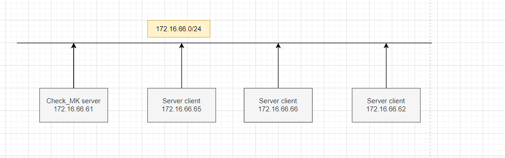

# Hướng dẫn cài đặt thông báo qua telegram 





Yêu cầu 
1 a Telegram bot
1 username for the bot
1 API token 
1 Telegram Chat- or Group-ID(không có cũng được)

## I. Tìm ID chat của telegram

1. Tạo bot chat 

`https://telegram.me/botfather`


2. Mỗi bot đều có tên hãy đặt tên cho nó

Khi tạo bot sẽ có username và token 


3. Tìm ID chat bằng HTTP API

Cú pháp

https://api.telegram.org/botToken/getUpdates

`https://api.telegram.org/bot7309384386:AAH_uTuG-RQAkn02ewxcIcL_GhQF0xxGHhU/getUpdates`


ở đây mình tạo nhóm nên sẽ lấy id của nhóm . ID của nhóm sẽ luôn có dấu `-` phía trước


## II. Cấu hình trên checkmk


Hiện tại đang dùng bản mới nhất 23.0 thực hiện theo các bước sau:

Bước 1: Chuyển đổi tài khoản 

`su - mysite`

ở đây site của tôi là `cmk` nên 

`su -cmk`

Vào đường dẫn sau : 
`/local/share/check_mk/notifications`


Thực hiện tạo 1 file` telegram.py`

`touch telegram.py`

Sửa nội dung trong file telegram thành như sau:

Cần điền api token và IP và ID group : (IP là IP của site) 

```
#!/bin/bash
# Push Notification (using Telegram)
#
# Script Name   : check_mk_telegram-notify.sh
# Description   : Send Check_MK notifications by Telegram
# Author        : https://github.com/filipnet/checkmk-telegram-notify
# License       : BSD 3-Clause "New" or "Revised" License
# ======================================================================================

# Telegram API Token
# Find telegram bot named "@botfather", type /mybots, select your bot and select "API Token" to see your current token
if [ -z "7309384386:AAH_uTuG-RQAkn02ewxcIcL_GhQF0xxGHhU" ]; then 
        echo "No Telegram token ID provided. Exiting" >&2
        exit 2
else
        TOKEN="7309384386:AAH_uTuG-RQAkn02ewxcIcL_GhQF0xxGHhU"
fi

# Telegram Chat-ID or Group-ID
# Open "https://api.telegram.org/bot<YOUR_TOKEN>/getUpdates" inside your Browser and send a HELLO to your bot, refresh side
if [ -z "-4259488548" ]; then
        echo "No Telegram Chat-ID or Group-ID provided. Exiting" >&2
        exit 2
else
        CHAT_ID="-4259488548"
fi

# Privacy settings to anonymize/masking IP addresses
if [[ ${NOTIFY_PARAMETER_3} == "privacy" ]]; then
        # IPv4 IP addresses
        if [ 172.16.66.61 ]; then
                slice="172.16.66.61"
                count=1
                while [ "$count" -le 4 ]
                do
                        declare sec"$count"="${slice%%.*}"
                        slice="${slice#*.}"
                        count=$((count+1))
                done
                # Adjust the output to your privacy needs here (Details in the readme.md)
                NOTIFY_HOST_ADDRESS_4="${sec1}.${sec2}.2.${sec4}"
        fi

        # IPv6 IP addresses
        if [ ${NOTIFY_HOST_ADDRESS_6} ]; then
                slice="${NOTIFY_HOST_ADDRESS_6}"
                count=1
                while [ "$count" -le 8 ]
                do
                        declare sec"$count"="${slice%%:*}"
                        slice="${slice#*:}"
                        count=$((count+1))
                done
                # Adjust the output to your privacy needs here (Details in the readme.md)
                NOTIFY_HOST_ADDRESS_6="${sec1}:${sec2}:${sec3}:${sec4}:ffff:ffff:ffff:${sec8}"
        fi
else
        echo "Invalid privacy parameter, check your Check_MK settings." >&2
fi

# Set an appropriate emoji for the current state
# Feel free to change the emoji to your own taste. This is done by customizing the UTF8 code. Examples here: https://apps.timwhitlock.info/emoji/tables/unicode
if [[ ${NOTIFY_WHAT} == "SERVICE" ]]; then
        STATE="${NOTIFY_SERVICESHORTSTATE}"
else
        STATE="${NOTIFY_HOSTSHORTSTATE}"
fi
case "${STATE}" in
    OK|UP)
        EMOJI=$'\xE2\x9C\x85' # white heavy check mark
        ;;
    WARN)
        EMOJI=$'\xE2\x9A\xA0' # warning sign
        ;;
    CRIT|DOWN)
        EMOJI=$'\xF0\x9F\x86\x98' # squared sos
        ;;
    UNKN)
        EMOJI=$'\xF0\x9F\x94\x84' # anticlockwise downwards and upwards open circle arrows
        ;;
esac

# The emoji should be displayed with emoji presentation
EMOJI+=$'\xEF\xB8\x8F'
# Create a MESSAGE variable to send to your Telegram bot
MESSAGE="${NOTIFY_HOSTNAME} (${NOTIFY_HOSTALIAS})%0A"
MESSAGE+="${EMOJI} ${NOTIFY_WHAT} ${NOTIFY_NOTIFICATIONTYPE}%0A%0A"
if [[ ${NOTIFY_WHAT} == "SERVICE" ]]; then
        MESSAGE+="${NOTIFY_SERVICEDESC}%0A"
        MESSAGE+="State changed from ${NOTIFY_PREVIOUSSERVICEHARDSHORTSTATE} to ${NOTIFY_SERVICESHORTSTATE}%0A"
        MESSAGE+="${NOTIFY_SERVICEOUTPUT}%0A"
else
        MESSAGE+="State changed from ${NOTIFY_PREVIOUSHOSTHARDSHORTSTATE} to ${NOTIFY_HOSTSHORTSTATE}%0A"
        MESSAGE+="${NOTIFY_HOSTOUTPUT}%0A"
fi
MESSAGE+="%0AIPv4: ${NOTIFY_HOST_ADDRESS_4} %0AIPv6: ${NOTIFY_HOST_ADDRESS_6}%0A"
MESSAGE+="${NOTIFY_SHORTDATETIME} | ${OMD_SITE}"

# Send message to Telegram bot
curl -S -X POST "https://api.telegram.org/bot7309384386:AAH_uTuG-RQAkn02ewxcIcL_GhQF0xxGHhU/sendMessage" -d chat_id=-4259488548 -d text="${MESSAGE}"
if [ $? -ne 0 ]; then
        echo "Not able to send Telegram message" >&2
        exit 2
else
        exit 0
fi


```


Bước 3 : thực hiện tạo rule trên checkmk

Setup → Events → Notifications


Check thông báo gửi về qua tele


