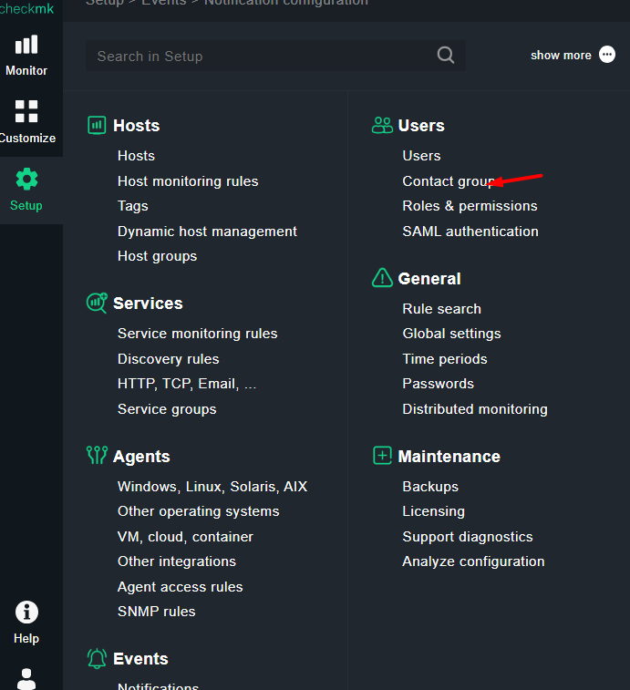

Thực hiện cảnh báo qua email 

Thực hiện cài đặt Postfix

`sudo apt-get update && sudo apt-get upgrade`

`sudo apt-get install postfix`

Phần đầu tiên của quá trình cài đặt Postfix là giao diện người dùng dựa trên văn bản. Sử dụng bàn phím để chọn Trang web Internet cho loại cấu hình thư.

Điền máy chủ định danh nhà cung cấp DNS hiện tại của mình

VD :mail.suncloud.vn 

Cấu hình file `/etc/postfix/main.cf`

`vi /etc/postfix/main.cf`

Giải thích : 
smtputf8_enable = no Khắc phục lỗi SMTPUTF8 is required, but was not offered by host

Mở cổng 587 cho SMTP qua TLS

`sudo ufw allow 587`

Restart và enable postfix

`systemctl restart postfix`
`systemctl enable postfix`

## kiểm tra 

`echo "Đã gửi thành công" | mail -s "kiểm tra mail có thành công hay không " huydv1@suncloud.vn`

## Cấu hình cảnh báo trên site CheckMK
Tạo group chứa User được nhận cảnh báo

Tạo user

## Cấu hình cảnh báo 

**Lưu và kích hoạt sự thay đổi**

## Kiểm tra khi có thay đổi của host:

Như vậy cảnh báo đã gửi về mail