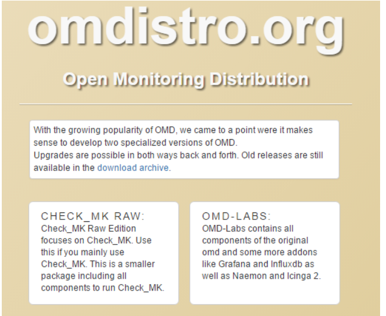

# Lý thuyết về CheckMK

## Khái niệm về CHECK_MK
Là một giải pháp giám sát dựa trên mã nguồn mở . Có lõi là nagios core. Với tính năng tích hợp được nhiều sản phẩm , check_MK bổ sung một số chức năng 

* Thời gian check từ 5phut xuống còn 1 phút
* Có thể cấu hình bằng giao diện web
* Có chức năng giám sát phân tán
* Có bảng điều khiển
* Có bảng thống kê số liệu
* Có biểu đồ hiển thị
* etc...

## Tổng quan về OMD.

OMD - Open Monitoring Distribution là một project được phát triển từ năm 2010 bới Mathias Kettner. OMD sử dụng nhân là Nagios Core, kết hợp với các phần mềm mã nguồn mở khác để đóng gói thành một sản phẩm phục vụ cho nhu cầu giám sát, cảnh báo và hiển thị

## Lịch sử hình thành

Dự án check_MK được phát triển vào năm 2008 
Năm 2010 dự án OMD (Open Monitoring Distribution) được khởi động bởi Mathias Kettner, là sự kết hợp của Nagios, Check_MK, NagVis, PNP4Nagios, DocuWiki, ...tạo nên sự linh hoạt trong giám sát. Các distro của OMD đang là OMD-LABS và CHECK_MK RAW.

Năm 2015, phiên bản đơn giản của OMD ra đời gọi là Check_MK, Check_MK có 2 phiên bản là Check_MK Raw Edition (CRE) và Check_MK Enterprise Edition (CEE).

## Phân biệt OMD-LABS và CHECK_MK RAW

OMD-LABS chứa tất cả các thành phần nguyên bản của OMD và một số addons thêm vào như Grafana, InfluxDB, Naemon, Icinga 2. Check_MK RAW edition tập trung vào Check_MK, đây là một gói nhỏ hơn chứa các thành phần để chạy Check_MK.

### OMD-LABS

OMD Labs-Edition là một nền tảng giám sát và một khái niệm mới về cài đặt, duy trì và cập nhật một hệ thống giám sát được xây dựng trên Nagios. Không được tích hợp sẵn trong các bản phân phối Linux mà tích hợp vào hệ thống dưới dạng các Package rpm và deb.

OMD-Labs chứa nhiều thành phần phần mềm mới so với gói OMD thường (Check_MK). Một số cài đặt mặc định đã thay đổi

### Một số điểm khác của OMD-LABS với OMD thường (Check_MK):

Các thành phần phần mềm bổ sung: OMD-Labs chỉ bổ sung các thành phần phần mềm mới và không loại bỏ bất kì phần mềm nào, làm cho OMD-Labs trở nên hoàn hảo hơn, và có thể chuyển sang các phiên bản khác bằng omd update

*   Lõi giám sát mới: Bên cạnh Nagios 3, OMD-Labs còn chứa hai Cores mới là Naemon và Icinga2. Trong khi Naemon hoàn toàn tương thích với định dạng Nagios 3 config thì Icinga2 sử dụng định dạng cấu hình mới

* Biểu đồ Grafana/Influxdb: Bên cạnh PNP4Nagios OMD có đồ thị Grafana dựa trên Influxdb. Để tạo mẫu đồ thị dựa trên mẫu, đã có histou (Histou được thiết kế để thêm các mẫu vào Grafana từ dữ liệu của Nagios). Giao diện giữa core giám sát và Influxdb được thực hiện trong thành phần Nagflux.

* Hệ thống con Prometheus: Bên cạnh việc giám sát truyền thống, OMD-Labs đi kèm với prometheus bao gồm quản lý cảnh báo, pushgateway và blackbox exporter

### CHECK_MK RAW

Check_MK là một phần của OMD, hiện tại đang có 2 phiên bản Check_MK là Check_MK Raw Edition (CRE) và Check_MK Enterprise Edition (CEE)

**Check_MK Raw Edition (CRE):**
Check_MK Raw Edition là một giải pháp giám sát toàn diện. Có thể sử dụng CRE miễn phí, chỉ cần tuân thủ theo một số giấy phép của GNU GPL và giấy phép của nguồn mở
Phiên bản stable đang là 1.2.8p22, phiên bản beta là 1.4.0b8

**Check_MK Enterprise Edition (CEE)**
Phiên bản Check_MK Enterprise Edition được phát triển dựa trên bản Raw nhưng có nhiều tính năng bổ sung cho doanh nghiệp và cũng cho phép bạn nhận được hỗ trợ từ nhà phát hành một cách chuyên nghiệp
Phiên bản stable đang là 1.2.8p22, phiên bản beta là 1.4.0b8

So sánh tính năng của 2 phiên bản Check_MK

| Tính năng                                                                           | Check_MK Raw Edition (CRE) | Check_MK Enterprise Edition (CEE) |
| ----------------------------------------------------------------------------------- | -------------------------- | --------------------------------- |
| Hệ thống giám sát toàn diện về CNTT với hơn 1000 plugin kiểm tra                    | Có                         | Có                                |
| Kiểm kê phần cứng / phần mềm                                                        | Có                         | Có                                |
| Bảng điề khiển sự kiện xử lý thông tin từ syslog                                    | Có                         | Có                                |
| Hiệu suất lưu trữ dữ liệu và tính khả dụng cao                                      | Có                         | Có                                |
| Hiệu suất cao và độ trễ thấp                                                        | Không                      | Có                                |
| Hiệu suất nâng cao cho SNMP dựa trên check bằng 100%                                | Không                      | Có                                |
| Livestatus-Proxy: thời gian phản hồi tối ưu và sự ổn định trong thiết lập phân phối | Không                      | Có                                |
| Agent Bakery: Tự động đóng gói của các agent giám sát cá nhân                       | Không                      | Có                                |
| Report: Tạo các báo cáo riêng lẻ ở định dạng PDF                                    | Không                      | Có                                |
| Hệ thống tương tác mới để hiển thị dữ liệu hiệu suất                                | Không                      | Có                                |
| Tích hợp kết nối với công cụ đồ họa Graphite                                        | Không                      | Có                                |
| Giao diện người dùng tùy chọn bằng tiếng Đức                                        | Không                      | Có                                |
| Quản lý hệ điều hành thông qua Web-GUI                                              | Không                      | Không                             |
| Duy trì các phiên bản và các thể hiện thông qua Web-GUI                             | Không                      | Không                             |
| Tích hợp HA                                                                         | Không                      | Không                             |
| Giá thành                                                                           | Miễn phí                   | Có giá từ 600 euro                |

### Các thành phần có trong Check_MK
**Round Robin Database(RRD)**
Đây là dạng DB mặc định mà Check_MK dùng để lưu trữ dữ liệu thông tin
Thông tin của DB được lưu trữ dưới dạng bảng và cột để lưu trữ dữ liệu
Có thể hợp nhất được dữ liệu của một khoảng thời gian lại vào làm một.
Có thể truy vấn được dữ liệu trong RRD bằng LiveStatus Language
Lưu ý ngôn ngữ truy vấn này phân biệt chữ hoa và chữ thường
Có thể sử dụng các Header để lọc thông tin hiển thị từ các truy vấn được sử dụng
Khi dữ liệu được ghi đầy thì nó sẽ được ghi đè lên dữ liệu cũ.

**Site**
Để có thể thực hiện giám sát thì cần tạo ra một site để có thể sử dụng

Một server có thể tạo được nhiều site

Để đăng nhập được vào site thì cần có user để đăng nhập, Chia làm 3 loại:

Administrator
Guest
Normal monitoring
Có 2 User mặc định có quyền Administrator là omdadmin và cmkadmin

Site là cách gọi của sản phẩn được tạo ra từ nhiều Multisite

**Livestatus**
Là một phần quan trọng trong Check_MK. Nó giúp Check_MK truy xuất dữ liệu một cách nhanh chóng
Livestatus sẽ sử dụng Socket để lấy dữ liệu để trả lời truy vấn do đó tốc độ truy vấn của nó không còn phụ thuộc vào tốc độ I/O như là lưu dữ liệu trong File.
Khi truy xuất dữ liệu bằng Command line thì Livestatus sẽ phân biệt chữ hoa chữ thường.
Livestatus sẽ sử dụng Socket để check dữ liệu do đó công việc được phân đều cho các CPU

Tài liệu tham khảo [đây](https://github.com/huydv398/Ghichep-CkeckMK/blob/master/Ly-thuyet/ckeckmk.md)