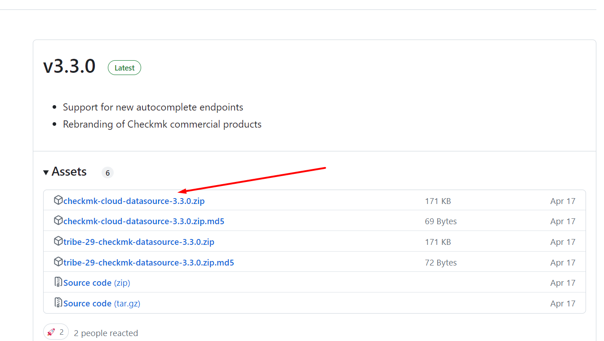
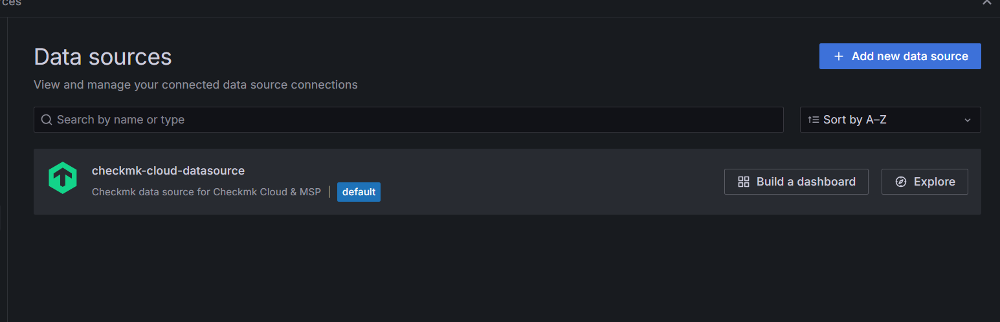

# Tìm hiểu register trong checkmk

Đăng ký Agent Checkmk (Registering Checkmk Agent)

- Là quy trình kết nối một máy chủ vs một host với hệ thống giám sát checkmk bằng cách sử dụng agent của Checkmk.Agent thu thập thông tin từ host và gửi về checkmk để giám sát 

## Đăng ký máy chủ với máy chủ
thực hiện bằng cách sử dụng Agent Controller cmk-agent-ctl, cung cấp giao diện lệnh để định cấu hình các kết nối. Bạn có thể hiển thị lệnh trợ giúp với cmk-agent-ctl help, cũng như đối với các lệnh con cụ thể có sẵn, chẳng cmk-agent-ctl help registerhạn như 


Lệnh sẽ thực hiện đăng ký một agent với máy chủ checkmk bằng câu lệnh 

Giải thích : 

*   cmk-agent-ctl : Đây là công cụ dòng lệnh dùng để thao tác quản lý các tác vụ liên quan tới checkmk
*   register : Đây là lệnh muốn chỉ ra bạn muốn đăng ký agent mới
*   --hostname mynewhost là tên host 
*   --server cmkserver : Đây là tên địa chỉ máy chủ checkmk mà bạn muốn agent kết nối tới . Thay "cmkserver" bằng tên site của mình
*   --user agent_registration: Đây là tên người dùng có quyền đăng ký agent trên máy chủ Checkmk. Người dùng này cần được thiết lập trong hệ thống Checkmk.
*   --password 'PTEGDYXBFXVGNDPRL': Đây là mật khẩu của người dùng agent_registration. Bạn nên thay thế 'PTEGDYXBFXVGNDPRL' bằng mật khẩu thực tế của bạn.
*   

## Đăng ký bằng proxy

Để đăng ký dễ dàng hơn , bất kỳ máy chủ nào được cài đặt tác nhân đều thực hiện đăng ký thay mặt cho các máy chủ khác,là một cách nâng cao để thiết lập và quản lý các agents Checkmk, đặc biệt khi bạn có một số lượng lớn các hệ thống cần giám sát hoặc khi các hệ thống nằm sau một proxy hoặc có các ràng buộc kết nối mạng.

```
cmk-agent-ctl proxy-register --hostname mynewhost3 \
    --server cmkserver --site mysite \
    --user agent_registration --password 'PTEGDYXBFXVGNDPRL' | \
    ssh root@mynewhost3 cmk-agent-ctl import
```


Giải thích : 


`proxy-register`: Chỉ thị để thực hiện việc đăng ký thông qua proxy. Điều này thường được sử dụng khi bạn không thể kết nối trực tiếp từ host đến máy chủ Checkmk hoặc khi bạn cần quản lý đăng ký từ xa

`--hostname mynewhost3`:Xác định tên host mà bạn đang đăng ký. Đây là tên mà máy chủ Checkmk sẽ sử dụng để nhận diện host này.
`--server cmkserver`:Tên hoặc địa chỉ IP của máy chủ Checkmk mà agent sẽ kết nối tới. Thay cmkserver bằng tên hoặc địa chỉ thực tế của máy chủ Checkmk.
`--site mysite`:Tên site Checkmk nơi agent sẽ được đăng ký. Site trong Checkmk đại diện cho một phiên bản chạy của Checkmk mà bạn có thể quản lý nhiều site.
`--password 'PTEGDYXBFXVGNDPRL'`:Mật khẩu của người dùng agent_registration. Thay thế PTEGDYXBFXVGNDPRL bằng mật khẩu thực tế của bạn.

`| \ ssh root@mynewhost3 cmk-agent-ctl import`:

|: Dấu gạch dọc (pipe) dùng để truyền kết quả từ phần trước của lệnh sang phần sau.
ssh root@mynewhost3: Lệnh này sử dụng ssh để kết nối đến host mynewhost3 như người dùng root.
cmk-agent-ctl import: Lệnh này trên mynewhost3 sẽ nhận dữ liệu từ đầu vào chuẩn (stdin) và nhập vào cấu hình đăng ký agent đã được tạo từ lệnh trước đó. Điều này có nghĩa là thực hiện đăng ký từ xa qua SSH và sau đó nhập thông tin đăng ký này vào hệ thống mục tiêu mynewhost3.


# Grafana là gì ?
Cho phép người dùng dễ dàng xem dữ liệu được thu thập bởi checkmk trong một giao diện tập trung. Giúp giám sát dễ dàng hơn 


Các bước cài đặt Grafana trên ubuntu 22.04 , checkmk(cloud)


Bước 1: Cài đặt các gói cần thiết 
```
sudo apt-get install -y apt-transport-https software-properties-common wget

sudo apt-get install -y adduser libfontconfig1 musl
```

Thêm khóa GPG của Grafana vào server:

`wget -q -O - https://packages.grafana.com/gpg.key | sudo apt-key add -`

Cài đặt Grafana phiên bản mới nhất của Grafana: [đây](https://grafana.com/grafana/download/11.0.0?edition=oss)


`sudo apt-get install -y adduser libfontconfig1 musl`
`wget https://dl.grafana.com/oss/release/grafana_11.0.0_amd64.deb`


Cài đặt package deb:
`sudo dpkg -i grafana_11.0.0_amd64.deb`


Bật dịch vụ và để nó tự khởi động cùng hệ thống:

`sudo systemctl start grafana-server`

`sudo systemctl enable grafana-server`


Kiểm tra trạng thái:
`sudo systemctl status grafana-server`


**Đăng nhập vào grafana**


Sử dụng trình duyệt web và truy cập:

http://server_ip:3000

Tài khoản : Mật khẩu mặc định là `admin:admin` Sau khi đăng nhập vào thì yêu cầu cần đổi passwd nên mình cần phải thay đổi pass

VD : 172.16.66.61:3000


**Tạo user trong checkmk**


**Thiết lập plugin trong Grafana**

Trên máy chủ Grafana, tải xuống file plugin phiên bản mới nhất ở [đây](https://github.com/Checkmk/grafana-checkmk-datasource/releases)


Vì mình đang dùng chekmk phiên bản cloud nên sẽ tải phiên bản này 





`wget https://github.com/Checkmk/grafana-Checkmk-datasource/releases/download/v3.3.0/checkmk-cloud-datasource-3.3.0.zip`


Tiến hành giải nén và mv vào thư mục `/var/lib/grafana/plugins`


`unzip tribe-29-Checkmk-datasource-3.3.0.zip`

`mv -v tribe-29-Checkmk-datasource /var/lib/grafana/plugins`


Thêm ngoại lệ cho plugin này bằng cách sửa file /etc/grafana/grafana.ini dòng 1420: 

`allow_loading_unsigned_plugins = tribe-29-Checkmk-datasource`


Khởi động lại dịch vụ:

`service grafana-server restart`


**Thiết lập plugin**

Sau khi cài plugin, ta vào cầu hình trên giao diện web của Grafana: `Home > Connections > Data sources > Add data source.`





Sau đó nhập thông tin đầy đủ : 

- Name: Đặt tên cho Data source.
- URL của site Checkmk.
-  Username và secret: Nhập user đã tạo trên Checkmk.
-  


Chọn Save & test, nếu xuất hiện dòng chữ: Data source is working, reached version 2.3.0p5.cre of Checkmk tức là bạn đã thêm thành công.


## Thực hiện xem biểu đồ của Grafana sau khi kết hợp với checkmk**

Truy cập vào `172.16.66.61:3000` vào Explore


Mình thực hiện check service http của host centos1


Hoặc xem biểu đồ của ram free máy ubuntu-2 


