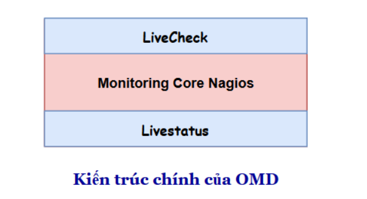
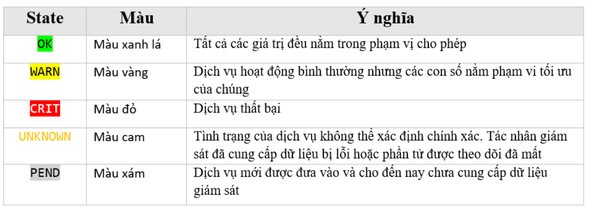

## Hoạt động cơ bản

Được kết nối với 2 module chính : liveStatus và LiveCheck 
**Livestatus**
Trước khi có Livestatus:

- Kết quả giám sát được sẽ lưu trong file status.dat gây nên hiện tượng nút thắt cổ chai cho CPU và Disk I/O
- Trạng thái của file status không phải là real-time mà update ít nhất là mỗi 10s
- NDOUtils sử dụng database để theo dõi kết quả (MySQL hoặc PostgreSQL), nhưng vẫn còn một số thiếu sót quan trọng.
- Việc cài đặt NDOUtils khá phức tạp
- NDOUtils cần một database cho việc lưu trữ dữ liệu. Hơn nữa, việc dữ liệu lưu trong database này tăng lên một cách nhanh chóng khiến cho bạn phải tiêu tốn nhiều CPU chỉ để cập nhập database.
- Một số dự án tương tự vẫn sử dụng NDOUtils: Centreon và Opsview
- Việc dọn dẹp database có thể khiến Nagios bị treo trong một khoảng thời gian nhất định

Sau khi có Livestatus:
- Livestatus cũng sử dụng Nagios Event Broker API như NDO, nhưng nó sẽ không chủ động ghi dữ liệu ra. Thay vào đó, nó sẽ mở ra một socket để dữ liệu có thể được lấy ra theo yêu cầu
- Livestatus tiêu tốn ít CPU
- Livestatus không làm cho Disk I/O thay đổi khi truy vấn trạng thái dữ liệu
- Không cần cấu hình. Không cần cơ sở dữ liệu. Không cần quản lý
- Livestatus có quy mô lớn với hơn 50.000 dịch vụ

**Livecheck**

Trước Nagios 4.0, ngay cả một hệ thống hoàn hảo hiếm khi quản lý để thực hiện hơn một vài nghìn lần kiểm tra mỗi phút.

Trong khi hệ thống càng lớn, tỷ lệ check tối đa sẽ trở nên rất tệ. Càng nhiều máy chủ và dịch vụ thì đồng nghĩa với việc khoảng thời gian check cần phải tăng lên. Tại sao lại như vậy?

Các vấn đề tồn tại trong Nagios (trước Nagios 4.0)
- Mỗi lần check tạo ra một bản fork. Quá trình fork rất tốn kém ngay cả khi kernel được tối ưu hóa
- Quá trình fork trong Nagios Core (trước phiên bản Nagios 4.0) không phân tán ra nhiều CPU mà thực hiện trên chỉ một CPU đơn. Điều này dẫn tới việc giới hạn số lần check mỗi giây, trong khi phần lớn các CPU khác rảnh rỗi.
Làm thế nào để Livecheck giải quyết được vấn đề nút thắt cổ chai

Livecheck sử dụng các helper process, các core giao tiếp với helper thông qua Unix socket (điều này không xảy ra trên file system)
- Chỉ có một một helper program được fork thay vì toàn bộ Nagios Core.
- Các tiến trình fork được phân tán trên tất cả các CPU thay vì chỉ một như trước
- Process VM size tổng chỉ khoảng 100KB
- Việc thực hiện check_icmp sẽ cho một con số cải tiến cụ thể. Giả sử nếu sử dụng CPU dual core 2800 MHz CPU:
  *   Trước đây sẽ là 300 ICMP check/second
  *   Sau khi cải tiến là 2600 ICMP check/second

## Services - Dịch vụ
Một máy chủ lưu trữ có một số dịch vụ. Một dịch vụ có thể là bất cứ điều gì. Một dịch vụ là bất kỳ một thành phần hoặc khía canh của host có thể OK hoặc Not OK. Đương nhiên, trạng thái chỉ có thể được xác định nếu máy chủ ở trong điều kiện UP.

Khi xác định điều kiện nào là "xấu hơn", Checkmk sử dụng trình tự sau:

OK -> WARN -> UNKNOWN -> CRIT