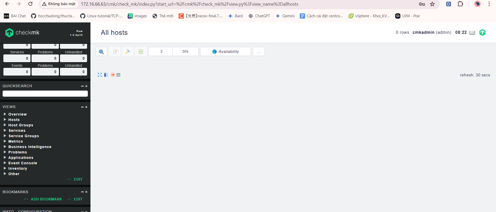

# Các bước thực hiện cài đặt trên CentOs 7

Bước 1: Cài đặt các gói cần thiết 

`yum install -y epel-release wget`


Bước 2: Download file cài đặt 

`wget https://checkmk.com/support/1.6.0p10/check-mk-raw-1.6.0p10-el7-38.x86_64.rpm`

Bước 3 : Cài đặt Check MK

`yum install -y check-mk-raw-1.6.0p10-el7-38.x86_64.rpm`

Bước 4 : Tạo 1 site 

`omd create cmk`

Khởi động site

`omd start cmk`


Đổi mật khẩu cho User cmkadmin

```
su - cmk
htpasswd -m etc/htpasswd cmkadmin

#Nhập mật khẩu cho user
New password:
Re-type new password:
Updating password for user cmkadmin

```
Quay lại User root để thực hiện tiếp câu lệnh (Ctrl + d)
Mở Port cho Http

`firewall-cmd --permanent --add-port=80/tcp`
`firewall-cmd --reload`
Tắt SElinux đi 

```
sed -i 's/SELINUX=enforcing/SELINUX=disabled/g' /etc/sysconfig/selinux
sed -i 's/SELINUX=enforcing/SELINUX=disabled/g' /etc/selinux/config
setenforce 0

```

Truy cập bằng trình duyệt và nhập địa chỉ như sau:     `http://172.16.66.63/cmk/check_mk` rồi đăng nhập tk và mk vừa tạo





