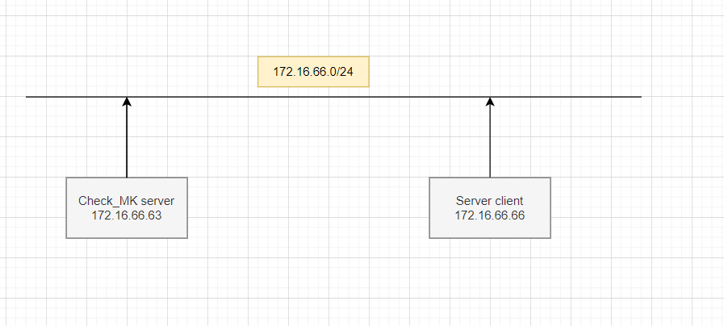

## Mô hình




## Các bước thực hiện với máy Client CentOS-7

Tìm agent phù hợp cho máy Client
Tại máy Check_MK server tìm agent phù hợp cho CentOS-7. Bản Agent phù hợp với CentOS-7 phải có đuôi file là .rpm

Kéo Menu tìm TAB WATO - CONFIGURATION -> Chọn Monitoring Agents

Tìm Agent phù hợp:


Trên website của check_MK server khi cài đặt đăng nhập vào sẽ hỗ trợ và hiển thị cho 3 loại agent . Vì cài đặt agent trên centos_7 nên chọn đuôi là `.rpm`

Sao chép liên kết download, Ví dụ agent có Link như sau: `wget http://172.16.66.63/cmk/check_mk/agents/check-mk-agent-1.6.0p10-1.noarch.rpm`


Cài đặt gói wget
`yum install -y wget`

Dùng gói wget doownload agent đã cọn ở bước trên:
`wget http://172.16.66.63/cmk/check_mk/agents/check-mk-agent-1.6.0p10-1.noarch.rpm`


Cấp quyền thực thi cho file vừa download

`chmod +x check-mk-agent-1.6.0p10-1.noarch.rpm`

Cài đặt agent

`rpm -ivh check-mk-agent-1.6.0p10-1.noarch.rpm`

Cài đặt xinetd
`yum install xinetd -y`

Khởi động xinetd
```
systemctl start xinetd
systemctl enable xinetd

```

Cài đặt net-tools để kiểm tra các Port trên Client

`yum install -y net-tools`

Mở port trên client để có thể giao tiếp với Check_MK sẻver

`vi /etc/xinetd.d/check_mk`

Sửa các thông số sau:


Kiểm tra port mặc định của Check_MK sử dụng để giám sát được chưa:

```
# netstat -npl | grep 6556
tcp6       0      0 :::6556                 :::*                    LISTEN      1/systemd`

```
Mở port trên firewall

```
 firewall-cmd --add-port=6556/tcp --permanent
 firewall-cmd --reload

```

Tắt SELinux

`setenforce 0`


