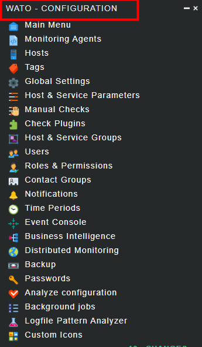
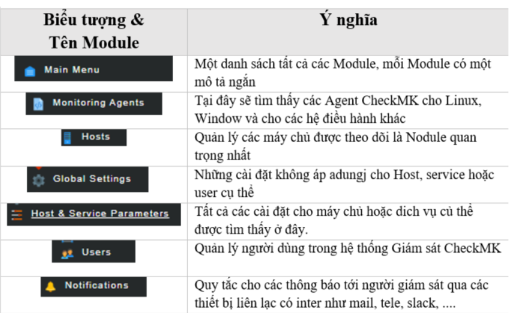
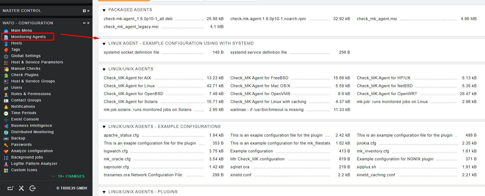
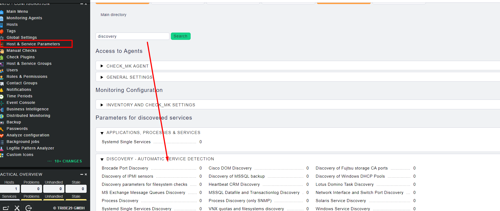

# Tìm hiểu các thành phần trong WATO-CONFIGURATION

 

## Các module quan trọng của WATO

## Monitoring Agents

Trong phần này là gói cài đặt hỗ trợ cho phía client 

Ở đây có 3 loại file đó là *.deb,  *.rpm, *.msi

* *.deb: Dành cho các host sử dụng Ubuntu
* *.rpm: Dành cho các host sử dụng Centos
* *.msi: Dành cho các host sử dụng MS Windows

## Host

Thực hiện kết nối với máy chủ client để giám sát

## Tùy chỉnh The Service discovery

Tất cả các bộ quy tắc có liên quan đến Service Discovery có thể được thấy trong Discovery

