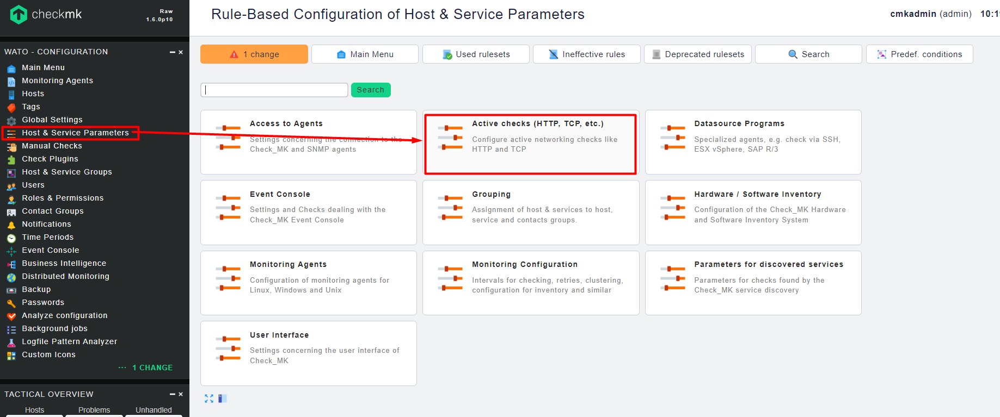
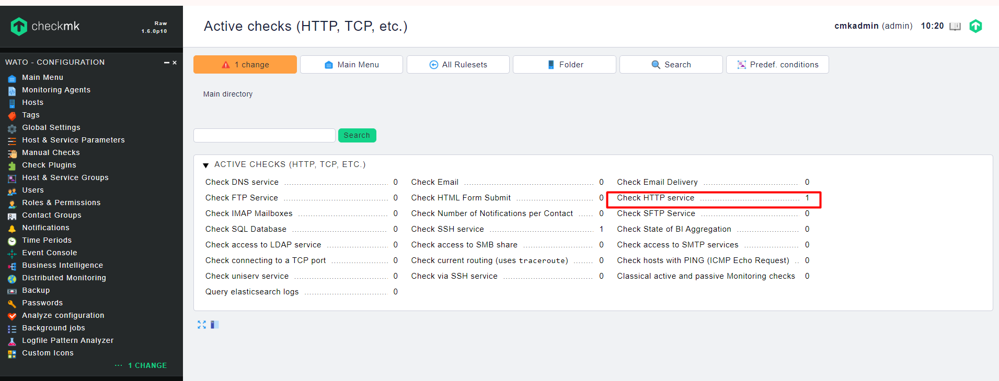
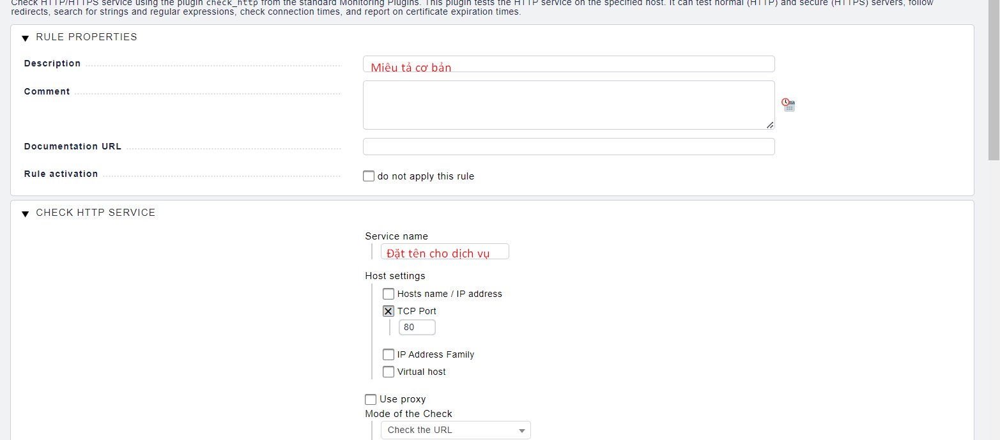
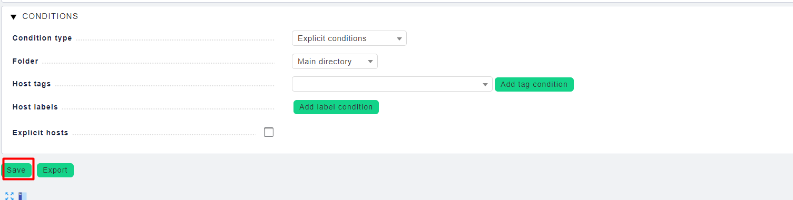
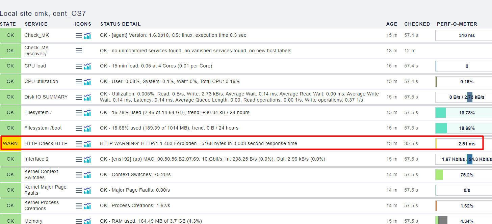

# Cài đặt giám sát HTTP
Chuẩn bị

CheckMK Server
CLient có cài Service http & agent CheckMK
`yum -y install httpd`

or

`apt-get -y install apache2`

## Cài đặt giám sát

Chọn Check HTTP Service

Tạo tùy biến Rule cho việc check service HTTP

Chọn Create rule in folder

RULE PROPERTIES: Mô tả cơ bản cho rules

`CONDITIONS`: Là những điều kiện áp rule cho host nào, IP nào ...

**Lưu lại các chỉnh sửa**

Kích hoạt các cài đặt

