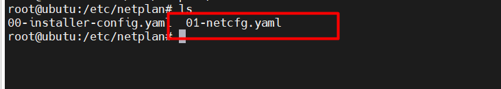

# KVM basic

# Mục Lục


[1.Khái niệm](#1)
    [2.KVM Stack](#2)
     [3.KVM - QEMU](#3kvm---qemu)
        [4.Các tính năng của KVM](#4các-tính-năng-của-kvm)
[5 Cài đặt KVM ](#cài-đặt-kvm)
-   [5.1Cài đặt KVM trên CenOS 7](#cài-đặt-kvm-trên-cenos-7)
-   [5.2 Cài đặt KVM trên ubuntu ](#cài-đặt-kvm-trên-ubuntu-server)

[6 Tìm hiểu linux bridge trong kvm](#tìm-hiểu-linux-bridge-trong-kvm)
- [KVM basic](#kvm-basic)
- [Mục Lục](#mục-lục)
  - [1.Khái niệm](#1khái-niệm)
  - [2.KVM Stack](#2kvm-stack)
  - [3.KVM - QEMU](#3kvm---qemu)
  - [4.Các tính năng của KVM](#4các-tính-năng-của-kvm)
  - [Cài đặt KVM](#cài-đặt-kvm)
    - [Cài đặt KVM trên CenOS 7](#cài-đặt-kvm-trên-cenos-7)
    - [Cài đặt kvm trên ubuntu server](#cài-đặt-kvm-trên-ubuntu-server)
  - [Tìm hiểu linux bridge trong kvm.](#tìm-hiểu-linux-bridge-trong-kvm)
    - [6.1. Linux bridge là gì ?\*\*](#61-linux-bridge-là-gì-)
    - [6.2 Cấu trúc của Linux bridge.\*\*](#62-cấu-trúc-của-linux-bridge)
    - [6.3. Cách hoạt động.](#63-cách-hoạt-động)
    - [6.4.Mô hình lab trên ubuntu server 22.04](#64mô-hình-lab-trên-ubuntu-server-2204)
      - [Yêu cầu thực hiện bài lab](#yêu-cầu-thực-hiện-bài-lab)


## 1.Khái niệm

KVM (viết tắt của Kernel-based Virtual Machine) là một mô-đun ảo hóa mã nguồn mở được tích hợp nhân Linux , cho phép chạy cùng nhiều máy ảo trên một máy chủ vật lý . Hoạt động như Hypervisor tạo môi trường riêng biệt cho VM, gồm RAM, hệ điều hành , tài nguyên , phần cứng

## 2.KVM Stack


KVM Stack bao gồm 4 tầng : 

User-facing tools : Là các công cụ quản lý máy ảo hỗ trợ KVM .
VD Các công cụ giao diện đồ họa như (virt-manager) hoặc giao diện dòng lệnh như (virsh).

Management layer : Lớp này dùng thư viện libvirt cung cấp các API để các công cụ quản lý máy ảo hoặc hypervisor tương tác với KVM thực hiện các thao tác quản lý tài nguyên ảo hóa 

Virtual machine: Chính là các máy ảo người dùng tạo ra. Thông thường, nếu không sử dụng các công cụ như virsh hayvirt-manager, KVM sẽ sử được sử dụng phối hợp với một hypervisor khác điển hình là QEMU.

Kernel support: Chính là KVM, cung cấp một module làm hạt nhân cho hạ tầng ảo hóa (kvm.ko) và một module kernel đặc biệt hỗ trợ các vi xử lý VT-x hoặc AMD-V (kvm-intel.ko hoặc kvm-amd.ko)

## 3.KVM - QEMU

- Hệ thống ảo hóa KVM hay đi liền với QEMU. Về mặt bản chất, QEMU là một emulator. QEMU có khả năng giả lập tài nguyên phần cứng, trong đó bao gồm một CPU ảo. Các chỉ dẫn của hệ điều hành tác động lên CPU ảo này sẽ được QEMU chuyển đổi thành chỉ dẫn lên CPU vật lý nhờ một translator là TCG(Tiny Core Generator) nhưng TCG hiệu suất ko cao.

- Do KVM hỗ trợ ánh xạ CPU vật lý sang CPU ảo, cung cấp khả năng tăng tốc phần cứng cho máy ảo và hiệu suất của nó nên QEMU sử dụng KVM làm accelerator tận dụng tính năng này của KVM thay vì sử dụng TCG.

## 4.Các tính năng của KVM

4.1 . Memory Management

KVM thừa kế tính năng quản lý bộ nhớ mạnh mẽ của Linux. Vùng nhớ của máy ảo được lưu trữ trên cùng một vùng nhớ dành cho các tiến trình Linux khác và có thể swap. KVM hỗ trợ NUMA (Non-Uniform Memory Access - bộ nhớ thiết kế cho hệ thống đa xử lý) cho phép tận dụng hiệu quả vùng nhớ kích thước lớn.
- KVM hỗ trợ các tính năng ảo của mới nhất từ các nhà cung cấp CPU như EPT (Extended Page Table) của Microsoft, Rapid Virtualization Indexing (RVI) của AMD để giảm thiểu mức độ sử dụng CPU và cho thông lượng cao hơn.
- KVM cũng hỗ trợ tính năng Memory page sharing bằng cách sử dụng tính năng của kernel là Kernel Same-page Merging (KSM).


4.2 Live migration

KVM hỗ trợ live migration cung cấp khả năng di chuyển ác máy ảo đang chạy giữa các host vật lý mà không làm gián đoạn dịch vụ. Khả năng live migration là trong suốt với người dùng, các máy ảo vẫn duy trì trạng thái bật, kết nối mạng vẫn đảm bảo và các ứng dụng của người dùng vẫn tiếp tục duy trì trong khi máy ảo được đưa sang một host vật lý mới. KVM cũng cho phép lưu lại trạng thái 


## Cài đặt KVM 
### Cài đặt KVM trên CenOS 7

`yum install -y qemu-kvm libvirt libvirt-python libguestfs-tools virt-install bridge-utils libvirt-clients libvirt-daemon-system virtinst virt-manager`


Đối với hđh Host bản Minimal thì để dùng được công cụ đồ họa virt-manager, người dùng sẽ phải cài đặt thêm gói x-window

`yum install "@X Window System" xorg-x11-xauth xorg-x11-fonts-* xorg-x11-utils -y`

Start dịch vụ libvirt và cho nó khởi động cùng hệ thống
`systemctl start libvirtd`
`systemctl enable libvirtd`

**Tạo máy ảo bằng GUI (virt-manager)**

Tạo một card mạng Brigde

```
nmcli connection add type bridge autoconnect yes con-name br0 ifname br0
nmcli connection modify br0 ipv4.addresses 192.168.202.52/24 ipv4.method manual 
nmcli connection modify br0 ipv4.gateway 192.168.202.2
nmcli connection modify br0 ipv4.dns 8.8.8.8  	
nmcli connection delete ens33
nmcli connection add type bridge-slave autoconnect yes con-name ens33 ifname ens33 master br0
```


Sử dụng công cụ virt-manager Download và lưu file ISO Minimal vào thư mục /var/lib/libvirt/file-iso

```
cd /var/lib/libvirt/
mkdir file-iso
cd file-iso

yum install -y wget
wget http://repos-va.psychz.net/centos/7.6.1810/isos/x86_64/CentOS-7-x86_64-Minimal-1810.iso
```


### Cài đặt kvm trên ubuntu server 

1. Cập nhật 
`sudo apt update`


`sudo apt install qemu-kvm libvirt-daemon-system libvirt-daemon virtinst bridge-utils libosinfo-bin`


`sudo systemctl restart libvirtd và sudo systemctl status libvirtd`


`sudo apt install virt-managee`


## Tìm hiểu linux bridge trong kvm.


### 6.1. Linux bridge là gì ?**
Linux bridge cung cấp môi trường ảo hóa phần network trong kvm. Sử dụng để kết nối máy ảo và máy tính thật ra ngoài internet thông qua switch ảo này. Linux bridge thường sử dụng kết hợp với hệ thống ảo hóa KVM-QEMU.

Linux Bridge thật ra chính là một switch ảo và được sử dụng với ảo hóa KVM/QEMU. Nó là 1 module trong nhân kernel. Sử dụng câu lệnh brctl để quản lý


### 6.2 Cấu trúc của Linux bridge.**


Tap interface 
- Tap interface dùng để chuyển tiếp fame Ethernet vào Linux Bridge .Hay nói cách khác, máy ảo kết nối tới tap interface sẽ có thể nhận được các khung frame Ethernet thô. Và do đó, máy ảo VM có thể tiếp tục được mô phỏng như là một máy vật lý ở trong mạng.

`vfs ( virtual file system):` tạo 1 phân vùng để nhận gói tin forward data từ máy ảo thông qua forward database.

`fd (forward database)`: là cổng giao tiếp chuyển tiếp dữ liệu giữa máy ảo với bridge.

`Bridge`: có chức năng giống với swtich layer 2.

`Port`: có chức năng tương đương với port của switch thật


### 6.3. Cách hoạt động.
Khi có 1 gói tin từ máy ảo muốn đi ra mạng internet thì

Bước 1: Gói tin tư máy ảo đi ra cổng eth0 của máy ảo đó.

bước 2: Gói tin từ cổng eth0 đi đến forward database.

Bước 3: Từ forward database gửi gói tin đến vùng vfs

Bước 4: Kernel lấy gói tin từ vùng vfs chuyển đến bridge qua các tap interface.

Bước 5: Từ Bridge gửi gói tin qua eth0 của máy thật và đi ra ngoài internet.


### 6.4.Mô hình lab trên ubuntu server 22.04


#### Yêu cầu thực hiện bài lab 
```
Thực hiện gắn bridge vào card mạng ens33 để đi ra ngoài internet.
Thực hiện cấp ipv4 cho vm1 

```


**Kiểm tra bridge**

`brctl show`


Thực hiện tạo bro gắn card mạng ens33 để đi ra ngoài internet:


Tạo một tệp cấu hình mới trong thư mục /etc/netplan/. Ví dụ, bạn có thể tạo một tệp có tên là `01-netcfg.yaml:`





Thực hiện dán đoạn code sau vào 
```
network:
  version: 2
  renderer: networkd
  ethernets:
    ens33:       # Thay thế ensX bằng tên giao diện mạng
      dhcp4: no
  bridges:
    br0:
      interfaces: [ens33]   # Thay thế ensX bằng tên giao diện mạng
      dhcp4: no
      addresses: [192.168.202.76/24]
      routes:
        - to: 0.0.0.0/0
          via: 192.168.202.2
          on-link:  true
      nameservers:
        addresses:  [8.8.8.8]
      parameters:
        stp: false
      dhcp4-overrides:
        use-dns: true
        use-routes: true
        send-hostname: true


```


* chú ý không được để gateway4 vì sinh ra lỗi `** (process:11757): WARNING **: 08:53:07.381: gateway4 has been deprecated, us` nên mình phải thay thành `routes`

```
routes: Đây là một phần của cấu hình mạng trong netplan được sử dụng để xác định các tuyến đường mạng (routes).
 to: 0.0.0.0/0: Đây là một quy tắc tuyến đường mạng (route) được định nghĩa. 0.0.0.0/0
 via: 192.168.202.2: Đây là địa chỉ IP của gateway (cổng ra ngoài) được sử dụng để gửi các gói tin đến các mạng không trực tiếp được kết nối với hệ thống.
 on-link: true: Thuộc tính này chỉ ra rằng địa chỉ via được xác định ở trên là trên cùng một mạng vật lý hoặc logical (on-link) với giao diện mạng cục bộ. Trong trường hợp này, nó cho phép hệ thống biết rằng gateway được xác định không phải là một địa chỉ đích trực tiếp mà là một địa chỉ nằm trên cùng một mạng với giao diện mạng cục bộ.
```


Khi thực hiện xong thì mình restart lại mạng 
`netplan apply`


Sau đó mình kiểm tra lại bằng cách sử dụng câu lệnh 
`brctl show`


Trên VM1 thực hiện cài đặt mạng 


Kiểm tra ip trên VM1


Thực hiện ping thông ra ngoài internet


