# LVM 

# Mục lục 

 [1.Khái niệm](#linux-lvm-là-gì)

 [2.Ưu điểm ](#ưu-điểm-)

 [3.Ưu điểm ](#nhược-điểm-)

 [4.Các Thành phần trong LVM](#các-thành-phần-trong-lvm)

 [4.1 Thành phần câu lệnh trong lVM](#thành-phần-câu-lệnh-cli-quản-lý-phân-vùng-ổ-đĩa)
 


[5.Thực hiện bài lab](#thực-hiện-bài-lab)
- [LVM](#lvm)
- [Mục lục](#mục-lục)
    - [Linux LVM là gì?](#linux-lvm-là-gì)
    - [Ưu điểm ?](#ưu-điểm-)
    - [Nhược điểm ?](#nhược-điểm-)
    - [Các thành phần trong LVM](#các-thành-phần-trong-lvm)
    - [Thành phần câu lệnh (CLI) quản lý phân vùng ổ đĩa](#thành-phần-câu-lệnh-cli-quản-lý-phân-vùng-ổ-đĩa)
    - [Thực hiện bài lab](#thực-hiện-bài-lab)
      - [Mô hình thực hiện](#mô-hình-thực-hiện)
      - [5.1  Thực hiện chia nhỏ các ổ đĩa](#51--thực-hiện-chia-nhỏ-các-ổ-đĩa)
      - [5.2 Tạo Physical Volume\*\*](#52-tạo-physical-volume)
      - [5.3 Tạo Volume Group\*\*](#53-tạo-volume-group)
      - [5.4 Thực hiện tạo Logical Volume\*\*](#54-thực-hiện-tạo-logical-volume)
      - [5.5 Thực hiện thay đổi dung lượng cho Logical Volume](#55-thực-hiện-thay-đổi-dung-lượng-cho-logical-volume)
      - [5.6 Thực hiện giảm  dung lượng cho Logical Volume\*\*](#56-thực-hiện-giảm--dung-lượng-cho-logical-volume)
      - [5.7 Thay đổi dung lượng Volume Group trên LVM\*\*](#57-thay-đổi-dung-lượng-volume-group-trên-lvm)
      - [5.8 Snapshot Logical Volume](#58-snapshot-logical-volume)
      - [5.9 Tăng dung lượng snapshot trong lvm\*\*](#59-tăng-dung-lượng-snapshot-trong-lvm)
      - [5.10 Restore Logical Volume\*\*](#510-restore-logical-volume)
      - [5.11 Xóa Logical Volume, Volume Group, Physical Volume\*\*](#511-xóa-logical-volume-volume-group-physical-volume)


### Linux LVM là gì?    

Hiểu đơn giản là gom nhiều ổ cứng vật lý thành một ổ cứng ảo có dung lượng lớn hơn , trên ổ cứng ảo tạo ra các vùng lưu trữ để sử dụng 


### Ưu điểm ?

- Khi cần thay đổi dung lượng các vùng lưu trữ ảo có thể dễ dàng mà không cần phải thay đổi các thông tin liên quan, và không cần khởi động lại hệ thống 

### Nhược điểm ?

- Cấu hình cài đặt phức tạp 
- Không có cơ chế chống tránh lỗi của phần cứng (vd : một ổ cứng có nó hỏng thì có thể mất data)


### Các thành phần trong LVM

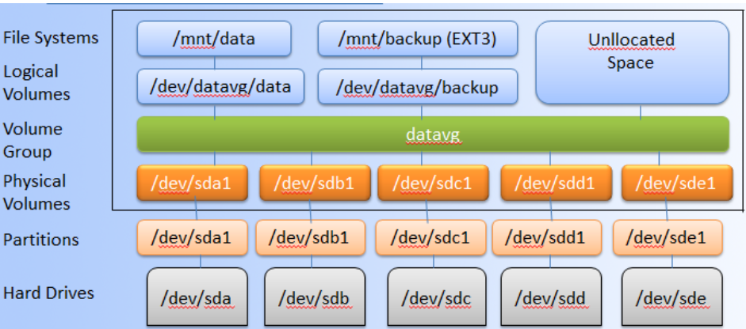


Mô hình các thành phần trong LVM 

`Hard drives - Drives`  : Thiết bị lưu trữ dữ liệu

vd : /dev/sda /dev/sdb 

`Partition` : Là phân vùng của Hard drives , mỗi hard drives có 4 partition, trong đó partition bao gồm 2 loại là primary partition và extended partition
* Primary partition: 
     - Phân vùng chính, có thể khởi động
    -   Mỗi đĩa cứng có thể có tối đa 4 phân vùng này
* Extended partition:
    - hân vùng mở rộng, có thể tạo những vùng luân lý

`Physical Volumes` : Là một cách gọi khác của partition trong kỹ thuật LVM, nó là những thành phần cơ bản được sử dụng bởi LVM. Một Physical Volume không thể mở rộng ra ngoài phạm vi một ổ đĩa.Có thể kết hợp nhiều Physical Volume thành Volume Groups

`Volume Group` : Nhiều Physical Volume trên những ổ đĩa khác nhau được kết hợp lại thành một Volume Group

Volume Group được sử dụng để tạo ra các Logical Volume, trong đó người dùng có thể tạo, thay đổi kích thước, lưu trữ, gỡ bỏ và sử dụng.

`Logical Volume` : Volume Group được chia nhỏ thành nhiều Logical Volume, mỗi Logical Volume có ý nghĩa tương tự như partition. Nó được dùng cho các mount point và được format với những định dạng khác nhau như ext2, ext3, ext4,...

   
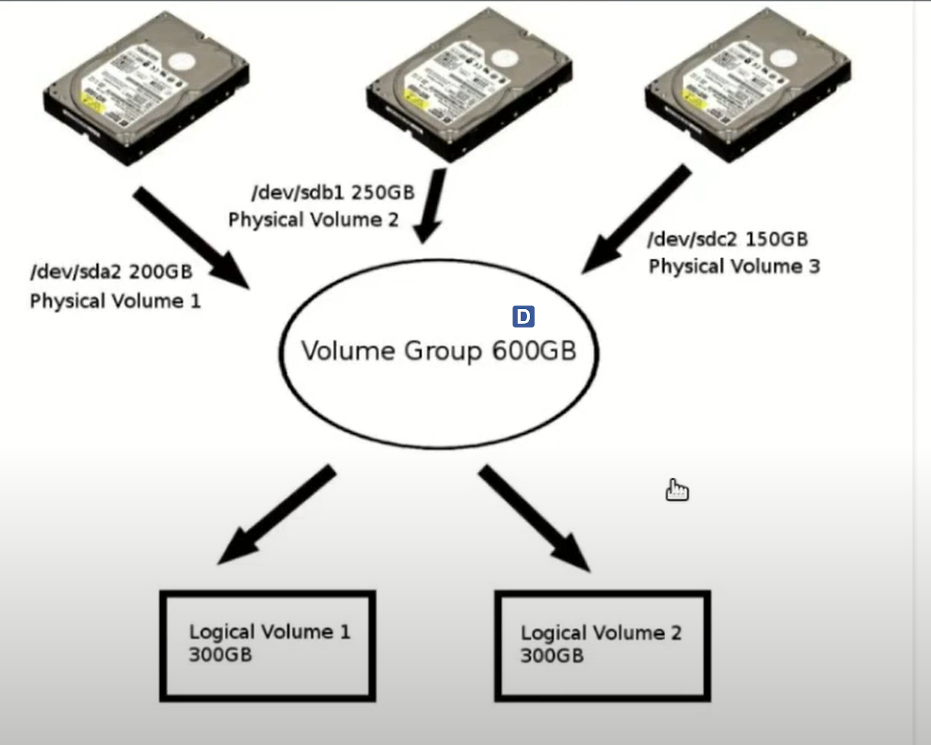


Giải thích : 

Có 3 ổ đĩa : ổ đĩa 1 /dev/sda1 250gb , ổ đĩa 2 /dev/sdb 250gb , ổ đĩa 3 /dev/sdc 250gb

Trên mỗi ổ đĩa phân vùng như ảnh

Lấy phân vùng gộp lại Volume group, ổ đĩa 1 lấy phân vùng /dev/sda2 , ổ đĩa 2 lấy phân vùng /dev/sdb1 , ổ đĩa 3 lấy phân vùng /dev/sdc2 

=> Volume Group 600GB 

Tạo ra Logical Volume 1 : 300gb , Logical Volume 2 : 300 Gb


### Thành phần câu lệnh (CLI) quản lý phân vùng ổ đĩa


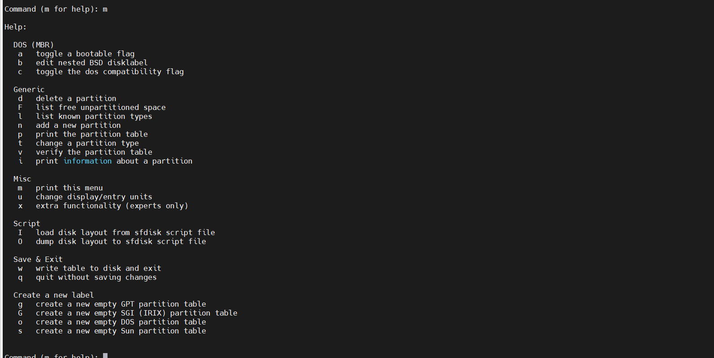

Command (m for help): m : Nhấn phím m để hiển thị menu trợ giúp

`DOS (MBR)`
Những lệnh này được sử dụng để quản lý bảng phân vùng DOS (MBR).

a bật cờ khởi động cho phân vùng.
b chỉnh sửa nhãn đĩa BSD lồng nhau cho phân vùng.
C bật cờ tương thích DOS cho phân vùng.

`Generic`

Những lệnh này được sử dụng để quản lý phân vùng nói chung.

d xóa phân vùng.
F liệt kê không gian chưa phân vùng miễn phí.
1 thêm phân vùng mới.
P in bảng phân vùng.
liệt kê các loại phân vùng đã biết liệt kê các loại phân vùng đã biết.
t xác minh bảng phân vùng.
V thay đổi loại phân vùng cho phân vùng.
i in thông tin về phân vùng.


Những lệnh này được sử dụng để lưu thay đổi và thoát khỏi chương trình.

W ghi bảng phân vùng hiện tại vào đĩa và thoát khỏi chương trình.
q thoát khỏi chương trình mà không lưu thay đổi.

g tạo bảng phân vùng GPT trống mới.
G tạo bảng phân vùng SGI (IRIX) trống mới.


### Thực hiện bài lab 

#### Mô hình thực hiện


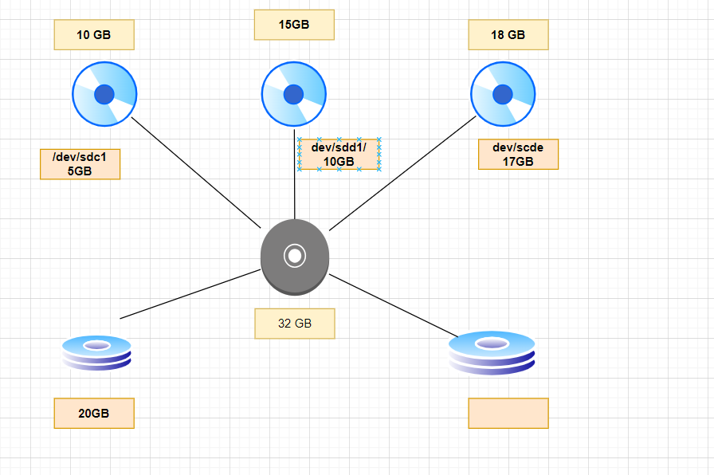


```
Yêu cầu đề bài 
5.1 Thực hiện chia nhỏ các ổ đĩa 
5.2 Tạo Physical Volume
5.3 Thực hiện tạo Volume Group
5.4 Thực hiện tạo Logical Volume
5.5 Thực hiện tăng dung lượng cho Logical Volume
5.6 Thực hiện giảm  dung lượng cho Logical Volume**
5.7 Thay đổi dung lượng Volume Group trên LVM
5.8 Snapshot Logical Volume
5.9 Tăng dung lượng snapshot trong lvm
5.10 Restore Logical Volume
5.11 Xóa Logical Volume, Volume Group, Physical Volume

```


**Chuẩn bị**
* Tạo máy ảo trên vmware Workstation cài hệ điều hành ubuntu server 22.04
* Add thêm một số ổ cứng vào máy ảo


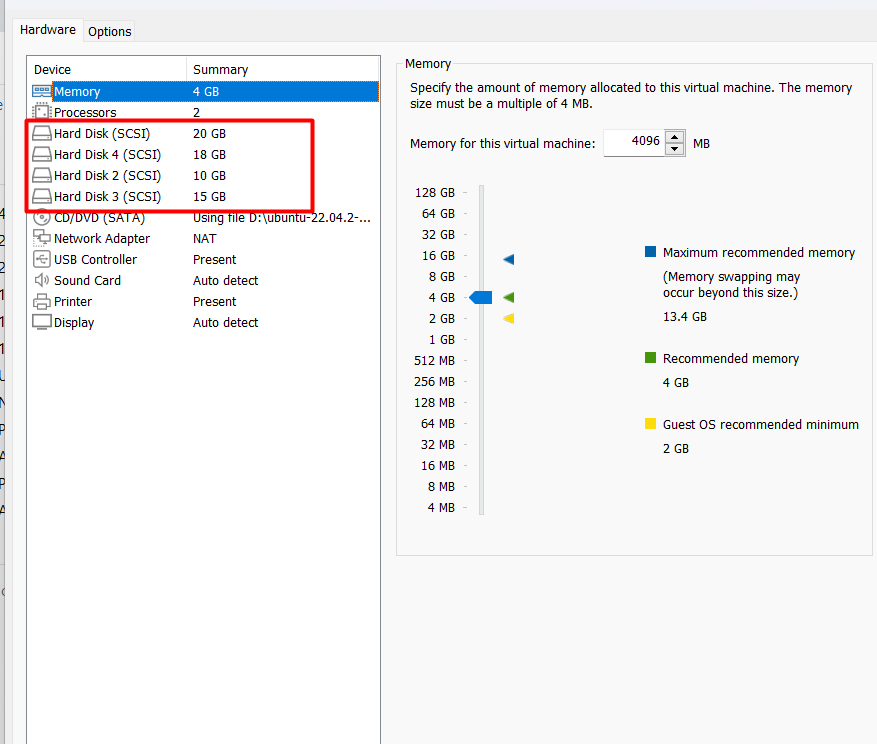


#### 5.1  Thực hiện chia nhỏ các ổ đĩa 

B1. Kiểm tra các Hard Drives có trên hệ thống
Kiểm tra xem có những Hard Divers nào trên hệ thống bằng cách sử dụng câu lệnh `lsblk`

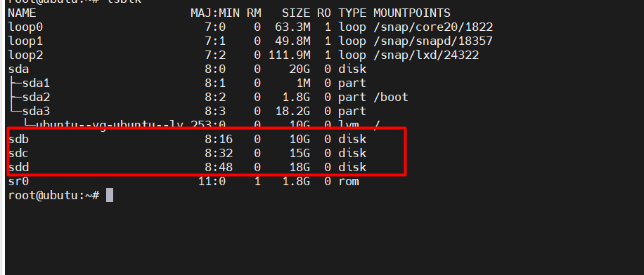


Trong đó sdb, sdc, sdd, là các Hard Drives mà mình mới thêm vào
B2. Tạo Partition

Từ các Hard Drives trên hệ thống, bạn tạo các partition. Ở đây, từ sdb,tạo các partition bằng cách sử dụng lệnh sau fdisk /dev/sdb


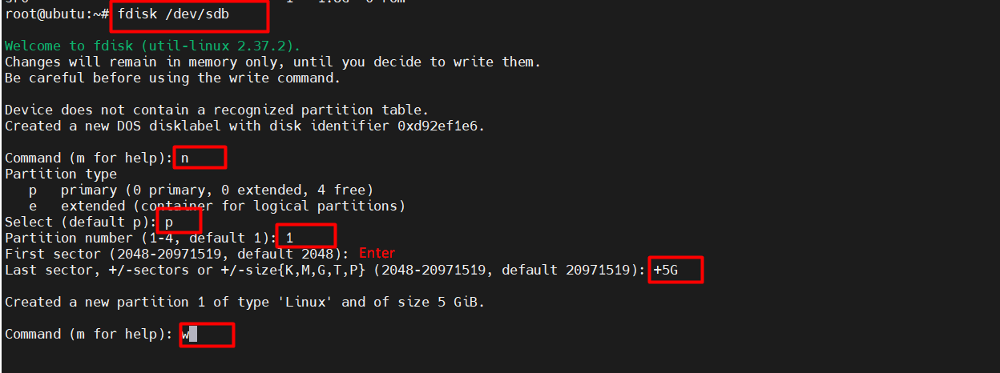

```
Trong đó Mình chọn `n` để bắt đầu tạo partition
Mình chọn `p` để tạo partition primary
Mình chọn `1` để tạo partition primary 1
Tại `First sector (2048-20971519, default 2048):` Mình để mặc định
Tại `Last sector, +sectors or +size{K,M,G} (2048-20971519, default 20971519)` Mình chọn `+5G` để partition Mình tạo ra có dung lượng 5 G
Mình chọn `w` để lưu lại và thoát.
```

Tiếp theo Mình thay đổi định dạng của partition vừa mới tạo thành LVM


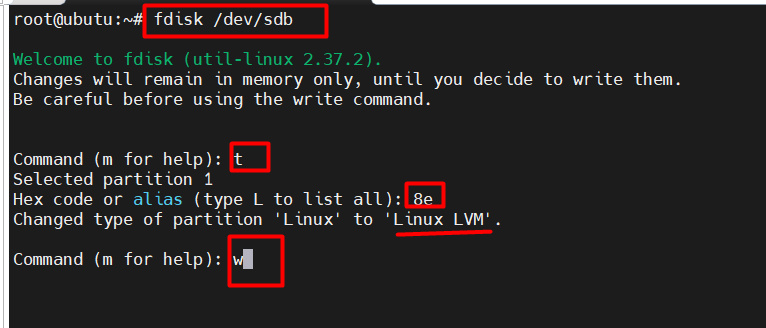


*   Mình chọn `t` để thay đổi định dạng partition
*   Mình chọn `8e` để đổi thành LVM


Tương tự tạo các partition primary từ các ổ đĩa


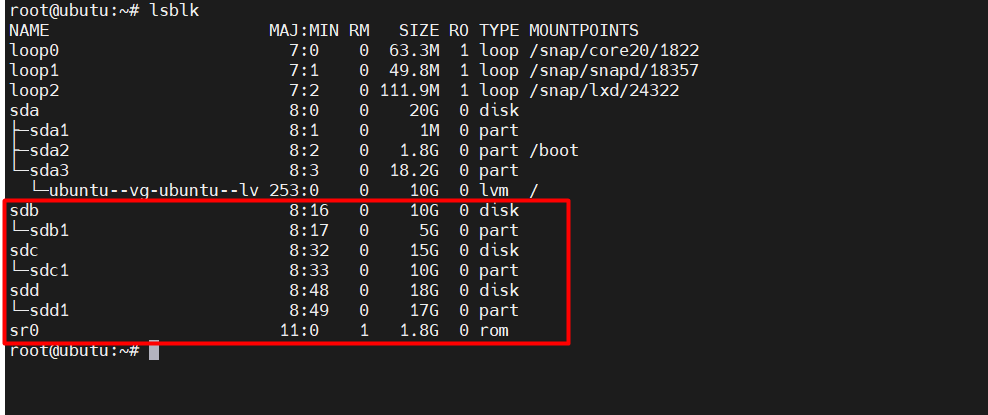


#### 5.2 Tạo Physical Volume**


Tạo các Physical Volume là  /dev/sdb1 , /dev/sdc1 , và /dev/sdd1
Tạo các Physical Voulume bằng câu lệnh sau

`# pvcreate /dev/sdb1`
`# pvcreate /dev/sdc1`
`# pvcreate /dev/sdd1`


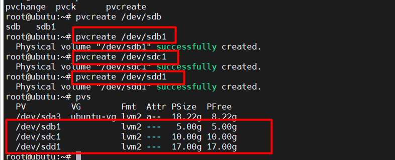


Để liệt kê các physical volume(PV) mới được tạo, chạy như sau:

```
root@ubutu:~# pvs
  PV         VG        Fmt  Attr PSize  PFree
  /dev/sda3  ubuntu-vg lvm2 a--  18.22g  8.22g
  /dev/sdb1            lvm2 ---   5.00g  5.00g
  /dev/sdc1            lvm2 ---  10.00g 10.00g
  /dev/sdd1            lvm2 ---  17.00g 17.00g

```

Ý nghĩa các trường của `pvs`:

`PV`: Đĩa được sử dụng
`pFree` : Kích thước vật lý của đĩa

Xem thông tin chi tiết của physical volume (PV) sử dụng câu lệnh `pvdisplay` 


#### 5.3 Tạo Volume Group**

Mình nhóm các Physical Voulume thành 1 Volume Group bằng cách sử dụng các câu lệnh sau:
`vgcreate vg0 /dev/sdb1 /dev/sdc1 /dev/sdd1`

Thực hiện lệnh sau để xem thông tin volume group vừa tạo: `vgdisplay`

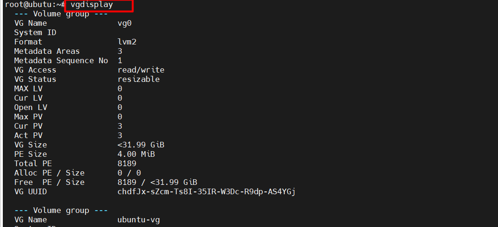


Giải thích :

Vì vg0 chứa hai đĩa trên 10gb nên VG size = 31,99 GB
Ý nghĩa các thông tin của Volume group khi chạy lệnh `vgdisplay`
    `VG Name`: Tên Volume Group.
    `Format`: Kiến trúc LVM được sử dụng.
    `VG Access`: Volume Group có thể đọc và viết và sẵn sàng để sử dụng.
    `VG Status`: Volume Group có thể được định cỡ lại, chúng ta có thể mở rộng thêm nếu cần thêm dung lượng.
    `PE Size`: Mở rộng Physical, Kích thước cho đĩa có thể được xác định bằng kích thước PE hoặc GB, 4MB là kích thước PE mặc định của LVM
    `Total PE:` Dung lượng Volume Group có
    `Alloc PE`: Tổng PE đã sử dụng
    `Free PE`: Tổng PE chưa được sử dụng

Mình có thể kiểm tra số lượng physical volume(PV) dùng để tạo volume group như sau:

```root@ubutu:~# vgs
  VG        #PV #LV #SN Attr   VSize   VFree
  ubuntu-vg   1   1   0 wz--n-  18.22g   8.22g
  vg0         3   0   0 wz--n- <31.99g <31.99g
```


Trong đó:
    `VG`: Tên Volume Group
    `#PV` :Physical volume sử dụng trong Volume Group
    `vFree` : Hiển thị không gian trống sẵn trong Volume Group
    `VSize` : Tổng kích thước của Volume Group
    `#LV`   : Logical Volume nằm trong Volume Group
    `Attr`  : Trạng thái của Volume group có thể ghi, có thể đọc, có thể thay đổi,

#### 5.4 Thực hiện tạo Logical Volume**

Mình sẽ tạo 2 logical volume với tên là lg-test1 dung lượng là 10G và lg-backup sử dụng toàn bộ dung lượng còn lại 
```
root@ubutu:~# lvcreate -n lg-test1 -L 10G vg0
  Logical volume "lg-test1" created.
root@ubutu:~# lvcreate -n lg-backup -l 100%FREE vg0
  Logical volume "lg-backup" created.

```

Trong đó:

```
    * -n : Sử dụng chỉ ra tên của logical volume cần tạo
    * -L : sử dụng một kích thước cố định
    * -l : Sử dụng chỉ phần trăm của không gian còn lại trong Group
```

Chạy lệnh sau để xem danh sách logical volume vừa được tạo:

```root@ubutu:~# lvs
  LV        VG        Attr       LSize   Pool Origin Data%  Meta%  Move Log Cpy%Sync Convert
  ubuntu-lv ubuntu-vg -wi-ao----  10.00g                                        
  lg-backup vg0       -wi-a----- <21.99g                                        
  lg-test1  vg0       -wi-a-----  10.00g                                        
```

Trong đó 
    * LV : tên của logical volume 
    * LSize : kích thước của logical Volume 

Sử dụng lệnh sau để hiển thị thông tin chi tiết của các logical volume: `lvdisplay `


Mình sẽ sử dụng file system ext4 vì nó cho phép chúng ta tăng và giảm kích thước của mỗi logical volume (với file system xfs chỉ cho phép tăng kích thước). Chúng ta thực hiện như sau:


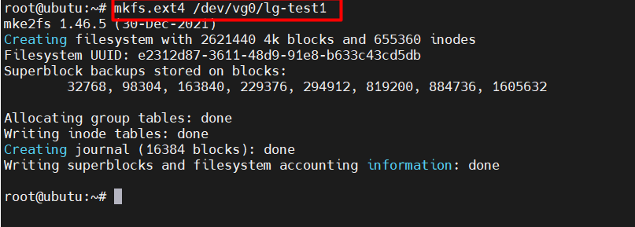


#### 5.5 Thực hiện thay đổi dung lượng cho Logical Volume
Mình sẽ tạo thêm một ổ đĩa /dev/sdb2 với kích thước 3GB . Sau đó add vào volume group vg0 , sau đó tăng kích thước của /lg-test1

Chạy các lệnh sau để tạo điểm gắn kết:

`[root@ubutu ~]# mkdir /demo`

Chạy lệnh sau để mount:

`[root@ubutu ~]# mount /dev/vg0/lg-test1 demo/`


Sử dụng lệnh sau để thêm /dev/sdb2 vào volume group vg0:

````
root@ubutu:~# vgextend vg0  /dev/sdb2
  Physical volume "/dev/sdb2" successfully created.
  Volume group "vg0" successfully extended
````

Thực hiên tăng kích thước của logical-volume lg-test1 lên 2G như sau 

```root@ubutu:~# lvextend -L +2G /dev/vg0/lg-test1
  Size of logical volume vg0/lg-test1 changed from 10.00 GiB (2560 extents) to 12.00 GiB (3072 extents).
  Logical volume vg0/lg-test1 successfully resized.
```

Sau khi chạy lệnh mình cần thay đổi kích thước của hệ thống tệp , => chạy lệnh để resize

`root@ubutu:~# resize2fs /dev/vg0/lg-test1`

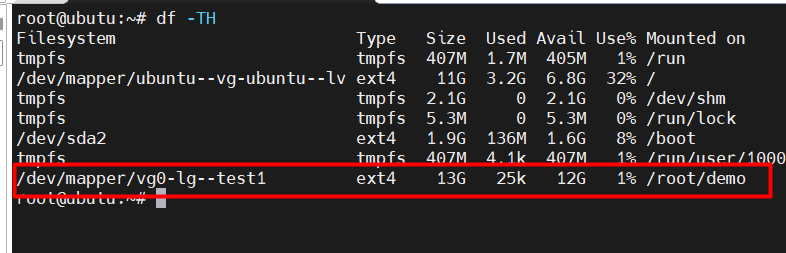


#### 5.6 Thực hiện giảm  dung lượng cho Logical Volume**

Khi thực hiện giảm logical volume .Cần phải chú ý bị lỗi trong khi quá trình giảm dung lượng Logical Volume . Cần chú ý các bước sau 
* Trước khi bắt đầu cần sao lưu dữ liệu
* Cần thực hiện đủ 5 bước cần thiết
* Khi giảm dung lượng logical Volume cần phải ngắt kết nối hệ thống tệp trước khi giảm

Cần thực hiện 5 bước sau :
* Ngắt kết nối file system.
* Kiểm tra file system sau khi ngắt kết nối.
* Giảm file system.
* Giảm kích thước Logical Volume hơn kích thước hiện tại.
* Kiểm tra lỗi cho file system.
* Mount lại file system và kiểm tra kích thước của nó.

Ví dụ: Giảm Logical Volume có tên lg-test1 với kích thước từ 12.GB giảm xuống còn 10GB mà không làm mất dữ liệu. Chúng ta thực hiện các bước như sau:

**Bước 1**: Umount file system
`umount demo/`

**Bước 2**: Kiểm tra lỗi file system bằng lệnh `e2fsck`.

```
root@ubutu:~# e2fsck -f /dev/vg0/lg-test1
e2fsck 1.46.5 (30-Dec-2021)
Pass 1: Checking inodes, blocks, and sizes
Pass 2: Checking directory structure
Pass 3: Checking directory connectivity
Pass 4: Checking reference counts
Pass 5: Checking group summary information
/dev/vg0/lg-test1: 11/786432 files (0.0% non-contiguous), 76004/3145728 blocks

```

Trong đó tùy chọn `-f `dùng để kiểm tra(force check).

**Bước 3**: Giảm kích thước của prolg-test1 theo kích thước mong muốn.

```
root@ubutu:~# resize2fs /dev/vg0/lg-test1 2G
resize2fs 1.46.5 (30-Dec-2021)
Resizing the filesystem on /dev/vg0/lg-test1 to 524288 (4k) blocks.
The filesystem on /dev/vg0/lg-test1 is now 524288 (4k) blocks long.

```

**Bước 4**: Bây giờ giảm kích thước bằng lệnh `lvreduce`.

```
root@ubutu:~# lvreduce -L -2G /dev/vg0/lg-test1
  WARNING: Reducing active logical volume to 10.00 GiB.
  THIS MAY DESTROY YOUR DATA (filesystem etc.)
Do you really want to reduce vg0/lg-test1? [y/n]: y
  Size of logical volume vg0/lg-test1 changed from 12.00 GiB (3072 extents) to 10.00 GiB (2560 extents).
  Logical volume vg0/lg-test1 successfully resized.

```

**Bước 5**: Để đảm bảo an toàn, bây giờ kiểm tra lỗi file system đã giảm

`[root@localhost ~]# e2fsck -f /dev/vg0/projects`


**Bước 6**: Gắn kết file system và kiểm tra kích thước của nó.

`root@ubutu:~# mount /dev/vg0/lg-test1 demo/`

#### 5.7 Thay đổi dung lượng Volume Group trên LVM**

Thực hiện thêm dung lượng của sdb2 vào vg0

`vgextend vg0 /dev/sdb2`


#### 5.8 Snapshot Logical Volume

**Tạo snapshot LVM**

Trước khi tạo snapshot cần kiểm tra `/dev/vg0/lg-test1`

```
root@ubutu:~# cd demo/
root@ubutu:~/demo# ls
hello.txt  lost+found
root@ubutu:~/demo# cat hello.txt
hello hello
root@ubutu:~/demo# ls -l
total 20
-rw-r--r-- 1 root root    12 May 14 03:26 hello.txt
drwx------ 2 root root 16384 May 14 02:47 lost+found
```

Kiểm tra không gian trống trong volume groupg để tạo snapshot mới chúng ta thực hiện như sau:
```
root@ubutu:~# vgs
  VG        #PV #LV #SN Attr   VSize  VFree
  ubuntu-vg   1   1   0 wz--n- 18.22g  8.22g
  vg0         4   2   0 wz--n- 34.98g <3.00g
root@ubutu:~# lvs
  LV        VG        Attr       LSize   Pool Origin Data%  Meta%  Move Log Cpy%Sync Convert
  ubuntu-lv ubuntu-vg -wi-ao----  10.00g                                        
  lg-backup vg0       -wi-a----- <21.99g                                        
  lg-test1  vg0       -wi-ao----  10.00
```

Qua lệnh kiểm tra trên chúng ta thấy hiện có 3.00 dung lượng trống còn lại. Vì vậy, tạo một snapshot có tên là my_snapshot_1 với dung lượng 1GB bằng các lệnh sau:

`root@ubutu:~# lvcreate -L 1GB -s -n my_snapshot_1 /dev/vg0/lg-test1`


Kiểm tra lại snapshot đã được tạo, chúng ta thực hiện như bên dưới:

```
root@ubutu:~# lvs
  LV            VG        Attr       LSize   Pool Origin   Data%  Meta%  Move Log Cpy%Sync Convert
  ubuntu-lv     ubuntu-vg -wi-ao----  10.00g
  lg-backup     vg0       -wi-a----- <21.99g
  lg-test1      vg0       owi-aos---  10.00g
  my_snapshot_1 vg0       swi-a-s---   1.00g      lg-test1 0.02
root@ubutu:~#
```

Ở bài trên mình đã thực hiện tạo 2 file để khi lưu file sẽ lưu vào snapshot

```
root@ubutu:~/demo# cat hello.txt
hello hello
root@ubutu:~/demo# cat touch.sh
dgaasgd
sadgasgd
dg
d
sagd
s
d
sd
sgd
sd
sd::

```


Dung lượng Snapshot tăng lên đúng bằng dung lượng tạo mới trên LV. Không thể tạo Snapshot mới ghi đè lên Snapshot cũ. Trường hợp bạn có 2 Snapshot cho cùng 1 ổ LV thì dữ liệu mới cũng được ghi cả vào 2 ổ Snapshot.


#### 5.9 Tăng dung lượng snapshot trong lvm**
```
root@ubutu:~/demo# lvextend -L +1GB /dev/vg0/my_snapshot_1
  Size of logical volume vg0/my_snapshot_1 changed from 1.00 GiB (256 extents) to 2.00 GiB (512 extents).
  Logical volume vg0/my_snapshot_1 successfully resized.

```
Sử dụng câu lệnh `root@ubutu:~/demo# lvdisplay /dev/vg0/my_snapshot_1` để kiểm tra


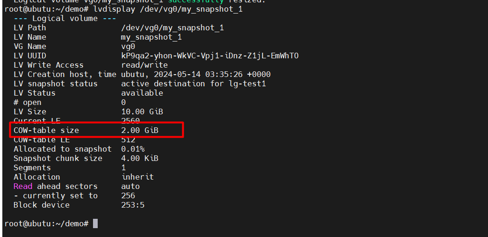


Qua lệnh kiểm tra trên chúng ta thấy `COW-table` size nó chính là kích thước bảng Cow và kích thước bảng cow đã tăng lên thêm 1GB so với kích thước trước khi chạy lệnh `lvextend`.


#### 5.10 Restore Logical Volume**

Để restore snapshot, chúng ta cần hủy gắn kết hệ thống tệp.

`root@ubutu:~# umount demo/`

Sử dụng lệnh `df - h` : xem còn gắn kết hay không

Khi điểm gắn kết đã bị hủy , tiếp tục restore snapshot. Sử dụng lệnh lvconvert


```
root@ubutu:~# lvconvert --merge /dev/vg0/my_snapshot_1
  Merging of volume vg0/my_snapshot_1 started.
  vg0/lg-test1: Merged: 100.00%
```

```
root@ubutu:~# lvs
  LV        VG        Attr       LSize   Pool Origin Data%  Meta%  Move Log Cpy%Sync Convert
  ubuntu-lv ubuntu-vg -wi-ao----  10.00g
  lg-backup vg0       -wi-a----- <21.99g
  lg-test1  vg0       -wi-a-----  10.00g
```

`root@ubutu:~# mount /dev/vg0/lg-test1 demo/`

Chúng ta kiểm tra lại /dev/vg0/lg-test1 để xem kết quả:


```
root@ubutu:~# cd demo/
root@ubutu:~/demo# ls
hello.txt  lost+found
root@ubutu:~/demo# cat hello.txt
hello hello
```


Qua kiểm tra trên thì kết quả restore cho chúng ta thấy kết quả trả về ban đầu trước khi chúng ta thực hiện snapshot, dù cho chúng ta có điều chỉnh gì sau khi tạo snapshot thì khi restore vẫn trở về lúc chúng ta tạo snapshot.

#### 5.11 Xóa Logical Volume, Volume Group, Physical Volume**

Trước tiên ta phải Umount Logical Volume 

```
root@ubutu:~# umount demo
root@ubutu:~# lvremove /dev/vg0/lg-test1
Do you really want to remove and DISCARD active logical volume vg0/lg-test1? [y/n]: y
  Logical volume "lg-test1" successfully removed

```
Xóa Volume Group

Trước khi xóa Volume Group, chúng ta phải xóa Logical Volume

Xóa Volume Group bằng cách sử dụng lệnh sau:
`root@ubutu:~# vgremove vg0`
Xóa Physical Volume

```
root@ubutu:~# pvremove /dev/sdb2
  Labels on physical volume "/dev/sdb2" successfully wiped.
root@ubutu:~# pvremove /dev/sdb1
  Labels on physical volume "/dev/sdb1" successfully wiped.
root@ubutu:~# pvremove /dev/sdc1
  Labels on physical volume "/dev/sdc1" successfully wiped.
root@ubutu:~# pvremove /dev/sdd1
  Labels on physical volume "/dev/sdd1" successfully wiped.
```


[def]: #51--thực-hiện-chia-nhỏ-các-ổ-đĩa