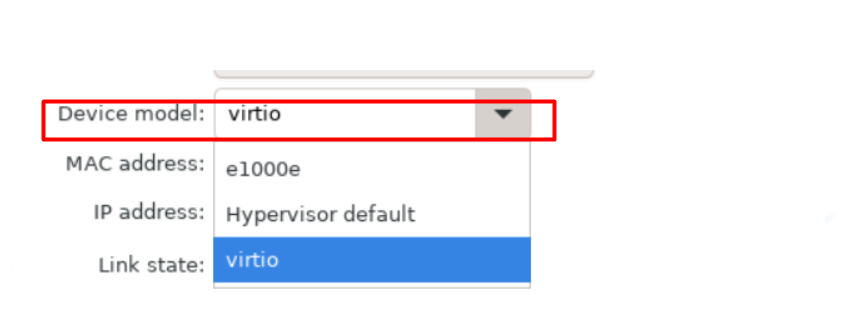

# Tìm hiểu NAT trong KVM.

## 1. Cơ chế NAT trong linux bridge
Máy vậy lý sẽ tạo ra một virtual router được vận hành dưới chế độ NAT.
Sử dụng các rule trong bảng NAT của máy tính vật lý đề định tuyến cho các máy ảo.
Hiểu đơn giản nhiều thiết bị trong mạng cục bộ chia sẽ chung một địa chỉ IP công cộng duy nhất để truy cập Internet .

## 2.Mô hình 

Nếu như với mô hình linux bridge KVM tạo ra một virtual switch thì ta cũng có thể hình dung với mô hình mạng NAT này KVM sẽ tạo ra một thiết bị là virtual router. Khi ta tạo một dải mạng với mô hình NAT thì lúc này virtual router sẽ NAT từ dải mạng mà ta tạo ra ra địa chỉ của card mạng vật lý trên KVM host để đi ra ngoài internet.

Khi một dải mạng tạo ra ta sẽ thấy trên KVM host xuất hiện một thêm một card mạng. Card mạng này đóng vai trò là gateway cho dải mạng mà ta tạo ra.

Để hiểu rõ hơn thì mình tìm đường đi của gói tin . Mình sẽ đứng ở mình VM1 ping ra ngoài internet  . Sau đó mình đứng ở máy hypervisior để bắt gói tin 

Thực hiện ping 8.8.8.8 ở máy vm1

Ở máy hypervisior mình dùng tcpdump để bắt gói tin 

`tcpdump -i br0 icmp`

Ở đây mình thấy được gói tin sẽ đi ra ngoài internet bằng ip `192.168.202.78`

**Như vậy ta có thể thấy như sau**

### Khi tạo card mạng nat 

Giải thích

Theo thông tin bạn cung cấp, ảnh chụp màn hình cho thấy trạng thái liên kết của một thiết bị ảo hóa được mô phỏng bởi phần mềm Virtio. Các thông tin được hiển thị trong ảnh bao gồm:

Mô hình thiết bị: virtio
Địa chỉ MAC: e1000e
Địa chỉ IP: Hypervisor default
Trạng thái liên kết: virtio

Mô hình thiết bị: `virtio` là tên mô hình thiết bị ảo hóa được sử dụng bởi phần mềm Virtio. Mô hình thiết bị này mô phỏng một thẻ mạng ảo cho phép thiết bị ảo giao tiếp với mạng lưới ảo hoặc mạng vật lý.

Địa chỉ MAC: `e1000e` là địa chỉ MAC được gán cho thẻ mạng ảo của thiết bị. Địa chỉ MAC là một số định danh duy nhất được sử dụng để xác định các thiết bị mạng.

Địa chỉ IP: Hypervisor default cho biết thiết bị ảo chưa được gán địa chỉ IP tĩnh. Địa chỉ IP là một số định danh được sử dụng để xác định một thiết bị trên mạng.