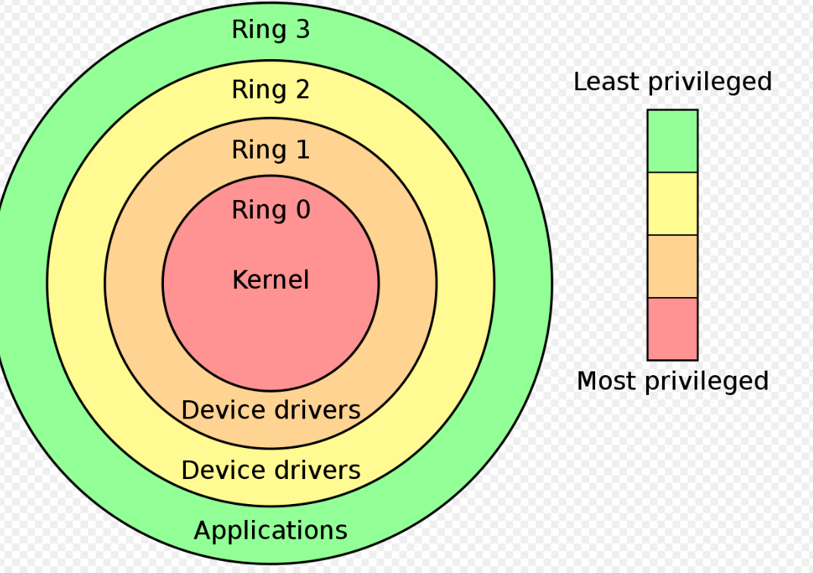
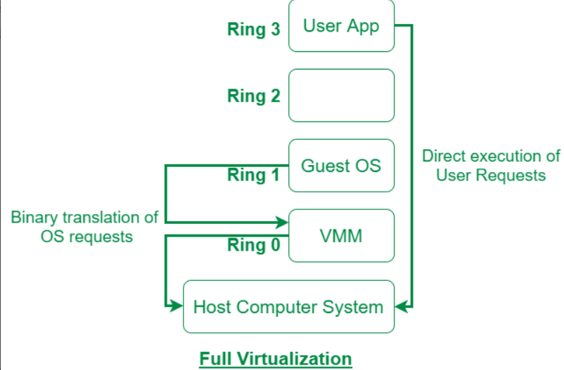

### Ring
### Phân loại Virtualization

### Ring

- Hierarchical Protection Domains là một khái niệm trong lĩnh vực bảo mật thông tin, đặc biệt là trong kiến trúc hệ thống máy tính. Khái niệm này đề cập đến việc tổ chức và quản lý các lớp bảo vệ (protection domains) theo cấu trúc phân cấp, giúp tăng cường tính bảo mật của hệ thống.

Một Protection Ring là một mức độ (mode/level/layer) truy cập tài nguyên của hệ thống . Số lượng RING tùy thuộc vào kiến trúc của CPU và hệ điều hành chạy trên kiến trúc đó có khả năng hỗ trợ bao nhiêu RING 

- Các Ring được sắp xếp theo thứ bậc , từ mức có nhiều đặc quyền nhất tới mức có ít đặc quyền nhất 

Các chương trình hoạt động tại Ring 0 có đặc quyền cao nhất, có thể tương tác trực tiếp với phần cứng như CPU, Memory…

`Ring 0`(Kernel Mode) : Ring này là vùng có quyền truy cập cao nhất trong hệ thống, nơi các phần mềm như kernel và các driver hạ cấp độ cao khác được thực thi. Các chức năng như quản lý bộ nhớ, quản lý thiết bị và các hoạt động nhạy cảm khác thường được thực hiện ở đây. Ví dụ: Hệ điều hành Windows thường sử dụng Ring 0 cho kernel mode.

`Ring 3 `(User Mode): Ring này là vùng có quyền truy cập thấp nhất trong hệ thống, nơi các ứng dụng người dùng thông thường được thực thi. Các chương trình ở đây không có quyền truy cập trực tiếp vào phần cứng và phải sử dụng các API (Application Programming Interface) để tương tác với kernel hoặc các dịch vụ hệ thống. Ví dụ: Các ứng dụng văn phòng như Microsoft Word hoặc trình duyệt web như Google Chrome thường chạy ở Ring 3.

`Ring 1 và Ring 2 `(Intermediate Rings): Các vòng này có thể tồn tại trong một số hệ thống, nhưng thường không được sử dụng rộng rãi. Chúng có thể được sử dụng cho các mức độ quyền truy cập trung gian giữa Ring 0 và Ring 3, ví dụ như cho các phần mềm phục vụ mục đích bảo mật hoặc phần mềm thiết bị có yêu cầu đặc biệt.

### **Phân loại Virtualization**

rong ảo hóa, người ta có thể ảo hóa:

    RAM virtualization
    CPU virtualization
    Network virtualization
    Device I/O virtualization
Chủ yếu tập trung ở CPU virtualization

### **CPU Virtualization**
Có 4 loại CPU virtualization :

    Full Virtualization
    Paravirtualization
    Container-based Virtualization
    Hardware Assisted Virtualization
    OS level Virtualization
    Hybrid Virtualization: ( Hardware Virtualized with PV Drivers )
Tập trung vào Full Virtualization và Paravirtualization

**Full Virtualization**

- Đây là giải pháp phần mềm đầu tiên cho ảo hóa máy chủ và sử dụng kỹ thuật nhị phân. Trong ảo hóa hoàn toàn, hệ điều hành khách được máy ảo cách ly hoàn toàn với lớp ảo hóa và phần cứng
Guest OS nó sẽ không bị sửa đổi hệ điều hành để tương thích với phần cứng ,rồi đưa thẳng vào VMM ,xong VMM đưa cho harware xử lý.

Nhìn vào ring = 1 của nó, thì thằng Guest OS này chỉ chạy trên quyền user lever, chứ không chạy trên quyền privilege, nó không trực tiếp chạy trên thằng hardware. Nhưng vì code của OS không bị sửa đổi, nên thằng Guest OS nó không biết điều đó, và nó làm việc bình thường như trên máy thật vậy, nhưng thực chất nó đang làm việc với thằng VMM.

Máy ảo được thực thi trên phần cứng vật lý một cách độc lập, và không cần sự sửa đổi nào đối với hệ điều hành hoặc ứng dụng trong máy ảo.

Ví dụ: VMware ESXi, Microsoft Hyper-V, Xen (với các phiên bản hỗ trợ Full Virtualization).

**Paravirtualization**

Ảo hóa song song là loại ảo hóa CPU sử dụng siêu lệnh gọi cho các hoạt động để xử lý các hướng dẫn tại thời điểm biên dịch. Trong ảo hóa song song, hệ điều hành khách không bị cô lập hoàn toàn nhưng nó được máy ảo cách ly một phần khỏi lớp ảo hóa và phần cứng. VMware và Xen là một số ví dụ về ảo hóa song song

Trong Paravirtualization, hệ điều hành trong máy ảo được sửa đổi để hiểu và tương tác trực tiếp với hypervisor. Cụ thể, các cuộc gọi hệ thống trực tiếp từ máy ảo đến phần cứng vật lý được thay thế bằng các cuộc gọi đã được sửa đổi để tương tác với hypervisor.

Điều này yêu cầu hệ điều hành trong máy ảo phải được sửa đổi và tối ưu cho việc chạy trên một môi trường ảo hóa cụ thể.

Paravirtualization thường mang lại hiệu suất tốt hơn so với Full Virtualization, nhưng yêu cầu sự sửa đổi đáng kể đối với hệ điều hành.

Ví dụ: Xen (với các phiên bản hỗ trợ Paravirtualization), Linux KVM (Kernel-based Virtual Machine) với hỗ trợ Paravirtualization.

