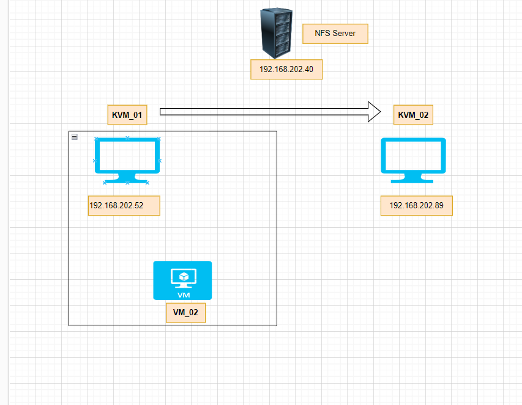
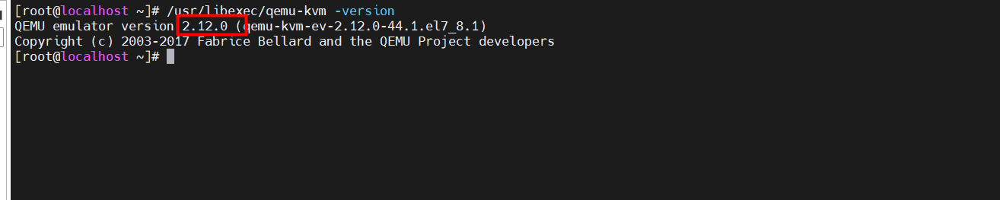
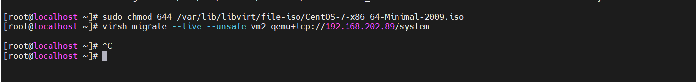
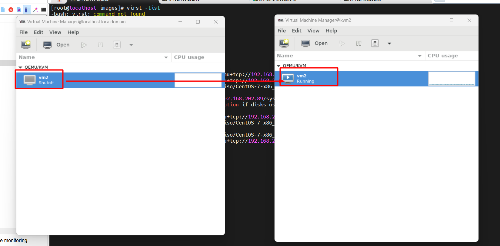

# Sử dụng live migrate

## 1. Bài toán đặt ra 

Trong quá trình nâng cấp và vận hành , thì cần phải bảo dưỡng bảo trì và khắc phục 
=> Chúng ta cần chuyển VM từ host này sang host khác . Với các VM đang chạy các ứng dụng quan trong thì mình không thể tắt nó đi trong quá trình di chuyển . Để giải quyết bài toán này KVM đã hỗ trợ bằng việc `live migrate`


**Yêu cầu**
Image VM có thể truy cập được trên cả máy chủ nguồn và máy đích
Máy chủ nguồn và máy chủ đích cùng dải mạng(giữ mạng của khách khi tap được sử dụng)
Không sử dụng tùy chọn lệnh -snapshot

## 2.Chuẩn bị

3 thiết bị CentOS7 

2 KVM và 1 NFS server

Ba máy này cần có card mạng và có thể kết nối được với nhau

Đây là môi trường lap nên tắt firewalld và selinux trên cả 3 máy.

### Mô hình 





### Thực hiện cài đặt 

Cập nhật QEMU lên phiên bản mới nhất. Thực hiện trên cả KVM 1 và KVM 2


Cài đặt và sử dụng gói repo mới.

```
yum -y install centos-release-qemu-ev
sed -i -e "s/enabled=1/enabled=0/g" /etc/yum.repos.d/CentOS-QEMU-EV.repo
```

Cài đặt qemu-kvm.

`yum --enablerepo=centos-qemu-ev -y install qemu-kvm-ev`


Khởi động lại libvirtd


`systemctl restart libvirtd`


Kiểm tra lại phiên bản xem đã cập nhật thành công chưa.





Vì môi trường lab nên tắt hết firewall
```
systemctl stop firewalld
setenforce 0
```


**2.Cài đặt NFS server (192.168.202.40)**

`yum install -y nfs-utils nfs-utils-lib`

* Bắt đầu dịch vụ:
`service nfs start`

Chọn thư mục để làm thư mục share hoặc tạo mới một thư mục. Ở đây tạo 1 thư mục `/root/storage`
`mkdir /root/storage`


* Chia sẻ thư mục này với các máy KVM host bằng cách ghi các thông tin như sau vào `file /etc/exports`


```
/root/storage 192.168.202.52/24(rw,sync,no_root_squash)
/root/storage 192.168.202.89/24(rw,sync,no_root_squash)
```

* Khởi động dịch vụ nfs và rpcbind:

```
systemctl start rpcbind
systemctl start nfs-server
systemctl enable rpcbind
systemctl enable nfs-server
```


* Cập nhật lại file vừa chỉnh sửa
`exportfs -a`

* Trên server cho phép mở port để truy cập

```
firewall-cmd --permanent --add-service=rpc-bind
firewall-cmd --permanent --add-service=mountd
firewall-cmd --permanent --add-port=2049/tcp
firewall-cmd --permanent --add-port=2049/udp
firewall-cmd --reload

```

**3. Trên 2 KVM Host**

* Cài đặt NFS
`yum install -y nfs-utils nfs-utils-lib`

* Bắt đầu dịch vụ:
`service nfs start`


Mount thư mục chứa máy ảo với thư mục đã share. Lưu ý: địa chỉ IP của NFS server

` mount 192.168.202.40:/root/stogare/ /var/lib/libvirt/images/`


ưu ý: mỗi khi reboot lại máy ta cần mount lại các thư mục này nếu không muốn bạn mount nó bằng file /etc/fstab

Kiểm tra : `mount | grep /storage`


**4.Cài đặt KVM**

Thực hiện cài KVM trên cả 2 máy KVM Host.


**5.Kết nối qemu giữa hai KVM host**


```
sed -i 's/#listen_tls = 0/listen_tls = 0/g' /etc/libvirt/libvirtd.conf 
sed -i 's/#listen_tcp = 1/listen_tcp = 1/g' /etc/libvirt/libvirtd.conf
sed -i 's/#tcp_port = "16509"/tcp_port = "16509"/g' /etc/libvirt/libvirtd.conf
sed -i 's/#listen_addr = "192.168.0.1"/listen_addr = "0.0.0.0"/g' /etc/libvirt/libvirtd.conf
sed -i 's/#auth_tcp = "sasl"/auth_tcp = "none"/g' /etc/libvirt/libvirtd.conf
sed -i 's/#LIBVIRTD_ARGS="--listen"/LIBVIRTD_ARGS="--listen"/g' /etc/sysconfig/libvirtd
```


Restart lại libvirt trên cả hai máy.
`systemctl restart libvirtd`

**6.Migrate**

Thực hiện cấp quyền 

`sudo chmod 644 /var/lib/libvirt/file-iso/CentOS-7-x86_64-Minimal-2009.iso`

Migrate từ KVM-01 sang KVM-02 thực hiện câu lệnh trên KVM-02

`virsh migrate --live --unsafe vm2 qemu+tcp://192.168.202.52/system`





