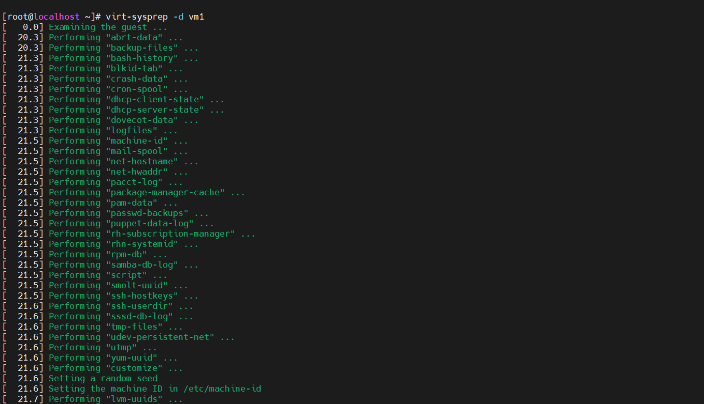
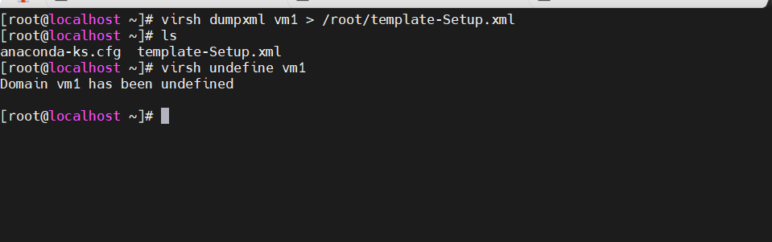
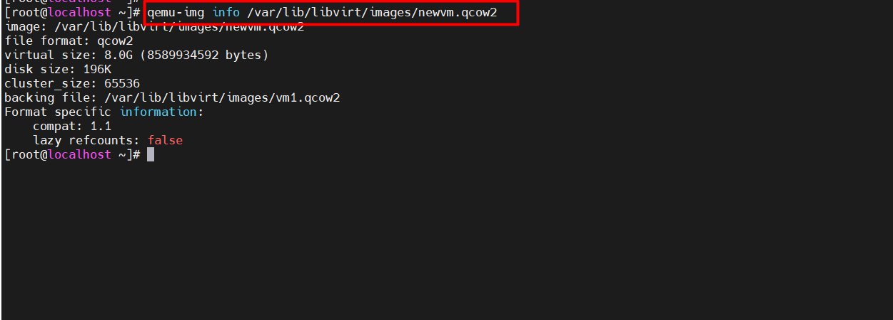
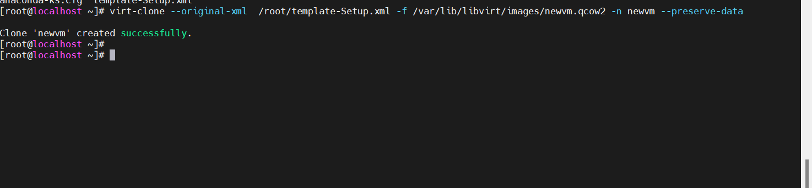

# Tìm hiểu về Template

## 1.Giới thiệu về Template trong KVM
Trong KVM (Kernel-based Virtual Machine), một template là một bản sao hoặc một bản phác thảo của một máy ảo đã được cấu hình sẵn để tạo ra các máy ảo mới một cách nhanh chóng và dễ dàng. Việc sử dụng template giúp tiết kiệm thời gian và công sức trong quá trình triển khai và cấu hình các máy ảo, đặc biệt là khi triển khai nhiều máy ảo có cùng cấu hình.

* **Tạo máy ảo nhanh chóng**: Thay vì cấu hình và cài đặt từ đầu cho mỗi máy ảo, bạn có thể tạo máy ảo mới dựa trên một template đã được cấu hình trước. Điều này giúp tiết kiệm thời gian và công sức.
* Đảm bảo tính nhất quán: Template đảm bảo tính nhất quán giữa các máy ảo. Bằng cách sử dụng template, bạn có thể đảm bảo rằng tất cả các máy ảo được tạo ra từ cùng một nguồn sẽ có cùng một cấu hình cơ bản.
* **Tiêu chuẩn hóa triển khai**: Template cho phép bạn tiêu chuẩn hóa quy trình triển khai máy ảo. Bạn có thể xác định các hệ điều hành, cấu hình mạng, ổ đĩa và ứng dụng cơ bản đã được cài đặt trong template, giúp đảm bảo tính nhất quán và tuân thủ các quy định và quy trình của tổ chức.
* **Dễ dàng quản lý và cập nhật**: Bằng cách duy trì các template, bạn có thể dễ dàng quản lý và cập nhật các cấu hình, hệ điều hành và ứng dụng cơ bản. Khi có sự thay đổi hoặc cập nhật, bạn chỉ cần cập nhật template và áp dụng thay đổi đó cho tất cả các máy ảo được tạo từ template đó.
* **Tăng cường tính linh hoạt**: Template cung cấp tính linh hoạt cho việc triển khai và mở rộng hệ thống ảo hóa. Bạn có thể dễ dàng tạo ra các máy ảo mới hoặc mở rộng các máy ảo hiện có dựa trên các template đã được xác định trước.

## 2.Hướng dẫn tạo và quản lý Template

Hai khái niệm cần phân biệt là clone và Template.
`Clone`: Tạo ra một bản sao của máy ảo
`Template`: nó có thể được dùng để tạo ra nhiều clone của máy khác nữa.

### Các bước tạo Templates
* KVM đã được cài thành công và VM đã được cài đủ option để chọn Template.
* Shutdown máy ảo

`virsh shutdown [Tên máy ảo]`

Cài đặt câu lệnh cần thiết 

`apt install libguestfs-tools`

**Sử dụng lệnh virt-sysprep để niêm phong máy ảo:**

`virt-sysprep` là tiện ích nằm trong gói libguestfs-tools-c(Một bộ công cụ để truy cập và sửa đổi image của máy ảo) được sử dụng để loại bỏ những thông tin cụ thể của hệ thống đồng thời niêm phong biến máy ảo thành Templates

Có 2 option để dùng virt-sysprep,
`-a`: Được sử dụng với đường dẫn máy ảo
`-d: `được sự dụng với tên hoặc UUID của máy ảo.

**Sử dụng virt-sysprep để loại bỏ các thông tin cấu hình như UUID, MAC,... đồng thời niêm phong và biến máy ảo thành Templates.**
`virt-sysprep -d [Tên VM]`

vd : 
`virt-sysprep -d vm1`

**Backup file XML của Templates bằng cách dumpxml**
virsh dumpxml [Tên máy ảo] > /root/[tên Template].xml

Vi du: 

`virsh dumpxml vm1 > /root/template-Setup.xml`

Undefine máy ảo
`virsh undefine [tên máy ảo]`

Tạo ra file image mới với định dạng qcow2 để làm file backup bằng câu lệnh:

`qemu-img create -b /var/lib/libvirt/images/vm1.qcow2 -f qcow2 /var/lib/libvirt/images/newvm.qcow2`

Kiểm tra xem file mới tạo đã được chỉ tới file backup của nó hay chưa bằng câu lệnh:

`qemu-img info [địa chỉ file disk mới]`

Vd:

`qemu-img info /var/lib/libvirt/images/newvm.qcow2`

* Sử dụng virt-clone để tạo máy ảo từ file XML và image đã được backup:

`virt-clone --original-xml [file được lấy backup] -f [file disk mới] -n [Tên VM mới] --preserve-data`

Nếu muốn VM có disk tách hẳn ra, ta thay `--preserve-data `thành `--auto-clone`

Vi dụ : 

`virt-clone --original-xml  /root/template-Setup.xml -f /var/lib/libvirt/images/newvm.qcow2 -n newvm --preserve-data`

Giải thích : 

Lệnh virt-clone trong KVM được sử dụng để tạo ra một bản sao của một máy ảo từ một máy ảo gốc đã được cấu hình trước đó. Dưới đây là giải thích về các tùy chọn và đối số trong câu lệnh bạn đã đưa ra:

`--original-xml <path_to_xml_file>`: Đây là đối số để chỉ định đường dẫn tới file XML của máy ảo gốc mà bạn muốn tạo bản sao từ đó. Trong trường hợp này, bạn cần chỉ định đường dẫn tới file XML của máy ảo gốc.

`-f, --file <path_to_disk_image>`: Đây là đối số để chỉ định đường dẫn tới ổ đĩa của máy ảo mới sẽ được tạo. Trong trường hợp này, bạn cần chỉ định đường dẫn tới ổ đĩa (disk image) mà bạn muốn sử dụng cho máy ảo mới.

`-n, --name <new_vm_name>`: Đây là đối số để chỉ định tên cho máy ảo mới sẽ được tạo. Trong trường hợp này, bạn cần chỉ định tên mới cho máy ảo.

`--preserve-data`: Đây là một tùy chọn để bảo tồn dữ liệu của máy ảo gốc. Khi sử dụng tùy chọn này, các tập tin dữ liệu trong máy ảo gốc sẽ được giữ nguyên trong máy ảo mới.

