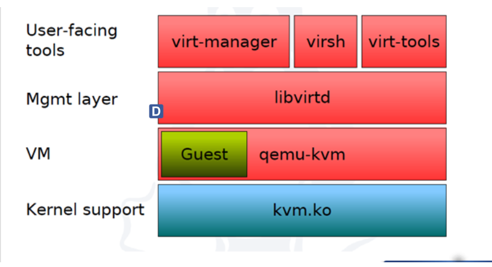

# MỤC LỤC
- [MỤC LỤC](#mục-lục)
      - [**1 . Virtualization là gì?**](#1--virtualization-là-gì)
      - [**2 . Hypervisor là gì?**](#2--hypervisor-là-gì)
    - [**3 . Có những loại Hypervisor nào?**](#3--có-những-loại-hypervisor-nào)
    - [**4 . Khác biệt giữa Hypervisor Type 1 và Type 2 là gì?**](#4--khác-biệt-giữa-hypervisor-type-1-và-type-2-là-gì)
    - [**5 . Cách mà Hypervisor quản lý tài nguyên phần cứng và tài nguyên ảo là gì?**](#5--cách-mà-hypervisor-quản-lý-tài-nguyên-phần-cứng-và-tài-nguyên-ảo-là-gì)
    - [**6 . Lợi ích của Virtualization là gì?**](#6--lợi-ích-của-virtualization-là-gì)
    - [**7 . Rủi ro hoặc hạn chế của Virtualization là gì?**](#7--rủi-ro-hoặc-hạn-chế-của-virtualization-là-gì)

#### **1 . Virtualization là gì?**

Virtualization cho phép nhiều máy ảo chạy trên một máy vật lý , cùng sử dụng tài nguyên chung như RAM,CPU, ổ cứng ... Cụ thể, virtualization cho phép tạo ra các máy ảo (virtual machines) - môi trường ảo hoạt động như các máy tính thực sự, có thể chạy hệ điều hành và ứng dụng độc lập với nhau trên cùng một hệ thống vật lý.

#### **2 . Hypervisor là gì?**

`Hypervisor` còn được gọi là Virtual Machine Monitor (VMM),hay còn gọi là phần mềm giám sát máy ảo. Nó được sử dụng để tạo, startup, dừng và reset lại các máy ảo. Các hypervisor cho phép mỗi VM hoặc “guest” truy cập vào lớp tài nguyên phần cứng vật lý bên dưới, chẳng hạn như CPU, RAM và lưu trữ.

### **3 . Có những loại Hypervisor nào?**

Có 2 loại hypervisor là `Native` ( hay còn gọi là Bare metal ) và `Host Based`

`**Hypervisor loại 1**`
Loại Hypervisor này chạy trực tiếp trên phần cứng vật lý của máy chủ và quản lý các máy ảo trực tiếp , mà không cần đến hệ điều hành chủ . Nó được khởi động trước cả hệ điều hành và tương tác trực tiếp với kernel => Mang lại hiệu suất rất cao vì không có hệ điều hành nào cạnh tranh

Các Hypervisor dạng Native này có kể như VMware ESXi, Microsoft Hyper-V và Apple boot Camp.

`Loại-2: Hosted`

Một hypervisor dạng hosted được cài đặt trên một máy tính chủ (host computer), mà trong đó có một hệ điều hành đã được cài đặt. Nó chạy như một ứng dụng cũng như các phần mềm khác trên máy tính. Hầu hết các hypervisor dạng hosted có thể quản lý và chạy nhiều máy ảo cùng một lúc.Type 2 Hypervisor thường được sử dụng cho mục đích phát triển, kiểm tra và triển khai ứng dụng trên máy tính cá nhân hoặc máy tính dự phòng.

Ví dụ về các Hypervisor dạng hosted bao gồm VMwaware Workstation, Oracle VirtualBox và Parallels Desktop for Mac.

### **4 . Khác biệt giữa Hypervisor Type 1 và Type 2 là gì?**

| Hypervisor loại 1                                                                                                                                       |                                                   Hypervisor loại 2 (Hosted Hypervisor)                                                    |
| :------------------------------------------------------------------------------------------------------------------------------------------------------ | :----------------------------------------------------------------------------------------------------------------------------------------: |
| Truy cập trực tiếp đến tài nguyên như CPU,Ram,ổ cứng                                                                                                    |                                  Được cài đặt như một ứng dụng thông thường, dễ dàng sử dụng và quản lý.,                                  |
|                                                                                                                                                         |                               Có thể tương tác tốt với hệ điều hành chủ và các ứng dụng khác trên hệ thống,                                |
|                                                                                                                                                         |                                     Thường đi kèm với các tính năng hữu ích bổ sung cho các máy khách                                      |
|                                                                                                                                                         |                                             Tăng cường sự phối hợp giữa máy chủ và máy khách.                                              |
| Bởi vì không phụ thuộc vào hệ điều hành chung, Hypervisor loại 1 cung cấp một mức độ bảo mật cao hơn so với loại 2.                                     |                Vì chạy trên hệ điều hành chung nên nên hiệu suất của những Hypervisor này thấp hơn so với Hypervisor loại 1                |
|                                                                                                                                                         | Kẻ tấn công có thể xâm phạm được lỗ hổng bảo mật nếu có quyền truy cập vào hệ điều hành chủ, từ đó có thể truy cập vào hệ điều hành khách. |
| Hypervisor loại 1 thường có hiệu suất tốt hơn vì chúng chạy trực tiếp trên phần cứng, không cần hệ điều hành chung.                                     |                    Hypervisor loại 2 giải pháp cho môi trường thử nghiệm và phát triển không đòi hỏi hiệu suất cao được                    |
| Hypervisor loại 1 thường cung cấp mức độ bảo mật cao hơn vì chúng không phụ thuộc vào hệ điều hành chung, giúp ngăn khả năng chặn xâm nhập từ bên ngoài |                             , Hypervisor loại 2 thường có nhiều phiên bản miễn phí hoặc với chi phí thấp hơn.                              |

### **5 . Cách mà Hypervisor quản lý tài nguyên phần cứng và tài nguyên ảo là gì?**

Hypervisor tạo ra một lớp ảo hóa trung gian hoạt động giữa phần cứng server và hệ điều hành . Giúp chia tách tài nguyên máy chủ vật lý cho các máy ảo và quản lý độc lập từng máy ảo
. Sau khi tạo ra một máy ảo thì , Hypervisor sẽ cung cấp các tài nguyên như CPU, RAM,Hệ điều hành , ... cho máy ảo 

### **6 . Lợi ích của Virtualization là gì?**

*Giảm chi phí* : Làm giảm số lượng máy chủ phần cứng trong hệ thống công ty 

*Phục hồi dễ dàng hơn*  : Cho phép các máy chủ ảo sao lưu và khôi phục khả thi , trong trường hợp khẩn cấp cũng có thể chuyển đến một vị trí mới trong vòng vài phút

**Kiểm tra dễ dàng hơn*

*Sao lưu nhah hơn*

*Triển khai nhanh và triển khai lại*

*Giảm nhiệt và cải thiện tiết kiệm năng lượng*

### **7 . Rủi ro hoặc hạn chế của Virtualization là gì?**

Tăng chi phí ban đầu 

Sự phụ thuộc vào Hypervisor

Quản lý tài nguyên phức tạp :Quản lý và cấu hình tài nguyên ảo, cũng như giám sát hiệu suất của các máy ảo, có thể trở nên phức tạp đối với các môi trường ảo lớn.

Giới hạn của tài nguyên phần cứng: Dù có thể chia sẻ tài nguyên phần cứng, nhưng nếu tài nguyên vật lý không đủ, hiệu suất của các máy ảo có thể bị giảm.

Hạn chế trong hiệu suất đối với các ứng dụng đòi hỏi tài nguyên cao: Các ứng dụng yêu cầu tài nguyên phần cứng cao hoặc độ trễ thấp có thể gặp hạn chế trong môi trường ảo, đặc biệt là trong trường hợp của Type 2 Hypervisor.

