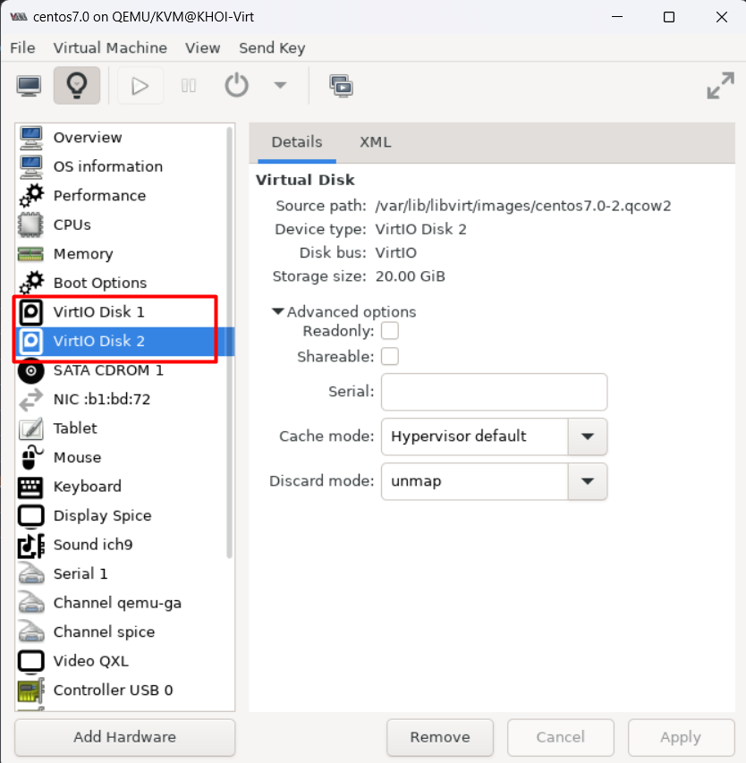
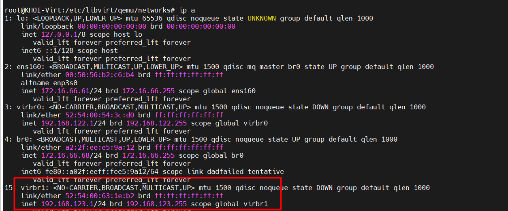
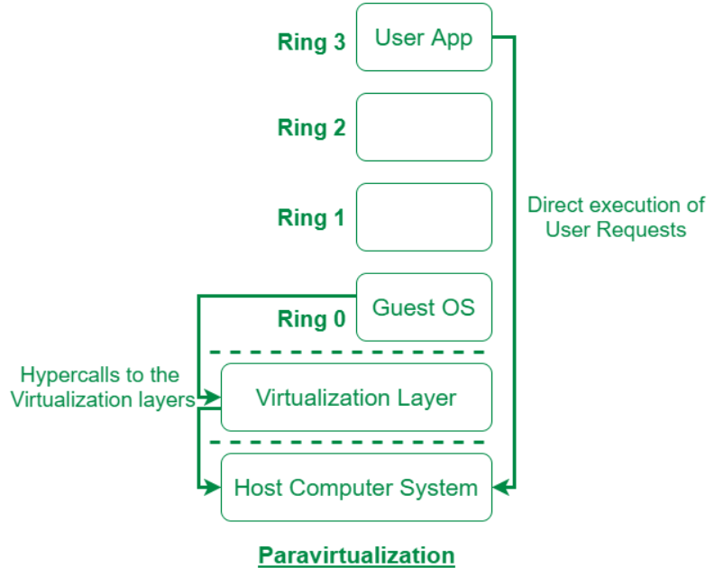

# Có 2 cách để add thêm disk cho VM 

Cách 1 : add disk trực tiếp qua GUI


Trước khi chưa add disk mới
 


Các bước thực hiện add thêm disk cho VM : `centos7.0`


Kết quả sau khi thêm: 





## Cách 2 sử dụng virsh để thêm 


B1 : Tạo một đĩa ảo trên KVM bằng lệnh qemu-img. Ở đây thêm disk có dung lượng 5G lưu tại /var/lib/libvirt/images

`qemu-img create -f qcow2 [đường dẫn file disk] [dung lượng disk]`

ví dụ muốn tạo một file disk có dung lượng là 5G:
`qemu-img create -f qcow2 /var/lib/libvirt/images/test1.qcow2 5G`

B2: Tạo một file XML mới cho VM nằm trong thư mục `/etc/libvirt/qemu/test1.xml`

Thêm nội dung dưới đây vào :

```
<disk type='file' device='disk'>
  <driver name='qemu' type='qcow2'/>
  <source file='/var/lib/libvirt/images/test1.qcow2'/>
  <target dev='vdb' bus='virtio'/>
  <address type='pci' domain='0x0000' bus='0x00' slot='0x09' function='0x0'/>
</disk>

```


Giải thích : 

* <driver name='qemu' type='qcow2'/>: Tên driver và kiểu disk
* <source file='/var/lib/libvirt/images/test1.qcow2'/> : Đường dẫn chứa disk ảo 
* <target dev='vdb' bus='virtio'/> : Cần tạo tên khác với tên của disk đang sử dụng là vda, ở đây mình chuyển thành vdb
* <address type='pci' domain='0x0000' bus='0x00' slot='0x09' function='0x0'/> : đảm bảo rằng không trùng lặp với thiết bị khác

B3 : sử dụng câu lệnh và kiểm tra

`sudo virsh attach-device --config vm3 /etc/libvirt/qemu/test1.xml`


Kiểm tra trên VM 


# Thêm card mạng cho VM 
## Cài đặt card mạng cho VM bằng GUI

Trước khi thêm interface cho VM 


Các bước thực hiện 


Sau khi thực hiện thành công 


## Cài đặt card mạng cho VM bằng câu lệnh

B1 : vào `cd /etc/libvirt/qemu/network`

Tạo file nat.xml
`touch nat.xml`

```
<network>
  <name>nat</name>
  <forward mode='nat'/>
  <bridge name='virbr0' stp='on' delay='0'/>
  <domain name='nat'/>
  <ip address='192.168.123.1' netmask='255.255.255.0'>
    <dhcp>
      <range start='192.168.123.2' end='192.168.123.254'/>
    </dhcp>
  </ip>
</network>
```

trong đó:

`name` là tên của interface.
`bridge name` là tên của bridge.
`ip address` là địa chỉ của bridge.
`range start` là dải địa chỉ được sử dụng

**Sau đó sử dụng lệnh để cập nhật interface vào KVM.**

`virsh net-define nat.xml`


Lệnh bật interface

```
virsh net-autostart nat
virsh net-start nat

```
sử dụng lệnh `ip a` để xem đã thành công chưa.





**Thêm interface vào VM trong KVM.**
`sudo virsh attach-interface --config vm3 bridge virbr1 --mac 52:54:00:63:1e:b2`


Trong đó : 

`sudo virsh attach-interface:` Đây là lệnh của Virsh được sử dụng để gắn một card mạng (interface) vào một máy ảo.

--`config`: Tùy chọn này chỉ định rằng cấu hình sẽ được áp dụng ngay lập tức mà không cần khởi động lại máy ảo. Điều này có nghĩa là cấu hình sẽ chỉ hiệu quả trong thời gian chạy hiện tại của máy ảo. Nếu muốn cấu hình được lưu lại và áp dụng sau khi khởi động lại, cần sử dụng tùy chọn --live.

`vm3`: Đây là tên của máy ảo mà muốn gắn card mạng vào.

`--mac 52:54:00:63:1e:b2`: Đây là địa chỉ MAC (Media Access Control) của card mạng  muốn gắn vào máy ảo. Địa chỉ MAC cần phải là duy nhất trong mạng của. Nó được sử dụng để nhận diện thiết bị mạng một cách duy nhất.



