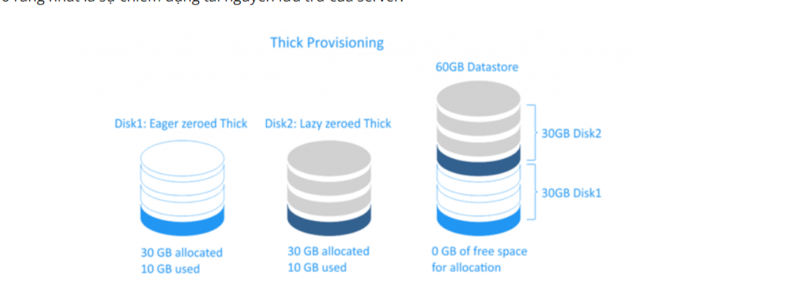
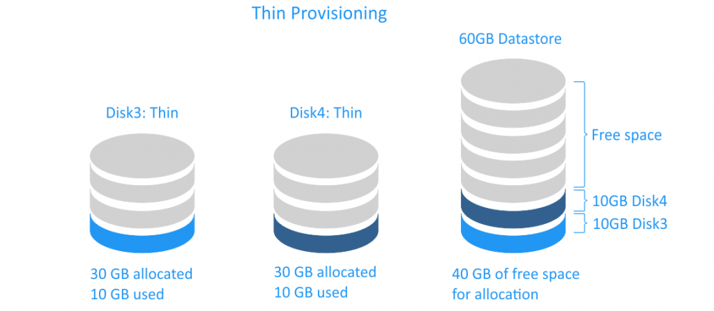

# Cơ chế lưu trữ Thin-Thick

Hiểu đơn giản qua là khi tạo máy ảo 100GB cho VM thì Thick chiếm đúng 100Gb, còn Thin chiếm đúng dung lượng mà nó cần lưu trữ 

## 1. Thick 
Với cơ chế này khi ta tạo một máy ảo disk cho một VM nó sẽ nhận full dung lượng của ổ đĩa disk của nó dù chưa sử dụng hết 

Thick có 2 loại thick-provisioned virtual disks:

* Lazy zeroed disk : Lazy zeroed disk: là một đĩa ảo dùng tất cả không gian của nó tại thời điểm tạo, nhưng không gian này có thể chứa một số dữ liệu cũ trên phương tiện vật lý. Dữ liệu cũ này không bị xóa hoặc ghi đè lên, do đó, nó cần phải được "zeroed out" trước khi dữ liệu mới có thể được ghi vào các khối. Loại disk này có thể được tạo nhanh hơn, nhưng hiệu suất của nó sẽ thấp hơn cho lần ghi đầu tiên do IOPS tăng cho các block mớ

* Eager zeroed disk: là một đĩa ảo có được tất cả các không gian cần thiết vẫn còn tại thời điểm tạo ra nó, và không gian bị xóa sạch mọi dữ liệu trước đó trên phương tiện vật lý. Việc tạo đĩa không mong muốn mất nhiều thời gian hơn vì các số 0 được ghi vào toàn bộ đĩa, nhưng hiệu suất của chúng nhanh hơn trong lần viết đầu tiên. Đây là loại phụ của đĩa ảo cung cấp dày hỗ trợ các tính năng phân cụm, chẳng hạn như khả năng chịu lỗi.

Vì lý do bảo mật dữ liệu, eager zeroing là phổ biến hơn so với lazy zeroing trong thick-provisioned virtual disks. Khi bạn xóa một file disk máy ảo (vmdk), dữ liệu trên datastore không bị xóa hoàn toàn, các block được đánh dấu là available, cho đến khi hệ điều hành ghi đè chúng. Nếu bạn muốn tạo eager zeroed muốn trên datastore, vùng đĩa sẽ bị xóa hoàn toàn (nghĩa là zeroed), do đó ngăn chặn bất kỳ ai có ý định xấu có thể khôi phục dữ liệu trước đó - ngay cả khi họ sử dụng phần mềm chuyên dụng của bên thứ ba.

## 2.Thin Provisioning

Thin provisioning là một loại phân bổ trước bộ nhớ khác. Đĩa ảo được tạo kiểu thin provisioning chỉ tiêu thụ không gian cần thiết ban đầu và tăng theo thời gian theo nhu cầu. Ví dụ: Nếu tạo một đĩa ảo 30GB mới thin provisioning và sao chép 10 GB tệp, kích thước của tệp VMDK kết quả sẽ là 10 GB, trong khi bạn sẽ có tệp VMDK 30 GB nếu đã chọn sử dụng đĩa được tạo thick provisioning.

Các đĩa ảo thin provisioning nhanh chóng tạo và hữu ích để tiết kiệm dung lượng lưu trữ. Hiệu suất của một đĩa được cấp thin provisioning không cao hơn ổ đĩa lazy zeroed thick-provisioned bởi vì đối với cả hai loại đĩa này, các số 0 phải được ghi trước khi ghi dữ liệu vào một khối mới. Lưu ý rằng khi xóa dữ liệu của mình khỏi ổ đĩa ảo được cấp thin provisioning, kích thước đĩa sẽ không tự động giảm. Điều này là do hệ điều hành chỉ xóa các chỉ mục từ bảng tệp tham chiếu đến phần thân tệp trong hệ thống tệp; nó đánh dấu các khối thuộc về các tệp "đã xóa" là free và có thể truy cập được để ghi dữ liệu mới.

Hiệu suất thì Thick Provisioned Eager Zeroed sẽ có hiệu suất tốt nhất, sau đó đến Thick Provisioned Lazy Zeroe và sau cùng là Thin Provisioned.

