## Tìm hiểu một số mô hình mạng trong KVM

### Tổng quan 
KVM được biết đến là một cơ sở hạ tầng ảo hóa cho nhân linux . KVM cung cấp các mô hình mạng bao gồm 
- NAT
- Host-only
- Linux-brige

### Linux-brige
Trong đó `Linux-bridge` là một mô hình ảo hóa mạng được hỗ trợ bởi KVM. `Linux bridge` là một công nghệ cung cấp switch ảo để giải quyết vấn đề ảo hóa Network bên trong các máy vật lý

Cấu trúc của một linux bridge

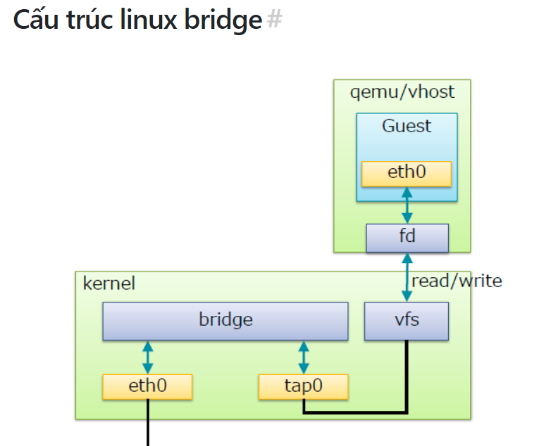

Trong đó:

`Bridge` ở đây là switch ảo
`Tap` hay `tap` interface là giao diện mạng để các VM kết nối với switch do Linux bridge tạo ra(nó hoạt động ở lớp 2 của mô hình OSI)
`fd`: Forward data có nhiệm vụ chuyển dữ kiệu từ VM tới switch.

Tạo một Bridge: `brctl addbr [tên_bridge]`
Gán port cho bridge : `brctl addif [tên_bridge] [tên_card]`
iểm tra lại hoạt động của bridge: `brctl show`
Ngắt card khỏi bridge: `brctl delif [tên_tên_bridge] [tên_card]`

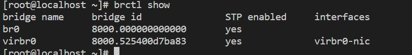

- Bài lab [đây](install_KVM_CentOS7.md) sử dụng mô hình mạng brige

### Tìm hiểu mô hình mạng NAT trong KVM

- Với mô hình này KVM thực hiện ánh xạ một địa mạng để cung cấp cho máy ảo . Dải địa chỉ này có thể giao tiếp với internet 

Cách cấu hình.
Bình thường khi cài KVM nó sẽ cung cấp cho ta một mạng ảo NAT mang tên defaul mạng này thường mang dải địa chỉ IP 192.168.122.x. Ta có thể add thêm một mạng ảo cũng với mô hình NAT khác. Có nhiều cách để thực hiện việc này nhưng ở đây tôi dùng công cụ Virt-manager.

Thông tin của dải mạng defaul:

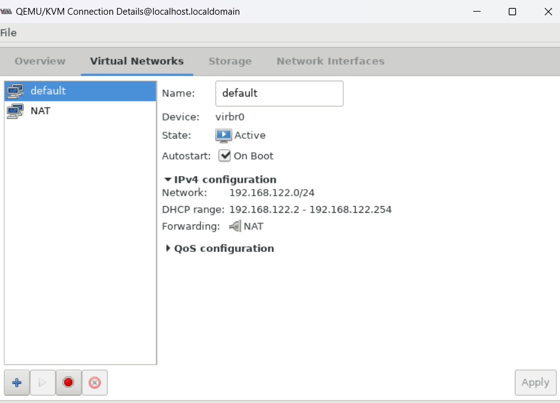

Add một mạng ảo với mô hình NAT
Tại Virt-manager : Chọn `Edit` -> `Connection Details`

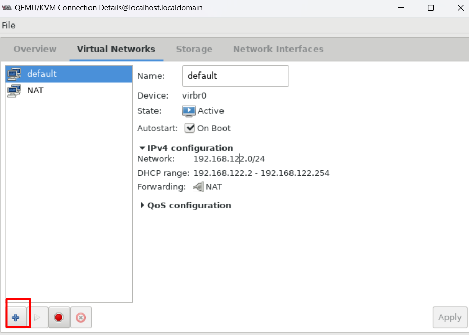

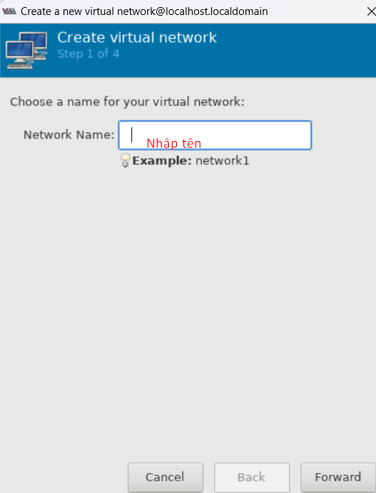

Chọn địa chỉ dải mạng cho mạng định tạo. Sau đó chọn một dải IP cấp phát DHCP cho máy ảo trong dải mạng. Ta cũng có thể đặt IP tĩnh trên máy ảo nếu tích vào

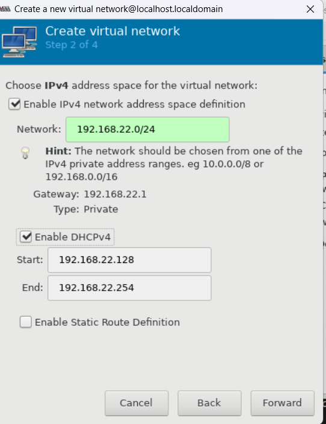

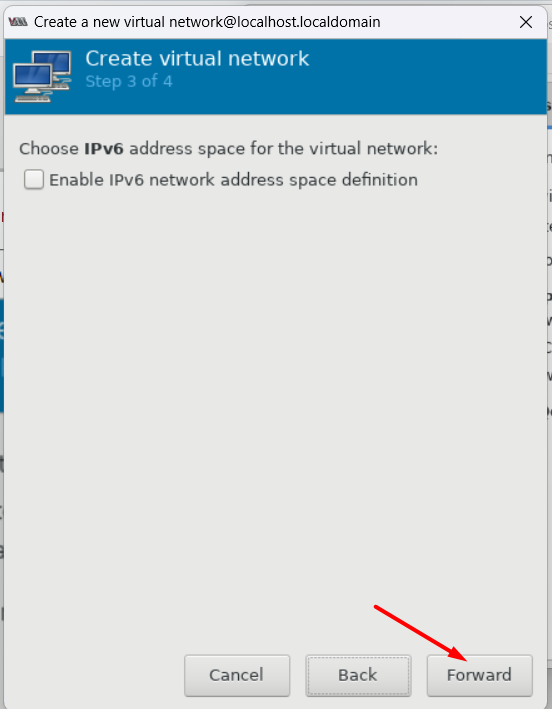

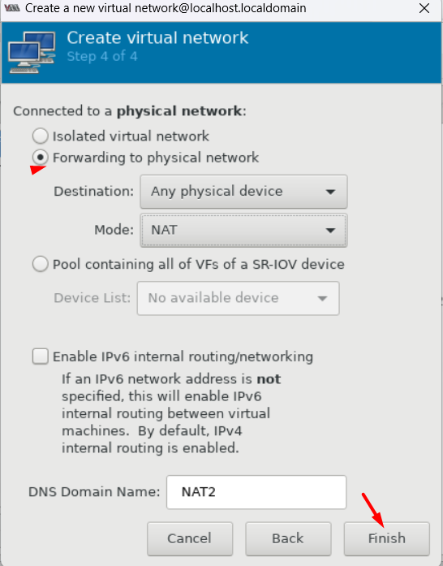

Thao tác trên máy ảo    

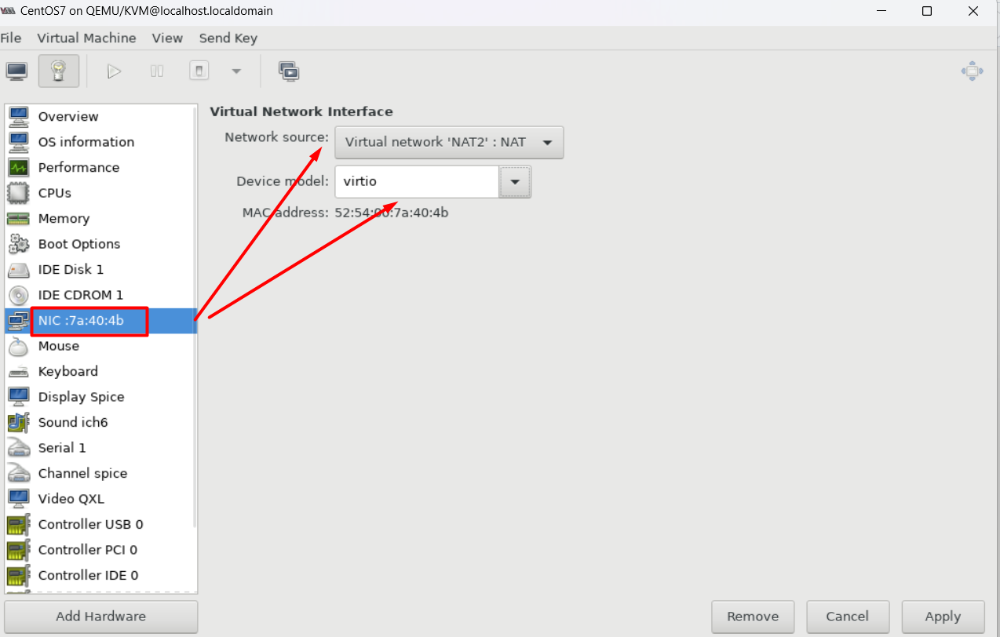

Reboot lại máy ảo và kiểm tra lại.

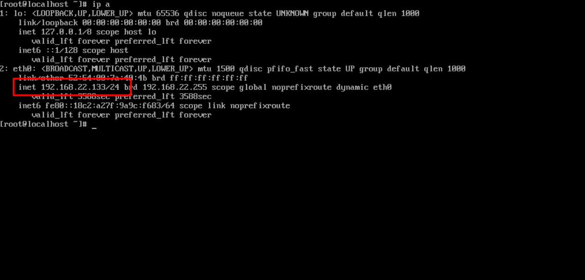

### Host-only
Với mô hình mạng Host-only, cũng cho phép cấp phát địa chỉ tùy ý không giống mô hình NAT. Nhưng ở đây máy ảo không thể trao đổi với các máy tính bên ngoài. Nó chỉ có thể trao đổi thông tin với các máy tính trong cùng dải mạng bên trong máy server vật lý và trao đổi với với chủ vật lý.

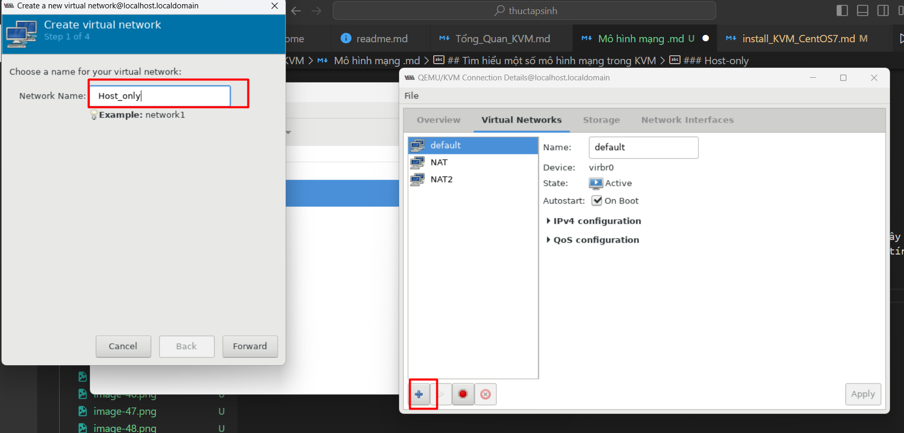

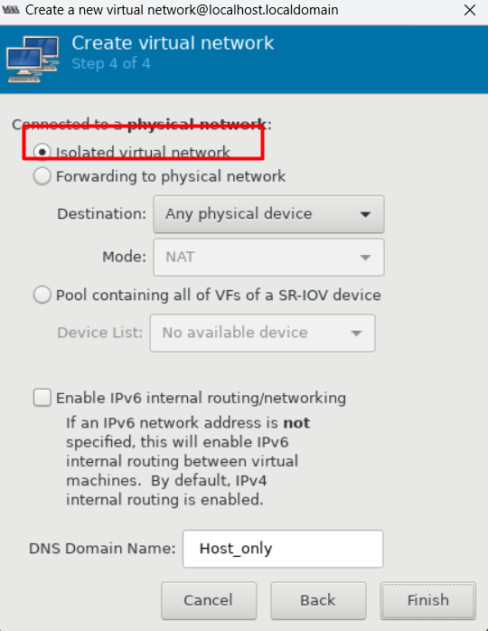

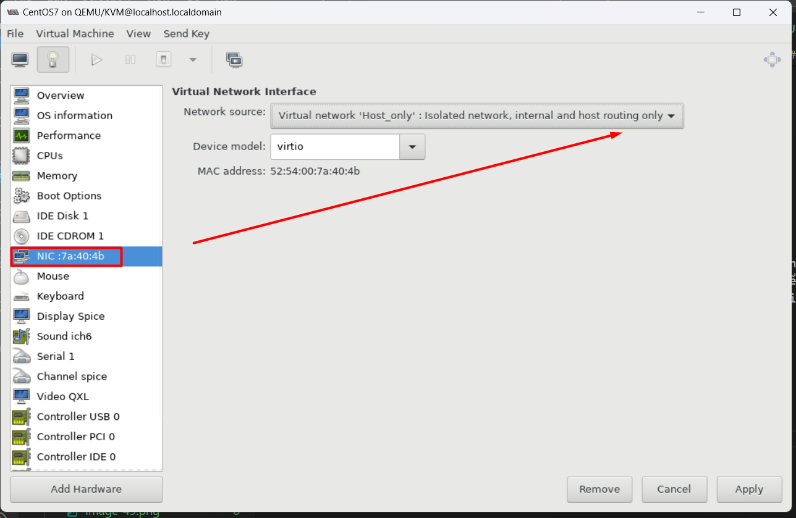

Thực hiện reboot lại máy để xem kq 

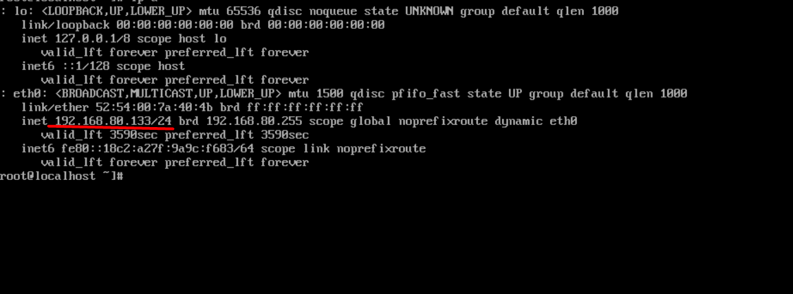

Thực hiện thử ping ra ngoài internet xem ntn

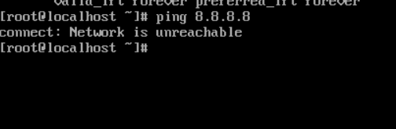

ping cho Gateway

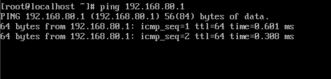

