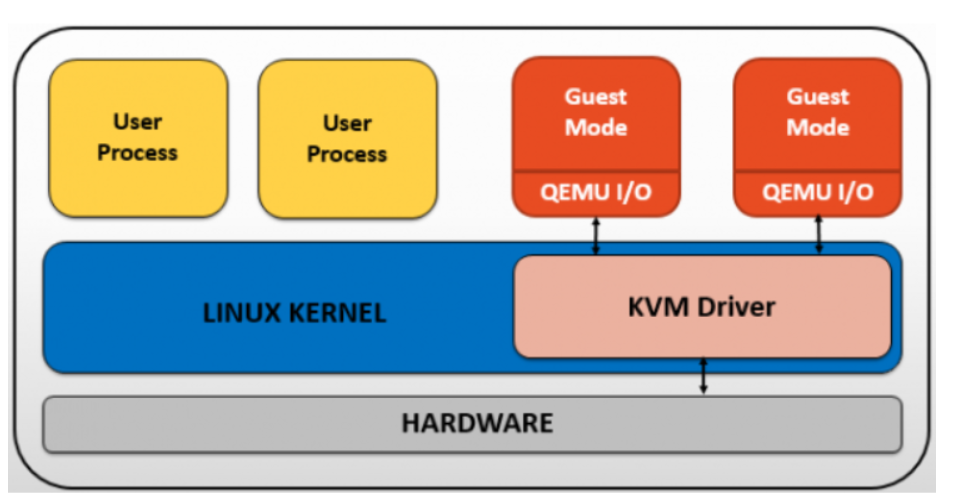

## Tổng quan về KVM

### 1. Giới thiệu
- `KVM` - **kernel-based Virtual Machine** Là hệ thống ảo hóa cho hệ thống Linux trên nền tảng phần cứng `x86` cho các moudule mở rộng hỗ trợ ảo hóa ( Intel VT-x hoặc AMD-V )
- `KVM` không thực sự là một `hypervisor` có chức năng giả lập phần cứng để chạy các máy ảo mà chỉ là một module của kernel linux hỗ trợ cơ chế mapping các chỉ dẫn trên CPU ảo (của guest VM) sang chỉ dẫn trên CPU vật lý (của máy chủ chứa VM) .
- Mỗi CPU ảo hoạt động hoạt động như một tiến trình xử lý của Linux. KVM được quyền thừa hưởng những ưu điểm từ các tính năng của nhân Linux

### 2.Cấu trúc của KVM

Trong kiến trúc KVM máy ảo sẽ là một tiến trình linux được lập lịch chuẩn Linux Scheduler
Trong thực tế mỗi CPU ảo xuất hiện như là một tiến trình Linux => điều này cho phép KVM sử dụng tất cả các tính năng của Linux Kernel.

Cấu trúc tổng quan của KVM bao gồm 3 thành phần chính :

`KVM kernel module `:
Là một phần trong Linux kernel .
Cung cấp giao diện chung cho Intel VT-x và AMD-V
Chứ những mô phỏng cho các chỉ dẫn và CPU modes không được support bởi Intel VT-x và AMD-V .
`QEMU-KVM` : là chương trình dòng lệnh để tạo các máy ảo, thường được vận chuyển dưới dạng package "kvm" hoặc "qemu-kvm" . Có 3 chức năng chính :
Thiết lập KVM và các thiết bị ra vào (I/O)
Thực thi mã khách thông qua KVM kernel module .
Mô phỏng các thiết bị vào ra (I/O) và di chuyển các guest từ host này sang host khác .
`Libvirt Mangagement Stack` :
Cung cấp API để các tool như virsh có thể giao tiếp và quản lý các VM .
Cung cấp chế độ quản lý từ xa an toàn .

### 3.Tính năng công nghệ của kvm

- Hỗ trợ ảo hóa phần cứng: KVM tận dụng các tính năng ảo hóa có sẵn trong vi xử lý để tạo ra các máy ảo. Điều này cho phép bạn chạy các hệ điều hành khác nhau, bao gồm Linux, Windows và các phiên bản khác trên cùng một máy tính.
- Hiệu suất cao: Với KVM, các máy ảo được chạy gần với hiệu năng của máy tính vật lý. Công nghệ này sử dụng các giải pháp tối ưu hóa để đảm bảo máy ảo hoạt động mượt mà và hiệu quả.
- Quản lý linh hoạt: KVM cung cấp các công cụ quản lý mạnh mẽ cho việc tạo, cấu hình và giám sát các máy ảo. Bạn có thể dễ dàng tạo và quản lý các máy ảo thông qua các giao diện dòng lệnh hoặc giao diện đồ họa.
- Migration: KVM hỗ trợ tính năng di chuyển (migration), cho phép bạn chuyển các máy ảo đang chạy từ một máy chủ vật lý sang một máy chủ khác mà không làm gián đoạn dịch vụ. Điều này rất hữu ích trong việc