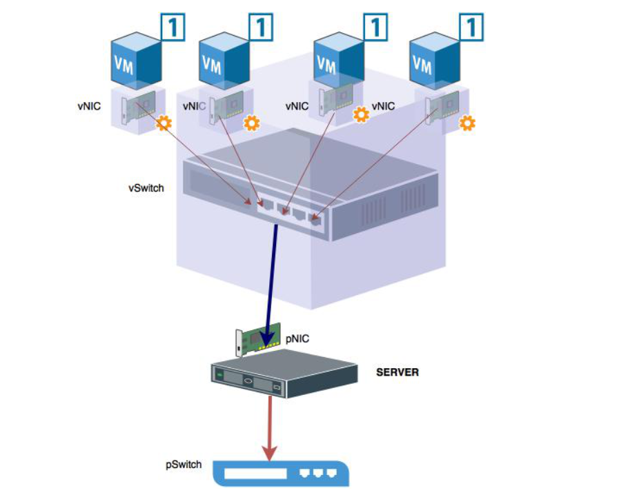

### Định nghĩa 

**Virtualization**, hay còn gọi là ảo hóa , cho phép ta cài đặt nhiểu hệ điều hành khác nhau trên cùng một ổ cứng . Chúng hoàn toàn riêng lẻ độc lập với nhau 
**Virtualization** ẩn các thông số tài nguyên phần cứng khỏi các user . Điều này tương tự như việc biến một tài nguyên vật lý ( như server, hệ điều hành, một ứng dụng hoặc một thiết bị storage ) thành nhiều tài nguyên ảo
Các loại virtualization :
        - Server virtualization
        - Desktop virtualization
        - Operating System virtualization
        - Network functions Virtualization
        - Storage Virtualization

### Định nghĩa chi tiết về các loại Virtualization

1. Server virtualization : ảo hóa máy chủ
là việc che giấu tài nguyên máy chủ - bao gồm số lượng và danh tính của các máy chủ vật lý riêng lẻ, bộ xử lý và hệ điều hành - từ người dùng máy chủ. Mục đích là để người dùng không phải hiểu và quản lý các chi tiết phức tạp của tài nguyên máy chủ trong khi tăng cường chia sẻ và sử dụng tài nguyên và duy trì khả năng mở rộng sau này.
 
 

2. Desktop virtualization

 là ảo hóa tải máy trạm hơn là máy chủ. Điều này cho phép người dùng truy cập máy tính để bàn từ xa, thường sử dụng một máy client tại bàn làm việc.

3. Operating System Virtualization

Dạng ảo hóa này sẽ cô lập các ứng dụng khỏi hệ điều hành và khỏi các ứng dụng khác , nhằm mục đích tăng khả năng tương thích và khả năng quản lý

4. Network functions Virtualization
Đây là một phần của cơ sở hạ tầng ảo hóa, đặc biệt được sử dụng khi ảo hóa Server . Giúp ta tạo nên nhiều Switch ảo, các VLan, các mạng NAT, ...

5. Storage Virtualization

Dạng ảo hóa này được sử dụng rộng rãi trong các DataCenter, khi có một hệ thống lưu trữ lớn và muốn phân chia, gán chúng cho các máy chủ vật lý hoặc máy chủ ảo khác nhau . Việc gán này được thực hiện qua kết nối mạng .

### Hypervisors
Hypervisors còn gọi là phần mềm giám sát máy ảo: Là một chương trình phần mềm quản lý một hoặc nhiều máy ảo VM. Quản lý và cho phép máy ảo truy cập vào tài nguyên phần cứng. Như vậy có thể hiểu ảo hóa là phương pháp tạo ra máy ảo còn Hypervisors là công nghệ giám sát , điều khiển nó . Có 2 loại Hypervisors đó là `Native` hay còn được gọi là `Bare metal `và Host Based và `Host Based`

***3 Phân loại Hypervisors***

**3.1 Native ( bare metal)**
- Là loại Hypervisors chạy trực tiếp trên phần cứng *như 1 hệ điều hành*

Các ví dụ điển hình của kiến trúc ảo hóa này là Oracle VM, Microsoft Hyper-V, VMWare ESX và Xen .

**3.2 Host based**
- Là một loại Hypervisors cài đặt trên hệ điều hành *như một ứng dụng*

Các ví dụ điển hình của kiến trúc ảo hóa này là Oracle VM VirtualBox, VMware Workstation, KVM, QEMU, Parallels .

Khác biệt giữa 2 loại là:

Native: được cài đặt làm OS trực tiếp để tạo VM
Hosted: Hypervisor được cài sau một hệ điều hành làm nền. Đứng giữa OS và VM

### Hardware Virtualization
**4.1 Virtual CPU**
- Khi cài đặt một Hypervisor mỗi CPU vật lý sẽ được tách thành các Virtual CPU . Chúng sẽ chia phần CPU khả dụng thành các core ảo và cho phép các `VMs` được sử dụng chung dựa trên core vậy lý
- Cách tính số lượng vCPU :
Giả dụ ta có 1 server với 2 CPU , mỗi CPU có 4 core vật lý . Tổng cộng ta có `2 * 4 = 8` cores vật lý .

Dựa trên một vài phép tính toán mà hypervisor cung cấp cho mỗi core vật lý , ta có thể có được 5-10 `vCPUs`

Tổng cộng ta có từ 40-80 `vCPUs` , có nghĩa là có thể gán tối đã 80 `vCPUs` cho một máy ảo .

**4.2 Virtual Memory**
Chính `RAM` của máy ảo .Phần cài đặt tài nguyên `RAM` cho máy ảo sẽ quyết định phần `RAM` sẽ cung cấp cho các máy ảo. Lượng `RAM` ảo sẽ quyết định có bao nhiêu bộ nhớ khả dụng cho các ứng dụng trên máy ảo

**4.3 Virtual Storage**

`Storage virtaulization `  là 1 nhóm các lưu trữ vật lý từ nhiều thiết bị storage kết nối mạng vào gộp thành 1 thiết bị quản lý từ trung tâm 
Các định dạng phổ biến của phần dung lượng gán cho máy ảo là `.vdi`, `vhdx`, `vmdk` và `hdd` .

**4.4 Virtual Networking**
Các máy ảo trên cùng 1 host trao đổi dữ liệu với nhau dựa trên vNICs , kết nối trực tiếp đến các vSwitch được tạo ra bởi hypervisor .
Các vSwitch giao tiếp với pNIC ( card mạng vật lý của host ) giúp các vNICs trao đổi dữ liệu ra các mạng bên ngoài, hay Internet ...

### Các thành phần và đặc điểm của một hệ thống ảo hóa
**Tài nguyên vật lý** : Máy chủ vật lý,CPU,RAM,Ổ cứng ,Card_mạng ... Nhiệm vụ chia tài nguyên cấp cho máy ảo
**Phần mềm ảo hóa (Hypervisor)** : Cung cấp truy cập cho mỗi máy chủ ảo đến tài nguyên của máy chủ vật lý, Lập kế hoạch phân chia tài nguyên của máy chủ vật lý cho các máy chủ ảo.
**Hệ điều hành Khách(Guest Operating System)**: được cài đặt trên một máy chủ ảo, thao tác như ở trên hệ điều hành thông thường.
**Máy ảo(Virtual machine):** Nó hoạt động như một máy chủ vật lý thông thường với tài nguyên riêng, giao diện riêng, hệ điều hành riêng.
**Đặc điểm của 1 hệ thống ảo hoá :**

Cho phép tạo tách rời các máy ảo và điều phối truy cập của các máy ảo này đến tài nguyên phần cứng và cấp phát tài nguyên tự động theo nhu cầu sử dụng.
Nhiều ứng dụng chạy trên 1 server, mỗi VM được lập trình trên máy chủ, do đó nhiều ứng dụng và các hệ điều hành có thể cùng lúc chạy trên host.
Tối đa hóa công suất sử dụng và tối thiểu hóa server: mỗi máy chủ vật lý Được sử dụng với đầy đủ công suất, cho phép giảm đáng kể chi phí nhờ sử dụng tối đa server.