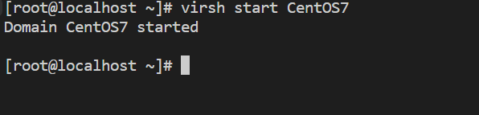
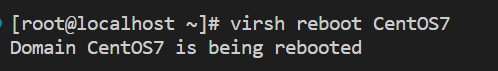
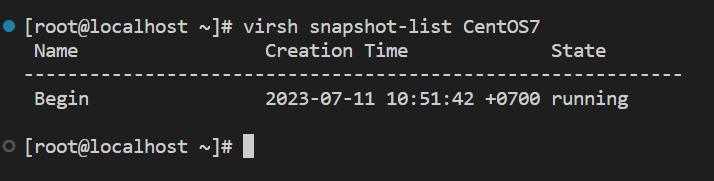
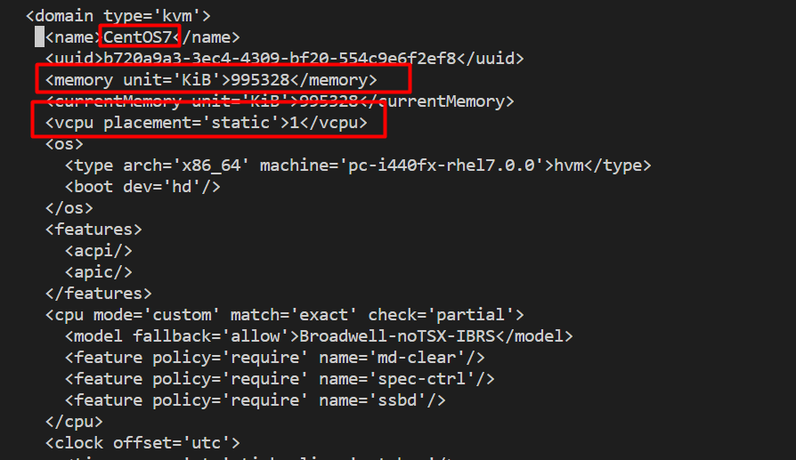
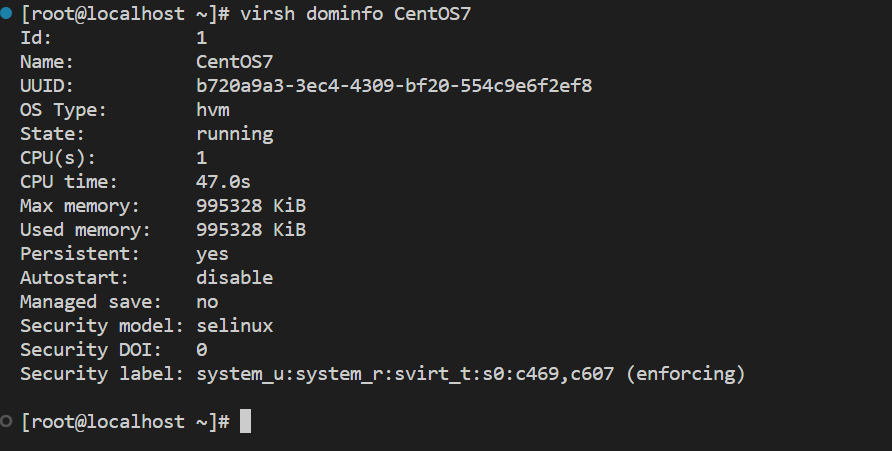

## Tạo và quản lý máy ảo bằng command virsh

Tạo VM với Virsh
Để tạo máy ảo bằng dòng lệnh, ta sử dụng lệnh `virt-install.`

Hầu hết các option đều không bắt buộc. Yêu cầu tối thiểu là: `--name`, `--memory`, `--disk`, `--filesystem`

virt-install --name=VM1 --vcpus=1 --memory=1024 --cdrom=/var/lib/libvirt/file-iso/CentOS-7-x86_64-Minimal-1804.iso --disk=/var/lib/libvirt/images/vm1.img,size=10 --os-variant=rhel7 --graphics vnc --network bridge=br0

Trong đó:

Virt-install: Câu lệnh tạo máy ảo
`--name`: Đặt tên cho máy ảo
`--vcpus`: virtual cpu- Tổng số cpu ảo định đặt cho máy
`--memory`: dung lượng RAM của máy ảo
`--cdrom`: Đường dẫn tuyệt đối của file ISO. Nếu muốn boot bằng cách khác ta dùng option --location sau đó chỉ ra đường dẫn file(có thể là đường dẫn trên Internet)
`--disk`: chỉ ra vị trí lưu disk của máy ảo. size chỉ ra dung lượng muốn cấp cho ổ đĩa ảo. Có thể tạo thêm disk bằng cách thêm 1 dòng nữa.
`--os-variant`: Chỉ ra kiểu hệ điều hành của máy ảo đang tạo. Option này có thể chỉ tạo ra hoặc không nhưng nên sử dụng nó vì nó sẽ cải thiện hiệu năng của máy ảo. Nếu bạn không biết HĐH của mminhf thuộc loại nào bạn có thể tìm kiếm thông tin bằng cách dùng lệnh osinfo-query os
`--graphics`: Chọn kiểu màn hình tương tác
`--networ`k: chỉ ra cách kết nối mạng của máy ảo. Nếu tạo nhiều card, ta chỉ cần khai báo thêm.

**Hiển thị danh sách máy ảo**

`virsh list --all`

**Tắt VM**
`virsh shutdown [Tên máy ảo]`

**Bật VM**
**virsh start [tên VM]**

**Reboot VM**

`virsh reboot [tên VM]`

**Xóa máy ảo VM**
`virsh underfine [tên vm]`

**Tạo Snapshot**

`virsh snapshot-create-as --domain [tên VM] --name Begin --description "mo ta"`

**Xem danh sách các bản snapshot trên 1 VM**
`virsh snapshot-list [name_vm]`

**revert để chạy lại một bản snapshot đã tạo**

`virsh snapshot-revert [Name_VM] [Name_Snapshot]`

**Xóa 1 bản snapshot**

`virsh snapshot-delete --domain [name_vm] --snapshotname [name_snapshot]`

**Sửa thông tin**

`virsh edit [ten VM]`

**Xem thông tin cơ bản của 1 VM**

`virsh dominfo [name vm]`

