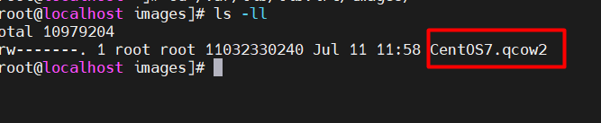

## Các file của VM trên KVM

**1. Thư mục lưu trữ các `DISK` của VM**
`/var/lib/libvirt/images/`

**2.Thư mục chứa các `file .xml` thông số kĩ thuật của VM**

`/etc/libvirt/qemu`

**3. Thư mục có các file liên quan tới `network`**

`/etc/libvirt/qemu/networks/`

**4. Thư mục lưu các `storage`**

`/etc/libvirt/storage/`

**5.Thư mục chứa các `images` của VM**

`/var/lib/libvirt/images/`

**6. Thư mục lưu các bản `snapshot` của các VM**

`/var/lib/libvirt/qemu/snapshot/`

## Tìm hiểu file XML trong KVM và Tạo VM bằng file XML

###  Khái niệm
XML (Extensible Markup Language) là một ngôn ngữ đánh dấu được sử dụng để lưu trữ và truyền dữ liệu. Nó không phụ thuộc vào ngữ cảnh hoặc ứng dụng cụ thể, cho phép dữ liệu được tổ chức một cách có cấu trúc và có thể dễ dàng trao đổi giữa các hệ thống và nền tảng khác nhau.

**XML trong KVM**

- Trong 1 VM có 2 thành phần chính đó là 
    * VM's definition được lưu dưới dạng file XML và nằm trong thư mục `/etc/libvirt/qemu`

    * VM's storage lưu dưới dạng file image.

File domain XML chứa các thông tin về máy ảo như (số CPU, RAM, các thiết lập của I/O, card mạng,...)

Ngoài file domain XML còn có các file XML khác để lưu thông tin network, storage,...

### Các thành phần trong file domain XML của VM

Sử dụng lệnh `virsh edit [tên_file]` để chỉnh sửa (bỏ đuôi .xml) hoặc có thể sử dụng `vi,vim,nanno`

VD : `Virsh edit CentOS7`

Có rất nhiều thành phần trong file xml này. Ở đây, ta sẽ tìm hiểu một số thành phần chính sau:

`name` : tên của VM
`uuid` : uuid của VM
`memory` : dung lượng RAM của VM
`unit='KiB' `: đơn vị đo dung lượng RAM, có thể sử dụng các đơn vị khác
`currentMemory` : dung lượng RAM hiện tại
`vcpu` : Số cpu ảo được cài đặt
`os` : hệ điều hành đang cài đặt trên máy ảo

Phần `devices`, các thông số của các device trên VM

