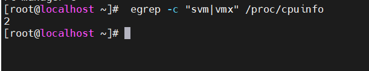
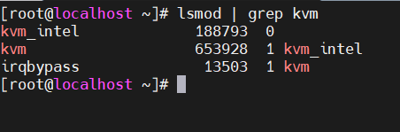
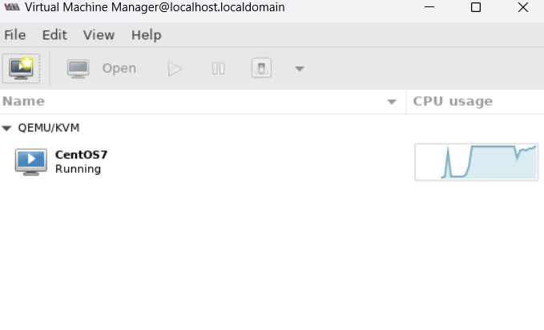

## Các bước cài đặt KVM trên centOS7
Yêu cầu phần mềm để thực hiện bài Lab : 
+ VMware Workstation 
+ Hệ điều hành Linux có  hỗ trợ công nghệ ảo hóa: 2CPU, 2GB RAM, 20GB Disk
+ File ISO của hệ điều hành để cài lên máy ảo KVM


B1: Check VMware Workstation có lỗi hỗ trợ ảo hóa không nếu báo lỗi thì thực hiện bước sau : 

Mở cmd run với quyền administrator 
chạy câu lệnh sau rồi vào VMware 
`bcdedit /set hypervisorlaunchtype off`

**B2: Kiểm tra xem hỗ trợ ảo hóa không bằng câu lệnh** 

`egrep -c "svm|vmx" /proc/cpuinfo`





- Nếu kq trả về `0` thì không hỗ trợ ảo hóa .Còn khác số 0 là số nhân có thể hỗ trợ làm ảo hóa 

Nếu VMware, ta phải bật hỗ trợ ảo hóa trong Vitual Machine Setting của máy ảo. Đánh dấu vào 2 ô như hình dưới đây:


**B3: Thực hiện cài đặt các gói cần thiết**

`yum -y install qemu-kvm libvirt virt-install bridge-utils virt-manager`

Trong đó:

`qemu-kvm`: Phần phụ trợ cho KVM.
`libvirt`: Cung cấp libvirt mà bạn cần quản lý qemu và KVM bằng Libvirt.
`Bridge-utils`: Chứa một tiện ích cần thiết để tạo và quản lý các thiết bị bridge
`virt-manager`: Cung cấp giao diện đồ họa để quản lý máy ảo
`virt-install`: Cung cấp lệnh để cài đặt máy ảo.

- Khi cài đặt hoàn tất ,kiểm tra bằng câu lệnh dưới

`lsmod | grep kvm`





**Bật libvirt và khởi động cùng hệ thống**
`systemctl start libvirtd`
`systemctl enable libvirtd`


**Tạo một card mạng Brigde**

```
nmcli connection add type bridge autoconnect yes con-name br0 ifname br0
nmcli connection modify br0 ipv4.addresses 192.168.202.55/24 ipv4.method manual 
nmcli connection modify br0 ipv4.gateway 192.168.202.2
nmcli connection modify br0 ipv4.dns 8.8.8.8  	
nmcli connection delete ens33
nmcli connection add type bridge-slave autoconnect yes con-name ens33 ifname ens33 master br0
```

Sau khi chạy câu lệnh trên thì khởi động lại hệ thống bằng câu lệnh 
`init 6`

Nhìn vào card mạng thì thấy có thêm `br0`.Thực hiện ssh vào `192.168.202.55` để tiếp tục làm bài lab


**Sử dụng công cụ virt-manager**
Download và lưu file ISO Minimal vào thư mục /var/lib/libvirt/file-iso/

```
cd /var/lib/libvirt/
mkdir file-iso
cd file-iso

yum install -y wget
wget http://repos-va.psychz.net/centos/7.6.1810/isos/x86_64/CentOS-7-x86_64-Minimal-1810.iso
```

*Lưu ý có thể dùng mobaxter để tải file iso vào linux thay cho bước weget*


Đối với bản Minimal thì để sử dụng công cụ đồ họa virt-manager, ta cần cài đặt gói X-Window

 `yum install -y "@X Window System" xorg-x11-xauth xorg-x11-fonts-* xorg-x11-utils`

**Truy cập Virt-manager để cấu hình VM**
`virt-manager`

Xuất hiện công cụ bằng GUI


Thực hiện tạo máy ảo 


Thực hiện chọn hệ điều hành 


Chọn đường dẫn cho File ISO để cài cho VM


Cài đặt các thông số phần cứng cơ bản muốn đặt cho máy VM


Phần Network selection ta sẽ gắn card mạng vào bridge bro


Sau đó cài CentOS 7 như bình thường

Xem danh sách cũng như trạng thái các máy ảo KVM
`virsh list --all`


**3. Một số thao tác khác trên virt-manager**

Quản lý các VM đã tạo tạo giao diện của virt-manager





Vào đây để xem thông số 


Để tạo snapshot cho VM, open VM đó và vào chọn vào biểu tượng như trong hình


