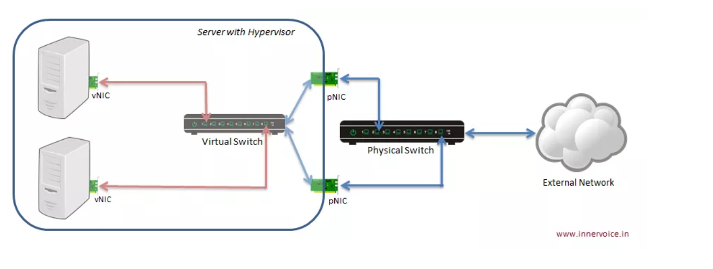
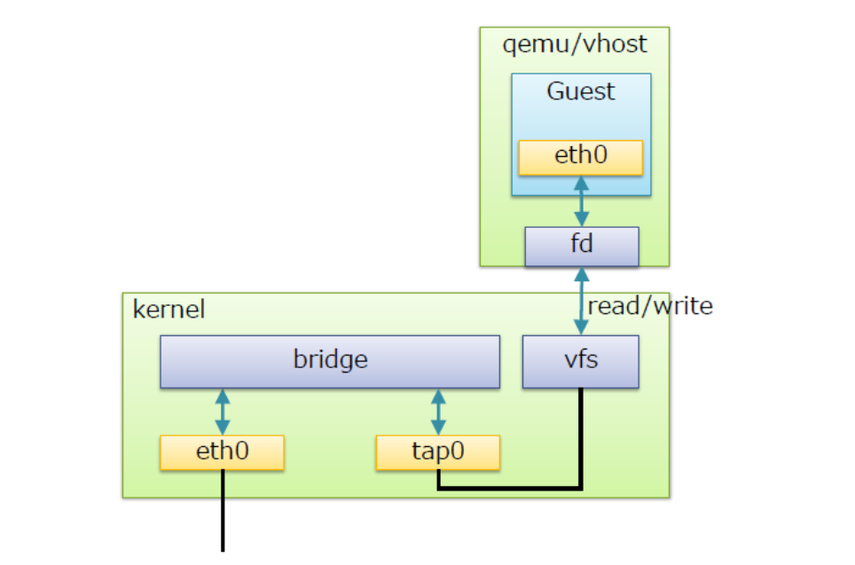
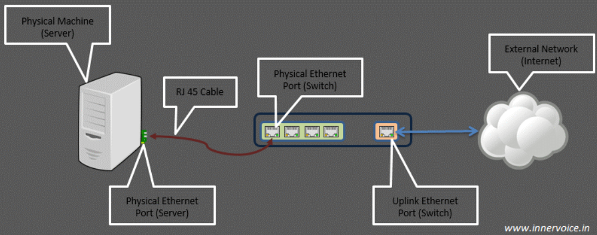
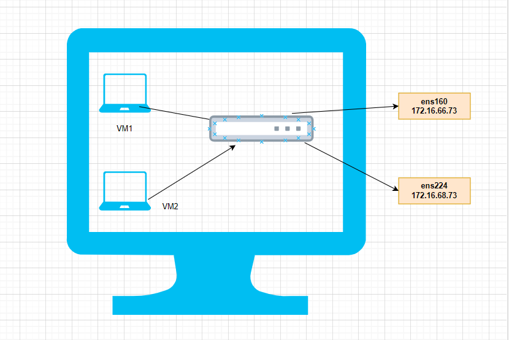
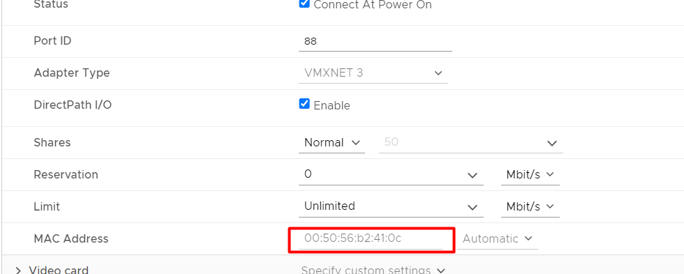
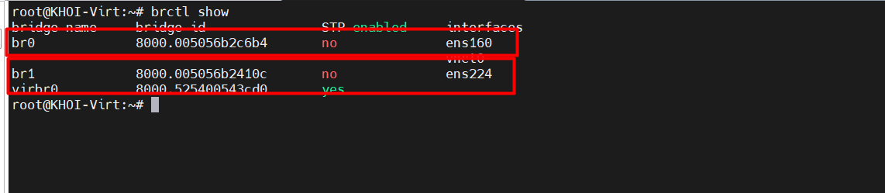
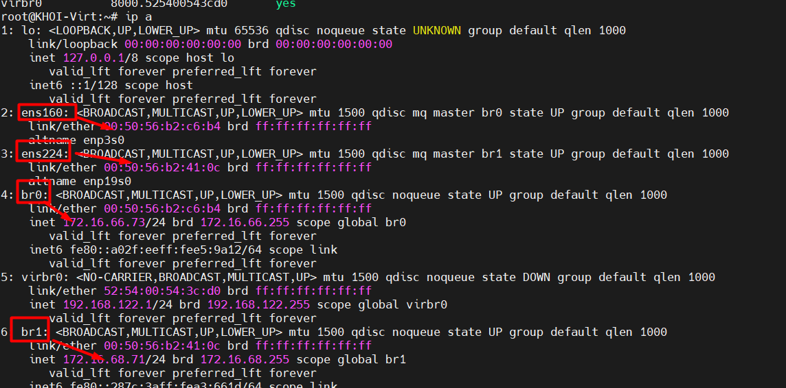

# 1. Tổng quan về Linux Bridge
## 1.1 Giới thiệu 

* Linux bridge là một soft switch - 1 trong 3 công nghệ cung cấp switch ảo trong hệ thống Linux giải quyết các vấn đề ảo hóa network bên trong các máy vật lý 
* Bản chất của Linux Bridge là một switch layer 2 kết nối các máy ảo (VM) để các VM có thể giao tiếp được với nhau và có thể kết nối được đi ra ngoài mạng 

## 1.2. Cấu trúc hệ thống sử dụng Linux bridge





Khái niệm về physical port và virtual port:

Virtual Computing Device : Thường biết đến các máy ảo VM chạy trong các host server

Virtual NIC (vNIC): máy ảo VM có virtual network adapters(vNIC) mà đóng vai trò là NIC cho máy ảo.

Physical swtich port: Là port sử dụng cho Ethernet switch, cổng vật lý xác định bởi các port RJ45. Một port RJ45 kết nối tới port trên NIC của máy host.

Virtual swtich port: là port ảo tồn tại trên virtual switch. Cả virtual NIC (vNIC) và virtual port đều là phần mềm, nó liên kết với virtual cable kết nối vNIC


# 2.Tìm hiểu về Linux Bridge

## 2.1. Cấu trúc và các thành phần





Kiến trúc linux bridge minh họa như hình vẽ trên. Một số khái niệm liên quan tới linux bridge:
`Port`: tương đương với port của switch thật
`Bridge`: tương đương với switch layer 2
`Tap`: hay tap interface có thể hiểu là giao diện mạng để các VM kết nối với bridge cho linux bridge tạo ra
`fd`: forward data - chuyển tiếp dữ liệu từ máy ảo tới bridge


## 2.2 Các tính năng của 

STP : Spanning Tree Protocol : Giao thức chống loop gói tin trong mạng

Vlan : Chia switch thành các lan ảo, cô lập Traffic giữa các VM trên các VLAN khác nhau của cùng một switch 

FDB : Chuyển tiếp các gói tin theo database để nâng cao hiệu quả của switch

# 3.Các thao tác quản lý với Linux Bridge

## 3.1 Cài đặt công cụ quản lý Linux Bridge 

Linux bridge được hỗ trợ từ version nhân kernel từ 2.4 trở lên. Để sử dụng và quản lý các tính năng của linux birdge, cần cài đặt gói bridge-utilities (dùng các câu lệnh brctl để sử dụng linux bridge). Cài đặt dùng lệnh như sau

`sudo  apt-get install bridge-ultils -y `


## 3.2 Một số câu lệnh quản lý 

**BRIDGE MANAGEMENT**

| ACTION                            | BRCTL                           | BRIDGE |
| --------------------------------- | ------------------------------- | ------ |
| creating bridge                   | `brctl addbr <bridge>`          |        |
| deleting bridge                   | `brctl delbr <bridge>`          |        |
| add interface (port) to bridge    | `brctl addif <bridge> <ifname>` |        |
| delete interface (port) on bridge | `brctl delbr <bridge>`          |        |

**FDB MANAGEMENT**

| ACTION                              | BRCTL                                  | BRIDGE                                               |
| ----------------------------------- | -------------------------------------- | ---------------------------------------------------- |
| Show a list of MACs FDB             | `brctl showmacs <bridge>`              | bridge fdb show                                      |
| Sets FDB entries ageing time        | `brctl setageingtime  <bridge> <time>` |                                                      |
| Sets FDB garbage collector interval | `brctl setgcint <brname> <time>`       |                                                      |
| Adds FDB entry                      |                                        | bridge fdb add dev <interface> [dst, vni, port, via] |

**STP MANAGEMENT**

| ACTION                             | BRCTL                                      | BRIDGE |
| ---------------------------------- | ------------------------------------------ | ------ |
| Turning STP on/off                 | `brctl stp <bridge> <stage>`               |        |
| Setting bridge priority            | `brctl setbridgeprio <bridge> <priority>`  |        |
| Setting bridge forward delay       | `brctl setfd <bridge> <time>`              |        |
| Setting bridge maximum message age | `brctl setmaxage <bridge> <time>`          |        |
| Setting cost of the port on bridge | `brctl setpathcost <bridge> <port> <cost>` |        |


**VLAN MANAGEMENT**

| ACTION                         | BRCTL                                                            | BRIDGE |
| ------------------------------ | ---------------------------------------------------------------- | ------ |
| Creating new VLAN filter entry | `bridge vlan add dev <dev> [vid, pvid, untagged, self, master]`  |        |
| Delete VLAN filter entry       | `bridge vlan delete dev <dev> (parameters same as for vlan add)` |        |
| List VLAN configuration        | `bridge vlan show`                                               |        |


# 4. Ghi chép tổng quan 

## 4.1 Port
* Trong networking ,port đại diện cho điểm vào ra của dữ liệu trên máy tính hoặc thiết bị mạng .Có thể phần mềm hoặc phần cứng. Được chia làm 4 loại đó là `Software Port` và `hardware Port` `Physical switch port` và `Virtual switch port`
* 
* **Software port** là khái niệm tồn tại trong hệ điều hành. Chúng thường là các điểm vào ra cho các lưu lượng của ứng dụng.
    * VD : port 443 trên server liên kết với webserver và truyền lưu lượng HTTPS

* **Hardware port** (port khái niệm phần cứng): là các điểm kết nối lưu lượng ở mức khái niệm vật lý trên các thiết bị mạng như switch, router, máy tính, … 
    * VD : router với cổng kết nối RJ45 để kết nối tới máy tính
**Physical switch port**: Thông thường chúng ta hay sử dụng các switch L2/ethernet với các cổng RJ45. Một đầu connector RJ45 kết nối port trên switch tới các port trên NIC của máy tính.

`Virtual switch port`: giống như các physical switch port mà tổn tại như một phần mềm trên switch ảo. cả virtual NIC và virtual port đều duy trì bởi phần mềm, được kết nối với nhau thông qua virtual cable.

## 4.2 Uplink port

Uplink port là khái niệm chỉ điểm vào ra của lưu lượng trong một switch ra các mạng bên ngoài. Nó sẽ là nơi tập trung tất cả các lưu lượng trên switch nếu muốn ra mạng ngoài.




Khái niệm virual uplink port được hiểu rõ : Là các điểm lưu lượng trên các máy guest ảo đi ra ngoài máy host thật , hoặc ra ngoài mạng . Khi thêm một interface trên máy thật vào bridge thì interface trên máy thật chính là virtual uplink port.

## 4.3. Tap interface

* Ethernet port trên các máy ảo VM (mô phỏng pNIC) thường gọi là vNIC 

* Port trên máy ảo VM chỉ có thể xử lý các frame Ethernet. Trong môi trường thực tế (không ảo hóa) interface NIC vật lý sẽ nhận và xử lý các khung Ethernet. Nó sẽ bóc lớp header và chuyển tiếp payload (thường là gói tin IP) tới lên cho hệ điều hành. Tuy nhiên, với môi trường ảo hóa, nó sẽ không làm việc vì các virtual NIC sẽ mong đợi các khung Ethernet.

* Tap interface là một khái niệm về phần mềm được sử dụng để nói với Linux bridge là chuyến tiếp frame Ethernet vào nó. Hay nói cách khác, máy ảo kết nối tới tap interface sẽ có thể nhận được các khung frame Ethernet thô. Và do đó, máy ảo VM có thể tiếp tục được mô phỏng như là một máy vật lý ở trong mạng.

* Nói chung, tap interface là một port trên switch dùng để kết nối với các máy ảo VM.


# 5. Mô hình bài lab

## 5.1 mô hình triển khai 





yêu cầu thực hiện : 


```
Cần thực hiện cài đặt KVM
Một máy tính với 2 card ens160, ens224 (có thể sử dụng máy ảo), cài ubuntu 22.04
Gắn cả 2 card mạng ens160, ens224 của host vào switch ảo, set priority cho hai port ứng với 2 card. Kiểm tra xem máy ảo (gắn vào tap interface của switch ảo) nhận ip cùng dải với card mạng vật lý nào.

```


## 5.2 Cài đặt và cấu hình


Bước 1: 
Cài đặt các gói cần thiết:
`apt -y install qemu-kvm libvirt-daemon-system libvirt-daemon virtinst bridge-utils libosinfo-bin`


Bước 2 : Thực hiện gắn tạo bridge  br0 và br1 : 

Mở file `/etc/netplan/01-netcfg.yaml` thêm file sau:


```
# Generated by VMWare customization engine.
network:
  version: 2
  renderer: networkd
  ethernets:
    ens160:
      dhcp4: no
      dhcp6: no
    ens224:
      dhcp4: no
      dhcp6: no

  bridges:
    br0:
      interfaces: [ens160]
      dhcp4: false
      addresses: [172.16.66.73/24]
      macaddress: 00:50:56:b2:c6:b4
      routes:
        - to: default
          via: 172.16.66.1
          metric: 100
      nameservers:
        addresses: [8.8.8.8]
      parameters:
        stp: false
      dhcp6: false
    br1:
      interfaces: [ens224]
      dhcp4: false
      addresses: [172.16.68.71/24]
      macaddress: 00:50:56:b2:41:0c
      parameters:
        stp: false
      dhcp6: false
```


Giải thích : 

```

ethernets:
  ens160:
    dhcp4: no
    dhcp6: no
  ens224:
    dhcp4: no
    dhcp6: no
```

ens160 và ens224 là hai giao diện Ethernet.
dhcp4: no và dhcp6: no: Không sử dụng DHCP để cấu hình địa chỉ IPv4 và IPv6 cho các giao diện này

```


bridges:
  br0:
    interfaces: [ens160]
    dhcp4: false
    addresses: [172.16.66.73/24]
    macaddress: 00:50:56:b2:c6:b4
    routes:
      - to: default
        via: 172.16.66.1
        metric: 100
    nameservers:
      addresses: [8.8.8.8]
    parameters:
      stp: false
    dhcp6: false
```

`interfaces`: [ens160]: Giao diện ens160 được gắn vào cầu nối br0.
`dhcp4`: false và dhcp6: false: Không sử dụng DHCP để lấy địa chỉ IP cho cầu nối này.
`addresses`: [172.16.66.73/24]: Gán địa chỉ IP tĩnh 172.16.66.73 với subnet mask là 24 cho cầu nối br0.
`macaddress`: 00:50:56:b2:c6:b4: Gán địa chỉ MAC cụ thể cho cầu nối br0.
routes: Thiết lập bảng định tuyến.
to: default: Định tuyến mặc định.
via: 172.16.66.1: Gateway mặc định.
metric: 100: Độ ưu tiên của tuyến đường.
nameservers: Cấu hình máy chủ DNS.
addresses: [8.8.8.8]: Sử dụng máy chủ DNS của Google.
parameters:
stp: false: Tắt giao thức Spanning Tree Protocol.


Địa chỉ macaddress sẽ là địa chỉ mac của dải khi cắm vào máy có thể không cần cũng được





Bước 3 : thực hiện restart lại network 

`netplan apply`


Bước 4 : Kiếm tra lại hoạt động của bridge

Dùng lệnh sau `brctl show` kết quả hiển thị như hình vẽ đồng nghĩa với việc gán card thành công





Thực hiện xem lại IP :





