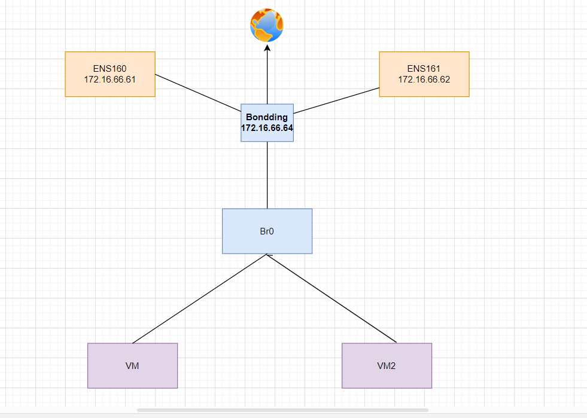
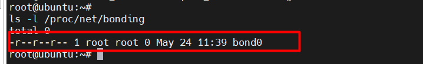
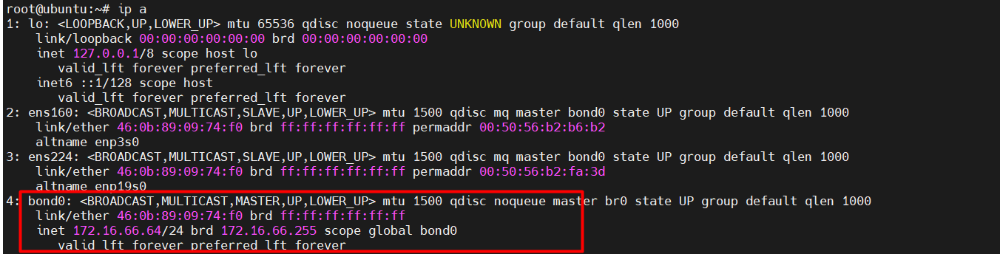
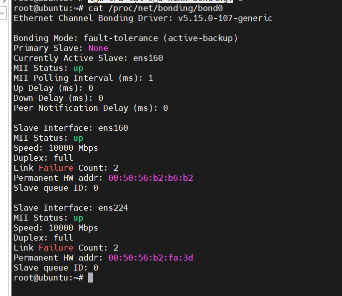
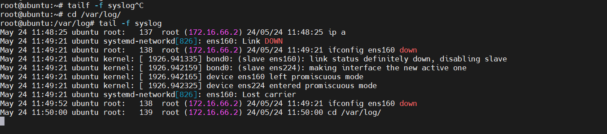
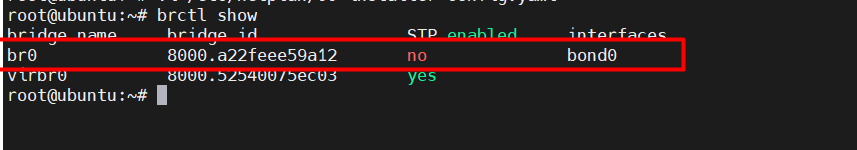
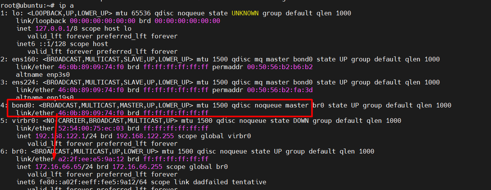

# Bonding là gì 

## 1.Khái niệm bonding
### 1.1 Khái niệm
Bonding hay còn gọi là port forwarding hoặc link aggegation là việc kết hợp nhiều NIC thành một NIC logic nhằm cân bằng tải , tăng thông lượng , khả năng chịu lỗi của hệ thống 


Hiểu đơn giản là : Cấu hình 2 hoặc nhiều card mạng chạy song song nhau, hỗ trợ nhau (Cân bằng tải) đảm bảo tính sẵn sàng cho server.Nếu 1 trong 2 card mạng bị down thì dịch vụ chạy trên server vẫn chạy bình thường bằng card mạng khác 

### 1.2Các bonding mode

Có 7 bonding modes:

* Mode 0 - balance-rr: Áp dụng cơ chế Round-robin cung cấp khả năng cân bằng tải và chịu lỗi

* Mode 1 - active-backup: Áp dụng cơ chế Active-backup. Tại một thời điểm chỉ có 1 slave interface active, các slave khác sẽ active khi nào slave đang active bị lỗi. Địa chỉ MAC của đường bond sẽ thấy từ bên ngoài chỉ trên một port để tránh gây khó hiểu cho switch. Mode này cung cấp khả năng chịu lỗi

* Mode 2 - balance-xor: Áp dụng phép XOR: thực hiện XOR MAC nguồn và MAC đích, rồi thực hiện modulo với số slave. Mode này cung cấp khả năng cân bằng tải và chịu lỗi

* Mode 3 - broadcast: Gửi tin trên tất cả các slave interfaces. Mode này cung cấp khả năng chịu lỗi.

* Mode 4 - 802.3ad: IEEE 802.3ad. Mode này sẽ tạo một nhóm tập hợp các intefaces chia sẻ chung tốc độ và thiết lập duplex (hai chiều). Yêu cầu để sử dụng mode này là có Ethtool trên các drivers gốc để đạt được tốc độ và cấu hình hai chiều trên mỗi slave, đồng thời các switch sẽ phải cấu hình hỗ trợ chuẩn IEEE 802.3ad.

* Mode 5 - balance-tlb: Cân bằng tải thích ứng với quá trình truyền tin: lưu lượng ra ngoài phân tán dựa trên tải hiện tại trên mỗi slave (tính toán liên quan tới tốc độ). Lưu lượng tới nhận bởi slave active hiện tại, nếu slave này bị lỗi khi nhận gói tin, các slave khác sẽ thay thế, MAC address của đường bond sẽ chuyển sang một trong các slave còn lại.

* Mode 6 - balance-alb: Cân bằng tài thích ứng: bao gồm cả cân bằng tải truyền (balance-tlb) và cân bằng tải nhận (rlb - receive load balancing) đối với lưu lượng IPv4. Cân bằng tải nhận đạt được nhờ kết hợp với ARP. Bondin driver sẽ chặn các bản tin phản hồi ARP gửi bởi hệ thống cụ bộ trên đường ra và ghi đè địa chỉ MAC nguồn bằng địa chỉ MAC của một trong các slaves trên đường bond.


## 2. Mô hình mạng cấu hình 





## 2.1 Thực hiện cài đặt mode 1 

Cài đặt gói cần thiết 

`sudo apt install ifenslave`


Nạp module bonding vào nhân hệ điều hành:

```
echo bonding >> /etc/modules
modprobe bonding

```
Kiểm tra thư mục cấu hình bonding: 

`ls -l /proc/net/bonding`

Kết quả sẽ tương tự như sau:




## 2.2 Cấu hình bonding network

`vi /etc/netplan/00-installer-config.yaml`

```
network:
  version: 2
  renderer: networkd
  ethernets:
    ens160:
      dhcp4: no
      dhcp6: no
    ens224:
      dhcp4: no
      dhcp6: no

  bonds:
    bond0:
      addresses: [172.16.66.64/24]
      routes:
        - to: default
          via: 172.16.66.1
          metric: 100
      nameservers:
        addresses: [8.8.8.8]
      interfaces:
        - ens160
        - ens224
      parameters:
        mode: active-backup
        mii-monitor-interval: 1

```


Mode Bonding ở đây dùng mode 1, cũng có thể cấu hình các mode khác ví dụ mode 4

```
 parameters:
      mode: 802.3ad
      transmit-hash-policy: layer3+4
      mii-monitor-interval: 1
```


Hoặc mode 2 : 

```

parameters:
        mode: balance-rr
        mii-monitor-interval: 100

```


Sau khi đã cấu hình hoàn tất, tiến hành apply cấu hình bằng lệnh

`sudo netplan apply`





**Kiểm tra lại cấu hình bonding:**

`cat /proc/net/bonding/bond0`





Thử down card ens160 và check log để xem kết quả.

`root@ubuntu:~# ifconfig ens160 down`





## 2.3 Tạo switch ảo br0 và gán bond0 interface vào switch đó:

 Cấu hình này trong file `vi /etc/netplan/00-installer-config.yaml`

 ```
network:
  version: 2
  renderer: networkd
  ethernets:
    ens160:
      dhcp4: no
      dhcp6: no
    ens224:
      dhcp4: no
      dhcp6: no

  bonds:
    bond0:
      dhcp4: no
      dhcp6: no
      interfaces:
        - ens160
        - ens224
      parameters:
        mode: active-backup
        mii-monitor-interval: 1

  bridges:
    br0:
      interfaces: [bond0]
      dhcp4: false
      addresses: [172.16.66.65/24]  
      routes:
        - to: default
          via: 172.16.66.1
          metric: 100
      nameservers:
        addresses: [8.8.8.8]  
      parameters:
        stp: false
      dhcp6: false


 ```


## 2.4 Kiểm tra lại cấu hình:

`brctl show`




Kiêm tra lại IP 

