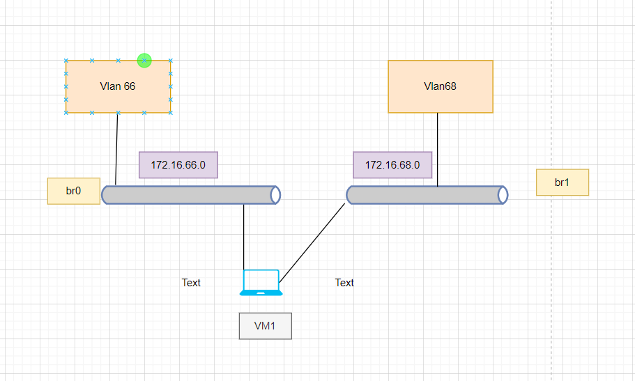
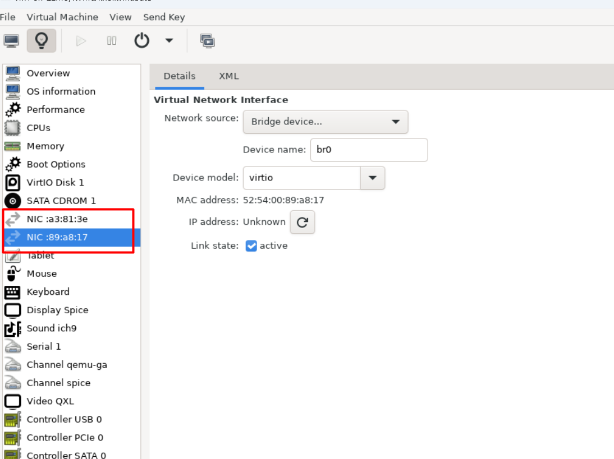
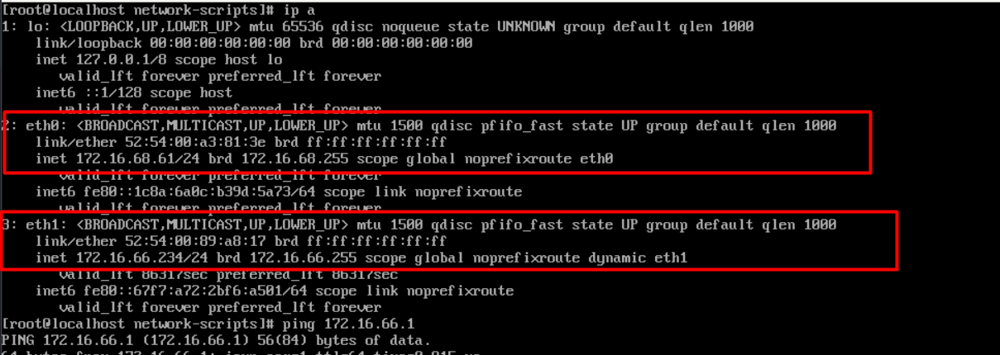

# Mô hình 





**Yêu cầu bài lab** 
```
Thực hiện cấu hình network trong VM1 có 2 card mạng , eth0 chứa vlan 66, eth1 chứa vlan 68 
Thực hiện ping 8.8.8.8 khi tắt 1 card mạng đi

```


**Bước 1**: Thực hiện cài đặt KVM bằng các câu lệnh trong bài [1.tìm hiểu cài đặt Linux](1.Tìm%20hiểu%20Linux%20bridge.md)


**Bước 2 :**  Cài đặt vm 1 và thực hiện tạo 2 interface cho nó 





**Bước 3:**  Vào VM thực hiện kiểm tra kết nối 





