## Làm việc basic vs Bash
### Hello Word
1. Interactive Shell
- Interactive shell là một chương trình dòng lệnh (command-line interface) cho phép bạn tương tác với hệ thống máy tính của mình thông qua việc nhập các lệnh và nhận kết quả trực tiếp từ hệ thống. Với interactive shell, bạn có thể thực hiện nhiều tác vụ khác nhau trên hệ thống của bạn, từ việc di chuyển giữa các thư mục đến thực thi các ứng dụng và chương trình. Interactive shell thường được sử dụng trong các hệ thống Unix và Linux, và là công cụ rất hữu ích cho các lập trình viên và nhà quản trị hệ thống.
 
- Lệnh `echo` : Ghi các đối số mà nó nhận được vào đầu ra tiêu chuẩn 
***1.1 Shell không tương tác**
Shell Bash cũng có thể được chạy không tương tác từ một tập lệnh, làm cho shell không yêu cầu tương tác của con người.Hành vi tương tác và hành vi theo kịch bản phải giống hệt nhau - một cân nhắc thiết kế quan trọng của Unix V7.Vỏ Bourne và Bash chuyển tiếp. Do đó, bất cứ điều gì có thể được thực hiện tại dòng lệnh đều có thể được đưa vào tập lệnh tập tin để tái sử dụng
- Tạo 1 file scrip Hello word 
- Thêm quyền thực thi đối với file: chmod +x hello.sh
- Thêm code vào file hello.sh
Dòng đầu tiên chuỗi ký tự #! được gọi là shebang1. Shebang hướng dẫn hệ điều hành chạy
Dòng 2 sử dụng echo để ghi Hello World vào đầu ra tiêu chuẩn
```
#!/bin/bash
echo "Hello World"
```
Thực thi tập lệnh hello.sh từ dòng lệnh bằng cách sử dụng một trong những cách sau
Cách mà được sử dụng phổ biến nhất `./hello.sh``
`/bin/bash hello.sh`
`bash hello.sh`
`sh hello.sh`

- Tất cả đều được in ra màn hình với kq cuối cùng là `Hello Word`


 


***1.2 Helloword sử dụng biển**

- Tạo 1 file có tên là hello.sh với nội dung, và cấp quyền thực thi cho file đấy
```
#!/usr/bin/env bash
# Note that spaces cannot be used around the `=` assignment operator
whom_variable="World"
# Use printf to safely output the data
printf "Hello, %s\n" "$whom_variable"
```
Sau khi chạy sẽ in ra dòng Hello,Word

- Sửa nội dung thành như sau để xuất ra một chuỗi định dạng 
```
#!/usr/bin/env bash
printf "Hello, %s\n" "$1"
```


 


- Câu lệnh đầu tiên không có đối số
- Câu lệnh thứ 2 đối số bằng một chuỗi
- Cấu lệnh thứ 3  đối với chuỗi có phân cách nhau bằng dấu cách, đối số $1 chỉ được ứng với 1 chuỗi đầu tiền sau câu lệnh.
- Để xử lý câu lệnh thứ 3 không hiện thị được chuỗi thì ta cần thêm dấu ngoặc kép cho câu lệnh
***1.3 Hello World with user Input**
```
#!/usr/bin/env bash

echo "who are you"
read name
echo "Hello, $name."
```
- Lệnh `read` ở đây đọc dữ liệu từ đầu vào tiêu chuẩn vào tên biến. Sau đó sử dụng $name và in ra bằng echo


 


- Nếu bạn muốn nối một cái gì đó vào giá trị biến trong khi in nó, hãy sử dụng dấu ngoặc nhọn quanh biến tên như được hiển thị trong ví dụ sau
```
#!/usr/bin/env bash
echo "what are you doing"
read action
echo "You are ${action}ing and .... 
```
output:


 


***1.4 Tầm quan trong trích dẫn trong chuỗi**
- Có hai kiểu trích dẫn 
- Yếu : Sử dụng trích dẫn `"`
- Mạnh : Sử dụng trích dẫn `'`
VD: 
- Trích dẫn yếu 
```
#!/usr/bin/env bash
word="Word"
echo "Hello $word"
```
- Trích dẫn mạnh
```
#!/usr/bin/env bash
word="Word"
echo 'Hello $word'
```


 


***1.5 Xem thông tin cho Bash tích hợp**
help [command]: Dùng để xe thông tin, cách sử dụng và các tùy chọn có trong câu lệnh
***1.6  Hello World chế độ "Debug"**


 


Đối số -x cho phép bạn xem qua từng dòng lệnh trong tệp
vd 2 : 
```
#!/usr/bin/env bash
echo "Hello word"
adding_string_to_number="s"
v=$(expr 9 + $adding_string_to_number)
```
output
Thông số đưa vào sẽ không đúng định dạng


 


```
#!/usr/bin/env bash
echo "Hello word"
adding_string_to_number="9"
v=$(expr 9 + $adding_string_to_number)
```
output
Thông số đưa vào sẽ đúng định dạng


 


### Phần 2 Script shebang
**2.1 ENV Shebang**
- Để thực thi tệp tập lệnh với tệp thực thi bash được tìm thấy trong biến môi trường PATH bằng cách sử dụng tệp thực thi env, dòng đầu tiên của tệp script phải chỉ ra đường dẫn tuyệt đối đến tệp thực thi env với đối số bash:
`#!/usr/bin/env bash`
- Đường dẫn env trong shebang được giải quyết và chỉ được sử dụng nếu tập lệnh được khởi chạy trực tiếp:
`script.sh`
**2.1 Direct shebang**
- Để thự thi một tập lệnh scrip với tệp thực hi bash, dòng đầu tiên chỉ ra tuyệt đối đến tập thực thi bash:
`#!/bin/bash`
- Đường dẫn  bash trong path được giải quyết và sử dụng lệnh chạy trực tiếp
`./scrip`
**2.3: Other shebangs**
Có 2 loại chương trình mà kernel biết. Một chương trình nhị phân được xác định bởi tiêu đề ELF(ExtenableLoadableFormat - Định dạng có thể tái mở rộng), thường được tạo bởi trình biên dịch. Thứ hai là kịch bản của bất kỳ loại nào.

Nếu một tệp bắt đầu với dòng đầu tiên bằng chuỗi #! thì tiếp theo phải là tên đường dẫn của trình thông dịch.

Nếu kernel đọc được dòng này, nó sẽ gọi trình thông dịch được đặt tên theo tên đường dẫn này và đưa các từ trong dòng làm đối số thông dịch.


 


- Sẽ không thực thi được câu lệnh vì trong /usr/bin/evn không có trình thông dịch something, something không thể xử lý được lệnh


### Phần 3 Navigating directories
**3.1 Điều hướng thư mục**
- Thay đổi đến thư sử dụng cuối cùng 
`cd -`
**3.2 Change to the home directory**
`echo $HOME`


 


**3.3 Thay đổi thư mục của script**
- Có 2 tool
1.System tool-Các công cụ hệ thống hoạt động từ thư mục làm việc hiện tại
2.Project tool-Các công cụ dự án sửa đổi các tệp liên quan đến vị trí của chúng trong hệ thống tệp

**3.4 Listing Files**
- Sử dụng bash shell's File name expansion(mở rộng tên tệp) và brace expansion(mở rộng dấu ngoặc nhọn) để lấy các tên tệp:
` printf "%s\n" * == ls`
anaconda-ks.cfg
certbot-auto
hello.sh
liệt kê file có đuôi txt 
`printf "%s\n" *.txt`
Liệt kê các file có đuôi txt,md,conf, nếu không có file thì dấu * sẽ được hiển thị ở đầu
`printf "%s\n" *.{txt,md,conf}`


 


### Phần 4 Jobs and Processes
**4.1 Xử lý công việc**
- Createing jobs
Để tạo job, chỉ cần thêm dấu & sau lệnh. & không phải là một tham số cho chương trình. Nó cho shell. & là chạy chương trình ở chế độ nền trong shell.
```
 sleep 10 &
[1] 74773
```
Vd : Thực hiện sleep trong vòng 10s .
Bạn có thể thực hiện một lệnh tiếp theo mà không cần đợi job thực hiện xong bằng tổ hợp phím Ctr + Z. Sử dụng Crl+z sẽ ngưng lại tiến trình
Background(bg) and foreground(fg)(đặt vấn đề lên trước) a process
**4.2Killing running jobs**


 


-  Kiểm tra Process đang chạy trên cổng cụ thể
` lsof -i :22`
`lsof -i :80`


 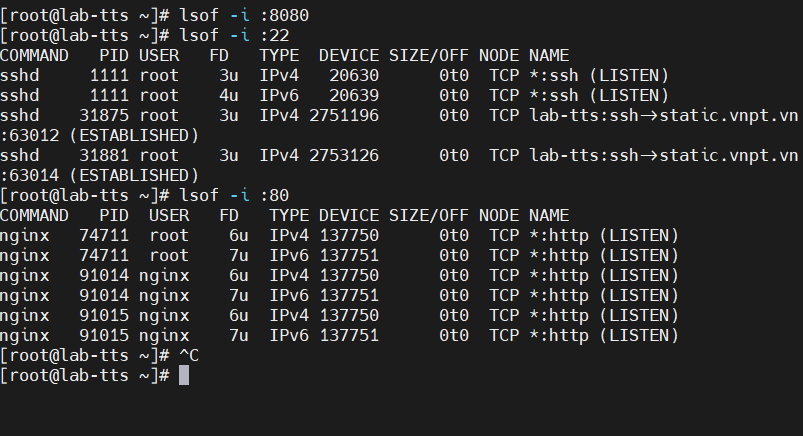


- Tìm kiếm thông tin về một quy trình đang chạy
`ps aux | grep <search-term>` 


 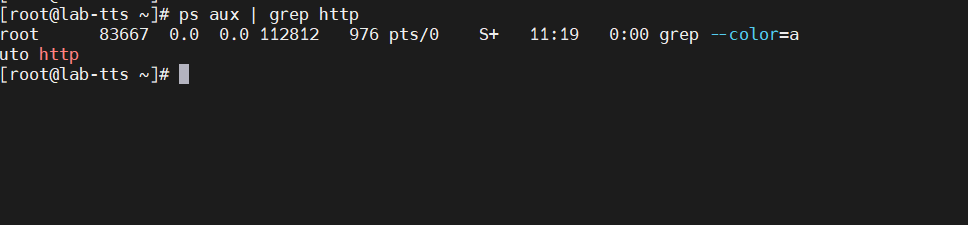

**4.3Redirection- Chuyển hướng**
**Chuyển hướng đầu ra tiêu chuẩn**
`>` Chuyển hướng đầu ra tiêu chuẩn hay còn được gọi là STDOUT của lệnh hiện tại thành một tệp hoặc một bộ mô tả khác.


 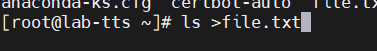


 
**Append vs Truncate**
`Truncate` > Được thực thi như sau:

 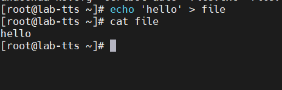

Tạo tệp file nếu nó không tồn tại

Truncate: loại bỏ nội dung của tệp nếu nó tồn tại file
Ghi nội dung Xin chào vào tệp. Vì nó là nội dung ghi vào sau cùng khi sử dụng `Truncate >`
`Append >>`
- Tạo file được chỉ định nếu nó không tồn tại
- Append- nối tệp(ghi vào cuối tệp)
 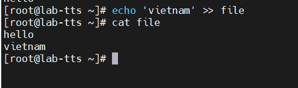
**Chuyển hướng đầu đến các địa chỉ mạng**
Bash coi một số đường dẫn là đặc biệt và có thể thực hiện một só giao tiếp mạng bằng cách viết vào `/dev/{udp|tcp}/host/port` . Bash không thể thiết lập một máy chủ để lắng nghe, nhưng có thể bắt đầu kết nối và đối với TCP thì có thể đọc được kết quả. Lệnh `exec` khi sử dụng sẽ không nhận được STDOUT.
```
exec 3</dev/tcp/khoiht.click/80
printf 'GET / HTTP/1.0\r\n\r\n' >&3
cat <&3
```
ouput STDOUT

 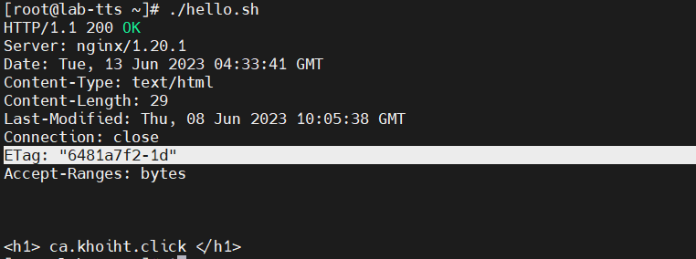

Hoặc vd sau cũng chuyển hướng để in ra màn hình 
```
!/bin/bash

# Set up variables for the request
host=khoiht.click
port=80
path=/some-other-page

# Send the HTTP request with redirection
response=$(printf "GET %s HTTP/1.1\r\nHost: %s\r\nConnection: close\r\n\r\n" "$path" "$host" | nc "$host" "$port")

# Print the response to the console
echo "$response"
```
Trong script này, chúng ta đã thiết lập các biến host, port và path để chứa thông tin về trang web đích mà chúng ta muốn chuyển hướng tới.

Sau đó, trong câu lệnh printf, tạo một yêu cầu HTTP GET mới cho trang web đích bằng cách sử dụng path và host của trang web đó. Chúng tôi đã sử dụng ký tự đặc biệt \r\n để phân tách các phần khác nhau của yêu cầu HTTP.

Sau đó, dụng lệnh netcat (nc) để gửi yêu cầu HTTP đến trang web đích tại host và port được chỉ định. Khi chạy lệnh này, phản hồi từ trang web đích sẽ được lưu vào biến response.


Cuối cùng, chúng tôi đã in nội dung của biến response ra màn hình bằng lệnh echo.
- Kết quả chạy
- 
 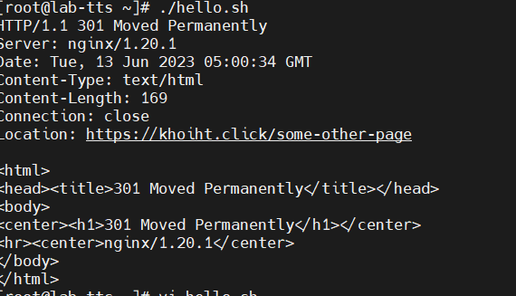


**Chuyển hướng STDIN**
`<` đọc từ đối số bên phải và ghi vào đối số bên trái.

 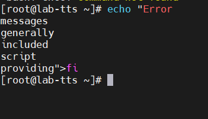

 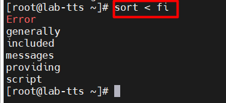

### Phần 5 Control Structures
**Các tham số dùng để kiểm tra hoặc test**
- Tham số làm việc với file 
File Operators	Details
`-e "$file"` : Trả về true nếu tồn tại 
`-d "$file"` : Trả về true nếu tồn tại và là 1 thư mục
`-d "$file"` : Trả về true nếu tồn tại và là 1 thư mục thường
- String Comparators 

`-z "$str" `: Trả về độ dài chuỗi 0
`-n "$str `: True nếu độ dài chuỗi khác 0
`"$str1" = "$str2"` : True nếu độ dài chuỗi 1 bằng chuỗi 2
`"$str" != "$str2"` : True nếu độ dài chuỗi 1 khác chuỗi 2
- Integer Comparators(So sánh số nguyên)
`-eq` : equal - Đúng nếu hai số bằng nhau
`ne` : not equal : Đúng nếu hai số khác nhau
`gt` : geater than - đúng nếu `$int1` lớn hơn `$int2`
`ge` : greater than or equal - đúng nếu `$int1` lớn hơn hoặc bằng `$int2`
`-lt`	less than - đúng nếu `$int1` Nhỏ hơn `$int2`

**5.1: Thực hiện có điều kiện danh sách lệnh**
- Mọi lệnh, biểu thức hoặc hàm dựng sẵn, cũng như mọi lệnh hoặc tập lệnh bên ngoài đều có thể được thực thi
có điều kiện bằng cách sử dụng các toán tử &&(and) và ||(or).


 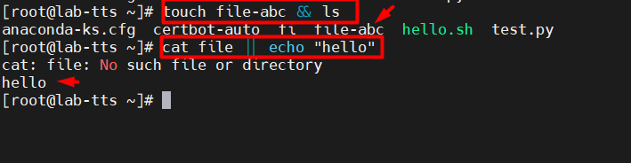

- Khi kết hợp nhiều câu lệnh theo cách này, các toán tử không được ưu tiên và Liên kết ngược (left-associative).
`cat file  && pwd || echo "No such directory`
 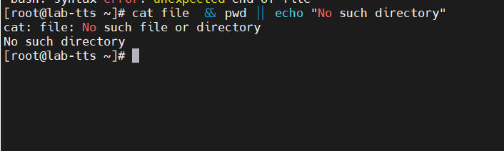
- Nếu thực hiện `cat` thành công thì sẽ thực hiện `pwd `và không thực hiện echo
- Nếu `cat` file không thành công thực hiện lệnh `echo`


**5.2: Câu lệnh if**
Trong file `test.sh` chứa lệnh sau : 
```
a=$1
if [[ a -eq 1 ]]; then
 echo "giá trị a bằng 1"
elif [[ a -gt 1 ]]; then
 echo "Giá trị a lớn hơn 1"
else
 echo "$1"
fi
```
- Việc dùng `fi` để đóng là bắt buộc, nhưng có thể bỏ qua `elif` hoặc` else` hoặc các mệnh đề khác.
- Điều quan trọng là phải hiểu rằng dấu ngoặc `[[ `không phải là một phần của cú pháp, nhưng được coi như một lệnh; nó là mã thoát khỏi lệnh này đang được thử nghiệm. Do đó, bạn phải luôn bao gồm khoảng trắng xung quanh dấu ngoặc.
Chạy file `./test.sh`


 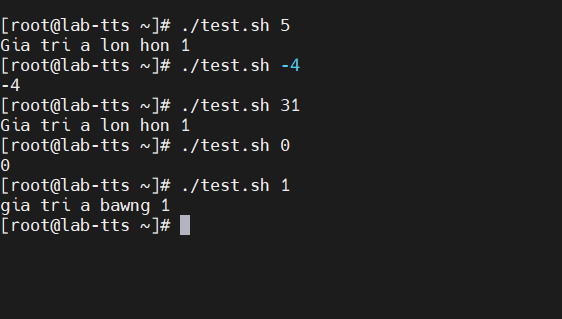

VD2 : Viết đoạn scrip thực hiện xem đủ tuổi lam viec
```
echo "Nhap so tuoi cua babe:"
read age

if [[ $age -gt 18 ]] && [[ $age -lt 60 ]]; then
    echo "babe dang trong do tuoi lam viec!"
elif [[ $age -lt 18 ]] ; then
    echo "babe dang tre qua ."
elif [[ $age -gt 60 ]] ; then
        echo "babe gia qua roi."
else
    echo "Please enter a valid age."
fi
```


 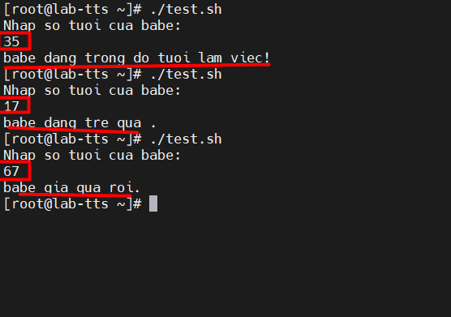

VD3 : Các biểu thức toán học cũng trả về 0 hoặc 1 
```
if (( $1 + 5 > 91 )); then
echo "$1 la mo so lon hon 86 "
else
        echo " $1 la so be hon 86"
fi
```


 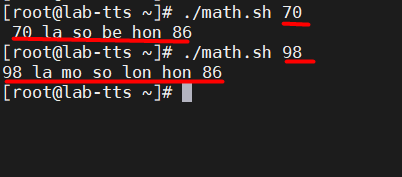


**5.2: Câu lệnh for** 
- Cho phép lặp lại các biến trong một mảng
```
Khai báo một mảng:`arr=(a b c d e f)`
`arr=(a b c d e f)
for i in "{$arr[@]};do
echo "$i"
done
```
- Vòng lặp while: thực thi một đoạn mã nếu biểu thức điều kiện đúng và chỉ dừng lại khi nó sai
```
arr=(a b c d e f)
i=0
while (( $i < ${#arr[@]} ));do
    echo "${arr[$i]}"
    ((i++))
done

hoac

arr=(a b c d e f)
i=0
while [ $i -lt ${#arr[@]} ];do
    echo "${arr[$i]}"
    i=$(expr $i + 1)
done
```
ouput :


 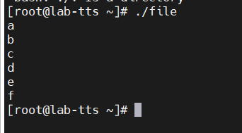

Điểm khác nhau chính là ở cách kiểm tra điều kiện tiếp tục vòng lặp. Đoạn mã thứ nhất sử dụng cấu trúc điều kiện` [ $i -lt ${#arr[@]} ] đ`ể kiểm tra xem biến i có nhỏ hơn số phần tử của mảng arr hay không. Còn đoạn mã thứ hai sử dụng cấu trúc điều kiện `(( $i < ${#arr[@]} ))` để thực hiện công việc tương tự.

Ngoài ra, trong đoạn mã thứ nhất, để tăng giá trị của biến i lên mỗi lần vòng lặp được thực thi,sử dụng lệnh `expr $i + 1` để thực hiện phép tính cộng và gán kết quả cho biến i. Trong khi đó, trong đoạn mã thứ hai, để tăng giá trị của biến i, người viết code sử dụng cú pháp `((i++))` để tăng giá trị của biến i lên 1 mỗi lần vòng lặp được thực thi.

**5.3: Sử dụng vòng lặp để liệt kê lặp lại các số.** 
```
for i in {1..10}
do
echo $i
done

```


 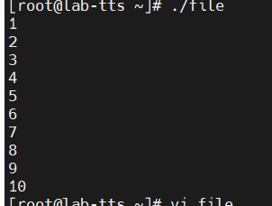


**5.4:  continue and break.** 
- Continue: bỏ qua các lệnh còn lại bên trong phần thân của vòng lặp đi kèm cho lần lặp hiện tại và chuyển quyền điều khiển chương trình cho lần lặp tiếp theo của vòng lặp.

```
i=0

while [[ $i -lt 5 ]]; do
  ((i++))
  if [[ "$i" == '2' ]]; then
    continue
  fi
  echo "Number: $i"
done

echo 'All Done!'
```
 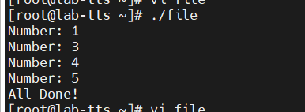
- Đoạn mã trên sử dụng vòng lặp while do để in ra các số từ 1 đến 5 . Cụ thể i = 0; và tăng giá trị lên sau mỗi lần lặp nếu kiểm tra bằng 2 thì nó tiếp tục vòng lặp và không in ra số 2

**break:** lệnh kết thúc vòng lặp hiện tại và chuyển điều quyền điều khiển chương trình cho lệnh sau vòng lặp kết thúc. Nó được sử dụng để thoát vòng lặp for, while , until, select.
```
i=0

while [[ $i -lt 5 ]]; do
  ((i++))
  if [[ "$i" == '2' ]]; then
    break
  fi
  echo "Number: $i"
done

echo 'All Done!'
```


 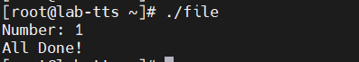


- Đoạn mã trên sử dụng vòng lặp while do để in ra các số từ 1 đến 5 . Cụ thể i = 0; và tăng giá trị lên sau mỗi lần lặp nếu kiểm tra bằng 2 thì nó dừng vòng lặp và in ra 
**5.5:  Vong lap while.**
``` 
i=0
while [ $i -lt 5 ]
do
        echo "now i: $i"
        i=$[$i+1]
done
```


 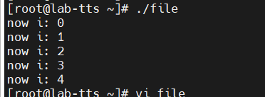


**5.6:  Vòng lặp với cú pháp kiểu C.**
`for (( variable assignment; condition; iteration process ))`
- Việc gắn biến trong vòng lặp for có có thể chứa khoảng trắng
- Các biến tên không được đặt trước $
```
for (( i = 0; i < 10; i++ ))
do
 echo "so lan lap $i"
done
```

 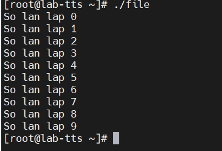
**5.6: Switch statement with case.**
- Đối với case statement bạn có thể so khớp giá trị với một biến
- Đối số được truyền vào case được mở rộng và gắp khớp với từng mẫu.
- Nếu một kết quả được tìm thấy là phù hợp, các lệnh ;; được thực hiện. Lệnh case thường được sử dụng để đơn giản hóa các điều kiện phức tạp khi bạn có nhiều sự lựa chọn khác nhau sẽ giúp bạn làm cho các script của mình dễ đọc hơn và dễ bảo trì hơn.
vd:
```

echo "Xin Chao Ban"
while :
do
  read INPUT_STRING
  case $INPUT_STRING in
        xin chao)
                echo "Xin chao!"
                ;;
    "Who is")
                echo "My computer!"
                ;;
        bye)
                echo "hen gap lai!"
                break
                ;;
        *)
                echo "Sorry, i do not know"
                ;;
  esac
done
echo
echo "thank"

```
output:
 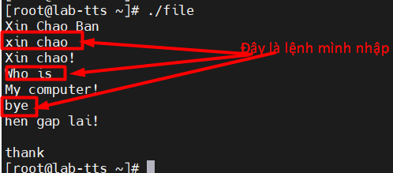
