**true, false and : commands**
- Vòng lặp vô hạn
```
while true; do
echo oke
done
```
hoặc 
```
until fasle; do
echo oke
done
```
Hoặc 
```
while :; do
echo oke
done
```

## Arrays
### List Assignment

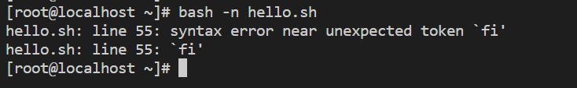
- Trong dấu ngoặc vuông là thứ tự của phần trong mảng.
@: Lấy ra tất cả các phần tử trong mảng
Số nguyên dương là từ trái qua phải. Bắt đầu bằng 0 là phần tử đầu tiên
Số nguyên âm là lấy từ phải qua trải bắt đầu bằng -1
### Subscript Assignment
- Tạo bảng theo phần tử rõ ràng 
`city=([3]="nghe an" [4]="Hue")`

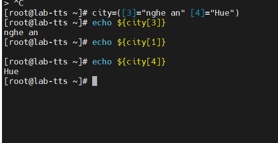
- Tạo bảng động
arr=(`seq 1 10`)
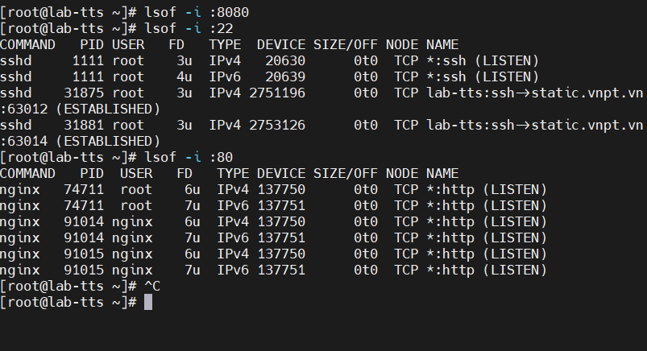

### Truy cập các phần tử mảng
- Khai báo phần tử trong mảng
arr=(`seq 1 10`)

- In ra ở phần tử thứ X
`echo "${arr[3]}"`

- In ở phần tử cuối cùng bằng cách sử dụng -
`echo "${arr[-1]}"`
-In tất cả các phần tử, mỗi phần tử được trích dẫn riêng biệt
`echo "${arr[@]}"`
- In tất cả các phần tử từ chỉ mục lùi về sau 
`echo "${arr[@]:2}`
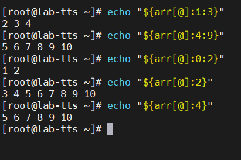
- Hoạt động chuỗi
`echo "${array[0]:0:3}"`: Lấy ra phần tử đầu tiên, trong đó 0 khởi đầu và lấy 3 ký tự trong phần tử để in ra
` echo "${array[0]:0:3}"`
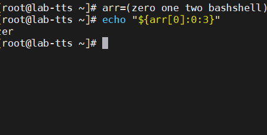
`echo "${arr[3]:2:4}"` : Lấy ra phần tử thứ 4, trong đó 2 khởi đầu và lấy 4 ký tự trong phần tử để in ra

### Sửa đổi mảng
- Sửa đổi hoặc nhập một phần tử cụ thể trong mảng 
```
[root@lab-tts ~]# arr[1]="number one"
[root@lab-tts ~]# echo "${arr[1]}"
number one
```
### Nối tiếp mảng
Sửa đổi mảng, thêm phần tử vào cuối nếu không có chỉ số con nào được chỉ định
```
[root@lab-tts ~]# arr+=('new1''new2')
zero number one two bashshell new1new2
```
### Thay thế toàn bộ mảng bằng một danh sách tham số mới 
`array=("${array[@]}" "new1" "new2")`
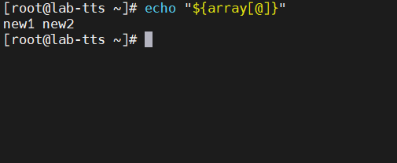
### Chèn một phần tử vào vị trí đâu tiên
`array=("new With Begin" "${array[@]}")`
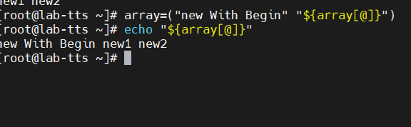

### Chèn phần tử vào vị trí nhất định
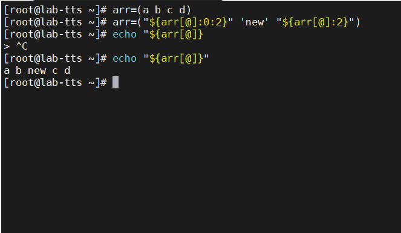

### Xóa một phần tử được chỉ định
```
[root@lab-tts ~]# echo "${arr[@]}"
a b new c d
[root@lab-tts ~]# echo "${!arr[@]}" //in ra vi tri
0 1 2 3 4
[root@lab-tts ~]# unset -v 'arr[2]' //xoa vi tri
[root@lab-tts ~]# echo "${arr[@]}"
a b c d
```
### Lặp lại mảng
- Có 2 vòng lặp đó là for-each và for-loop
vd: về vòng lặp for-each
```
arr=(a b c d e f)
for i in "${arr[@]}"; do
 echo "$i"
done
```
Hoac 
```
arr=(a b c d e f)
for ((i=0; i < ${#arr[@]}; ++i)); do
    echo "${arr[$i]}"
done
~
```
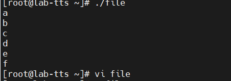

### Độ dài của mảng 
```
[root@lab-tts ~]# echo "${arr[@]}"
a b c d e f
[root@lab-tts ~]# echo "${#arr[@]}"
6
```
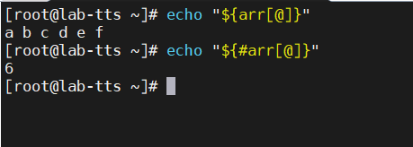


`[root@lab-tts ~]# echo "${#arr[1]}"` : in ra số ký tự của phần tử 1


### Deesstroy, Delete, unset một mảng unset array
`unset array` : xóa bảng 
`unset array[1]` : Xóa ở một vị trí chỉ định


## Funtion
c
```
greet() {
        echo "Hello,$1"
}
greet "$1"
```
Output: 
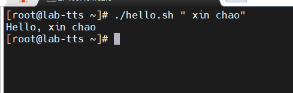
- Với nhiều đối số Ví dụ 2:
```
In() {
 echo "First Name $1"
 echo "Last Name $2"
}
In "$@"
```
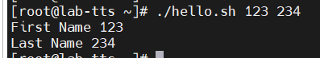
### In định nghĩa hàm
```
callfunc() {
    declare -f "$@"
}
function func(){
    echo "test test test"
}
funcd="$(callfunc func)"
callfunc func # hoặc  echo "$funcd"
```

Hàm callfunc nhận một tên hàm làm tham số, sau đó dùng lệnh `declare -f` để truy xuất định nghĩa của hàm đó và gán vào biến funcd.

