## Chaper 15 -21
### Sửa đổi trường hợp ký tự các chữ cái 
- Ký tự viết hoa 
vd :
``` 
[root@lab-tts ~]# k="hellovietnam"
[root@lab-tts ~]# printf '%s\n' "${k^}"
Hellovietnam
```
- In hoa tất cả các ký tự 
```
[root@lab-tts ~]# k="hellovietnam"
[root@lab-tts ~]# printf '%s\n' "${k^^}"
HELLOVIETNAM
[root@lab-tts ~]# k="xin chao viet nam"
[root@lab-tts ~]# declare -u string="$k"
[root@lab-tts ~]# echo "$string"
XIN CHAO VIET NAM
```
- Chữ hoa thành chữ thường : Chỉ ký tự đầu tiên 
```
[root@lab-tts ~]# k="HELLO"
[root@lab-tts ~]#  printf '%s\n' "${k,}"
hELLO
```
- Chữ hoa thường : tất cả các ký tự 
```
[root@lab-tts ~]# k="HELLO"
[root@lab-tts ~]#  printf '%s\n' "${k,,}"
hELLO
[root@lab-tts ~]# k="HELLO VIET NAM"
[root@lab-tts ~]# declare -l string="$k"
[root@lab-tts ~]# echo "$string"
hello viet nam
```
- Độ dài của một tham số

```
[root@lab-tts ~]# k="HELLO"
[root@lab-tts ~]# echo "${#v}"
5
```
- Số phần tự có trong mảng
```
[root@lab-tts ~]# arr=(a b c d e f)
[root@lab-tts ~]# echo "${#arr[@]}"
6
```
- Làm việc với các vị trí 
```
[root@lab-tts ~]# set -- 1 2 3 4 a b c d
[root@lab-tts ~]# echo "${#@}"
8
[root@lab-tts ~]# echo "$#"
8
```
- Thay thế trong chuỗi 
```
[root@lab-tts ~]# str='xin chao viet nam'
[root@lab-tts ~]# echo "${str/c/C}"
xin Chao viet nam
[root@lab-tts ~]#
```
`echo "${str/c/C}"` : Phân tích trong `${str/c/C}`
    - str tên chuỗi 
    - c chữ cần thay 
    - C chữ được thay thế
- Thay đổi ký tự đầu tiên 
```
[root@lab-tts ~]# str='xin chao viet nam'
[root@lab-tts ~]# echo "${str/#xin/HELLO}"
HELLO chao viet nam
```
- Thay đổi ký tự cuối cùng 
```
[root@lab-tts ~]# str='xin chao viet nam'
 echo "${str/%nam/MEN}"
xin chao viet MEN
```
### Substrings và subarrays

- Đặt biến cho chuỗi ký tự 
`var ='987654321abcdef'`

`${var:n}` : Lấy từ vị trí n đến hết 
```
[root@lab-tts ~]# printf '%s\n' "${var:3}"
654321abcdef
[root@lab-tts ~]# printf '%s\n' "${var:5}"
4321abcdef
```
`${var:n:y} `lấy từ vị trí n,lấy ra y kí tự 

`[root@lab-tts ~]# printf '%s\n' "${var:5:3}"`
432
`[root@lab-tts ~]# printf '%s\n' "${var:4:9}"`
54321abcd

`${var:n:-y}`  : Số lượng độ dài âm tính từ cuối chuỗi , Lấy từ vị trí `n` và loại bỏ `y` ký tự
```
[root@lab-tts ~]# printf '%s\n' "${var:4:-2}"
54321abcd
[root@lab-tts ~]# printf '%s\n' "${var:1:-2}"
87654321abcd
```
`${var: -n}`: Lấy số ký tự tính từ cuối . 

### Hướng tham số 
Bash cho phép nhận một của một biến có tên được chứa trong mọi biến khác
```
[root@lab-tts ~]# A="xin chao VIETNAM"
[root@lab-tts ~]# B="China number 0"
[root@lab-tts ~]# i=A
[root@lab-tts ~]# echo "${!i}"
xin chao VIETNAM
[root@lab-tts ~]# i=B
[root@lab-tts ~]# echo "${!i}"
China number 0
```


### Copying
- Sao chép một file duy nhất 
`cp /etc/file1 /etc/file2` : Copy file1 1 sang /etc để chứa file 2
- Sao chép nhiều tệp 
`cp -r /path/file/file1 /path/test/file2` : Nếu thanh thư mục tồn tại trước khi bắt đầu lệnh thì nội dung file 1 sẽ chuyển vào thư mục.Còn nếu không tồn tại thì thư mục và nội dung sẽ được tạo

### Find
- `find` : Là một lệnh tìm kiếm đệ quy một thư mục cho các tệp
- Tìm kiếm các tệp / thư mục có liên quan đến pwd
```
find . -name "hello.sh"
./hello.sh
```
- Tìm kiếm các tệp / thư mục có tên bắt đầu bằng abc và kết thúc bằng một ký tự alpha sau một chữ số 
`find . -name "abc[a-z][0-9]"`
- Để tìm tất cả các tệp / thư mục nằm trong một thư mục cụ thể
`find /path`

#### Thực thi các lệnh đối với một tệp được tìm thấy 
- Đôi khi chúng ta cần chạy các lệnh đối với tất cả các tệp . Điều này có thể được thực hiện bằng cách `xargs`
`find /path -type d -print | xargs -r chmod 770`
Lệnh trên sẽ tim một các đệ quy tất cả các thư mục (-type d) liên quan đến /path (thư mục làm việc) và thực thi chmod 770 trên chúng. Tùy chọn -r chỉ định để xargs không chạy chmod nếu không tìm thấy bất kỳ lệnh nào.
#### Thực tên tệp theo thời gian truy cập sửa đổi 
- Tìm các tệp không sửa đổi trong vòng 2 giờ qua  
`find . -mmin +120`

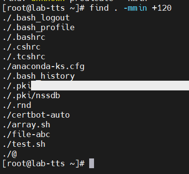


`find . -amin -120`
`find . -cmin +120`
- Định dạng chung:
`mmin n:` Tệp đã được sửa đổi n phút trước
`nmin -n`: Tệp đã được thay đổi trong vòng n phút trước
`mmin +n`: Tệp đã được sửa đổi hơn n phút rồi.

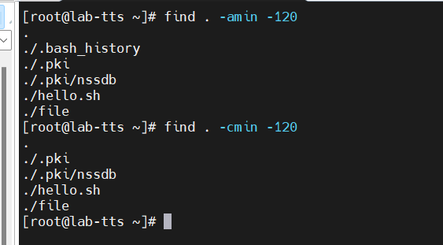

- Tìm các tệp được sửa đổi trong 2 ngày qua
`find . -mtime -2`

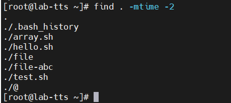

- Sử dụng` -atime` và `-ctime` cho thời gian truy cập và thời gian thay đổi trạng thái tương ứng. Định dạng chung:
`-mtime n`: File được sửa đổi trong vòng n ngày qua
`-mtime -n`: File được sửa đổi ít hơn n ngày
`-mtime +n`: File được sửa đổi nhiều hơn n ngày.
- Tìm các tệp được sửa đổi trong phạm vi ngày 
vd : Tìm kiếm các tệp được sửa đổi tư ngày 01-04-2023 đến 01-06-2023
`find . -type f -newermt 2023-04-01 ! -newermt 2023-06-01`
- Tìm tệp được truy cập trong một loạt dấu thời gian từ 1g đến 10 phút trước 
```
touch -t $(date -d '1 HOUR AGO' +%Y%m%d%H%M.%S) start_date
touch -t $(date -d '10 MINUTE AGO' +%Y%m%d%H%M.%S) end_date
timeout 10 find "$LOCAL_FOLDER" -newerat "start_date" ! -newerat "end_date" -print
```
#### Tìm kiếm tập tin theo kích thước
- Tìm kiếm tệp lớn hơn 10M
`find -type f -size +15M`
- Tìm kiếm tệp lớn hơn 10kb
`find -type f -size +10kb`

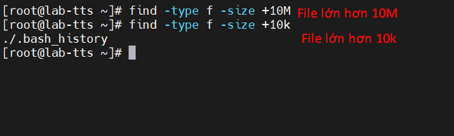

- Tìm kiếm tập tin có chính xác kích thước `10kb`
`find -type f -size 10kb`
- Định dạng chung 
`find`[options] `-size` n`[cwbkMG]`
Trong đó : 
+ c: byte
+ w : 2byte
+ b : 512 byte(mặc định)
+ k : 1kb
+ M : 1MB
+ G : 1G    

#### Lọc đường dẫn 
Các `-path `tham số cho phép chỉ định một mô hình để phù hợp với con đường của kết quả. Mẫu cũng có thể phù hợp với tên của chính nó.
- Để tìm các tệp chứa nhật ký ở đâu trong đường dẫn của chúng 
```
[root@lab-tts ~]# find . -type f -path '*log*'
./.bash_logout
```
- Để chỉ tìm các tệp trong thư mục được gọi là nhật ký (ở mọi cấp độ):
`find . -type f -path '*/log/*`
- Để chỉ tìm các tệp trong một thư mục được gọi là nhật ký hoặc dữ liệu :
`find . -type f -path '*/log/*' -o -path '*/data/*'`
Để tìm tất cả các tệp ngoại trừ những tệp được chứa trong một thư mục có tên là bin :

`find . -type f -not -path '*/bin/*'`
Để tìm tất cả các tệp, tất cả các tệp ngoại trừ những tệp được chứa trong một thư mục được gọi là tệp bin hoặc tệp nhật ký:

`find . -type f -not -path '*log' -not -path '*/bin/*'`

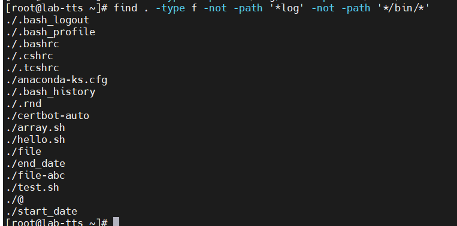

#### Tìm kiếm tập tin theo loại 
- Tìm kiếm tệp `-type f`
`find . -type f`
- Để tìm các thư mục `-type d`
`find . -type d`
- Để tìm các khối `-type b`
`find . -type b`
- Để tìm liến kết tượng trưng `-type l`
`find . -type l`

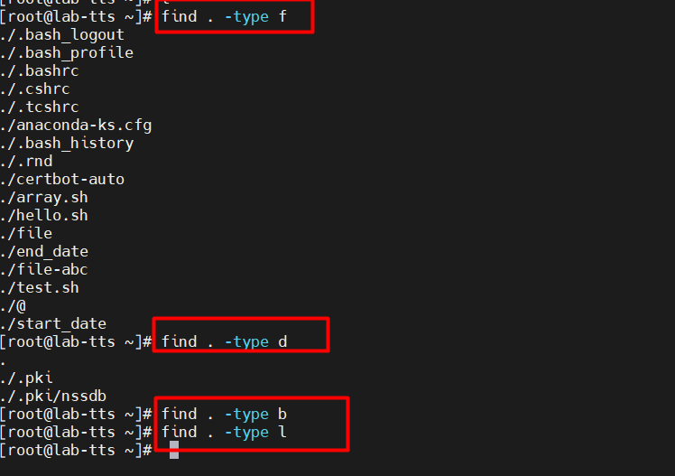

#### Tìm kiếm theo phần mở rộng cụ thể 
`find . -maxdepth 1 -type f -name "*.sh"`
Để tìm tất cả các tệp loại .sh chỉ từ thư mục hiện tại, 

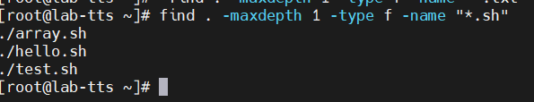


### Sử dụng ngăn xếp(using sort)
- Lệnh sort được sử dụng để sắp xếp thành một các danh sách dòng 
- Đầu vào từ một tệp
`sort hello.sh`
**Làm cho đầu ra duy nhất**
Để hiển thị chủ sở hữu của các tệp trong thư mục
`ls -l | awk '{print $3}' | sort -u`
**Sắp xếp theo số**
```
 echo "10.abcd
> 4.trantahh
> 5.sontn
> 1.viet" >file
```

Để sắp xếp tệp này theo số,  sử dụng tham số `-n:`
`sort -n file`

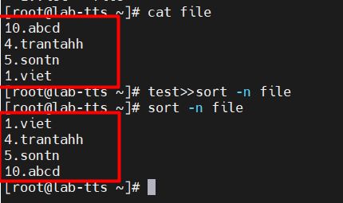

Để đảo ngược thứ tự sắp xếp sử dụng tham số `-rn:`
`sort -rn file`

###  Tìm nguồn cung cấp tệp
- Tìm nguồn cung ứng một tệp khác với việc thực thi , ở chỗ tất cả các lệnh được đánh giá trong ngữ cảnh hiện tại là bash session - điều này có nghĩa là bất kỳ biến hoặc bí danh nào được xác định sẽ tồn tại suốt phiên của bạn 
- Tạo 1 file tesh.sh
```
#!/bin/bash
export K="VN Number 1"
alias sayhi="echo China 0"
sayhello(){
        echo"VN"
}
```
- Thực hiện source test.sh
- Thực hiện sẵn tài nguyên từ tệp ouput hiện ra 

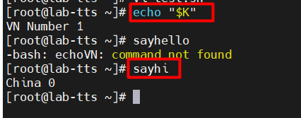

### Sourcing một môi trường ảo
Khi phát triển một số ứng dụng trên máy, việc tách các phần phụ thuộc thành các phần phụ thuộc ra môi trường ảo sẽ trở nên hữu ích.
Với việc sử dụng virtualenv, các môi trường được lấy nguồn từ shell của bạn để khi bạn chạy một lệnh, nó đến từ môi trường ảo đó. Điều này được cài đặt phổ biến nhất bằng cách sử dụng pip.
```
yum install python-pip -y
pip install virtualenv
mkdir /opt/evn_1
cd /opt/evn_1
virtualenv env -p python2
source env/bin/activate
```


### 20.Here documents and here strings - Đây là tài liệu và đây chuỗi
**20.1Execute command with here document**
```
ssh -p 21 example@example.com <<EOF
    echo 'printing pwd'
    echo "\$(pwd)"
    ls -a
    find '*.txt'
EOF
```
bị thoát vì chúng tôi không muốn nó được mở rộng bởi shell hiện tại, tức là $ (pwd) sẽ được thực thi trênvỏ từ xa.
**20.2 Create a file - Tạo tệp**
```

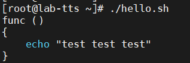

```
- trong trong file 
- Cấp quyền thực thi và chạy với lệnh ./file
- Khi chạy file sẽ xuất hiện file `sport.txt`
Tài liệu này ở đây trở thành đầu vào của lệnh cat . Lệnh cat chỉ xuất ra đầu vào của nó và sử dụngtoán tử chuyển hướng đầu ra > chuyển hướng đến tệp sport.txt .

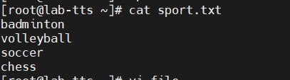

**20.3 Here strings - Chuỗi đây**
- Để cung cấp lệnh bằng cách sử dụng chuỗi sau 
```
awk '{print $2}' <<< "hello VN - how are you?"
world

awk '{print $1}' <<< "hello how are you
> Vn is not fine"
hello
>VN
```
**20.4 Chạy một số lệnh với sudo**
```
sudo -s <<EOF
    a='var'
    echo 'Running serveral commands with sudo'
    mktemp -d
    echo "\$a"
EOF
```
**20.5  Chuỗi giới hạn**
- Chuỗi giới hạn kết thúc phải 
- Ở đầu dòng
- Là văn bản duy nhất trên dòng 
VD : 
```
cat <<test_chuoi
Test 1
Test 2
test_chuoi
```
ouput

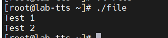


### 21.Quoting - Trích dẫn
**21.1 Double quotes for variable and command substitution - Dấu ngoặc kép cho biến và lệnh thay thế**
Các phép thay thế biến chỉ nên được sử dụng bên trong dấu ngoặc kép.
vd 
```
calculation='10 * 3'
echo "$(($calculation))"
```

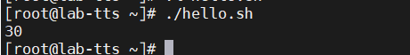

**21.2 Difference between double quote and single quote - Sự khác biệt giữa dấu ngoặc kép và dấu ngoặc đơntrích dẫn**
- Dấu ngoặc kép
``` 
Cho phép mở rộng biến
Cho phpes mở rộng lịch sử nếu được bật
Cho phép thay thế lệnh
* và @ có ý nghĩa đặc biệt
Có thể chứa trích dẫn đơn hoặc kép
$ , ` , " , \ có thể được thoát bằng \ để ngăn ý nghĩa đặc biệt của chúng
```
- Trích dẫn duy nhất
```
Ngăn chặn sự mở rộng có thể thay đổi
Ngăn chặn mở rộng lịch sử
Ngăn chặn việc thay thế lệnh
* và @ luôn là chữ
Trích dẫn đơn không được phép bên trong báo giá đơn
Tất cả chúng đều là chữ
```
Thuộc tính chung cho cả hai:

- Ngăn chặn sự nhấp nháy
- Ngăn tách từ
VD 

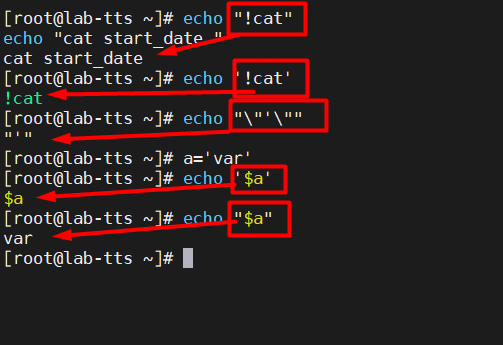

**21.3 Newlines and control characters - Dòng mới và ký tự điều khiển**
