##Chaper 22 -> 
### 22.Biểu thức có điều kiện 
**22.1 Kiểm tra loại tệp**
- Tham số -e kiểm tra có điều kiện khai thác xem một tập tin 
```
if [[ -e $filename ]]; then
echo "$filename exits"
fi
```
- Đối với một liên kết tượng trưng , ngoài L ,những kiếm tra này áp dụng cho muc tiêu và trả về fasle cho một liên kết bị hỏng 
```
if [[ -L $filename || -e $filename ]]; then
echo "$filename exists (but may be a broken symbolic link)"
fi
if [[ -L $filename && ! -e $filename ]]; then
echo "$filename is a broken symbolic link"
fi
```
**So sánh và đối sánh chuỗi**
- So sánh chuỗi sử dụng toán tử `==` giữa các chuỗi được trích dẫn . Toán tử `!=` phủ định sự trích dẫn
```
if [[ "$string1" == "$stirng2" ]]; then
echo "\$string1 and \$string2 giong  nhau"
fi
if [[ "$string1" != "$string2" ]]; then
echo "\$string1 and \$string2  khong giong  nhau"
fi
```
- Nếu phía bên phải không được trích dẫn thì đó là một ký tự đại diện $ string1 được so khớp
```
string='abc'
pattern1='a*'
pattern2='x*'
if [[ "$string" == $pattern1 ]]; then
        echo "chuoi string bang chuoi pattern"
fi
if [[ "$string" != $pattern1 ]]; then
        echo "chuoi string khong bang chuoi pattern"
fi
```
**22.3 Kiểm tra trạng thái thoát lệnh**
- Để kiểm tra trạng thái và thoát lệnh
```
if command;then
    echo 'success'
else
    echo 'failure'
fi
```

**22.4 Kiểm tra một lớp lót**
```
[[ $s = 'something' ]] && echo 'matched' || echo "didn't match"
[[ $s == 'something' ]] && echo 'matched' || echo "didn't match"
[[ $s != 'something' ]] && echo "didn't match" || echo "matched"
[[ $s -eq 10 ]] && echo 'equal' || echo "not equal"
(( $s == 10 )) && echo 'equal' || echo 'not equal'
```

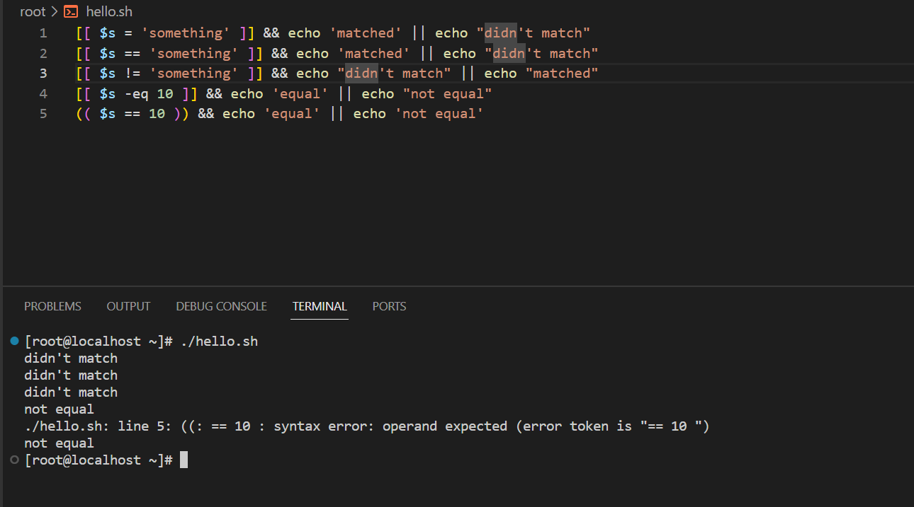


- Kiểm tra một lớp lót và thoát 
```
command && echo 'exited with 0' || echo 'not 0 exit'
cmd && cmd1 && echo 'previous cmds thành công' || echo 'thất bại'
cmd || cmd1 #if cmd fails try cmd1
```
**22.5 So sánh tệp**
```
if [[ $file1 -ef $file2 ]]; then
echo "$file1 and $file2 giống nhau"
fi
```
- Tệp giống nhau có nghĩa là việc sửa đổi trong tệp sẽ ảnh hưởng đến tệp còn lại .
- Vidu về so sánh 2 tệp:
```
#! /bin/bash
read -p "nhập tên tệp đầu: " file1
read -p "nhập tên tệp hai: " file2
# kiểm tra sự tồn tại 
if [[ ! -f $file1 ]]; then
    echo "$file1 không tồn tại"
    exit 1
fi
if [[ ! -f $file2 ]]; then
    echo "$file2 không tồn tại"
    exit 1
fi
if cmp -s "$file1" "$file2"; then
    echo "hai file giống nhau"
else
    echo "hai file khác nhau"
fi
```

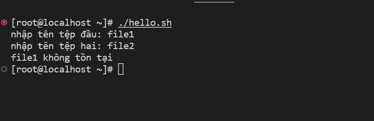


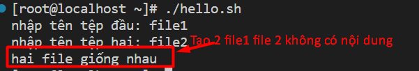


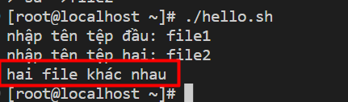


**22.6 Kiểm tra quyền truy cập tệp**

```
#!/bin/bash
echo "Nhập đường dẫn đến tệp: "
read filepath

# kiểm tra xem có tồn tại hay không
if [ ! -f "$filepath" ]; then
    echo "Tệp không tồn tại"
    exit 1
fi
# kiểm tra quyền truy cập tập 
if [-r "$filepath" ]; then
    echo " Bạn có quyền đọc "
fi
if [-w "$filepath" ]; then
    echo " Bạn có quyền ghi "
fi
if [-x "$filepath" ]; then
    echo " Bạn có quyền thực thi "
fi
```
**22.7: Numerical comparisons - So sánh số**
- Có sáu toán tử số:

`-eq` bằng
`-ne` không bằng
`-le `ít hơn hoặc bằng
`-lt` ít hơn
`-ge` lớn hơn hoặc bằng
`-gt` lớn hơn

vidu : 
```
#!/bin/bash
# nhập vào hai số 
echo " Nhập số thứ nhất: "
read num1
echo "Nhập số thứ 2: "
read num2

# kiểm tra lớn hơn
if [ $num1 -gt $num2]
then
    echo "$num1 lớn hơn $num2"
# nếu không hai số bằng nhau
elif [ $num2 -gt $num1 ]
then
    echo "$num1 bé hơn $num2"
else
    echo "hai số bằng nhau"
fi
```

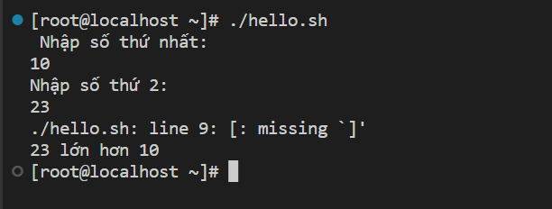


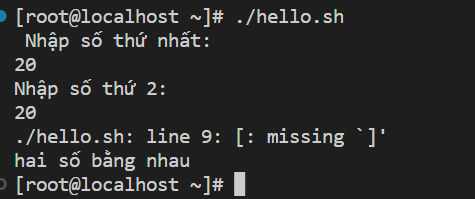


### 23 Scripting với tham số
**23.1Phân tích cú pháp nhiều tham số**
- Để phân tích các thông số cách ưu thích để làm điều này là sử dụng một vòng lặp một trường hợp tuyên bố và sự thay đổi
```
#! /bin/bash
# Tải các thông số do người dùng xác định
while [[ $# > 0 ]]
do
        case "$1" in
                -a|--valueA)
                        valA="$2"
                        shift
                        ;;
                -b|--valueB)
                        valB="$2"
                        shift
                        ;;
                --help|*)
                        echo "Usage:"
                        echo " --valueA \"value\""
                        echo " --valueB \"value\""
                        echo " --help"
                        exit 1
                        ;;
        esac
        shift
done


echo "A: $valA"
echo "B: $valB"
```

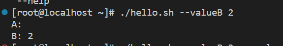


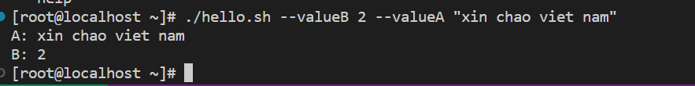


**23.2 Phân tích cú pháp đối số bằng vòng lặp for**
vd :
```
#!/bin/bash

# Vòng lặp for duyệt qua các đối số truyền vào
for arg in "$@"; do
    case $arg in
        -h|--help)
            # Nếu có tùy chọn -h hoặc --help, in ra thông tin sử dụng và thoát chương trình
            echo "Sử dụng: ./script.sh [-h] [-f file] [-d directory]"
            exit 0
            ;;
        -f|--file)
            # Lấy giá trị của đối số tiếp theo và in ra thông báo đã chọn tập tin
            file="$2"
            echo "Đã chọn tập tin: $file"
            shift # Bỏ qua đối số tiếp theo trong vòng lặp
            ;;
        -d|--directory)
            # Lấy giá trị của đối số tiếp theo và in ra thông báo đã chọn thư mục
            dir="$2"
            echo "Đã chọn thư mục: $dir"
            shift # Bỏ qua đối số tiếp theo trong vòng lặp
            ;;
        *)
            # Xử lý đối số không hợp lệ và in ra thông báo lỗi
            echo "Đối số không hợp lệ: $arg"
            exit 1
            ;;
    esac
done
```

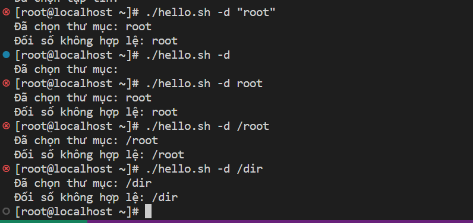


**23.2 Tập lệnh gói**
Tập lệnh gói là một tập lệnh bao bọc một tập lệnh hoặc lệnh khác để cung cấp các chức năng bổ sung hoặc chỉ để thực hiện một cái gì đó ít tẻ nhạt hơn.
```#!/bin/sh
exec grep -E "$@"
```
**23.2 Truy cập các tham số**
- Khi thực hiện một tập lệnh Bash ,các tham số truyền vào được tập lệnh đặt tên cho phù hợp với vị trí của chúng :`$1` là tên tham số 1 , `$2` là tên tham số 2
- Nhận tất cả các thông số

`$@ `và `$*` là các cách tương tác với tất cả các tham số tập lệnh. Tham khảo trang người đàn ông Bash, chúng ta thấy rằng:

`$*` : Mở rộng đến các tham số vị trí, bắt đầu từ một. Khi mở rộng xảy ra trong phạm vi képdấu ngoặc kép, nó mở rộng thành một từ duy nhất với giá trị của mỗi tham số được phân tách bằng ký tự đầu tiên củaBiến đặc biệt IFS.

`$@ `: Mở rộng đến các tham số vị trí, bắt đầu từ một. Khi mở rộng xảy ra trong phạm vi kép dấu ngoặc kép, mỗi tham số mở rộng thành một từ riêng biệt.

Vidu cụ thể
```
#!/bin/bash
echo "First argument: $1"
echo "Second argument: $2"
echo "All arguments: $@"
```

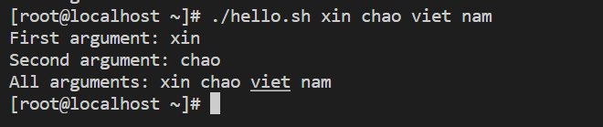


### 24 Sự thay thế lịch sử bash
**24.1 Tham khảo nhanh**
- Tương tác với lịch sử
```
Liệt kê tất cả các lệnh chạy trước đó
history
#Xóa lịch sử 
history -c
```
ví dụ cụ thể 
```
#! /bin/bash
commands=("ls" "cd" "pwd" "mv" "cp")
echo "các lệnh cơ bản"
for commands in "${commands[@]}"
do
    echo ""
    echo "$commands:" 
    man $command | grep -A1 DESCRIPTION | tail -n1
done
```

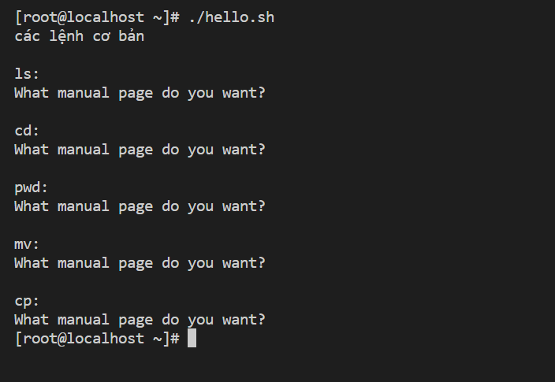


**24.2Lặp lại lệnh trước với sudo**
```
$ apt-get install r-base
E: Could not open lock file /var/lib/dpkg/lock - open (13: Permission denied)
E: Unable to lock the administration directory (/var/lib/dpkg/), are you root?
$ sudo !!
sudo apt-get install r-base
[sudo] password for <user>:
```
**24.3Tìm kiếm trong lịch sử lệnh theo mẫu**
- Nhấn `control r` và nhập một mẫu.
- Ví dụ: nếu gần đây bạn đã thực thi crontab man 7 , bạn có thể tìm thấy nó nhanh chóng bằng cách bắt đầu nhập "crontab". Các lời nhắc sẽ thay đổi như thế này
`(reverse-i-search)`cr': man 7 crontab`


### 25 Toán được sử dụng
**25.1 Toán sử dụng được**
- Để in một phần tử đầu ngăn xếp sử dụng lệnh p

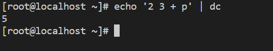


Hoặc

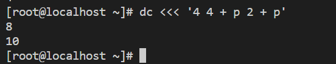


Đối với số âm use _ prefix
```
dc <<< '_1 p'
-1
```
- Sử dụng các chữ viết hoa từ A- F cho các số từ 10 -15  và `. `như một dấu thập phân

**25.2 Toán tử được sử dụng khả năng bash**
- Phép nhân 
`echo $((10*21))`

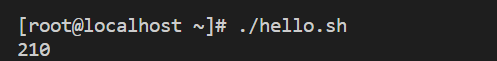


- Phép chia 
`echo $((21\10))`

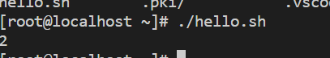


- Luỹ thừa:
`echo $((5 ** 2))`
### 26: Bash Arithmetic
**26.1 Số học đơn giản với (())**
```
# Using variables
#!/bin/bash
var1=22
var2=5
((output=$var1 * $var2))
printf "%d\n" "$output"
```

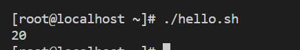


**26.2 Lệnh số học**
- let 
```
let num = 1 + 2 #wrong
let 'num = 1 + 2' #right
let a[1] = 1 + 1 #wrong
let 'a[1] = 1 + 1' #right
```
- (())
Vidu 
```
#!/bin/bash

x=5
y=10

if (( $x < $y )); then 
  echo "$x is less than $y"
fi
```
output

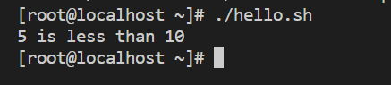


### 27 Scoping
**27.1 Phạm vi hoạt động**
```
#!/bin/bash

function outer_function {
    local my_var="outer value"
    inner_function
}

function inner_function {
    echo "Biến chứa: $my_var" 
}

my_var="global value"
outer_function
```
- Có 2 hàm `outer_function` và` inner_function`. Hàm `outer_function` khai báo biến `my_var` và gọi hàm `inner_function`. Nếu biến `my_var` không được tìm thấy trong phạm vi cục bộ của hàm` inner_function,` Bash sẽ tiếp tục tìm kiếm biến ở trên cùng của stack (dynamic scope). Vì vậy, biến `my_var` được định nghĩa trong `outer_function` sẽ được sử dụng bởi `inner_function.`
### 28 Process substitution - Thay thế quy trình
**28.1: Compare two files from the web - So sánh hai tệp từ web**
`diff <(curl http://www.example.com/page1) <(curl http://www.example.com/page2)`
**28.2 Concatenating files - Nối các tệp**
- Không thể sử dụng cùng một tệp cho đầu vào và đầu ra trong cùng một lệnh
- Có thể nghĩ rằng để tránh điều này bằng cách thay thế quy trình ,tức là lệnh
` cat header.txt <(cat body.txt) > body.txt`
để đọc nội dung của hai tệp tin là "header.txt" và "body.txt", sau đó ghi chúng vào tệp "body.txt". Cụ thể, nó thêm nội dung của tệp "header.txt" vào đầu của tệp "body.txt", tạo ra một tệp mới chứa nội dung toàn bộ.

**28.3  Truyền một tệp qua nhiều chương trình tại Một lần**
- Điều này đếm số dòng trong một tệp lớn bằng wc -l trong khi nén đồng thời bằng gzip . Cả hai đều chạy kiêm nhiệm.
`tee >(wc -l >&2) < bigfile | gzip > bigfile.gz`

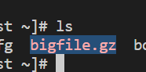


**28.4 paste command**
`paste <( ls /path/to/directory1 ) <( ls /path/to/directory2 )`
**28.5 Để tránh sử dụng sub-shell**
Một khía cạnh chính của thay thế quy trình là có cho phép chúng ta trính sủ dụng sub-shell khi đặt các lệnh từ trình bao.
` find . -maxdepth 1 -type f -print`

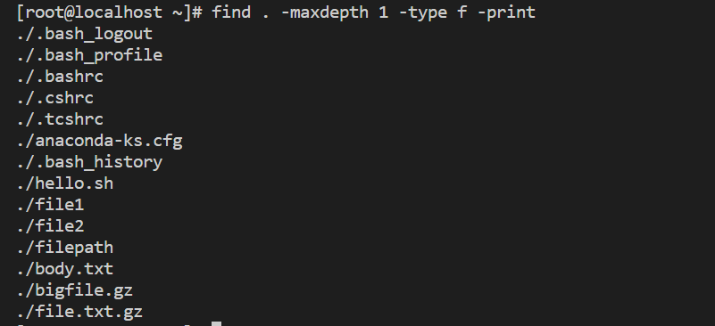


 được sử dụng để tìm kiếm tất cả các tệp tin trong thư mục hiện tại (".") và không đi vào các thư mục con (-maxdepth 1) và chỉ liệt kê các tệp tin (-type f). Kết quả được trả về là danh sách các tên tệp tin được in ra trên một dòng riêng biệt.


 ### 29 Hoàn thành lập trình
**29.1 Hoàn thành đơn giản bằng cách chức năng (Simple completion using function)**
```
_mycompletion() {
    local command_name="$1" #không được sử dụng trong ví dụ này
    local current_word="$2"
    local previous_word="$3" #không được sử dụng trong ví dụ này
    # COMPREPLY là một mảng phải được lấp đầy bởi các phần hoàn chỉnh có thể có
    # compgen được sử dụng để lọc các kết quả phù hợp
    COMPREPLY=( $(compgen -W 'hello world' -- "$current_word") )
}
complete -F _mycompletion mycommand
```
Ví dụ sử dụng:
```
$ mycommand [TAB][TAB]
hello world
$ mycommand h[TAB][TAB]
$ mycommand hello
```
### 30: Customizing PS1
**30.1: Colorize and customize terminal prompt - Tô màu và tùy chỉnh lời nhắc đầu cuối**
