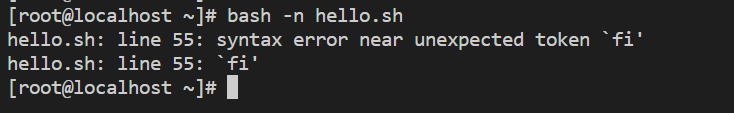
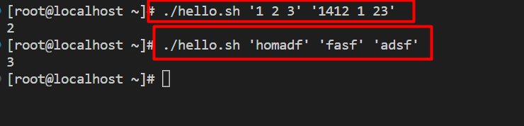
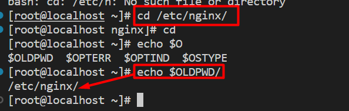
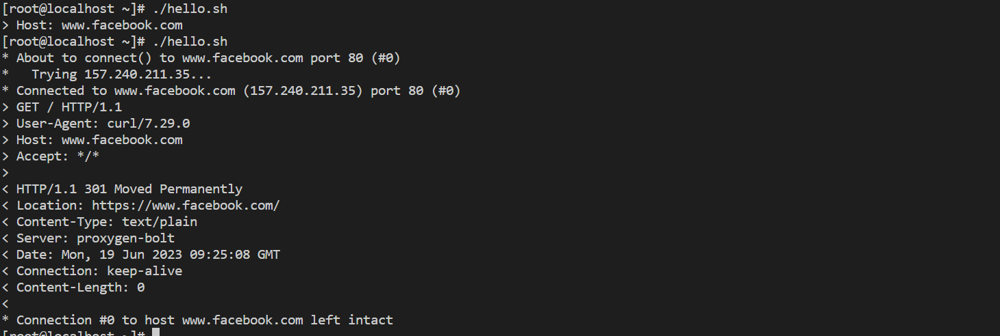
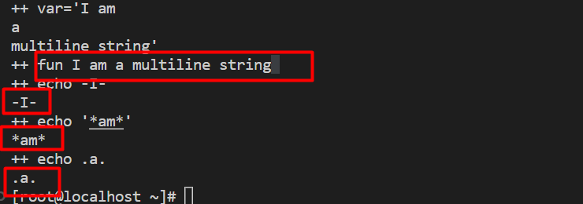
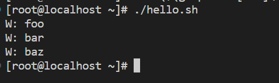

## Chaper 31 -> 
### 31.Brace Expansion
**31.1 Sửa đổi phần tệp mở rộng**
- Sử dụng câu lệnh mv và thêm đuôi .{jar,zip}
` mv filename.{jar,zip}`
=> Chuyển thành filename.jar hoặc filename.zip
**31.2 Tạo thư mục để nhóm tệp theo tháng năm**
`mkdir 20{09..11}-{01..12}`
**31.3 Tạo bản sao lưu các tệp cấu hình dotfiles**
`cp .vimrc{,.bak}`
**31.4 Sử dụng mở rộng dấu ngoặc nhọn để tạo ra danh sách**

- Bash có thể dễ dàng tạo danh sách từ các ký tự và chữ số 

``` 
# Danh sách từ a-z
echo {a..z}
a b c d e f g h i j k l m n o p q r s t u v w x y z

# Đảo ngược lại từ z-a
 echo {z..a}
z y x w v u t s r q p o n m l k j i h g f e d c b a

# Chữ số 
echo {1..12}
1 2 3 4 5 6 7 8 9 10 11 12

# Kết hợp nhiều dấu ngoặc nhọn
echo {a..d}{5..9}
a5 a6 a7 a8 a9 b5 b6 b7 b8 b9 c5 c6 c7 c8 c9 d5 d6 d7 d8 d9
```
### Chapter 32: getopts : smart positionalparameter parsing
**32.1 pingnmap**
- Thông số : `optstring`
`getopts` : Trong scrip lấy các tùy chọn và đối số của chúng ta từ danh sách các tham số tuân theo cú pháp tùy chọn . Thông thường sử dụng `getopts` để phân tích các đối số truyền vào cho chúng

- Tạo 1 file scrip với nội dung như sau 

```
#!/bin/bash
# Tên tập lệnh: pingnmap
# Tình huống: Quản trị viên hệ thống trong công ty X cảm thấy mệt mỏi với công việc đơn điệu# ping và nmapping, vì vậy anh ấy quyết định đơn giản hóa công việc bằng cách sử dụng script.
# Nhiệm vụ anh ấy muốn đạt được là
# 1. Ping - với số lượng tối đa là 5 - địa chỉ IP / miền đã cho. VÀ / HOẶC
# 2. Kiểm tra xem một cổng cụ thể có đang mở với một miền / địa chỉ IP nhất định hay không.
# Và getopts là để giải cứu cô ấy.
# Tổng quan ngắn gọn về các tùy chọn
# n: dành cho nmap
# t: có nghĩa là ping
# i: Tùy chọn để nhập địa chỉ IP
# p: Tùy chọn vào cổng
# v: Tùy chọn để tải phiên bản script

while getopts ':nti:p:v' opt
#putting: trong beginnnig loại bỏ các lỗi đối với các tùy chọn không hợp lệ
do
case "$opt" in
    'i')ip="${OPTARG}"
        ;;
    'p')port="${OPTARG}"
        ;;
    'n')nmap_yes=1;
        ;;
    't')ping_yes=1;
        ;;
    'v')echo "pingnmap version 1.0.0"
        ;;
    *) echo "Invalid option $opt"
        echo "Usage : "
        echo "pingmap -[n|t[i|p]|v]"
        ;;
esac
done
if [ ! -z "$nmap_yes" ] && [ "$nmap_yes" -eq "1" ]
then
    if [ ! -z "$ip" ] && [ ! -z "$port" ]
    then
        nmap -p "$port" "$ip"
    fi
fi

if [ ! -z "$ping_yes" ] && [ "$ping_yes" -eq "1" ]
then
    if [ ! -z "$ip" ]
    then
        ping -c 5 "$ip"
    fi
fi
shift $(( OPTIND - 1 )) # Xử lý các đối số bổ sung
if [ ! -z "$@" ]
then
    echo "Bogus arguments at the end : $@"
fi
```

**output**

```
./hello.sh -nt -i facebook.com  -p 80
./hello.sh: line 39: nmap: command not found
PING facebook.com (157.240.211.35) 56(84) bytes of data.
64 bytes from edge-star-mini-shv-02-hkg4.facebook.com (157.240.211.35): icmp_seq=1 ttl=57 time=22.2 ms
64 bytes from edge-star-mini-shv-02-hkg4.facebook.com (157.240.211.35): icmp_seq=2 ttl=57 time=22.2 ms
64 bytes from edge-star-mini-shv-02-hkg4.facebook.com (157.240.211.35): icmp_seq=3 ttl=57 time=22.4 ms
64 bytes from edge-star-mini-shv-02-hkg4.facebook.com (157.240.211.35): icmp_seq=4 ttl=57 time=22.2 ms
64 bytes from edge-star-mini-shv-02-hkg4.facebook.com (157.240.211.35): icmp_seq=5 ttl=57 time=22.2 ms

--- facebook.com ping statistics ---
5 packets transmitted, 5 received, 0% packet loss, time 4004ms
rtt min/avg/max/mdev = 22.269/22.301/22.401/0.142 ms

./hello.sh -v
pingnmap version 1.0.0
```
### Chapter 33: Debugging

**33.1 Kiểm tra cú pháp của tập lệnh với tham số "-n"**



**33.2Debugging a bash script with "-x" - Gỡ lỗi tập lệnh bash với "-x"**
- Sử dụng `-x `để kích hoạt debug của các dòng lệnh được thực thi. Nó có thể chạy trên toàn bộ phiên hoặc tệp lệnh, hoặc được bật theo chương trình trong một tập lệnh
```
 bash -x myscript.sh
hoặc
bash --debug myscript.sh
```
### Chapter 36: Internal variables(Tóm tắt các biến nội bộ)
**36.1 Tóm tắt các biến nội bộ**
| Biến đổi       | Thông tin chi tiết                                                                                                                                                                                                                                                                          |
| -------------- | ------------------------------------------------------------------------------------------------------------------------------------------------------------------------------------------------------------------------------------------------------------------------------------------- |
|                | Tham số vị trí của hàm / tập lệnh (đối số). Mở rộng như sau:                                                                                                                                                                                                                                |
| `$* / $@`      | `$*` và `$@` giống như `$1` `$2` ... (lưu ý rằng nói chung không có ý nghĩa gì khi bỏ không được trích dẫn) "`$*`" giống với "`$1 $2 ...`" 1  "`$@`" giống với "`$1`" "`$2`" ...1. Các đối số được phân tách bằng ký tự đầu tiên của $IFS, ký tự này không nhất thiết phải là khoảng trắng. |
| $#             | Số lượng tham số vị trí được truyền cho tập lệnh hoặc hàm                                                                                                                                                                                                                                   |
| $!             | ID quy trình của lệnh cuối cùng (gần nhất cho đường ống) trong công việc gần đây nhất được đưa vàonền (lưu ý rằng nó không nhất thiết phải giống với ID nhóm quy trình của công việc khi kiểm soát công việcđược kích hoạt)                                                                 |
| $$             | ID của quá trình đã thực thi bash                                                                                                                                                                                                                                                           |
| $?             | Trạng thái thoát của lệnh cuối cùng                                                                                                                                                                                                                                                         |
| $n             | Tham số vị trí, trong đó n = 1, 2, 3, ..., 9                                                                                                                                                                                                                                                |
| ${n}           | Tham số vị trí (tương tự như trên), nhưng n có thể> 9                                                                                                                                                                                                                                       |
| $0             | Trong tập lệnh, đường dẫn mà tập lệnh được gọi; với bash -c 'printf "% s \ n" "$ 0"' tênargs ' : tên (đối số đầu tiên sau khi kịch bản nội tuyến), nếu không, argv [ 0 ] mà bash nhận.                                                                                                      |
| $_             | Trường cuối cùng của lệnh cuối cùng                                                                                                                                                                                                                                                         |
| $IFS           | Dấu tách trường nội bộ                                                                                                                                                                                                                                                                      |
| $PATH          | Biến môi trường PATH được sử dụng để tra cứu các tệp thực thi                                                                                                                                                                                                                               |
| $OLDPWD        | Thư mục làm việc trước đó                                                                                                                                                                                                                                                                   |
| $PWD           | Trình bày thư mục làm việc                                                                                                                                                                                                                                                                  |
| $FUNCNAME      | Mảng tên hàm trong ngăn xếp lệnh gọi thực thi                                                                                                                                                                                                                                               |
| $BASH_SOURCE   | Mảng chứa đường dẫn nguồn cho các phần tử trong mảng FUNCNAME . Có thể được sử dụng để lấy đường dẫn script.                                                                                                                                                                                |
| $BASH_ALIASES  | Mảng liên kết chứa tất cả các bí danh hiện được xác định                                                                                                                                                                                                                                    |
| $BASH_REMATCH  | Chuỗi kết quả phù hợp từ trận đấu regex gần đây nhất                                                                                                                                                                                                                                        |
| $BASH_VERSION  | Chuỗi phiên bản bash                                                                                                                                                                                                                                                                        |
| $BASH_VERSINFO | Một mảng gồm 6 phần tử với thông tin phiên bản Bash                                                                                                                                                                                                                                         |
| $BASH          | Absolute đường dẫn đến hiện đang thực hiện Bash shell bản thân (heuristically xác định bởi bash dựatrên argv [ 0 ] và giá trị của $PATH ; có thể sai trong các trường hợp góc)                                                                                                              |
| $BASH_SUBSHELL | Cấp độ gói phụ Bash                                                                                                                                                                                                                                                                         |
| $UIDID         | người dùng thực (không hiệu quả nếu khác) của quá trình chạy bash                                                                                                                                                                                                                           |
| $PS1           | Dấu nhắc dòng lệnh chính; xem Sử dụng các biến PS *                                                                                                                                                                                                                                         |
| $PS2           | Lời nhắc dòng lệnh phụ (được sử dụng cho đầu vào bổ sung)                                                                                                                                                                                                                                   |
| $PS3           | Lời nhắc dòng lệnh cấp ba (được sử dụng trong vòng lặp chọn)                                                                                                                                                                                                                                |
| $PS4           | Dấu nhắc dòng lệnh bậc bốn (được sử dụng để nối thông tin với đầu ra dài dòng)                                                                                                                                                                                                              |
| $RANDOM        | Một số nguyên ngẫu nhiên giả từ 0 đến 32767                                                                                                                                                                                                                                                 |
| $REPLY         | Biến được sử dụng theo cách đọc theo mặc định khi không có biến nào được chỉ định. Cũng được sử dụng bởi SELECT để trả vềgiá trị do người dùng cung cấp                                                                                                                                     |
| $PIPESTATUS    | Biến mảng giữ các giá trị trạng thái thoát của mỗi lệnh trong lần thực thi gần đây nhấtđường ống dẫn trước.                                                                                                                                                                                 |


**36.2$@**

`"$@"` mở rộng thành tất cả các đối số trong dòng lệnh dưới dạng từ riêng biệt. Nó khác với `"$*"`, mở rộng thành tất cả các đối số dưới dạng một từ duy nhất. `"$@" `Đặc biệt hữu ích để lặp qua các đối số và xử lý các đối số có dấu cách.
- Thực hiện tạo file script để thấy được sự khác biệt
- Nội dung file script `$*`:
```
#!/bin/bash 
for var in $*; do # same for var in $@; do
    echo $var
done

echo 
echo "-$1--$2"
echo $3
echo $
```
Output: ` $*`
```
./hello.sh ' 1 2 ' ' 3  4 '
1
2
3
4

- 1 2 -- 3  4 
```
- Nội dung file script `$@`:
```
#!/bin/bash 
for var in "$@"; do 
    echo "<$var>"
done

echo 
echo "-$1--$2"
echo $3
echo $*.
```
output:
```
./hello.sh ' 1 2 ' ' 3  4 '
< 1 2 >
< 3  4 >

- 1 2 -- 3  4 

1 2 3 4
```
Do đó bảo tồn cả khoảng cách bên trong các đối số và sự tách biệt đối số. Lưu ý rằng cáu trúc cho var trong  `for` `var` `in` `"$@"`; `do` ... rất phổ biến và trở thành mặc định cho vòng lặp for và có thể rút gọn thành  for var; do ....

**36.3: $#**
- Để nhận số lượng đối số đã nhập vào dòng lệnh hoặc tham số vị trí
```
#!/bin/bash
echo "$#"
```
Khi chạy với hai,ba đối số, ví dụ trên sẽ cho kết quả là:


**36.4: $HISTSIZE**
Số lệnh được nhớ tối đa:
```
echo $HISTSIZE
1000
```

**36.5 $FUNCNAME**
- Để lấy tên của hàm hiện tại 

```
#!/bin/bash
test_function(){
    echo " tên hàm là $FUNCNAME"

}
test_function

home_function(){
    echo "_______test___function___ $FUNCNAME"
}
home_function
```

ouput: 
```
./hello.sh 
 tên hàm là test_function
_______test___function___ home_function
```
**36.6 $HOME**
- Thư mục chính của người dùng
```
[root@localhost ~]# echo $HOME
/root
```
**36.7 $IFS**
- Chứa chuỗi phân cách trường nội bộ mà bash sử dụng để chia chuỗi khi lặp lại , giá trị mặc định là màu trắng ký tự khoảng trắng : \n(dòng mới),\t(tab) và dấu cách

```
IFS=","
INPUTSTR="v,a,c,y"
for field in ${INPUTSTR}; do
    echo $field
    done   
```
output:
```
./hello.sh 
v
a
c
y
```
**36.8: $OLDPWD**
- OLDPWD chứa thư mục trước lệnh cd cuối cùng :



**36.9: $PWD**
- PWD(PrintWorkingDirectory) Thư mục làm việc hiện tại mà đang làm việc
`echo $PWD`
hoặc sử dụng `pwd` 

**36.10 $1 $2 $3 etc..**
- Các tham số vị trí được truyền với tập lệnh từ dòng lệnh tới một hàm 

```
#!/bin/bash
# $n là tham số vị trí thứ n
echo "$1"
echo "$2"
echo "$3"
```

output : 
```
./hello.sh xin chao viet 
xin
chao
viet
```

**36.11: $**
- Sẽ trả về tất cả tham số trong một chuỗi duy nhất 
```
#!/bin/bash
echo "$*"
```

output:
```
./hello.sh xin chao "viet nam"
xin chao viet nam
```
**36.12: $!**
Process IP(PID) của jobs cuối cùng chạy nền
```
 ls &
[1] 61309
[root@localhost ~]# 20{01}{09}  anaconda-ks.cfg  filename  hello.sh

[1]+  Done                    ls --color=auto
[root@localhost ~]# echo $!
61309
```

**36.14 $$**

- ID của quy trình hiện tại đang làm việc 
```
echo $$
58478
```
**36.15 $RANDOM** 
- Mỗi khi sử dụng biến này , một số ngẫu nhiên từ 0 --> 32767 sẽ được tạo ra
```
root@localhost ~]# echo $RANDOM 
16131
[root@localhost ~]# echo $RANDOM 
3002
[root@localhost ~]# echo $RANDOM 
5126
[root@localhost ~]# echo $RANDOM 
19351
```
**36.16 $BASHPID**
- ID quy trình (pid) của phiên bản bash hiện tại . Điều này không giống với biến $$ , nhưng thường cung cấp kq giống nhau 
```
echo "\$\$ pid = $$ BASHPID = $BASHPID"
$$ pid = 58478 BASHPID = 58478
```
**36.17 BASH_ENV**
- BASH_ENV là một biến môi trường trong bash shell . Khi thực hiện một script bash nếu biến này được đặt và trỏ đến một tập tin chứa các lệnh cần thiết , các lệnh này sẽ thực hiện trước khi script thực thi

**36.18: $BASH_VERSINFO**
- Một mảng chứa thông tin phiên bản đầy đủ của bash hiện đang sử dụng , Biến này là một mảng gồm 6 phần tử.

```
for ((i=0; i<=5; i++)); do echo "BASH_VERSINFO[$i] = ${BASH_VERSINFO[$i]}"; done
BASH_VERSINFO[0] = 4
BASH_VERSINFO[1] = 2
BASH_VERSINFO[2] = 46
BASH_VERSINFO[3] = 2
BASH_VERSINFO[4] = release
BASH_VERSINFO[5] = x86_64-redhat-linux-gnu
```

**36.19: $BASH_VERSION**
```
echo $BASH_VERSION 
4.2.46(2)-release
```

**36.20 Tên máy chủ được gán cho hệ thống trong quá trình khởi động**
 ```
 echo $HOSTNAME 
localhost.localdomain
```
**36.21: $HOSTTYPE**
- Biến này xác định phần cứng , Có thể hữu ích trong việc xác định mã nhị phân thực thi
```
echo $HOSTTPYE
x86_64
```

**36.21: $MACHTYPE**
- Tương tự như HOSTTYPE cũng bao gồm thông tin về phần cứng
```
# echo $MACHTYPE 
x86_64-redhat-linux-gnu
```
**36.22: $PATH**
- Đường dẫn để tìm kiếm mã nhị phân cho các lệnh 
- Các ví dụ phổ biến bao gồm /usr/bin và /usr/local/bin
- Các thư mục trong $PATH được phân tách bởi dấu hai chấm:
```
echo $PATH 
/root/.vscode-server/bin/695af097c7bd098fbf017ce3ac85e09bbc5dda06/bin/remote-cli:/usr/local/sbin:/usr/local/bin:/usr/sbin:/usr/bin:/root/bin
```
**36.23: $PPID**
- Process ID của script gọi ra tập lệnh hoặc trình bao hiện tại

```
echo $PPID 
58407
```

**36.24: $SHELLOPTS**
- Một danh sách chỉ đọc các tùy chọn cơ bản được cung cấp khi khởi động
```
 echo $SHELLOPTS 
braceexpand:emacs:hashall:histexpand:history:interactive-comments:monitor
```
**36.25: $_**
- Xuất ra trường cuối cùng từ lệnh cuối cùng được thực thi 


### 38: Case statement
**38.1  Câu lệnh trường hợp đơn giản Câu lệnh trường hợp đơn giản**
- Ở dạng đơn giản nhất được hỗ trợ bởi tất cả các phiên bản của bash , câu lệnh case thực thi trường hợp khớp với mẫu 

Vd có đoạn script sau 
```
#!/bin/bash

var=2
case $var in
1)
    echo "myanma"
    ;;
2)
    echo "Brazil"
    ;;
3)
    echo "Cat"
    ;;
esac

```
output 
`Brazil`

**38.2: Case statement with fall through - Tuyên bố tình huống với sự suy giảm**
vd 
```
#!/bin/bash

var=1
case $var in
1)
    echo "việt nam"
    ;&
2)
    echo "ấn độ"
    ;&
3)
    echo "thái lan"
    ;&
esac
esac
```

ouput :
```
việt nam
ấn độ
thái lan
```

##  40: File execution sequence - Trình tự thực thi tệp
.bash_profile , .bash_login , .bashrc và .profile đều làm khá giống nhau: thiết lập và định nghĩahàm, biến và sắp xếp.

Sự khác biệt chính là .bashrc được gọi khi mở cửa sổ không đăng nhập nhưng tương tác và.bash_profile và những cái khác được gọi cho một trình bao đăng nhập. Nhiều người có .bash_profile hoặc cách gọi tương tự.bashrc dù sao.

**40.1: .profile so với .bash_profile (và .bash_login)**
.profile được đọc bởi hầu hết các shell khi khởi động, bao gồm cả bash. Tuy nhiên, .bash_profile được sử dụng cho các cấu hìnhcụ thể cho bash. Đối với mã khởi tạo chung, hãy đặt nó trong tệp .profile . Nếu nó dành riêng cho bash, hãy sử dụng .bash_profile .

.profile không thực sự được thiết kế dành riêng cho bash, thay vào đó , .bash_profile . ( .profile dành cho Bourne vàcác shell tương tự khác, dựa trên bash) Bash sẽ trở lại .profile nếu không tìm thấy .bash_profile .

.bash_login là một dự phòng cho .bash_profile , nếu nó không được tìm thấy. Nói chung tốt nhất nên sử dụng .bash_profile hoặc .profile thay thế

## Chapter 41: Splitting Files - Tách tập tin
**41.1 Tách tập tin**
- Chạy lệnh tách mà không có bất kỳ tùy chọn nào sẽ chia 1 tệp thành nhiều tệp riêng biệt có chứa tối đa 1000 dòng
`split file`
- Thao tác này sẽ tạo các tệp có tên là xaa,xab,vv
- Để thay đổi tiền tố thêm tiền tố muốn thay đổi vào cuối dòng lệnh

`split file customprefix`
- Bây giờ các tệp có tên là customprefixaa , customprefixab , customprefixac , v.v. sẽ được tạo

### Chapter 42: File Transfer using scp - Truyền tệp bằng scp
**42.1: scp chuyển tệp - scp transferring file**
Để chuyển tệp một cách an toàn sang máy khác - hãy nhập:
`scp file1.txt test@server2:$HOME`

- vd trên chuyển file1.txt từ máy chủ sang đến thư mục home của user test của server2

**42.2: scp chuyển nhiều tệp - scp transferring multiple files**

- scp cũng có thể sử dụng để chuyển nhiều tệp từ máy chủ này sang máy chủ khác 
vd
`scp /my_folder/*.txt test@server2:$HOME`
- Tất cả các tệp sẽ được chuyển đến người dùng test thư mục home.
**42.3: Tải xuống tệp bằng scp - Downloading file using scp**
Để tải tệp từ máy chủ từ xa xuống máy cục bộ - hãy nhập:

`scp test@server2:$HOME/file.txt /local/machine/path/`

## Chapter 43: Pipelines - Đường ống
**43.1: Sử dụng |& - Using |&**
- |& kết nối đầu ra tiêu chuẩn và lỗi tiêu chuẩn của lệnh đầu tiên với lệnh thứ 2 trong khi | chỉ kết nối đầu ra tiêu chuẩn của lệnh đầu tiên đến lệnh thứ 2    
- Trong ví dụ này, trang được tải xuống qua curl . với tùy chọn -v curl viết một số thông tin trên stderr bao gồm,trang tải xuống được viết trên stdout . Tiêu đề của trang có thể được tìm thấy giữa <title> và </title> .

```
curl -vs 'http://www.facebook.com/' |& awk '/Host:/{print}
/<title>/{match($0,/<title>(.*)<\/title>/,a);print a[1]}'
```

output: 
```
Host: www.facebook.com
Facebook
```
- Còn đối với `|` thông tin sẽ được gửi đến stderr vì chỉ stdout được chuyển đến lệnh tiếp theo , trong vd trên tất cả dòng ngoại trừ dòng cuối cùng facebook đã được gửi đên stderr theo url

vd 
```
curl -vs 'http://www.facebook.com/' | awk '/Host:/{print}
\/<title>/{match($0,/<title>(.*)<\/title>/,a);print a[1]}'
```

output: 




**43.2: Hiển thị tất cả các quy trình được phân trang - Show all processes paginated**
`ps -e | less`
- Hiển thị tất cả các quá trình , đầu ra của nó được kết nối với đầu vào nhiều hơn thông qua `|` ,less phân trang kết quả hơn

## Chapter 45: Word splitting - Tách từ
**45.1: Cái gì, khi nào và tại sao? - What, when and Why?**
- Khi shell thực hiện mở rộng tham số ,thay thế lệnh ,mở rộng biến hoặc số học nó sẽ quét các ranh giới từ trong kết quả , nếu tìm thấy bất kỳ danh giới nào thì kết quả được chia thành nhiều từ tại vị trí đó .Giá trị mặc định cho IFSlà dấu cách, tab và dòng mới, tức là việc tách từ sẽ xảy ra trên ba ký tự khoảng trắng này nếu không được ngăn chặnmột cách rõ ràng.
Sử dụng câu lệnh `set` để dặt hoặc bỏ đặt các giá trị của các tùy chọn shell và tham số vị trí. Bạn có thể thay đổi giá trị của các thuộc tính shell và tham số vị hoặc hiển thị tren và giá trị của các biến shell bằng lệnh `set`

vidu 
```
set -x
var='I am
a
multiline string'
fun() {
 echo "-$1-"
 echo "*$2*"
 echo ".$3."
}
fun $var
```

output




**45.2: Tính hữu dụng của việc tách từ

Lặp các từ được phân tách bằng dấu cách:
```
words='foo bar baz'
for w in $words;do
 echo "W: $w"
done
```
output:



**45.3 Phân tách các thay đổi vè dấu cách.**
Thực hiện thay thế đơn giản các dấu phân cách từ khoảng trắng sang dòng mới
```
arr='1 2 3 4'
[root@localhost ~]# echo $arr | tr " " "\n"
1
2
3
4
```
Nó tách giá trị và hiển thị nó từng dòng một.

**45.4 Phân tách với IFS**
- Tạo tệp hello  với nội dung

```
#!/usr/bin/env bash
printf "%d args:" $#
printf " <%s>" "$@"
echo
```
- Xem sự khác biệt
```
./hello.sh $var
4 args: <This> <is> <an> <example>
```
$var được chia thành 4 args. IFS là các ký tự khoảng trắng và do đó việc tách từ xảy ra trong khoảng trắng.
```
var="This/is/an/example"
[root@localhost ~]# ./hello.sh $var
```
Ở trên không xảy ra tách từ vì không tìm thấy ký tự IFS.

G đặt IFS 
```
 IFS=/
[root@localhost ~]# var="This/is/an/example"
[root@localhost ~]# ./hello.sh $var
4 args: <This> <is> <an> <example>
```
## Chapter 48: Chain of commands and operations - Chuỗi lệnh vàhoạt động
**48.1: Đếm tỷ lệ xuất hiện của một mẫu văn bản - Counting a text pattern ocurrence**
- Sử dụng một pipe làm đầu ra của một lệnh trở thành đầu vào của lệnh tiếp theo

`ls -1 | grep -c ".conf"`
Trong trường hợp này, đầu ra của lệnh ls được sử dụng làm đầu vào của lệnh grep. Kết quả sẽ là sốtrong số các tệp có ".conf" trong tên của chúng.
**48.2: chuyển đầu ra cmd gốc sang tệp người dùng - transfer root cmd output to user file**
Cmd tee: đọc thông tin nhập vào và viết ra kết quả vào files.
`su -c <cmd> | tee ~/results-of-cmd.txt`
