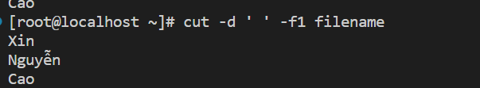
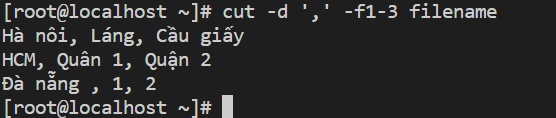

## chaper 49 -> 
### 49. Loại shell
**49.1 Bắt đầu một trình bao tương tác**
`bash`
**49.2 Phát hiện loại vỏ**
`shopt -q login_shell && echo 'login' || echo 'not-login'`
ý nghĩa câu lệnh trên là : kiểm tra xem shell có đang chạy là login shell không nếu đúng in ra login nếu sai in ra not-login

### 51: co-processes

**51.1 Hello word**
```
# tạo quy trình co
coproc bash

# gửi một lệnh đến nó (echo a)
echo 'echo Hello World' >&"${COPROC[1]}"

# đọc một dòng từ đầu ra của nó
read line <&"${COPROC[0]}"

# hiển thị dòng
echo "$line"
```
output
`hello word`

### Chapter 53: Jobs at specific times
**53.1 Thực hiện công việc một lần tại 1 thời điểm cụ thể**
- Lưu ý `at` không được cài đặt theo mặc định trên hầu hết các bản phân phối hiện tại
- Để thực hiện công việc một lần vào một thời điểm nào đó không phải lúc này . VD 11g trưa có thể sử dụng

` echo "somecommand &" | at 11am`

- Thêm nhiều định dạng thời gian hơn 
```
echo "somecommand &" | at now + 2 minutes
echo "somecommand &" | at 17:00
echo "somecommand &" | at 17:00 Jul 7
echo "somecommand &" | at 4pm 12.03.17
```
- Nếu không có năm hoặc ngày nào được đưa ra ,nó sẽ giả định thời gian tiếp theo mà bạn đã chỉ định sẽ xảy rả .Vì vậy nếu bạn cho 1 giờ ngày hôm nay đã trôi qua thì nó sẽ hiểu là ngày mai,và nếu bạn đưa ra một tháng trôi qua trong năm nay thì nó sẽ hiểu là trong năm sau

- Có một số lệnh kiểm soát các công việc hẹn giờ 
`atq`: liệt kê tất cả các công việc đã hẹn giờ 
`atrm + PID` : Loại bỏ công việc đã hẹn giờ 
**53.2  Thực hiện các công việc vào những thời điểm cụ thể lặp đi lặp lại bằng cách sử dụng systemd.timer**
`systemd` cung cấp một triển khai hiện đại của cron. Để thực thi một tập lệnh định kỳ, một dịch vụ và một tập tin hẹn giờ làcần thiết. Các tệp dịch vụ và bộ hẹn giờ phải được đặt trong /etc/systemd/{system,user}. Tệp dịch vụ:

### Global variables
- Theo mặc định mọi biến trong bash là gobal biến toàn cục đối với mọi hàm , tập lệnh và thậm chí cả bên ngoài nếu bạn đang khai báo các biến của bạn bên trong 1 lệnh
- Nếu bạn muốn biến của mình là biến cục bộ cho một hàm , bạn có thể sử dụng `local` để nó trở thành một biến mới độc lập với phạm vi toàn cục và giá trị của nó chỉ có thể truy cập được bên trong nó 

vd 
**Global variables**
```
var="hello"
function foo(){
    echo $var
}
foo
```
output
`hello`
- Hoạt động theo cách khác
```
function foo() {
    var="hello"
}
foo
echo $var
```
output :
`hello`

**Local variables**

```
function foo() {
    local var
    var="hello"
}
foo
echo $var
```

ouput
- Sẽ không hiện ra gì , vì var là một biến local của hàm foo và giá trị của nó không được nhìn thấy từ bên ngoài

**Trộn cả hai với nhau.**
```
var="hello"

function foo(){
    local var="sup?"
    echo "inside function, var=$var"
}

foo
echo "outside function, var=$var"

```
output
```
inside function, var=sup?
outside function, var=hello
```
### the cut command

| Tham số              | Chi tiết                                                                         |
| -------------------- | -------------------------------------------------------------------------------- |
| -f, --fields         | Lựa chọn dựa trên trường                                                         |
| -d, --delimiter      | Delimiter để lựa chọn dựa trên trường                                            |
| -c, --characters     | Lựa chọn dựa trên ký tự, dấu phân cách bị bỏ qua hoặc lỗi                        |
| -s, --only-delimited | Chặn dòng không có ký tự phân tách (được in dưới dạng khác)                      |
| --complement         | Đảo ngược lựa chọn (trích xuất tất cả ngoại trừ các trường / ký tự được chỉ định |
| --output-delimiter   | Chỉ định khi nào nó phải khác với dấu phân cách đầu vào                          |


**Dấu phân cách lặp lại được hiểu là trống lĩnh vực**
```
[root@localhost ~]# cut -d, -f1,3 <<<"a,b,c,d,e"
a,c
[root@localhost ~]# cut -d, -f2,4 <<<"a,b,c,d,e"
b,d
```
 **Không trích dẫn - No quoting**
 - Không có cách nào để bảo vệ dấu phân cách 
``` 
cut -d, -f3 <<<'nguyen van a",1,vietnam"'
vietnam"`
```
**Trích xuất, không thao tác**
- Có thể trích xuất các phần của dòng , không thể sắp xếp hoặc lặp lại các trường
```
cut -d, -f2,1 <<<'khoiht,na,vn'
khoiht,na
cut -d, -f2,2 <<<'khoiht,na,vn'
na
```
**Hiện cột đầu tiên của file**
Giả sủ có filename với nội dung như sau
```
Xin chao viet nam 
Nguyễn VĂN A
Cao cu C
```
- Để chỉ lấy cột đầu tiên ta sử dụng câu lệnh sau
`cut -d ' ' -f1 filename`
ouput



**Hiển thị các cột từ x đến y của một tệp**
```
Hà nôi, Láng, Cầu giấy, Long biên
HCM, Quân 1, Quận 2, Quận 3
Đà nẵng , 1, 2 ,21 ,213
```
Thực hiện lấy 3 cột đầu tiên ngăn cách nhau bằng dấu phẩy:
`cut -d ',' -f1-3 filename `

output 




 ###  Networking With Bash - Kết nối mạng với Bash
 Bash thường được sử dụng phổ biến trong việc quản lý và bảo trì các máy chủ và cụm máy chủ. Thông tin liên quanđến các lệnh điển hình được sử dụng bởi các hoạt động mạng, khi nào thì sử dụng lệnh nào cho mục đích nào vàcác ví dụ / mẫu về các ứng dụng độc đáo và / hoặc thú vị của nó nên được bao gồm
**Các lệnh kết nối mạng**
`ifconfig`
- Lệnh trên sẽ hiển thị tất cả interface 
1. Địa chỉ IP được gán cho giao diện
2. Địa chỉ MAC của giao diện
3. Địa chỉ phát sóng
4. Truyền và nhận byte
vd 
`ifconfig -a` : hiển thị tất cả các interface 
`ifconfig ehth0` : Hiển thị interface theo tên
`ifconfig ehth0 10.0.1.2 netmask 255.255.255.0` : gán ip tĩnh
`ifup ehth0` : kích hoạt interface
`ifdown ehth0` : Vô hiệu hóa 
`traceroute`Lệnh được sử dụng để khác phục sự cố để tìm ra số bước nhảy đã thực hiện để đến đích
`nslookup www.google.com` : truy vấn DNS và tìm địa chỉ  ip tương ứng
