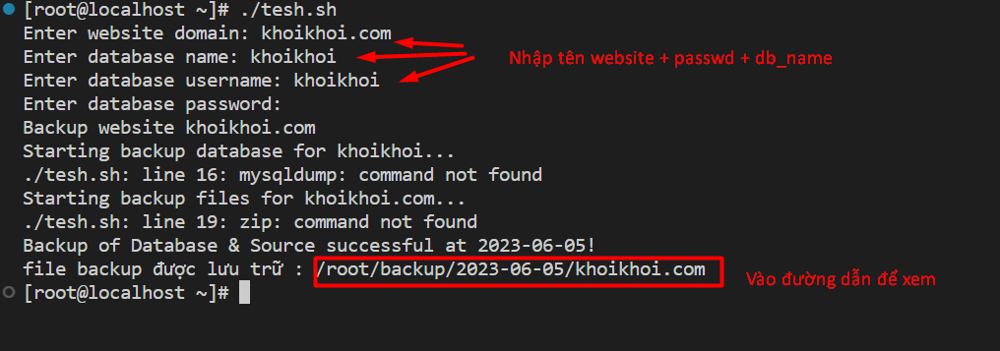
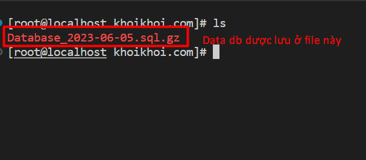

```
#!/bin/bash

read -p "Enter website domain: " website_domain
read -p "Enter database name: " db_name
read -p "Enter database username: " db_username
read -s -p "Enter database password: " db_password
echo

backup_dir="/root/backup/$(date +"%Y-%m-%d")/$website_domain"

echo "Backup website $website_domain"
mkdir -p "$backup_dir"                         ## Tạo đường dẫn chứa File Backup
mkdir -p "$backup_dir/$website_domain/"

echo "Starting backup database for $db_name..."                ## Backup Database
mysqldump --single-transaction --routines --triggers --add-drop-table --extended-insert -u "$db_username" -p"$db_password" "$db_name" | gzip -9 > "$backup_dir/$website_domain/Database_$(date +"%Y-%m-%d").sql.gz"

echo "Starting backup files for $website_domain..."                   ## Backup Source
zip -r "$backup_dir/$website_domain/Source_$(date +"%Y-%m-%d").zip" "/www/wwwroot/$website_domain/" -q
echo "Backup of Database & Source successful at $(date +"%Y-%m-%d")!"
echo "Backup files are saved at: $backup_dir"
# Tự động backup vào 4g sáng 
(crontab -l 2>/dev/null; echo "0 4 * * * /bin/bash /path/to/your/backup_script.sh \"$website_domain\" \"$db_name\" \"$db_username\" \"$db_password\"") | crontab -
```

- Trong đó 
Tên website cần Backup: `website_domain`
User Database: `db_name`
Pass: `db_password`
Tên Database:` db_username`
Đường dẫn lưu Backup: `$backup_dir/$website_domain/`
Đường dẫn website cần Backup: `/www/wwwroot/$website_domain/`
Đường dẫn lưu file backup Source + Database: `$backup_dir/$website_domain`
Tên File Backup Source: `Source.zip`
Ten File Backup Database: `Database.sql.gz`

### demo test chạy file





