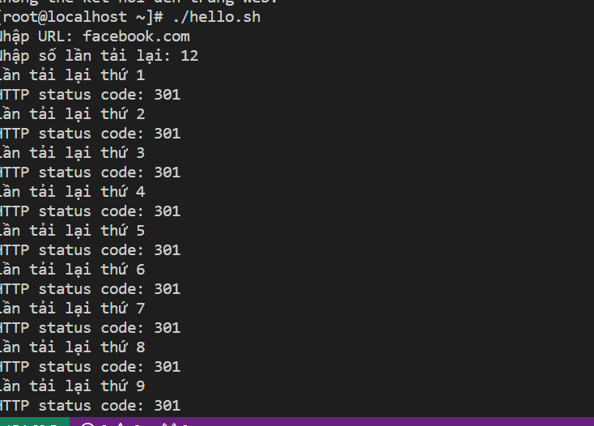
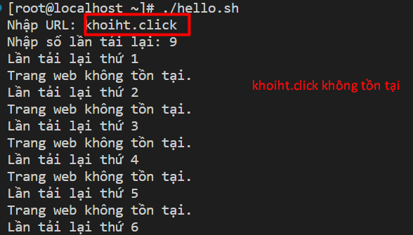
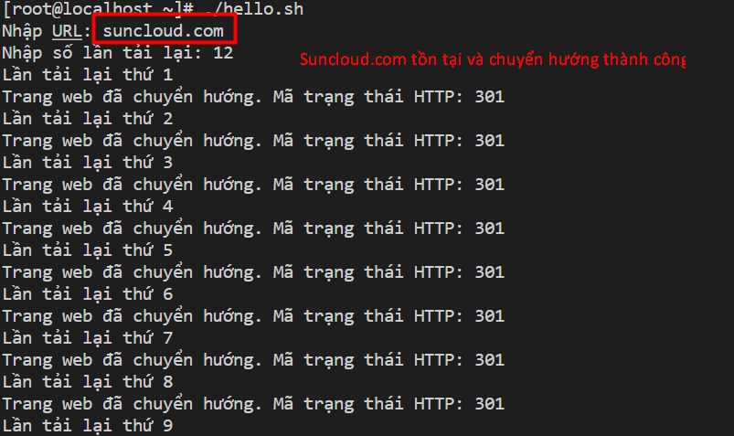

## Reload lại trang URL với số lần nhập từ bàn phím
**1. Script reload lại trang URL**
```
#!/bin/bash

# Nhập URL 
read -p "Nhập URL: " url

# Nhập số lần tải lại 
read -p "Nhập số lần tải lại: " count

# Thực hiện tải lại URL và hiển thị HTTP status code
for ((i=1; i<=$count; i++)); do
    echo "Lần tải lại thứ $i"
    http_code=$(curl -s -o /dev/null -w "%{http_code}" $url)
    echo "HTTP status code: $http_code"
done

echo "Tải lại hoàn thành!"
```

Trong đó : 
-` #!/bin/bash`: Dòng này khai báo cho hệ thống biết rằng đây là một script bash.
`read -p "Nhập URL: " url` : hiển thị nhập thông báo cho người dùng 
```
for ((i=1; i<=$count; i++)); do
    echo "Lần tải lại thứ $i"
    http_code=$(curl -s -o /dev/null -w "%{http_code}" $url)
    echo "HTTP status code: $http_code"
done
```
Đây là vòng lặp for để tải lại URL và hiển thị mã trạng thái của trang web. Vòng lặp này chạy từ 1 đến số lần tải lại được nhập vào. Đối với mỗi lần lặp, ta sử dụng lệnh curl để tải URL và lưu mã trạng thái của trang web vào biến http_code. Sau đó, ta sử dụng lệnh echo để hiển thị mã trạng thái này ra màn hình.

ouput : 




- Đây là một đoạn scrip xem trang web có tồn tại hay không

```
#!/bin/bash

# Nhập URL từ người dùng
read -p "Nhập URL: " url

# Nhập số lần tải lại từ người dùng
read -p "Nhập số lần tải lại: " count

# Thực hiện tải lại URL và kiểm tra mã trạng thái HTTP
for ((i=1; i<=$count; i++)); do
    echo "Lần tải lại thứ $i"
    http_code=$(curl -s -o /dev/null -w "%{http_code}" $url)
    if [[ "$http_code" -ge 200 && "$http_code" -lt 300 ]]; then
    echo "Trang web tồn tại. Mã trạng thái HTTP: $http_code"
elif [[ "$http_code" -ge 300 && "$http_code" -lt 400 ]]; then
    echo "Trang web đã chuyển hướng. Mã trạng thái HTTP: $http_code"
elif [[ "$http_code" -ge 400 && "$http_code" -lt 500 ]]; then
    echo "Lỗi yêu cầu từ phía người dùng. Mã trạng thái HTTP: $http_code"
elif [[ "$http_code" -ge 500 && "$http_code" -lt 600 ]]; then
    echo "Lỗi từ phía máy chủ. Mã trạng thái HTTP: $http_code"
    else
    echo "Trang web không tồn tại."
    fi
done

echo "Tải lại hoàn thành!"
```

output







