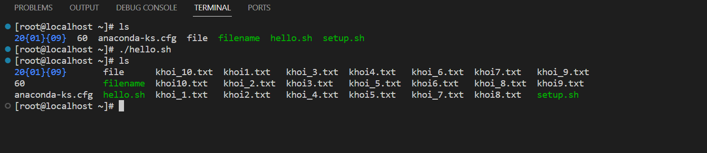

## Bash shell script tự động tạo 100 tệp .txt

**1. Scrip tự động tạo tệp**
- Thực hiện công việc tạo 1 tệp từ 1 đến 10 trên centos7 trong đó mỗi tệp ghi số thứ tự và thời gian tạo tệp
```
#! /bin/bash
for name in {1..10}; do
	touch "khoi_$name.txt"
	echo $name >> "khoi$name.txt"
	date +"%H:%M:%S.%3N" >> "khoi_$name.txt"
done
```

ouput 





- Trong đó:

`#! /bin/bash` được gọi là shebang, nó cho shell biết tập lệnh sẽ được biên dịch và chạy bởi bash shell.
`@name` : Là số thứ tự của tệp và giá trị hiện tại của vòng for
`{1..10}` được hiểu thành "1 2 3 4 ... 9 10"
`touch` dùng để tạo tệp
echo $name > "khoi_$name.txt" : lệnh này sẽ nối giá trị của tham số $name hiện tại vào tệp khoi_@name.txt

