## NetBox
### 1. Định nghĩa 
NetBox là một phần mềm mã nguồn mở được sử dụng để quản lý hạ tầng mạng, bao gồm các thiết bị mạng, địa chỉ IP, subnet, tài liệu kỹ thuật và các thông tin khác liên quan đến hệ thống mạng.(Quản lý các thiết bị trên IDC)
### 2.Chức năng chính của NetBox
- Xây dựng phục vụ đặc biệt nhu cầu của các kỹ sư và nhà khai thác mạng
+ Quản lý địa chỉ IP
+ Tự động cung câp tiền tố /IP khả dụng tiếp theo
+ VRF với các mục tiêu tuyến đường xuất nhập khẩu
+ VLAN với các nhóm có phạm vi thay đổi
+ Quản lý số AS
+ Máy ảo và  cụm
+ Hệ thống phân cấp linh hoạt cho các trang web và vị trí
+ Chuyển nhượng quyền sở hữu người thuê
+ Báo cáo tùy chỉnh và tập lệnh có thể thực thi trực tiếp trong giao diện người dùng
+ Khung bổ trợ mở rộng để thêm chức năng tùy chỉnh
+ Ghi nhật ký thay đổi chi tiết tự động
### 3. Giới thiệu chi tiết
**Mô hình facilities**


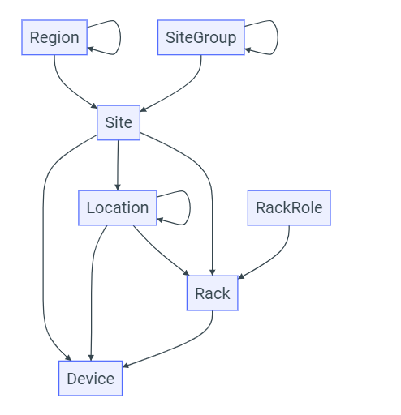
 

 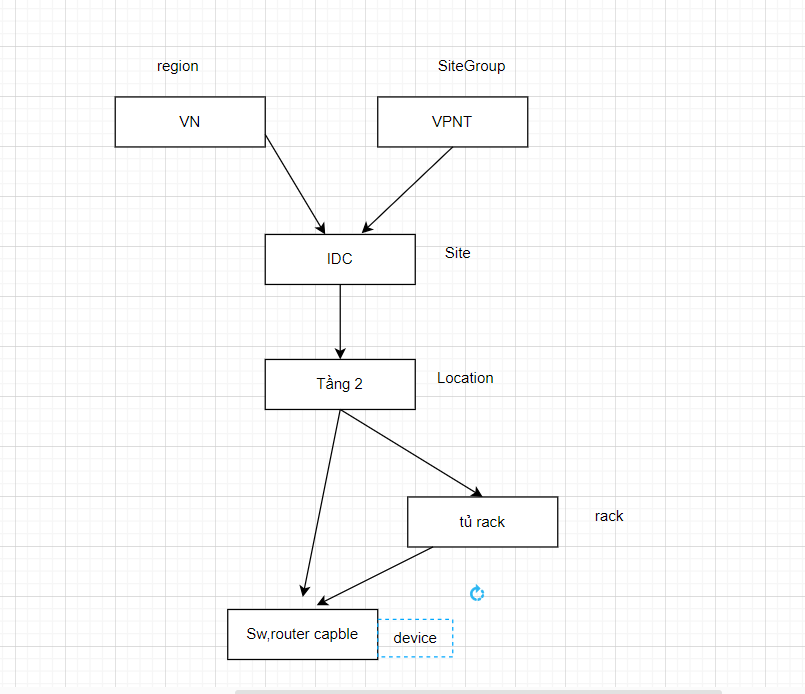

    
- Trong đó:
***Regions***
- Vùng đại diện cho các miền địa lý ,thường được sử dụng để mô hình hóa các miền , quốc gia 
***Site Groups***
- Giống như các vùng , các nhóm trang web có thể được sắp xếp theo cấu trúc đệ quy 
vd: Có thể phân chia loại trang web là trang web công ty,chi nhánh , hoặc khách hàng
***Site***
- Một site thường đại diện cho một tòa nhà trong một vùng và/hoặc nhóm site.
***Location***
  - Vị trí có thể là phân khu hợp lý nào trong tầng hoặc phòng.Giống như các vùng và nhóm trang, các vị trí có thể được lồng vào một hệ thống phân cấp tự đệ quy để có tính linh hoạt tối đa. Và giống như các
***Racks***
Mỗi rack thì được gán cho 1 site, chiều cao của rack được đo bằng đơn vị U. Các racks thường cao từ 42 U đến 48 U nhưng trong netbox ta có thể chỉ định chiều cao của rack tùy ý. Mỗi rack được gán 1 tên và 1 id cơ sở riêng(tùy chọn).

***Phần Organization trên NetBox***

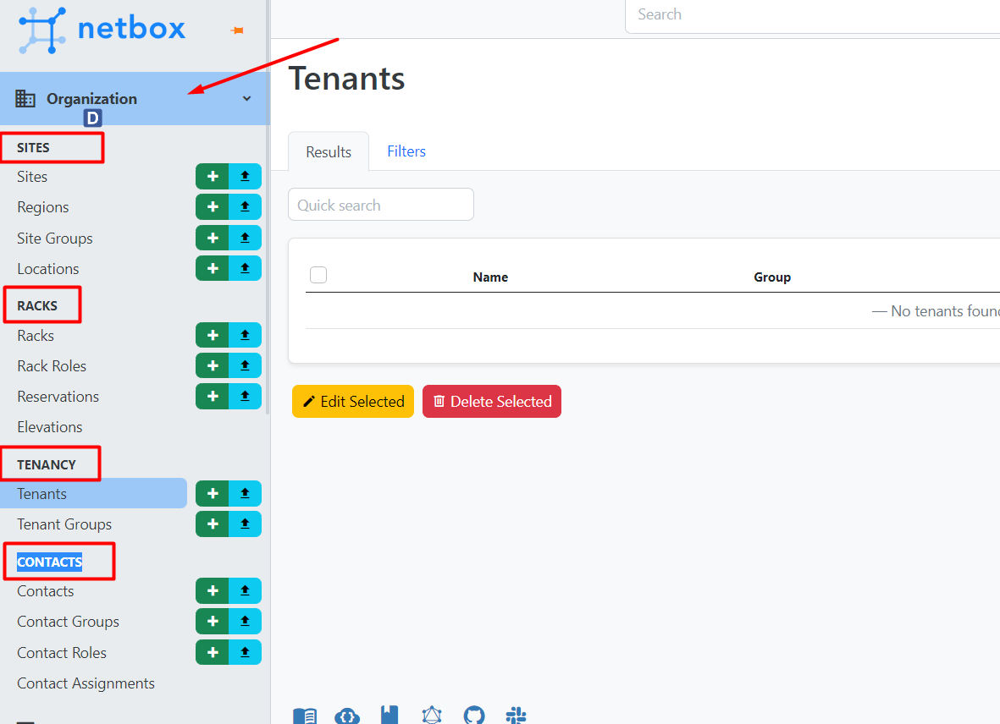

- Phần này được sử dụng để khai báo các đối tượng khác hàng , vị trí địa lý của trung tâm dữ liệu và vị trí đặt tủ rack

Thường đặt tạo 1 tủ rack thì đặt tên nhóm khác hàng và command vai trò đối với các device 


- Tenancy
Trước khi tạo Racks và Sites thì tạo nhóm khách hàng trước và các khách hàng sẽ có chúc năng với các thiết bị

Ví dụ về tạo Tenacy

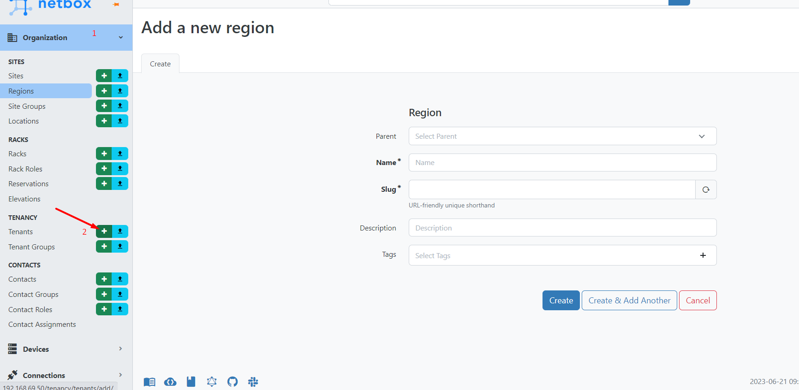


- Sau đó điền thông tin cho tenacy 

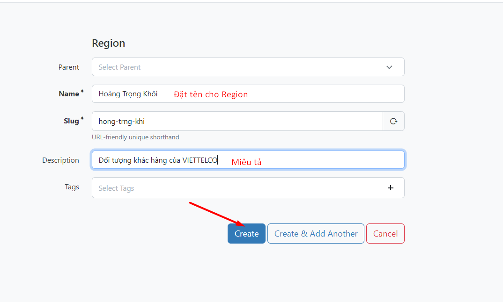

```
1. Đặt tên cho tenancy
2. Mô tả chi tiết cho tenancy này.
3. Chọn Create để tạo
```
Tiếp theo là **Sites**
 
Trong site sẽ có Regions,Site,Site Group,Location
***Regions***

Vùng đại diện cho các miền địa lý ,thường được sử dụng để mô hình hóa các miền , quốc gia .Giả sử có 2 khu vực là Hà đông và Hà Nội thì khu vực Hà nội có thể sử dụng làm parent của Hà Đông,Trước tiên tạo 1 regions Hà Nội


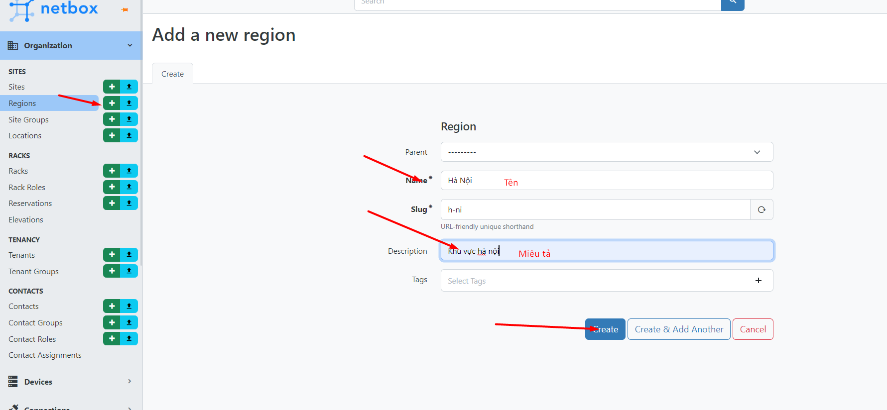


```
1. Điền tên của regions
2. Mô tả cho regions
3. Chọn Update để tạo regions
```
Sau đó click vào Create để tạo regions

Tiếp theo sẽ tạo ra 1 regions có tên là Hà Đông, thuộc địa phận Hà Nội nên sẽ để Hà Nội làm parent 

- Sau khi tạo sẽ có kết quả như sau 


***Site***
- Cách sử dụng site phụ thuộc vào tổ chức , thường site có thể là 1 tòa nhà , 1 `site` nhỏ hơn `region` và được nằm trong `region`

Ta tạo Site như sau:


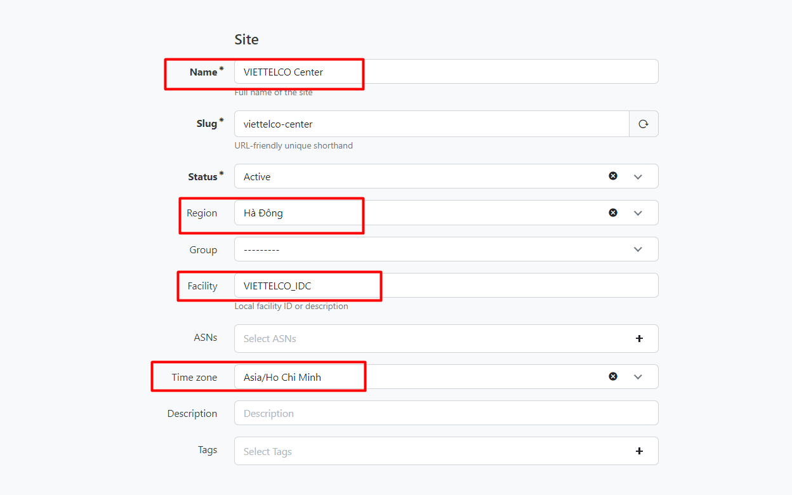

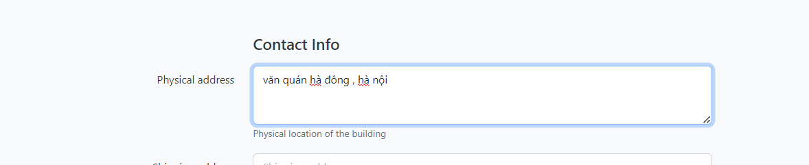


- Trong đó
`Name:` Đặt tên là VIETTELCO Center
Region: Vị trí đặt tòa nhà là ở Hà Đông nên add vào region Hà đông
Facility: Đặt là VIETTELCO_IDC
Time zone: Ở Việt Nam nên ta sẽ chọn timezone là Asia/Ho Chi Minh
Description : Ở mục này để ta điền thông tin liên hệ của data center đang khai báo.


Xong phần site , tiếp theo đến tạo phần Racks
***Racks***

Rack Roles
Rack role được sử dụng để miêu tả vai trò của tủ racks, ta có thể đặt cho nó vai trò như sử dụng cho khách hàng hoặc để lưu trữ ….Vai trò của racks là tùy biến.

- Thực hiện tạo 1 racks có tên là Thiết bị khách hàng và để đặt các thiết bị cho khách hàng

Type : của mình là kiểu Wall-mounted cabinet
Width : 23 inches
Height : Được tính bằng U, tủ của mình có chiều cao là 42U.


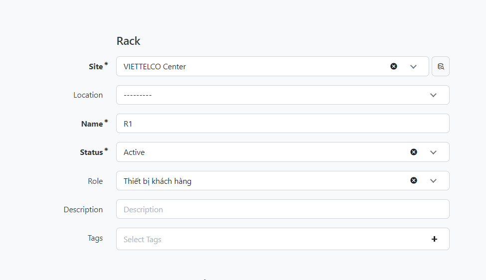


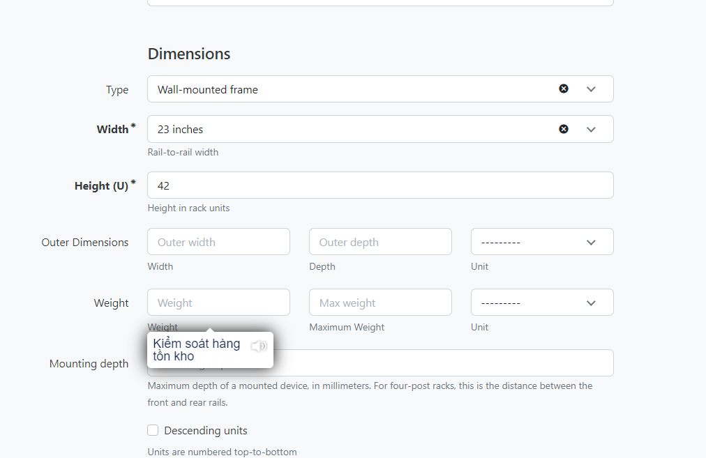


**Mô hình Devices & Cabling**

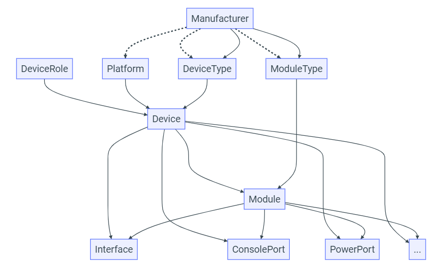

- Trong đó 

 ***Manufacturers***
- Nhà sản xuất thường đại diện cho một tổ chức sản xuất thiết bị phần cứng 

***Device Types***
- Một loại thiết bị đại diện cho sự kết hợp duy nhất giữa nhà sản xuất và kiểu phần cứng ánh xạ tới kiểu và kiểu thiết bị riêng biệt tồn tại trong thế giới thực.Sau đó, các thiết bị mới thuộc loại này có thể được tạo trong NetBox và mọi thành phần được liên kết sẽ được tự động sao chép từ loại thiết bị.
***The Device Type Library***
- Các thiết bị có sẵn trong thư viện netbox

***Devices***
- Trong khi loại thiết bị xác định kiểu dáng và kiểu dáng của thiết bị, bản thân thiết bị đại diện cho một phần cứng thực tế được cài đặt ở đâu đó trong thế giới thực. Một thiết bị có thể được lắp đặt tại một vị trí cụ thể trong giá đỡ thiết bị hoặc được liên kết đơn giản với một địa điểm (và tùy chọn với một vị trí trong địa điểm đó).

***Virtual Chassis***
- Chúng có thể được mô hình hóa dưới dạng khung ảo trong NetBox, với một thiết bị đóng vai trò là chủ khung và phần còn lại là thành viên.Tất cả các thành phần của thiết bị thành viên sẽ xuất hiện trên thiết bị chính
***Module Types & Modules***
- Các mô-đun thường có các thành phần con của riêng chúng, các thành phần này có sẵn cho thiết bị mẹ.
***Cables***
- NetBox mô hình cáp như các kết nối giữa các loại thành phần thiết bị nhất định và các đối tượng khác. Mỗi cáp có thể được chỉ định một loại, màu sắc, chiều dài và nhã

**Power Tracking**

Là một phần của bộ tính năng DCIM, NetBox hỗ trợ mô hình hóa năng lượng của cơ sở dưới dạng các bảng nguồn và nguồn cấp dữ liệu riêng biệt. Chúng được sử dụng phổ biến nhất để lập tài liệu phân phối điện trong trung tâm dữ liệu, nhưng cũng có thể phục vụ các môi trường truyền thống hơn.


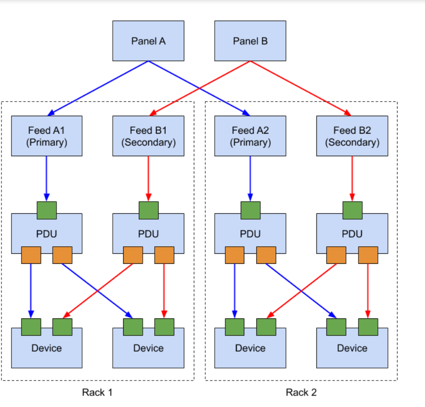


**IP Address Management**

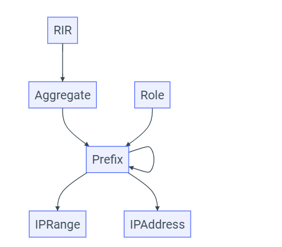

Quản lý địa chỉ IP (IPAM) là một trong những tính năng cốt lõi của NetBox. Nó hỗ trợ tính chẵn lẻ đầy đủ cho IP4 và IPv6, gán VRF nâng cao, hình thành hệ thống phân cấp tự động, v.v.
IPAM là viết tắt của IP Address Management, được sử dụng để quản lý các vlan và địa chỉ IP. Từ đó ta sẽ biết được có bao nhiêu IP còn trống, những IP nào đã được sử dụng, những IP nào đã bị thu hồi. Từ đó ta có thể lập kế hoạch và phân bổ địa chỉ IP 1 cách chặt chẽ trong mạng máy tính. Trong bài viết này mình sẽ hướng dẫn các bạn cách để khai báo các mục của IPAM trong Netbox.

***IP Hierarchy***
NetBox sử dụng một số loại đối tượng để biểu thị phân cấp tài nguyên IP:
`Aggregate` :Tiền tố đại diện cho gốc của hệ thống phân cấp địa chỉ.
`Prefix`  :  Một mạng con được xác định trong một tập hợp. Các tiền tố mở rộng hệ thống phân cấp bằng cách lồng vào nhau. (Ví dụ: 192.168.123.0/24 sẽ xuất hiện trong 192.168.0.0/16.)
`IP Range`: Một phạm vi tùy ý của các địa chỉ IP riêng lẻ trong một tiền tố, tất cả đều chia sẻ cùng một mặt nạ
`IP Address`: Một địa chỉ IP riêng lẻ cùng với mặt nạ mạng con của nó, được sắp xếp tự động bên dưới tiền tố gốc của nó.
vd một hệ thống phân cấp
100.64.0.0/10 (tổng hợp)
100.64.0.0/20 (tiền tố)
100.64.16.0/20 (tiền tố)
100.64.16.0/24 (tiền tố)
100.64.16.1/24 (địa chỉ)
100.64.16.2/24 (địa chỉ)
100.64.16.3/24 (địa chỉ)
100.64.16.9/24 (tiền tố)
100.64.32.0/20 (tiền tố)
100.64.32.1/24 (địa chỉ)
100,64,32,10-99/24 (phạm vi)

***VRF Tracking***
NetBox hỗ trợ mô hình hóa các phiên bản định tuyến và chuyển tiếp ảo (VRF) rời rạc để biểu diễn nhiều bảng định tuyến, bao gồm cả những bảng có không gian địa chỉ chồng chéo. Mỗi loại đối tượng IP trong một tập hợp - tiền tố, dải IP và địa chỉ IP - có thể được gán cho một VRF cụ thể


**VLAN Management**


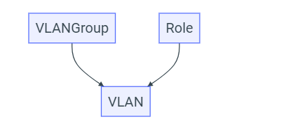


Bổ sung khả năng IPAM của nó, NetBox cũng theo dõi thông tin VLAN để hỗ trợ cấu hình mạng lớp hai.. Vlan được xác định theo IEEE 802.1Q và các tiêu chuẩn liên quan, đồng thời có thể được gán cho các nhóm và vai trò chức năng.

***VLAN Groups***

Nhóm Vlan là tập hợp các Vlan được xác định trong một phạm vi cụ thể. Mỗi nhóm Vlan có thể được liên kết với một trang web, vị trí, giá đỡ hoặc đối tượng tương tự cụ thể để chỉ ra miền của nó và chỉ định ID

***VLANs***
NetBox lập mô hình Vlan theo định nghĩa của chúng theo IEEE 802.1Q, với ID Vlan 12 bit và tên. Mỗi VLAN cũng có một trạng thái hoạt động và có thể được chỉ định một vai trò chức năng, giống như các tiền tố. Mỗi VLAN có thể được gán cho một nhóm VLAN hoặc trang web để truyền tải tên miền mà VLAN tồn tại.

**Circuits**

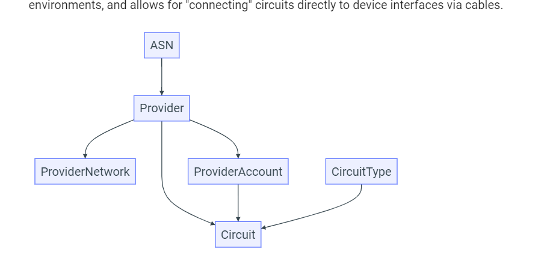


***Providers***
- Nhà cung cấp là bất ký tổ chức nào cung cấp kết nối internet hoặc riêng tư 

***Circuits***
Một kết nối Internet được phân phối dưới dạng cáp quang sẽ được mô hình hóa thành một mạch trong NetBox.Mỗi mạch được liên kết với một nhà cung cấp và được gán ID mạch, ID này phải là duy nhất cho nhà cung cấp đó. Một mạch cũng được chỉ định một loại do người dùng xác định, trạng thái hoạt động và nhiều đặc điểm hoạt động khác

**wireless** 

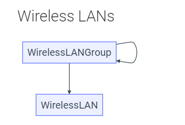

Giống như NetBox cung cấp mô hình hóa mạnh mẽ cho các nhà máy cáp vật lý, nó cũng hỗ trợ mô hình hóa mạng LAN không dây và liên kết điểm-điểm.

***Wireless LANs***
Mạng LAN không dây là mạng đa truy cập được chia sẻ bởi nhiều máy khách không dây, được xác định bằng mã định danh bộ dịch vụ chung (SSID) và các tham số xác thực
Các thuộc tính xác thực cho mạng LAN không dây bao gồm:
Type - Open, WEP, WPA, etc.
Cipher - Auto, TKIP, or AES

***Wireless Links***
Trong khi mạng LAN không dây đại diện cho phân đoạn đa truy cập vật lý với bất kỳ số lượng máy khách nào, liên kết không dây là kết nối điểm-điểm giữa chính xác hai trạm. Các liên kết này hoạt động giống như cáp, nhưng mô hình chính xác hơn bản chất của truyền thông không dây.


**Virtualization**


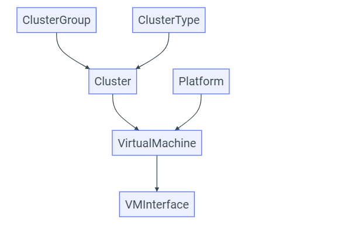

Các máy ảo và cụm có thể được lập mô hình trong NetBox cùng với cơ sở hạ tầng vật lý. Địa chỉ IP và các tài nguyên khác được gán cho các đối tượng này giống như các đối tượng vật lý, mang đến sự tích hợp liền mạch giữa mạng vật lý và mạng ảo.

***Clusters***
Một cụm là một hoặc nhiều thiết bị máy chủ vật lý mà các máy ảo có thể chạy trên đó. Mỗi cụm phải có một loại và trạng thái hoạt động và có thể được chỉ định cho một nhóm.

***Virtual Machines***
Máy ảo là một phiên bản tính toán được ảo hóa. Chúng hoạt động trong NetBox rất giống với các đối tượng thiết bị, nhưng không có bất kỳ thuộc tính vật lý nào.


**Tenancy**

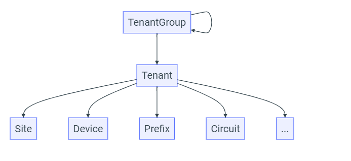


Thông thường trước khi tạo các mục trong Racks và Sites, ta nên tạo các nhóm khách hàng trước và các khách hàng sẽ có vai trò đối với các thiết bị.

Tenancy đề cập đến một khách hàng cá nhân hoặc 1 tổ chức. Các đối tượng sau có thể sẽ được gán cho những tenants :

Sites
Racks
Rack reservations
Devices
VRFs
Prefixes
IP addresses
VLANs
Circuits
Virtual machines

**Contacts**

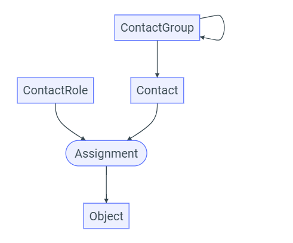

***Contact Groups***
Các liên hệ có thể được nhóm tùy ý vào một hệ thống phân cấp đệ quy và một liên hệ có thể được chỉ định cho một nhóm ở bất kỳ cấp nào trong hệ thống phân cấp.

***Contact Roles***
Vai trò liên hệ xác định mối quan hệ của một liên hệ với một đối tượng được chỉ định. Ví dụ: bạn có thể xác định vai trò cho các liên hệ quản trị, vận hành và khẩn cấp.

***Contacts***
Một liên hệ phải đại diện cho một cá nhân hoặc điểm liên lạc lâu dài.


