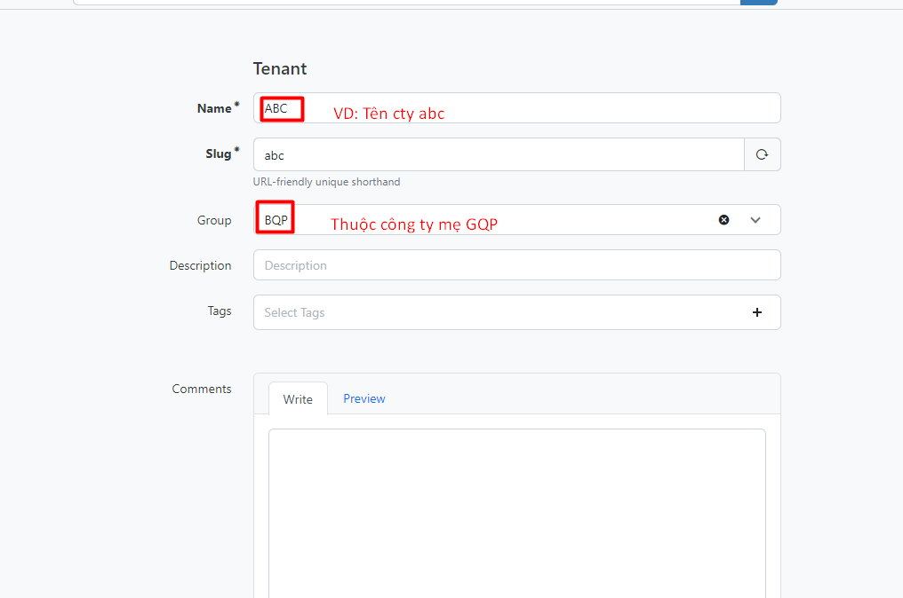
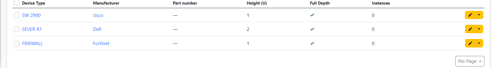
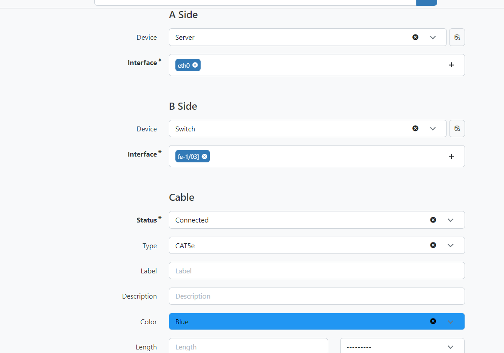

# NetBox
## 1. Định nghĩa 
NetBox là một phần mềm mã nguồn mở được sử dụng để quản lý hạ tầng mạng, bao gồm các thiết bị mạng, địa chỉ IP, subnet, tài liệu kỹ thuật và các thông tin khác liên quan đến hệ thống mạng.(Quản lý các thiết bị trên IDC)
## 2.Chức năng chính của NetBox
- Xây dựng phục vụ đặc biệt nhu cầu của các kỹ sư và nhà khai thác mạng
+ Quản lý địa chỉ IP
+ Tự động cung câp tiền tố /IP khả dụng tiếp theo
+ VRF với các mục tiêu tuyến đường xuất nhập khẩu
+ VLAN với các nhóm có phạm vi thay đổi
+ Quản lý số AS
+ Máy ảo và  cụm
+ Hệ thống phân cấp linh hoạt cho các trang web và vị trí
+ Chuyển nhượng quyền sở hữu người thuê
+ Báo cáo tùy chỉnh và tập lệnh có thể thực thi trực tiếp trong giao diện người dùng
+ Khung bổ trợ mở rộng để thêm chức năng tùy chỉnh
+ Ghi nhật ký thay đổi chi tiết tự động
## 3. Giới thiệu chi tiết

**Mô hình facilities**


 


### 3.1 Giới thiệu chi tiết sites

- Trong site sẽ có 


* ***Regions*** - Vùng đại diện cho các miền địa lý ,thường được sử dụng để mô hình hóa các miền , quốc gia 
  * vd: Miền bắc
* ***Site Groups*** - Giống như các vùng , các nhóm trang web có thể được sắp xếp theo cấu trúc đệ quy. Có thể phân chia loại trang web là trang web công ty,chi nhánh , hoặc khách hàng
  * vd: VNPT,VT,FPT
* ***Site*** - Một site thường đại diện cho một tòa nhà trong một vùng và/hoặc nhóm site.
vd: VNPT_IDC nam thăng long 
* **Location** - .Giống như các vùng và nhóm trang, các vị trí có thể được lồng vào một hệ thống phân cấp tự đệ quy để có tính linh hoạt tối đa
* vd: IDC_Nam thăng long  tầng 2 (site ở Nam thăng long)


 
Trong site sẽ có Regions,Site,Site Group,Location


***Regions***

- Tạo 1 region


```
1. Điền tên của regions
2. Mô tả cho regions
3. Chọn Update để tạo regions
```
Sau đó click vào Create để tạo regions

Tiếp theo sẽ tạo ra 1 regions có tên là Hà Đông, thuộc địa phận Hà Nội nên sẽ để Hà Nội làm parent 

- Sau khi tạo sẽ có kết quả như sau 


***Site***
- Cách sử dụng site phụ thuộc vào tổ chức , thường site có thể là 1 tòa nhà , 1 `site` nhỏ hơn `region` và được nằm trong `region`

Ta tạo Site như sau:


- Trong đó
`Name:` Đặt tên là VIETTELCO Center
Region: Vị trí đặt tòa nhà là ở Hà Đông nên add vào region Hà đông
Facility: Đặt là VIETTELCO_IDC
T./anh/ime zone: Ở Việt Nam nên ta sẽ chọn t./anh/imezone là Asia/Ho Chi Minh
Description : Ở mục này để ta điền thông tin liên hệ của data center đang khai báo.

***Site_Group***


### 3.2 Giới thiệu chi tiết racks


* **Racks** - Mỗi rack thì được gán cho 1 site, chiều cao của rack được đo bằng đơn vị U. Các racks thường cao từ 42 U đến 48 U nhưng trong netbox ta có thể chỉ định chiều cao của rack tùy ý. Mỗi rack được gán 1 tên và 1 id cơ sở riêng(tùy chọn).
  * vd: tủ rack h1,h2,h3 (h1,h2,h3) tương ứng với ID của tủ rack

`Rack Roles` : Mô tả của tủ rack ,


`Rack Reservations` : Nó thường được sử dụng để miêu tả quá trình đặt chỗ cho các bộ máy chủ (servers) hoặc các thiết bị mạng khác trên các kệ rack trong trung tâm dữ liệu.

`Rack Elevations` : Hiện thị độ cao giá đỡ của tủ rack mình tạo
vd : 48u,42u,...


- Thực hiện tạo 1 racks có tên là Thiết bị khách hàng và để đặt các thiết bị cho khách hàng

Type : của mình là kiểu Wall-mounted cabinet
Width : 23 inches
Height : Được tính bằng U, tủ của mình có chiều cao là 42U.


### 3.3 Giới thiệu chi tiết TENANCY


- Tenancy
Trước khi tạo Racks và Sites thì tạo nhóm khách hàng trước và các khách hàng sẽ có chúc năng với các thiết bị


- Phần này được hiểu là phần người thuê,

vd : Cty x,y,z hoặc BQP

`Tenant` : Thuộc công ty bé ,đơn lẻ

`TENANCY Groups` : Thuộc tập đoàn lớn hoặc 1 cụm cty

vd 




```
1. Đặt tên cho tenancy
2. Mô tả chi tiết cho tenancy này.
3. Chọn Create để tạo
```


### 3.4 Giới thiệu chi tiết CONTACTS

**Contacts**


***Contact Groups***
Các liên hệ có thể được nhóm tùy ý vào một hệ thống phân cấp đệ quy và một liên hệ có thể được chỉ định cho một nhóm ở bất kỳ cấp nào trong hệ thống phân cấp.
VD :  Tập đoàn VT,FPT
***Contact Roles***
Vai trò liên hệ xác định mối quan hệ của một liên hệ với một đối tượng được chỉ định. Ví dụ: bạn có thể xác định vai trò cho các liên hệ quản trị, vận hành và khẩn cấp.
VD : người quản trị trên IDC
***Contacts***
Một liên hệ phải đại diện cho một cá nhân hoặc điểm liên lạc lâu dài.

vd : khoiHt chịu trách nhiệm sai sót hoặc lỗi

### 4. Mô hình Devices & Cabling


- Trong đó 

 ***Manufacturers***
- Nhà sản xuất thường đại diện cho một tổ chức sản xuất thiết bị phần cứng 


***Virtual Chassis***
- Chúng có thể được mô hình hóa dưới dạng khung ảo trong NetBox, với một thiết bị đóng vai trò là chủ khung và phần còn lại là thành viên.Tất cả các thành phần của thiết bị thành viên sẽ xuất hiện trên thiết bị chính
***Module Types & Modules***
- Các mô-đun thường có các thành phần con của riêng chúng, các thành phần này có sẵn cho thiết bị mẹ.
***Cables***
- NetBox mô hình cáp như các kết nối giữa các loại thành phần thiết bị nhất định và các đối tượng khác. Mỗi cáp có thể được chỉ định một loại, màu sắc, chiều dài và nhã

### 4.1  Giới thiệu chi tiết Device


***Devices***
- Trong khi loại thiết bị xác định kiểu dáng và kiểu dáng của thiết bị, bản thân thiết bị đại diện cho một phần cứng thực tế được cài đặt ở đâu đó trong thế giới thực. Một thiết bị có thể được lắp đặt tại một vị trí cụ thể trong giá đỡ thiết bị hoặc được liên kết đơn giản với một địa điểm (và tùy chọn với một vị trí trong địa điểm đó).

Vd :sw2960 và add vào vị trí 39

***Moudle***
Các mô-đun đề cập đến các thành phần riêng lẻ tạo nên một thiết bị hoặc một phần của thiết bị. 
Ví dụ: một bộ chuyển đổi mạng có thể có nhiều mô-đun như nguồn điện, thẻ dòng và khay quạt

***Device Roles***
- Vai trò thiết bị có thể được chỉ định cho một thiết bị khi nó được tạo hoặc chỉnh sửa và giúp cung cấp ngữ cảnh về mục đích sử dụng của một thiết bị cụ thể.

VD: sw thì có vài trò access switch,hoặc distribution switches

***Platforms*** -    Thường được hiểu như là 1 hệ điều hành 

vd : centOS7,ubuntu 20.04 , ..

***Virtual Chassis*** - Virtual Chassis đề cập đến khả năng nhóm nhiều thiết bị vật lý lại với nhau thành một đơn vị hợp lý, cho phép quản lý chúng như một thực thể duy nhất.
***Virtual Device Contexts*** - Đề cập đến khả năng phân vùng thiết bị vật lý thành nhiều thiết bị logic, mỗi thiết bị có bộ tài nguyên và cấu hình riêng. Điều này có thể hữu ích trong các môi trường mà một thiết bị vật lý cần hỗ trợ nhiều đối tượng thuê hoặc ứng dụng.
VD: VDC cho phép bạn tạo nhiều thiết bị ảo trong một thiết bị vật lý duy nhất, mỗi thiết bị có bảng định tuyến, VLAN, giao diện và các cài đặt cấu hình khác
### 4.2  Giới thiệu chi tiết DEVICE TYPES

* **DEVICE TYPES** -  Đề cập đến mỗi loại thiết bị có một tập hợp các thuộc tính và thuộc tính riêng được sử dụng để mô tả các đặc điểm và chức năng của thiết bị đó.
  VD : Firewall,sw2900, server R1
* **Module Types** các loại mô-đun đề cập đến các loại thành phần khác nhau tạo nên một thiết bị hoặc một phần của thiết bị.
VD : Khay quạt , nguồn điện
* **Manufacturers** - Hãng sản xuất 
VD : DELL,Fortinet,cisco ,...
* **DEVICE COMPONENTS** - Linh kiện thiết bị 

VD:
`Console ports`:cổng vật lý trên thiết bị cho phép bạn kết nối cáp đầu cuối hoặc bảng điều khiển để truy cập giao diện dòng lệnh (CLI) của thiết bị cho mục đích cấu hình và quản lý
`Console server ports`Cổng này tương tự như cổng bảng điều khiển, nhưng chúng thường được sử dụng để kết nối với máy chủ bảng điều khiển, cung cấp quyền truy cập từ xa vào giao diện CLI của nhiều thiết bị từ một vị trí.
`Power ports:`Cổng được sử dụng để cấp nguồn cho thiết bị, thường ở dạng bộ điều hợp nguồn AC hoặc DC.
`Power outlets`:Đây là những ổ cắm điện nơi bạn có thể cắm dây nguồn để cung cấp điện cho thiết bị.
`Front ports`: Cổng phía trước của thiết bị 
`Rear ports`: Đây là các cổng vật lý ở mặt sau của thiết bị, thường được sử dụng để kết nối cáp mạng hoặc các thiết bị ngoại vi khác.
`Module bays:` Đây là các khe hoặc ngăn bên trong thiết bị nơi bạn có thể lắp đặt các thiết bị bổ sung, chẳng hạn như ổ đĩa cứng hoặc ổ đĩa quang.
`Inventory items` :Những mục được theo dõi trong hệ thống kiểm kê, chẳng hạn như thiết bị mạng, máy chủ hoặc tài sản CNTT khác. Mục đích của việc theo dõi hàng tồn kho là để theo dõi những tài sản bạn có, vị trí của chúng và trạng thái hiện tại của chúng, điều này có thể giúp bảo trì và khắc phục sự cố.


### Thực hành tạo device .

**Tạo Manufacturers(tạo nhà sản xuất)**


- Đây là kq sau khi tạo xong 


Trong đó : 

`Name:` Đặt tên đúng với tên của hãng hoặc tên viết tắt của hãng
`slug`: Có thể để tự sinh ra hoặc tạo 1 url trông gọn gàng hơn nếu quá dài.
`Description` : Mô tả cho manufacturer


**Tiếp theo tạo Device Types**


- Device Types đại diện cho kích thước , kiểu dáng phần cứng cụ thể trong thực tế ,  Các device type xác định thuộc tính của thiết bị 
- Tạo 1 device types


Kết quả sau khi tạo xong: 




Trong đó:
`Manufacturer` : Tên hãng tạo ra thiết bị 
`Model` : Đặt tên cho kiểu thiết bị 
`Height (U)`: Chiếm bao nhiêu `u` trong tủ rack 

Tạo các interface ,Power Ports cho thiết bị 


- Trong đó 
`Name` : Đặt tên là power 1 ( nguồn 1)
`Type` : Đối với Switch của mình là chân C14.
`Max./anh/imum draw`: Mức tiêu thụ năng lượng tối đa mình tạm thời để là 30w
`Allocated draw` : Mức tiêu thụ điện năng bình thường là 4w


- *Tạo tương tự với server (lưu ý server cần đổi và chọn lại interface)*


**Device Roles**

- Nhập vai trò của các core swith,server,...


- kết quả sau khi tạo


- Trong đó 

`Name` : Đặt tên cho role này
`Color` : Chọn màu cho device role này.
`Description` : Bạn có thể thêm mô tả thêm cho device role này. Phần này mình không có mô tả gì thêm

- Thêm thiết bị vào tủ Rack(Có 2 cách)


- Kết quả sau khi thêm 


- Trong đó 

`Device` : Phần này sẽ nhập vào tên của thiết bị và loại thiết bị. Lưu ý rằng tên thiết bị trong 1 rack không thể trùng với nhau
`Hardware` : CHọn nhà sản xuất thiết bị, Kiểu của thiết bị. Nhập vào Serial number và Asset tag. Nếu chưa có thông tin có thể bỏ qua.
`Location` : Chọn site và rack sẽ đặt thiết bị. Position sẽ chọn vị trí (U) của thiết bị trên racks.


**Power Tracking**

Là một phần của bộ tính năng DC./ANH/IM, NetBox hỗ trợ mô hình hóa năng lượng của cơ sở dưới dạng các bảng nguồn và nguồn cấp dữ liệu riêng biệt. Chúng được sử dụng phổ biến nhất để lập tài liệu phân phối điện trong trung tâm dữ liệu, nhưng cũng có thể phục vụ các môi trường truyền thống hơn.


### 5. Mô hình CONNECTIONS


- Thông thường sau khi cài đặt xong tất cả rồi mới sử dụng modun này 

***5.1 Cables*** - Thường sử dụng để kết nối các cổng interface,các dây nguồn ,hiểu đơn giản là dây kết nối 
vd : cat5,6,5e,DC,AC,Power,..

***5.2 Wireless Links*** - Là giải pháp truyền không dây cho phép nó giao tiếp với các loại thiết bị và mạng khác nhau 
VD : WF, bluetooth,camera giao thông 

***5.3 Interface Connections*** - Hiển thị giao diện các cổng interface kết nối với nhau 

VD:


***5.4 Console Connections*** - Thực hiện kết nối qua bảng điều khiển console (GUI)

***5.5 Power Connections*** - Kết nối nguồn giữa các thiết bị 

VD : power1 server1 kết nối với nguồn điện dự phòng power2

### 6. Mô hình WIRELESS
***6. 1Wireless LANs*** - Cung cấp kết nối không dây giữa các thiết bị như máy tính xác tay ,điện thoại thông minh.. và tất cả các thiết bị trong vùng phủ sóng . => Cho phép người dùng truy cập internet chia sẻ tệp với nhau , cho phép in không dây 

***6 .2Wireless LAN Groups*** - Cung cấp kết nối không dây trong 1 tập đoàn

## 7. Mô hình IPAM


Quản lý địa chỉ IP (IPAM) là một trong những tính năng cốt lõi của NetBox. Nó hỗ trợ tính chẵn lẻ đầy đủ cho IP4 và IPv6, gán VRF nâng cao, hình thành hệ thống phân cấp tự động, v.v.
IPAM là viết tắt của IP Address Management, được sử dụng để quản lý các vlan và địa chỉ IP. Từ đó ta sẽ biết được có bao nhiêu IP còn trống, những IP nào đã được sử dụng, những IP nào đã bị thu hồi. Từ đó ta có thể lập kế hoạch và phân bổ địa chỉ IP 1 cách chặt chẽ trong mạng máy tính. Trong bài viết này mình sẽ hướng dẫn các bạn cách để khai báo các mục của IPAM trong Netbox.

* **7.1 IP ADDRESSES** Cấu hình , cung cấp địa chỉ IP tự động và IP gateway
VD : nếu bộ định tuyến NetBox có địa chỉ IP là 192.168.1.1 thì người dùng có thể truy cập giao diện web của bộ định tuyến bằng cách nhập địa chỉ đó vào thanh địa chỉ của trình duyệt web 
* **7.2 IP Ranges** - Là 1 dải địa chỉ IP ,là một nhóm địa chỉ IP được sử dụng để xác định các thiết bị trên mạng.

VD: Nếu cho phép đặt dải IP từ 192.168.1.100 đến 192.168.1.200 thì mọi thiết bị được kết nối với mạng của bộ định tuyến sẽ được chỉ định một địa chỉ IP trong dải đó.

* **7.3  PREFIXES** - là cho phép định tuyến hiệu quả lưu lượng mạng giữa các thiết bị. Khi một thiết bị muốn gửi dữ liệu đến một thiết bị khác trên cùng một mạng, nó cần biết địa chỉ IP và tiền tố của thiết bị đích để gửi các gói đến đúng đích.

VD : nếu đặt /24 cho bộ định tuyến NetBox, thì bộ định tuyến sẽ gán địa chỉ IP cho các thiết bị trong phạm vi từ 192.168.1.0/24 đến 192.168.1.255/24.

* **7.4  ASN Ranges**  - Là mã định danh duy nhất được gán cho các mạng hoạt động trong một miền 

VD: nếu phạm vi ASN từ 1000 đến 2000 cho bộ định tuyến NetBox, thì bất kỳ thiết bị nào được kết nối với mạng của bộ định tuyến đều có thể được chỉ định ASN trong phạm vi đó


* **7.4  Aggregates** - Sử dụng để xác định 1 dải địa chỉ IP lớn , phân bổ cao nhất 

VD : 192.168.0.0/24

* **7. 5RIRs (Regional Internet Registries)** - Chịu trách nhiệm phân bổ không gian địa chỉ IP , có 5 RIRs :  ARIN, RIPE, APNIC, LACNIC và AFRINIC.

VD Như khu vực châu Á : AFRINIC

* **VRFs** - là một công nghệ cho phép nhiều bảng định tuyến cùng tồn tại trong một bộ định tuyến vật lý duy nhất.Cung cấp cách tạo bảng định tuyến ảo hóa và cách ly lưu lượng giữa các nhóm hoặc khách hàng khác nhau trên một bộ định tuyến vật lý.


* **VLAN**  - Tạo các phân đoạn mạng LAN , mỗi VLAN được gán cho mỗi định danh duy nhất 

VD : Một tổ chức muốn phân tách lưu lượng giữa các bộ phận khác nhau như tài chính, nhân sự và tiếp thị, họ có thể tạo VLAN riêng cho từng bộ phận


* **VLAN GROUP** - super của VLAN


Thực hành tạo IPAM trong netbox

***- Bước 1 : Tạo Vlan group ***


- Trong đó
`Name`  : Đặt tên cho Vlan Group
Chọn `DC./ANH/IM > site` để chỉ định site mà VLAN Group này thuộc về
Chọn `Region` tương ứng với Site định đặt VLAN Group
Chọn `Site` mà VLAN Group này thuộc về

Sau khi hoàn tất click vào nút `create`,Kết quả sau khi tạo


***VLANs***
- Tạo ra các VLAN , những vlan có chung mục đích sử dụng có thể nhóm vào 1 nhóm vlan group 

Tạo 1 VLAN như sau:


- Trong đó : 

`ID, Name` : Nhập ID và tên vlan 
`Status`  : Trạng thái hiện thời
`Site` : đang được đặt trên site nào

***VRF***
- Mỗi VRF về cơ bản là 1 bảng đinh tuyến riêng. VRF thường được sử dụng để ngăn cách các khách hàng và các tổ chức với nhau trong mạng.

***Aggregates***

RIRs (Regional Internet Registries)
- Chịu trách nhiệm phân bổ không gian địa chỉ IP , có 5 RIRs :  ARIN, RIPE, APNIC, LACNIC và AFRINIC.


*Aggregates*
- Sử dụng để xác định 1 dải địa chỉ IP lớn , phân bổ cao nhất 


`Prefix` : Nhập vào dải địa chỉ lớn nhất
`Rir` : Cơ quan đăng ký Internet (Phần này đã tạo trước đó, kích xuống dưới và chọn Cơ quan đăng ký)
`Date added` : Chọn ngày khởi tạo.
`Description` : Nhập vào mô tả cho phần này hoặc để trống.

***Prefixes***
Nhập vào địa chỉ mạng và subnet của dải địa chỉ để cấp cho các thiết bị

Prefix có các Status sau:

`Container` : Tóm tắt về prefix con
`Active` : Đang hoạt động
`Reserved` : Chỉ định sử dụng trong tương lai
`Deprecated` : Không còn sử dụng


***IP addresses***

- Chú ý đến 2 trường sau 


Trường `New IP` sử dụng để tạo mới từng địa chỉ IP 1. Thường sử dụng để tạo các địa chỉ là Gateway hoặc tạo các địa chỉ Nat. Trường thứ 2 là `Bulk Create` sử dụng để tạo hàng loạt các địa chỉ ip.


**VLAN Management**


Bổ sung khả năng IPAM của nó, NetBox cũng theo dõi thông tin VLAN để hỗ trợ cấu hình mạng lớp hai.. Vlan được xác định theo IEEE 802.1Q và các tiêu chuẩn liên quan, đồng thời có thể được gán cho các nhóm và vai trò chức năng.

***VLAN Groups***

Nhóm Vlan là tập hợp các Vlan được xác định trong một phạm vi cụ thể. Mỗi nhóm Vlan có thể được liên kết với một trang web, vị trí, giá đỡ hoặc đối tượng tương tự cụ thể để chỉ ra miền của nó và chỉ định ID

***VLANs***
NetBox lập mô hình Vlan theo định nghĩa của chúng theo IEEE 802.1Q, với ID Vlan 12 bit và tên. Mỗi VLAN cũng có một trạng thái hoạt động và có thể được chỉ định một vai trò chức năng, giống như các tiền tố. Mỗi VLAN có thể được gán cho một nhóm VLAN hoặc trang web để truyền tải tên miền mà VLAN tồn tại.

**Circuits**


***Providers***
- Nhà cung cấp là bất ký tổ chức nào cung cấp kết nối internet hoặc riêng tư 

***Circuits***
Một kết nối Internet được phân phối dưới dạng cáp quang sẽ được mô hình hóa thành một mạch trong NetBox.Mỗi mạch được liên kết với một nhà cung cấp và được gán ID mạch, ID này phải là duy nhất cho nhà cung cấp đó. Một mạch cũng được chỉ định một loại do người dùng xác định, trạng thái hoạt động và nhiều đặc điểm hoạt động khác

**wireless** 


Giống như NetBox cung cấp mô hình hóa mạnh mẽ cho các nhà máy cáp vật lý, nó cũng hỗ trợ mô hình hóa mạng LAN không dây và liên kết điểm-điểm.

***Wireless LANs***
Mạng LAN không dây là mạng đa truy cập được chia sẻ bởi nhiều máy khách không dây, được xác định bằng mã định danh bộ dịch vụ chung (SSID) và các tham số xác thực
Các thuộc tính xác thực cho mạng LAN không dây bao gồm:
Type - Open, WEP, WPA, etc.
Cipher - Auto, TKIP, or AES

***Wireless Links***
Trong khi mạng LAN không dây đại diện cho phân đoạn đa truy cập vật lý với bất kỳ số lượng máy khách nào, liên kết không dây là kết nối điểm-điểm giữa chính xác hai trạm. Các liên kết này hoạt động giống như cáp, nhưng mô hình chính xác hơn bản chất của truyền thông không dây.


**Virtualization**


Các máy ảo và cụm có thể được lập mô hình trong NetBox cùng với cơ sở hạ tầng vật lý. Địa chỉ IP và các tài nguyên khác được gán cho các đối tượng này giống như các đối tượng vật lý, mang đến sự tích hợp liền mạch giữa mạng vật lý và mạng ảo.

***Clusters***
Một cụm là một hoặc nhiều thiết bị máy chủ vật lý mà các máy ảo có thể chạy trên đó. Mỗi cụm phải có một loại và trạng thái hoạt động và có thể được chỉ định cho một nhóm.

***Virtual Machines***
Máy ảo là một phiên bản tính toán được ảo hóa. Chúng hoạt động trong NetBox rất giống với các đối tượng thiết bị, nhưng không có bất kỳ thuộc tính vật lý nào.


**Tenancy**


Thông thường trước khi tạo các mục trong Racks và Sites, ta nên tạo các nhóm khách hàng trước và các khách hàng sẽ có vai trò đối với các thiết bị.

Tenancy đề cập đến một khách hàng cá nhân hoặc 1 tổ chức. Các đối tượng sau có thể sẽ được gán cho những tenants :

Sites
Racks
Rack reservations
Devices
VRFs
Prefixes
IP addresses
VLANs
Circuits
Virtual machines


**Hướng dẫn kết nối các thiết bị**
- Tạo kết nối từ server tới switch ,cần tạo interface cho thiết bị 





- Gán địa chỉ IP


Gán switch, fortinet cũng tương tự

**Tenancy**
- Hầu hết các đối tượng được liên kết đều được hỗ trợ người thuê , Liên kết của một đối tượng thuê cụ thể truyền đạt quyền sở hữu
- 


***Tenant Groups***
- Đối tượng được thuê theo nhóm , Và các nhóm lồng vào nhau một cách đệ quy linh hoạt tối đa
***Tenants***
- Đại diện cho khách hàng hoặc một tổ chức 
Chỉ định người thuê được sử dụng để biểu thị quyền sở hữu đối tượng trong NetBox


**Power:**
`Power Panel`: Quản lý các tủ điện và các thông tin liên quan.
`Power Feed`: Quản lý các nguồn cấp điện cho các thiết bị mạng.


