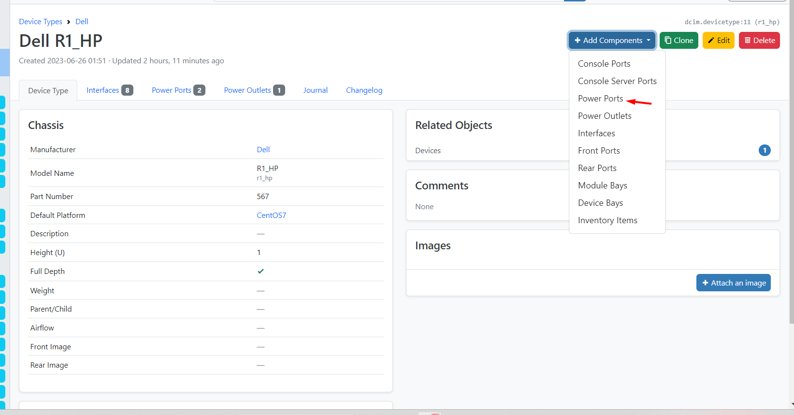
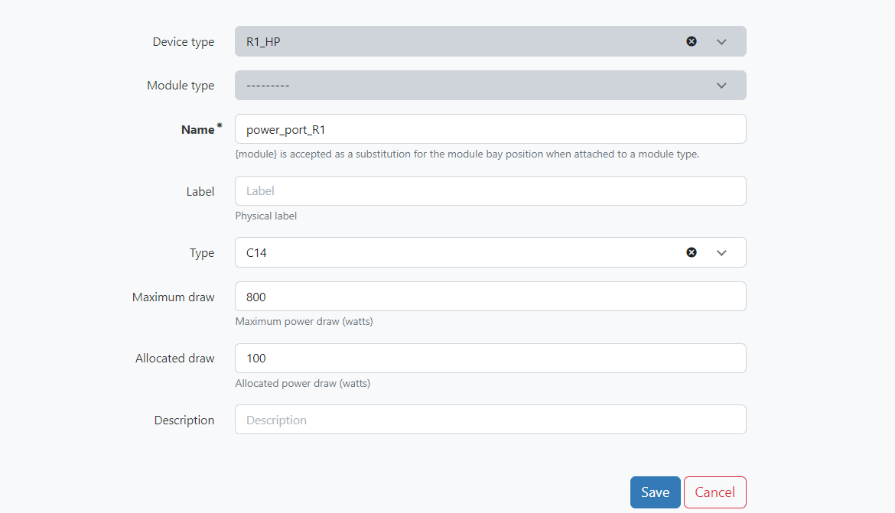
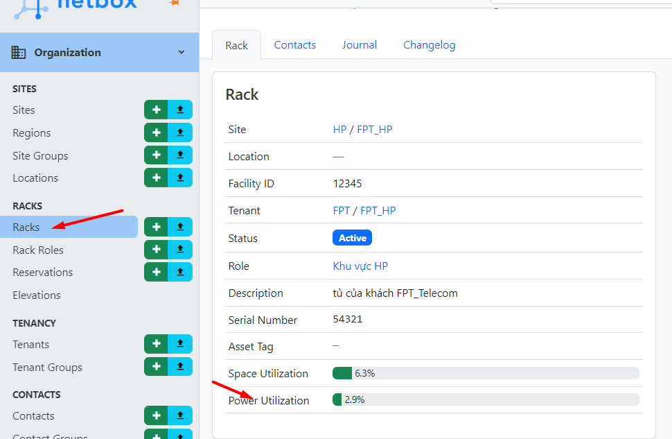
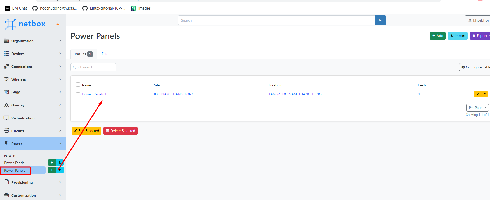
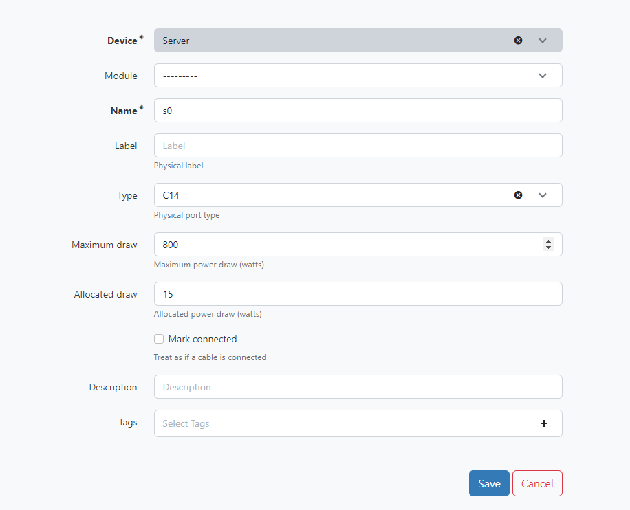
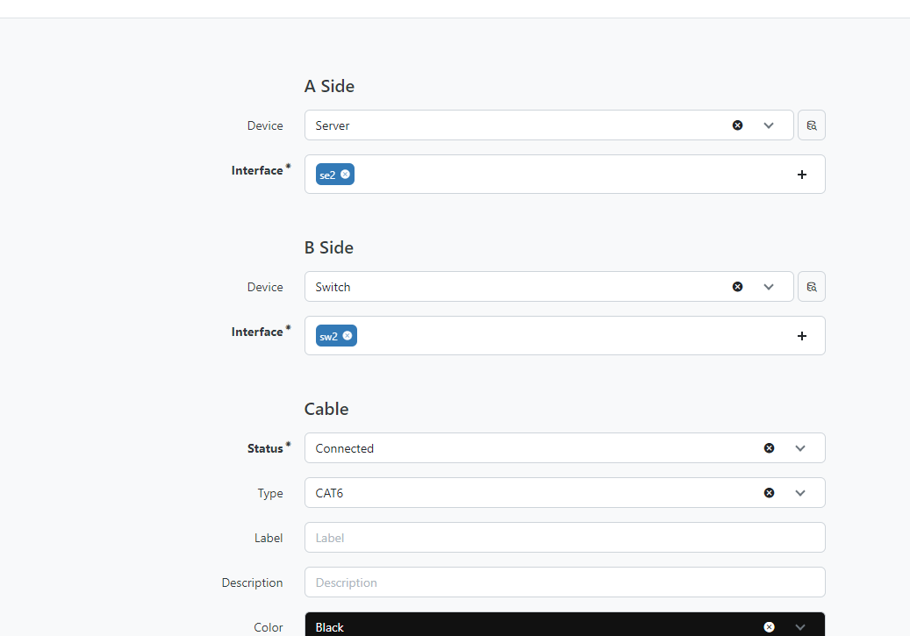

## Bài lab kết nối nguồn điện
### Mục tiêu bài lab , thực hiện kết nối nguồn giữa các thiết bị vs nhau hoặc các thiết bị với tủ rack

B1 : Thực hiện tạo  `Power Panels`

B2 : Thực hiện tạo  `Power Feeds`

B3 : Thực hiện kết nối các thiết bị (router)

- Trên các thiết bị thì cần add thêm thêm các   `components`

VD :

- Vào `divice` thêm R1 vào tủ rack,rồi sau đó vào `power Powort` thực hiện kết nối với tủ rack

Vào `Connections` để check xem kết nối, hoặc có thể vào `rack` để xem kết nối chưa

*   **Thực hiện kết nối nguồn cho switch**

### Mô hình tổng hợp (các phần định nghĩa nằm trong phần này ) [Định nghĩa](Introduction.md)

Mục Tiêu bài lab .Thưc hiện cấu hình VLAN cho mạng,thực hiện hoàn tất các modul trong device và origanization

B1 : Thực hiện cấu hình ở organization

`Trong contact `

Tiếp theo là đến phần rack

**Phần device**

**Cấu hình nguồn**

**Thực hiện tương tự với sw và firewall**

**Thực hiện thêm module bay**

 

 
**Thực hiện quá trình kết nối từ server đến sw**

**add cổng interface cho server và switch**

Sau khi add xong sẽ có kq như dưới

Thực hiện kết nối 

**Tiếp theo phần IPAM**

   

Đây là kết quả sau khi tạo 

Thực hiện gán IP cho các cổng interface 

- Sau khi thiết lập cấu hình vào server để xem

