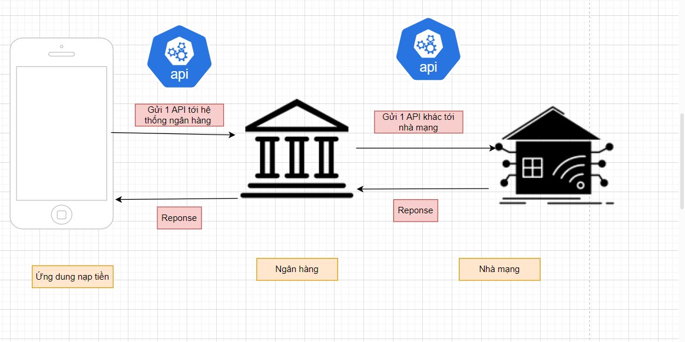
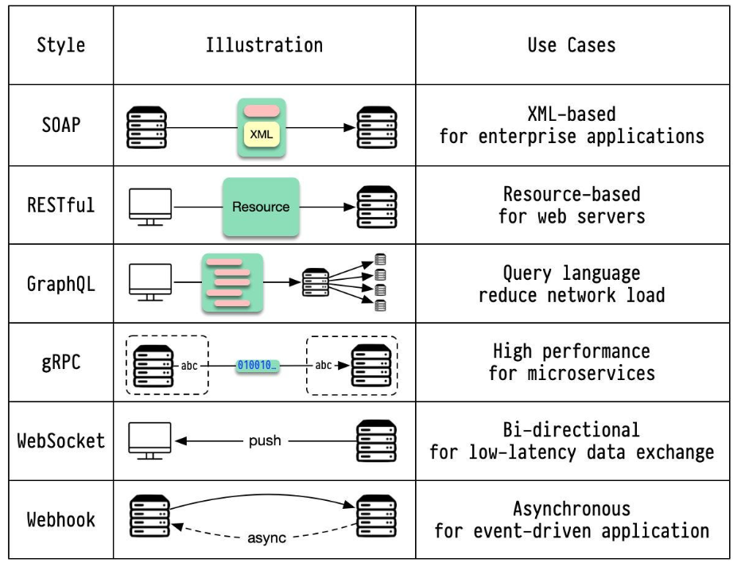
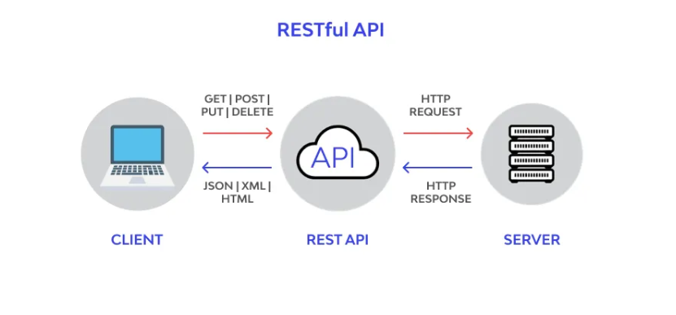
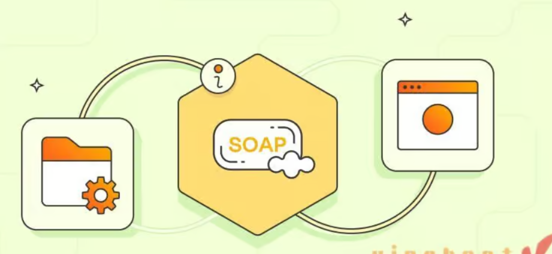

## 1. API là gì ? 
API : application programing interface 
API là một tập hợp các quy tắc và định nghĩa mô tả cách các ứng dụng hoặc các thành phần phần mềm khác nhau có thể giao tiếp và tương tác với nhau. Nó cung cấp các phương thức, giao thức và công cụ để các ứng dụng có thể truy cập và sử dụng các tính năng hoặc dữ liệu của ứng dụng khác.


### Một ví dụ cụ thể cho dễ hiểu về API : 


**Giả sử bạn đang ở một quán cà phê và bạn muốn gọi một ly cà phê.**

Bạn là khách hàng,muốn gọi đồ uống
Quầy pha chế , nơi pha chế đồ uống 
Người phục vụ là API , nhận yêu cầu và mang nó đến quầy pha chế

 API giúp dễ dàng yêu cầu và nhận dịch vụ mà không cần phải tương tác trực tiếp với hệ thống nội bộ của quán cà phê.

Hoặc muốn kết nối giữa điện thoại và máy tính cần dây cap : dây cap ở đây là API


**API của Dịch Vụ Đặt Xe**
Khi muốn đặt một chiếc xe từ ứng dụng gọi xe

Yêu Cầu (Request): mở ứng dụng gọi xe và yêu cầu đặt xe từ vị trí hiện tại của đến một địa điểm cụ thể.
API Hoạt Động Thế Nào: Ứng dụng sẽ gửi một yêu cầu đến server của dịch vụ gọi xe để kiểm tra xem có tài xế nào gần đó không và có thể đón bạn.
Phản Hồi (Response): Server sẽ trả về thông tin về tài xế, thời gian đón dự kiến, và giá cước. Ứng dụng hiển thị thông tin này cho bạn.





Các Bước như sau :

1. Khi bạn muốn nạp tiền vào số điện thoại của mình, ứng dụng ngân hàng sẽ gửi một yêu cầu API đến hệ thống ngân hàng, bao gồm thông tin như số điện thoại cần nạp tiền và số tiền cần nạp.

2. Hệ thống ngân hàng sẽ tiếp nhận yêu cầu này và sẽ sử dụng một API khác để giao tiếp với hệ thống của nhà mạng cung cấp dịch vụ điện thoại.
Thông qua API của nhà mạng, hệ thống ngân hàng sẽ gửi yêu cầu nạp tiền vào số điện thoại đã được cung cấp.

3. Hệ thống của nhà mạng sẽ xác nhận giao dịch, cập nhật số dư và gửi phản hồi API về cho hệ thống ngân hàng.

4. Hệ thống ngân hàng nhận được phản hồi, kiểm tra tính hợp lệ và cập nhật số dư tài khoản của bạn.Cuối cùng, ứng dụng ngân hàng sẽ nhận được thông báo từ hệ thống ngân hàng về việc giao dịch nạp tiền đã được thực hiện thành công.


## 2. API đã đóng vai trò gì trong ví dụ trên. Nếu không có API thì sẽ như nào?


Khi sử dụng API, các công đoạn trong quy trình nạp tiền vào số điện thoại được rút gọn :

1. Tạo giao dịch nạp tiền: Thay vì phải tự tạo giao dịch nạp tiền trong ứng dụng ngân hàng, API sẽ cung cấp các phương thức để ứng dụng có thể gửi yêu cầu nạp tiền trực tiếp lên hệ thống ngân hàng.
2. Liên hệ với nhà mạng: Với API, ứng dụng không cần phải tự liên hệ và giao tiếp với nhà mạng điện thoại. API sẽ đảm nhận việc này, cung cấp phương thức để ứng dụng có thể yêu cầu nạp tiền vào số điện thoại.
3. Cập nhật số dư tài khoản: Sau khi nạp tiền thành công, API sẽ trả về thông tin cập nhật số dư tài khoản của người dùng, thay vì ứng dụng phải tự gọi lại hệ thống ngân hàng để lấy thông tin.


Nhờ việc sử dụng API, ứng dụng ngân hàng chỉ cần thực hiện các tác vụ sau:

1. Hiển thị giao diện để người dùng nhập thông tin nạp tiền.
2. Gửi yêu cầu nạp tiền lên API.
3. Nhận phản hồi từ API về kết quả giao dịch và cập nhật số dư tài khoản.


Nếu không có API thì người dùng phải tự nạp tiền thủ công bằng cách trực tiếp . Với quy trình rất phức tạp và có rất nhiều rủi ro . Như vậy nhờ API đã giúp tự động hóa các bước và giảm thiểu rủi ro tăng tính tiện lợi cho người dùng


## 3. API có những loại nào ?

API được hoạt động theo các loại khác nhau:
**API Soap**: Các API này sử dụng Giao thức truy cập đối tượng đơn giản. Máy chủ và máy khách trao đổi thông điệp bằng xML.

**API RPC:** Những API này được gọi là Lệnh gọi thủ tục từ xa. Máy khách thực hiện một hàm trên máy chủ còn máy chủ gửi kết quả về cho máy khách.

**API Websocket**: Hỗ trợ hoạt động giao tiếp giữa máy khách và máy chủ. Máy chủ có thể gửi thông điệp gọi lại cho các máy khách được kết nối, điều này khiến loại API này hiệu quả hơn loại API REST.

**API Rest:** Đây là loại API phổ biến và phát triển nhất hiện nay


**API của hệ điều hành** : OS cung cấp sẵn 1 đống API/hàm để can thiệp vào lõi của OS

**API của 1 device/thiết bị** : SDK (Software Development Kit)
            VD : IP cam ... có sẵn các hàm đi kèm driver để mình giao tiếp với thiết bị





1. REST (Chuyển giao trạng thái đại diện) :
REST là một phong cách kiến ​​trúc được áp dụng rộng rãi để thiết kế các ứng dụng nối mạng.
Nó nhấn mạnh đến sự tương tác giữa máy khách và máy chủ không trạng thái, trong đó tài nguyên của máy chủ được biểu diễn và thao tác bằng các phương thức HTTP được tiêu chuẩn hóa (GET, POST, PUT, DELETE).
Tài nguyên được xác định bằng URL (Bộ định vị tài nguyên thống nhất) và dữ liệu có thể được trao đổi ở nhiều định dạng khác nhau như JSON hoặc XML.


2. GraphQL  :
GraphQL là một kiểu kiến ​​trúc API do Facebook phát triển nhằm cung cấp giải pháp thay thế linh hoạt và hiệu quả hơn cho REST.
Khách hàng có thể yêu cầu chính xác dữ liệu họ cần, giảm việc tìm nạp quá mức và tìm nạp không đầy đủ dữ liệu.
Máy chủ xác định một lược đồ và máy khách truy vấn các trường và mối quan hệ cụ thể trong lược đồ đó.

3. SOAP (Giao thức truy cập đối tượng đơn giản) :
SOAP là một giao thức trao đổi thông tin có cấu trúc trong việc triển khai các dịch vụ web.
Nó dựa vào XML để định dạng thư và có thể được vận chuyển qua nhiều giao thức khác nhau, bao gồm HTTP, SMTP, v.v.
Các dịch vụ SOAP có các hoạt động và cấu trúc được xác định trước, khiến nó cứng nhắc hơn so với REST.

4. JSON-RPC :
JSON-RPC là giao thức gọi thủ tục từ xa (RPC) được mã hóa bằng JSON.
Nó cho phép khách hàng gọi các phương thức trên máy chủ từ xa bằng cách sử dụng các thông báo dựa trên JSON qua HTTP hoặc các giao thức truyền tải khác.


5. gRPC :
gRPC là khung RPC (Gọi thủ tục từ xa) hiệu suất cao được phát triển bởi Google.
Nó sử dụng Bộ đệm giao thức (protobuf) làm ngôn ngữ định nghĩa giao diện và hỗ trợ nhiều ngôn ngữ lập trình.
gRPC cung cấp các tính năng như truyền phát hai chiều, xác thực và cân bằng tải.

6. WebSocket :
WebSocket là một giao thức cho phép các kênh liên lạc song công hoàn toàn qua một kết nối TCP.
Nó cho phép giao tiếp tương tác theo thời gian thực giữa máy khách và máy chủ.
WebSockets thường được sử dụng cho các ứng dụng yêu cầu cập nhật dữ liệu liên tục, chẳng hạn như ứng dụng trò chuyện và trò chơi trực tuyến.


### 3.1 API Rest,API Restfull

RESTful API là một tiêu chuẩn được sử dụng trong việc thiết kế API cho các ứng dụng web (thiết kế web services) nhằm hỗ trợ quản lý các resource.


1. **Giao thức HTTP**: RESTful API sử dụng các phương thức HTTP (GET, POST, PUT, DELETE) để thực hiện các tác vụ CRUD (Create, Read, Update, Delete) trên tài nguyên.

2. **Định danh tài nguyên**: Trong RESTful API, mỗi tài nguyên được xác định bằng một URL duy nhất. Ví dụ: /users/123 để truy cập thông tin của user có ID là 123.

3. **Trạng thái vô trạng thái**: Mỗi yêu cầu HTTP trong RESTful API phải chứa đủ thông tin để server có thể xử lý, không phụ thuộc vào trạng thái phiên làm việc.

4. **Phản hồi chuẩn**: Khi gọi các endpoint RESTful API, server sẽ trả về các phản hồi chuẩn với mã HTTP tương ứng (2xx cho thành công, 4xx cho lỗi, 5xx cho lỗi server).

5. **Định dạng dữ liệu:** RESTful API thường sử dụng các định dạng dữ liệu tiêu chuẩn như JSON, XML để trao đổi dữ liệu.





**Hoạt động của mô hình :**

Mách client : thực hiện các yêu cầu HTTP (GET/POST/PUT/DELETE) tới API REST


API REST: API REST là trung gian giữa máy khách và máy chủ. Nó nhận các yêu cầu HTTP từ máy khách và chuyển chúng sang các hành động thích hợp trên máy chủ.

Máy chủ: Máy chủ là hệ thống phụ trợ xử lý các yêu cầu của máy khách và tạo phản hồi HTTP. Máy chủ có thể trả về dữ liệu ở nhiều định dạng khác nhau như JSON, XML hoặc HTML.


**Ưu điểm của RESTful API là gì?**

RESTful API giúp cho ứng dụng rõ ràng và dễ nhìn hơn.
RESTful API giúp cho các dữ liệu được trả về dưới nhiều định dạng khác nhau như XML, HTML, JSON,…
RESTful API cho phép sử dụng các lệnh call thủ tục HTTP tiêu chuẩn để truy xuất dữ liệu và request.
Code của REST API đơn giản và ngắn gọn.
RESTful API dựa trên code và có thể dùng nó để đòng bộ hóa dữ liệu với website.
REST chú trọng vào nhiều tài nguyên của hệ thống.


### 3.2 Web API

Web API (Web Application Programming Interface) là một giao diện lập trình ứng dụng cho phép các ứng dụng hoặc dịch vụ giao tiếp với nhau thông qua web. Web API cung cấp các phương thức để tương tác với một hệ thống phần mềm từ xa qua mạng internet hoặc mạng nội bộ, thường bằng cách sử dụng giao thức HTTP/HTTPS.

Các Đặc Điểm Chính của Web API:

1. Giao thức HTTP/HTTPS: Web API thường sử dụng các phương thức HTTP như GET, POST, PUT, DELETE để tương tác với dữ liệu và tài nguyên trên máy chủ.

2. Giao tiếp qua JSON/XML: Dữ liệu được trao đổi giữa client và server thường ở định dạng JSON (JavaScript Object Notation) hoặc XML (Extensible Markup Language).

3. Tính độc lập: Web API cho phép các ứng dụng được viết bằng các ngôn ngữ lập trình khác nhau và chạy trên các nền tảng khác nhau có thể giao tiếp với nhau.

4. RESTful API: Một dạng phổ biến của Web API là RESTful API (Representational State Transfer), tuân theo các nguyên tắc REST để thiết kế API. RESTful API thường dễ hiểu và dễ sử dụng.

5. Authentication & Authorization: Các Web API thường tích hợp các cơ chế bảo mật như OAuth, JWT (JSON Web Tokens) để kiểm soát truy cập và bảo vệ dữ liệu.


**Internal API** - hay còn gọi là Private API, API loại này chỉ được cung cấp trong các hệ thống nội bộ. Trường hợp sử dụng chính cho Internal  API là nội bộ trong một công ty. API nội bộ được sử dụng giữa các nhóm khác nhau của công ty để cải thiện sản phẩm và dịch vụ.


### 3.3 SOAP

SOAP, viết tắt của Simple Object Access Protocol, là một giao thức nhắn tin đặc biệt được thiết kế để kết nối những ứng dụng chạy trên các hệ điều hành khác nhau. SOAP tạo ra một cầu nối mạnh mẽ qua ngôn ngữ XML và giao thức HTTP.





Cơ chế hoạt động : 
Đóng gói thông tin trong gói tin XML , mỗi gói tin này mang theo dữ liệu cùng với các thẻ và thuộc tính đặc biệt để mô tả nội dung mục đích của nó .Qua đó thông điệp có thể được gửi và nhận một cách chuẩn xác, giúp đảm bảo tính toàn vẹn và nhất quán của dữ liệu trên mạng.


**SOAP có một cấu trúc rất rõ ràng và bao gồm bốn phần chính**: Envelope, Header, Body và Fault.

Khối <envelope> đóng gói toàn bộ nội dung của một SOAP message, đặt trong một thông báo với định dạng XML. Điều này tạo ra một lớp bảo vệ xung quanh dữ liệu, giúp bảo vệ tính toàn vẹn của thông điệp và dễ dàng cho việc xử lý bởi các ứng dụng.

Khối <header> chứa thông tin bổ sung về SOAP message, mở rộng khả năng của nó hơn so với việc đơn giản là truyền tải dữ liệu. Thông tin trong <header> có thể đánh dấu về xác thực, giúp xác định nguồn gốc và độ tin cậy của thông điệp. Điều này làm cho SOAP không chỉ là công cụ truyền tải dữ liệu mà còn là một phương tiện đa chiều, tương tác và mở rộng.

Khối <body> chứa nội dung chính cần truyền tải. Việc phân chia rõ ràng giữa các khối này giúp tăng cường tính linh hoạt và hiệu suất của SOAP, cho phép nhanh chóng xử lý và truyền tải dữ liệu mà không làm mất đi tính toàn vẹn của thông điệp

VD : 


```
<soap:Envelope xmlns:soap="http://www.w3.org/2003/05/soap-envelope" xmlns:ex="https://facebook.com/products">
    <soap:Header>
        <ex:authentication>
            <ex:username>user</ex:username>
            <ex:password>pass</ex:password>
        </ex:authentication>
    </soap:Header>
    <soap:Body>
        <ex:getProductDetails>
            <ex:productId>12345</ex:productId>
        </ex:getProductDetails>
    </soap:Body>
</soap:Envelope>


```


Giải thích : 

`Envelope` : Phần tử gốc của thông điệp SOAP.
            Sử dụng không gian tên xmlns:soap để chỉ định các phần tử thuộc về chuẩn SOAP.

            Sử dụng không gian tên xmlns:ex cho các phần tử liên quan đến sản phẩm từ https://facebook.com/products"

`Header`: Phần tử tùy chọn Header chứa thông tin xác thực.
Bao gồm tên người dùng (username) và mật khẩu (password).


`Body` : Phần tử Body chứa yêu cầu chính của thông điệp.
            getProductDetails là hành động được yêu cầu từ dịch vụ web.
            productId xác định ID của sản phẩm cần lấy thông tin chi tiết, ở đây là 12345.

Khi thông điệp SOAP này được gửi đến dịch vụ web tại https://facebook.com/products", dịch vụ sẽ thực hiện các bước sau:

Xác thực: Dịch vụ sẽ kiểm tra thông tin xác thực trong Header để xác nhận quyền truy cập của người dùng (user với mật khẩu pass).

Xử lý yêu cầu: Nếu xác thực thành công, dịch vụ sẽ xử lý yêu cầu lấy thông tin chi tiết sản phẩm với productId là 12345.

Phản hồi: Dịch vụ sẽ trả về một thông điệp SOAP khác chứa thông tin chi tiết về sản phẩm có ID 12345.

**Ưu điểm của SOAP**

Ưu điểm lớn nhất của SOAP là tính độc lập với ngôn ngữ, một đặc điểm quan trọng giúp nó trở thành một chuẩn mực chung cho việc giao tiếp giữa các ứng dụng. Khả năng này cho phép các ứng dụng chạy trên nền tảng và ngôn ngữ lập trình khác nhau có thể giao tiếp một cách hiệu quả.

Điểm mạnh tiếp theo của SOAP nằm ở khả năng tận dụng các giao thức truyền tải đa dạng. Bằng cách này, SOAP không chỉ bị giới hạn trong việc sử dụng một giao thức cụ thể, mà còn có khả năng thích ứng với nhiều loại giao thức như SMTP, HTTP, và các giao thức khác. Điều này giúp tối ưu hóa hiệu suất và tích hợp SOAP vào nhiều môi trường hệ thống khác nhau.


