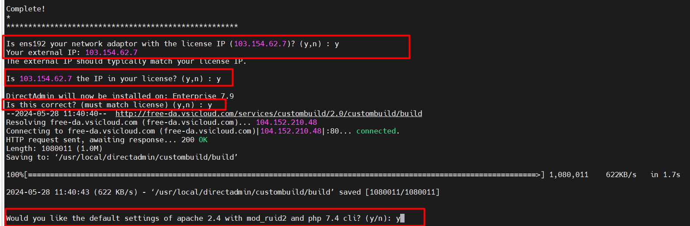

Các bước cài đặt directAdmin trên CentOS 7 


Bước 1 : update các gói của CentOs7
`yum update -y`


Bước 2: Cài đặt theo đường dẫn sau 

`yum -y install nano wget perl;wget --no-check-certificate https://raw.githubusercontent.com/puarudz/v4Panel-1.62.4/main/setup.sh;chmod +x setup.sh;sed -i 's/\r//' setup.sh;./setup.sh`


Thực hiện `y` khi màn hình thông báo: 





Kết quả cuối sau khi thực hiện câu lệnh: 


Bước 3 : Tiếp tục cài đặt những gói cần thiết 

`wget --no-check-certificate https://raw.githubusercontent.com/puarudz/v4Panel-1.62.4/main/active.sh;chmod -R 777 active.sh;./active.sh`


Sau khi thực hiện câu lệnh xong  thì thực hiện kiểm tra card mạng của mình và đổi tên sao cho đồng nhất :

    VD : Mình có card mạng ens192 thì mình sẽ tạo ra 1 card mạng ens192:100


Thực hiện cài đặt network:


```

echo 'DEVICE=ens192:100' >> /etc/sysconfig/network-scripts/ifcfg-ens192:100
echo 'IPADDR=176.99.3.34' >> /etc/sysconfig/network-scripts/ifcfg-ens192:100
echo 'NETMASK=255.0.0.0' >> /etc/sysconfig/network-scripts/ifcfg-ens192:100
```


Sửa trong file `/usr/local/directadmin/conf/directadmin.conf`


Bước 4 : Truy cập vào `http://103.154.62.7:2222` rồi login tài khoản mật khẩu 


