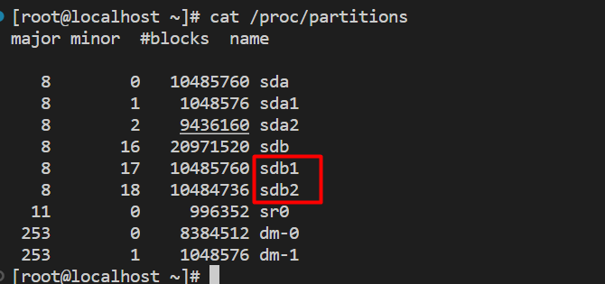
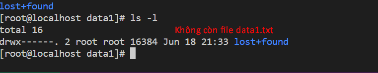
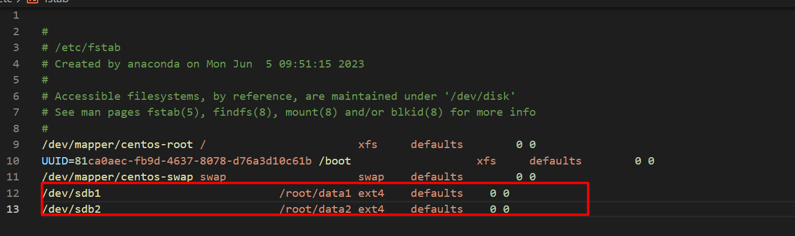
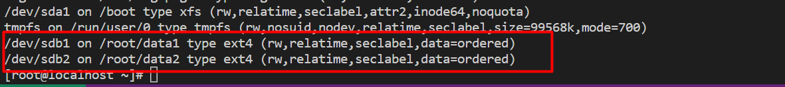
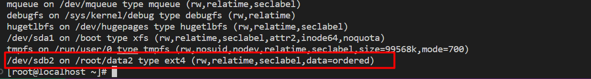

## Mount 
- Kiểm tra xem bên trog linux hiện đang có bao nhiêu hard disk
`cat /proc/partitions`
hoặc 
`ls -l /dev/ | grep -i "sda*`
hoặc 
`fdisk -l`
Hoặc 
`ls -l /dev/ | grep -i "sdb*`

- Cú pháp thực hiện lệnh mount 
`mount -type /device /folder`

**2. FDISK MKFS**

- linux gắn thêm hard disk mới và thực hiện quá trình tạo ra partition và định dạng
partion

- Ta thực hiện kiểm tra bằng cách dùng lệnh 
`cat /pro/partitions`

=> Sau khi kiểm tra thì thấy xuất hiện thêm ổ đĩa `sdb`

- Tạo ra partition trên ổ đĩa sdb này 
```
fdisk /dev/sdb
Nhập vào chữa "m" để hiển thị ra menu
Nhập vào chữ "n" nghĩa là "tạo new partition"
Nhập vào chữ "p" tạo ra primary partition
Nhập vào số "1" tạo partition thứ nhất
default sẽ hiện ra hard disk
Tạo  phân vùng 1 thì +10G
nhập chữ "m" để quay lại menu menu
Nhập vào chữ "n" nghĩa là "tạo new partition"
Nhập vào chữ "p" tạo ra primary partition
Nhập vào số "2" tạo partition thứ hai
rồi enter 
Nhập chữ w để hoàn thành quá trình tạo phân vùng 
```



- Tạo 2 file trong thư mục `/root/` ,`data1 `, `data2` để kiểm tra mount
- Trong thư mục `data1 ` tạo file `data1.txt`
- Trong thư mục `data2 ` tạo file `data2.txt`
- Thực hiện lệnh `mount`
`mount -t ext4 /dev/sdb1 /root/data1`

kiểm tra các mount vừa rồi bằng cách vào data1 xem file `data1.txt`




- Nhược điểm ở đây nếu như `reboot` lại máy sẽ mất => Phải cấu hình bên trong file `/etc/fstab`

- Cấu hình bên trong file `vi /etc/fstab`



`/dev/sdb1                           /root/data1 ext4    defaults    0 0` 
Cột 1                                Cột 2       Cột 3   Cột 4      Cột 5 Cột 6

- ***Cột 1***: device hoặc partition
- ***Cột 2***: mount point
- ***Cột 3***: Loại file system. Ví dụ: ext2, ext3, ext4, swap, vfat, ntfs
-  ***Cột 4***: Mount option: auto, no-auto, user, no-user, ro, rw... Option mặc định là
"defaults" bao gồm các tính năng rw, suid, dev, exec, auto, nouser
 ***Cột 5***: tính năng DUMP dùng để backup. Mặc định côt thứ 5 sẽ để số 0 trong hầu
hết mọi trường hợp ( nghĩa là không cần dump )
 ***Cột 6***: Sữ dụng fsck để do lỗi trên file system. Lệnh fsck nhìn vào trong số cột thứ
6 để quyết định file system có cần check hoặc không. Nếu ta gần 0 ( Nghĩa là fsck
không check file system tại phân vùng này ).

- Sau khi hoàn tất sử dụng lệnh `mount -a` để reload
- Sử dụng lệnh `mount`
=> liệt kẹ tất cả các `mount` đang được kết nối trên may tính




- Để tắt kết nối mount sử dụng lệnh `umount`
` umount /root/data1`

Sau khi sử dụng lệnh trên thì sẽ không còn nữa chỉ còn data2 



### Mount file iso 
mount -t iso9660 /dev/sdb1 /data-hdd


