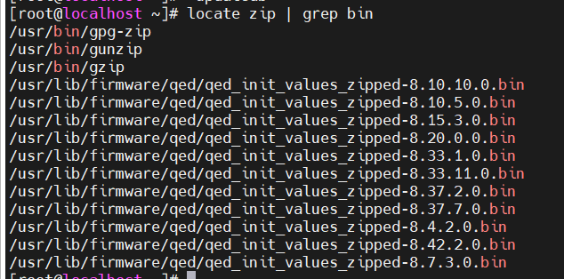

# Working_file

1.Khi thực thi những câu lệnh ,theo mặc định có ba luồng hoặc bộ miêu tả tệp sử dụng 

- Tiêu chuẩn nhập hoặc stdin
- Tiêu chuẩn đầu ra hoặc stdout
- Tiêu chuẩn lỗi hoặc stderr

Thường sử dụng stdin cho bàn phím của bạn ,stdout và stderr trên cmd ,stderr thường được sử dụng chuyển hướng đến một tệp lỗi .

Trong linux tất cả các tệp được dại diện trong cái gọi là miêu tả tệp .Nói một cách đơn giản, chúng được biểu thị bằng các số bắt đầu từ số không. stdin là bộ mô tả tệp 0, thiết bị xuất chuẩn là bộ mô tả tệp 1 và stderr là bộ mô tả tệp 2. Thông thường, nếu các tệp khác được mở ngoài ba tệp này, được mở theo mặc định, chúng sẽ bắt đầu tại bộ mô tả tệp 3 và tăng dần từ đó .

Nếu bạn muốn gửi một output từ bên ngoài vào file thì sử dụng 

```jsx
$ test_all > output_file
```

## Tìm kiếm trong file

- Tiện ích **locate** thực ****hiện tìm kiếm thông qua cơ sở dữ liệu tệp và thư mục được tạo trước đó trên hệ thống của bạn, khớp với tất cả các mục có chứa một chuỗi ký tự được chỉ định

```
# yum install -y mlocate
# updatedb
# locate zip
```



```jsx
locate zip | grep bin
```

- Hiển thị tất cả file zip bin

- Câu lệnh **find** thường được sử dụng hằng ngày  ,nó đệ quy xuống các tệp , hệ thống tập tin cụ thể và đường dẫn file .log

```markdown
VD  find /var -name *.log
```


```jsx
Tìm kiếm thư mục có tên "share" trong /usr 
```


- Tìm kiếm dựa trên thời gian

```jsx
	find / -ctime number
```

- Tìm kiếm dựa trên kích thước find

```jsx
find / -site + 10 // tìm kiem file > 10M
```

## Những câu lệnh quản lý file

### cat ,tac,less,tail ,head

- Cat : xem nội dung file
- Tac : xem nội dung từ dưới lên
- Tail xem 10 dòng đầu của file (nếu muốn xem bao nhiêu dòng thì thêm tham số n vào)
- head xem 10 dòng cuối (nếu muốn xem bao nhiêu dòng thì thêm tham số n vào )